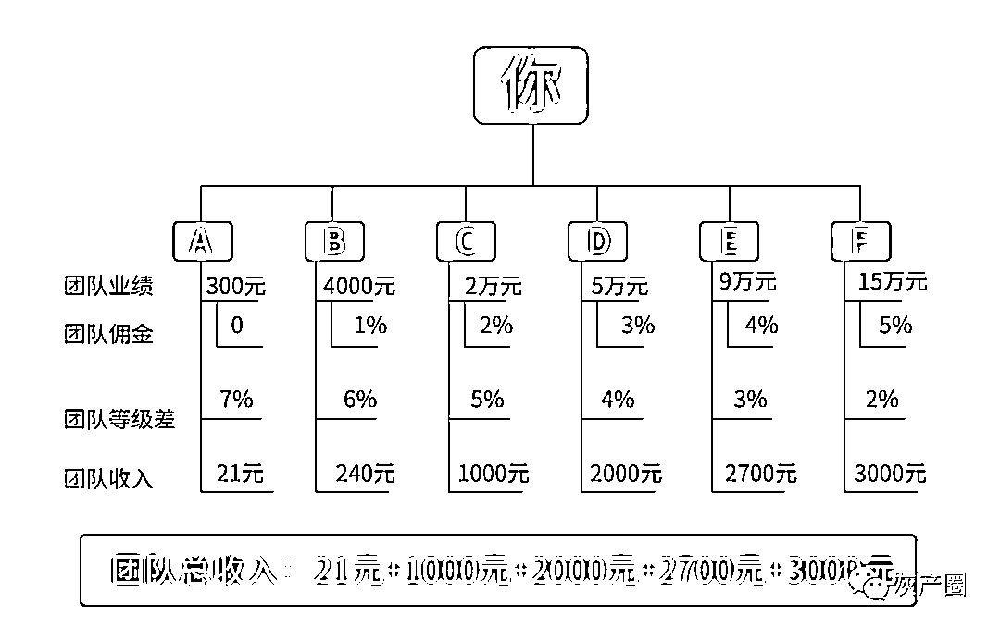

# 信用卡积分变现成“蓝海”？合伙人入门费 1388 元

> 原文：[`mp.weixin.qq.com/s?__biz=MzIyMDYwMTk0Mw==&mid=2247500518&idx=4&sn=8ce0c214efa3feab93076164eace9cea&chksm=97cb09dea0bc80c82c13f9a71be62517cdabd168000c7ecee57f4cb6825d83bd1e5428c8c406&scene=27#wechat_redirect`](http://mp.weixin.qq.com/s?__biz=MzIyMDYwMTk0Mw==&mid=2247500518&idx=4&sn=8ce0c214efa3feab93076164eace9cea&chksm=97cb09dea0bc80c82c13f9a71be62517cdabd168000c7ecee57f4cb6825d83bd1e5428c8c406&scene=27#wechat_redirect)

**点击上方蓝色字体免费订阅“灰产圈”**

文 | 禾雨

最近一段时间以来，多家银行相继调整了信用卡积分累积方式。

据统计，民生银行、广发银行、兴业银行、华夏银行、中信银行等股份制银行都先后对积分累积规则作出调整。

重庆银行存量积分值更是缩小 90%，积累规则由原来每满 1 元就累积 1 分，调整为每满 10 元才能积累一分。

而此次集中调整的背后，**是一个完整的信用卡积分变现产业链的崛起。**

通过硬件和软件的结合，信用卡积分成为灰产中介们获利的工具。在他们的口中，信用卡积分变现业务，还是一片“蓝海”，蕴藏着无限的财富。

事实上，**利用信用卡积分赚取的差价，只是他们收入的一小部分，招募合伙人才是他们的主要收入来源。**

层层分佣的模式，让信用卡变现中介们的队伍迅速壮大。

***信用卡积分变现***

为了促进用卡的频率，增加用户的粘性，几乎所有的银行都推出信用卡积分活动。

持卡用户使用信用卡消费后，就能获得一定的积分，用户可以使用积分兑换指定商品，包括话费、里程、实物商品等。

银行的信用卡积分制度，养活了一大批以薅积分羊毛为生的羊毛党。

“赚过一万多积分。”有持卡用户告诉消金社，他曾通过替网店刷单拿过积分，这些积分都用来兑换电影票等“商品”。

而事实上，在这些薅银行积分的群体中，还存在一些职业的羊毛党。他们凭借自己丰富的养卡经验，谋取暴利。

2020 年 3 月 5 日，中国裁判文书网发布的一则裁判文书显示，被告人叶露斌利用其本人名下及其所控制的他人的招商信用卡，采用交易后再退款等手法骗取招商银行消费积分。

招商银行提供的积分交易记录显示，叶露斌使用招商银行信用卡积分兑换星巴克、SPG、南航里程及酒店积分等，兑换成本最低合计超过 13 万。

“我见过的，就是两口子加双方父母 6 个人，加起来一共有 400 多张卡。”信用卡资深用户小刘透露。

据了解，信用卡职业玩家可以分为额度党和权益党两类。顾名思义，所谓的额度党更注重信用卡套现，而权益党则更注重信用卡积分。

**而这两类玩家的核心设备一样，都是 POS 机。**

“给我的定义就是个体户。”小刘告诉消金社，只需要拍身份证照和人脸识别就可以申请到 POS 机。

据了解，信用卡刷卡手续费是按照 7:2:1 分成的。其中，发卡银行拿 70%，收单机构拿 20%，清算组织只能分到 10%。

“银行为了扩大自己信用卡使用量，会再给支付公司返利。”小刘推测，这样一来银行的收益少了，**所以出于成本控制的考虑，就要砍积分兑换价值。**

职业的权益党玩家，“刷”积分的方式有很多，利用 POS 机刷卡套现后再还款，在“虚假交易”过程中积累积分，就是最常见的一种。

裁判文书显示，上述被告人叶露斌就是通过其本人及其所控制的他人名下的招商信用卡，**利用刷卡后再还款的闭环式虚假交易方法，非法获取招商银行 308 万余消费积分。**

“**信用卡积分主要是兑换航空里程，这是目前最主要的变现途径。**”小刘告诉消金社。

除此之外，类似于闲鱼等二手商品交易平台也已经成为积分变现的主要渠道。

“让积分兑换现金，因为积分有时间段你不换都会过期，浪费掉，这边协助兑换”，以“信用卡积分”为关键词在闲鱼上搜索，类似的宣传文案比比皆是。

而在兑换过程中，**持卡用户不仅需要提供信用卡号，甚至还需要提供验证码，用户的信息和账户安全方面，存在极大隐患。**

除此之外，“星巴克”、“必胜客”等信用卡积分兑换的商品，也是闲鱼上的“畅销货”。

而事实上，对于信用卡变现中介们来说，协助持卡用户变现并不是他们的主要收入来源，发展下线才是。

***招募“合伙人”，层层抽佣***

“一天兑换 5 个客户，一个月可以挣 7000 多。”信用卡变现中介林峰透露。

但他接着说，“**其实还是招代理最赚钱，一个就能赚 599 元。**”

在持卡人集中的信用卡论坛中，招募信用卡积分变现合伙人的信息每天都有更新。据了解，**目前积分变现的方式主要有两种，一种是利用机器兑换，而另一种则是通过手机 APP 兑换。**

在淘宝上，还有出售积分兑换专用终端机的商家，宣称“一台机器即可代理，激活设备成合伙人”。

图片截自淘宝 

相关介绍显示，该积分兑换专用终端机售价为 1388 元，支持 40 家银行一键兑换，直连银行积分系统。

而通过手机 APP 实现积分变现时，不需要购买机器，但同样也需要缴纳一定的费用才能成为合伙人。

据林峰介绍，他招募合伙人是通过一个叫“每天兑”的 APP 完成的，“平台是我们自己开发的，可以对接到银行总部。”

但某银行信用卡客户经理告诉消金社，“**直连银行积分系统或者对接到银行总部的说法并不可信，一般积分可以兑换礼品或者权益，如果变现的话就属于违规了。**”

“每天兑”的代理中心中详细罗列了积分兑换价格，不同银行积分兑换价格不同，合伙人等级不同，兑换价格也有差别。

图片截自每天兑 APP 

“**赚的就是差价。**”林峰举例道，钻石合伙人和黄金合伙人在使用民生白香卡变现时，就能出现 500 块的差价。

普通用户注册后，就是黄金合伙人，而想要变成钻石合伙人，就需要交纳 999 元才能升级。

“**当下级交了 999 元后，上级就能拿到 599 元。**”林峰告诉消金社，招募合伙人才是他的主要收入来源。

而上述通过购买积分兑换终端机发展合伙人的团队，更是在淘宝页面中承诺，成为合伙人后，积分兑换差价可达 30%。

不仅如此，该团队的合伙人的收入构成中，还包括团队奖励，以及“层层抽佣”获得的奖励。

图片截自淘宝

据介绍，购买机器成为合伙人后，**不仅可以获得直推合伙人积分兑换佣金的 3%，还可以获得间推合伙人积分兑换佣金的 2%。**

《禁止传销条例》第二条明确：

本条例所称传销，是指组织者或者经营者发展人员，通过对被发展人员以其直接或者间接发展的人员数量或者销售业绩为依据计算和给付报酬，或者要求被发展人员以交纳一定费用为条件取得加入资格等方式牟取非法利益，扰乱经济秩序，影响社会稳定的行为。

也就是说，**目前这种发展信用卡积分变现合伙人的方式，存在传销的风险。**

那么，信用卡积分到底是如何变现的呢？

“**积分通过我们平台兑换相应的产品，我们把商品换取现金。**”老刘坦言。

老刘说，**之所以可以做到“秒审”、“秒结”，是因为平台有自己的垫资渠道**，“我们平台先给你垫钱了而已。”

消金社还发现，类似于派金花这类的贷款或信用卡开卡返佣平台上，也开设了信用卡积分变现的通道。

图片截自派金花

派金花兑换教程显示，以招商银行信用卡积分兑换为例，需要持卡用户先登录“掌上生活”APP 利用积分购买腾讯视频会员月卡。

用户收到兑换成功的券码信息后，便可前往派金花报单。据观察，在报单时持卡用户需要提供姓名、手机号以及完整的券码短信。

**信用卡积分变现或存风险**

消金社接触几位信用卡积分套现中介发现，**他们在套现过程中几乎都需要持卡用户提供一些敏感信息，包括信用卡号、姓名、手机号，甚至有的还需要验证码。**

“我们也会直接帮助客户注册，客户只需要提供一个验证码就可以。”老刘告诉消金社，有的持卡用户为了图方便，会直接交给他们操作。

在聚投诉等投诉网站上，信用卡积分被盗刷的投诉内容比比皆是，尤其是广发银行更是此类投诉内容的“重灾区”。

图片截自聚投诉

事实上，在这个变现过程中，不仅存在信息泄露后，信用卡积分被盗刷的可能性，还有被诈骗的风险。

2019 年 4 月，中国裁判文书网发布的《杨某信用卡诈骗一审刑事判决书》显示，**被告人杨某以信用卡积分兑换现金为名，骗取他人信用卡使用，刷卡金额超过 62 万。**

据描述，杨某在以兑现名义骗取他人信用卡后，通过套现方式将信用卡内额度套出，用这种方式对王某等 8 人实施诈骗。

此外，持卡用户在使用目前市场上的一些积分兑现终端机或 APP 时，信息和资金安全方面也没有保障。

以每天兑 APP 为例，相关资料显示，其由深圳九方集团运营。

但消金社查询发现，其“官方微信公众号”运营主体为个人，预留的电话号码注册的企业在 2020 年 6 月 16 日已申请注销登记。

不仅如此，该公司还有 4 条经营异常信息，2016 年至 2018 年均未公布年度报告，且通过登记的住所或经营场所无法联系。

此外，该企业还因为被列入经营异常名录届满 3 年仍未履行相关义务，被深圳市市场监督管理局南山局列入严重违法名列中。

图片截自企查查

值得一提的是，在信用卡积分变现交易过程中，**从“刷”积分到变现环节中，还可能存在违规，甚至违法的风险。**

猖獗的积分变现灰产，倒逼银行修改积分制度，而这可能只是开始。

← 向右滑动与灰产圈互动交流 →

**点击****阅读原文****加入灰产圈高端社群**

