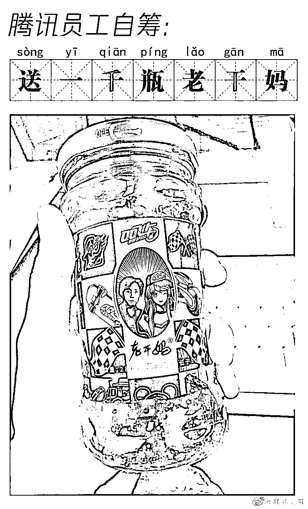

# 腾讯公司：我就是那个吃了假辣椒酱的憨憨企鹅

> 原文：[`mp.weixin.qq.com/s?__biz=MzIyMDYwMTk0Mw==&mid=2247500570&idx=1&sn=60b69ef15a5075382f5bd54717365f87&chksm=97cb0822a0bc813439e41cffcea2148d9940949aa6a21ec46d0aa0c6e9eafcb585fa32a266ff&scene=27#wechat_redirect`](http://mp.weixin.qq.com/s?__biz=MzIyMDYwMTk0Mw==&mid=2247500570&idx=1&sn=60b69ef15a5075382f5bd54717365f87&chksm=97cb0822a0bc813439e41cffcea2148d9940949aa6a21ec46d0aa0c6e9eafcb585fa32a266ff&scene=27#wechat_redirect)

**点击上方蓝色字体免费订阅“灰产圈”**

刚刚腾讯公司在官方微博回应“被骗”一事↓↓↓

称一言难尽并为了防止类似事件再次发生以**1000 瓶老干妈**为礼品征求类似线索

看到这里你是不是一头雾水： 

这是什么情况？

**请看前情提要**

**↓↓↓**

**腾讯起诉老干妈**6 月 29 日，中国裁判文书网公布的一则民事裁定书显示，4 月 24 日，广东省深圳市南山区人民法院裁定查封、冻结被告贵阳南明老干妈风味食品销售有限公司、贵阳南明老干妈风味食品有限责任公司名下价值 1624.06 万元的银行存款或查封、扣押其等值的其他财产。

腾讯方面 6 月 30 日对此回应称，**2019 年 3 月老干妈在腾讯投放了千万元广告合作，但无视合同长期拖欠未支付，腾讯被迫依法起诉，申请冻结了老干妈应支付的欠款金额。**[（>>>查看此前报道）](http://mp.weixin.qq.com/s?__biz=MjM5OTI5MjU1Mg==&mid=2650058799&idx=1&sn=4677a476796b17a749f8192d47db090f&chksm=bf3dabc8884a22de241e7337b2c33b2c1e0753a7bfadaca3721abbe128c8620ac880308a2717&scene=21#wechat_redirect)

值得一提的是 

腾讯曾在 QQ 飞车手游中

为老干妈精心策划了

一系列广告宣传

**QQ 飞车和老干妈联名礼盒**

**↓↓↓**

**老干妈：已报警**可是随后老干妈发布声明，称他们从未与腾讯公司进行过任何商业合作，腾讯遭遇了诈骗！7 月 1 日，贵阳公安双龙分局通报，**3 人伪造老干妈公司印章，冒充该公司市场经营部经理与腾讯签订合作协议，目前 3 人已被刑拘。**

贵阳警方发布通报后

腾讯发动态：

今天中午的辣椒酱突然不香了

随后

“吃瓜一线”群众支付宝发文表示：

“希望天下无假章。”

对此，网友们表示：

腾讯真是个傻白甜啊......

刚刚，腾讯公司公关总监张军

在微博留言中回复@腾讯公司：

你这个憨憨。

就在刚刚 ，腾讯官方微博发布视频《我就是那个吃了假辣椒酱的憨憨企鹅》

调侃自己被骗了，感兴趣的可以去微博@腾讯公司

瞅瞅去。

来源丨综合人民日报、中国青年报、新浪微博、长沙晚报

← 向右滑动与灰产圈互动交流 →

**点击****阅读原文****加入灰产圈高端社群**

