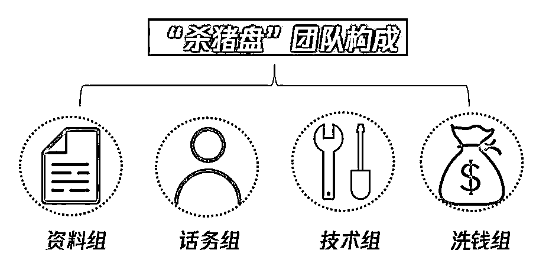

# XMEX：一群猪做的杀猪盘

> 原文：[`mp.weixin.qq.com/s?__biz=MzIyMDYwMTk0Mw==&mid=2247500570&idx=2&sn=fccbfc5dda903018c1b1b7125afdf265&chksm=97cb0822a0bc8134d40b7a31ab785e7ef6bf54ec6bbd29568f16170936586f2a278629750b68&scene=27#wechat_redirect`](http://mp.weixin.qq.com/s?__biz=MzIyMDYwMTk0Mw==&mid=2247500570&idx=2&sn=fccbfc5dda903018c1b1b7125afdf265&chksm=97cb0822a0bc8134d40b7a31ab785e7ef6bf54ec6bbd29568f16170936586f2a278629750b68&scene=27#wechat_redirect)

**点击上方蓝色字体免费订阅“灰产圈”**

币圈刮起一股“客损”邪气。

根本原因是，传统杀猪盘诈骗者盯上了区块链的优势，打造了一系列的杀猪盘式交易所。

利用用户对暴富的渴望，诈骗者通过操纵行情软件，恶意收割客户，从而将客户的损失收入囊中。

当中最让人瞠目结舌的，是以 XMEX 为典型的近 10 个杀猪盘式交易所。

这一系列交易所，除了名字和颜色略有不同，官网风格，UI 设计基本一致。更可怕的是，连 IP 地址都一致。

毫无疑问，这是同一团队所为。

同一个诈骗团队制造的一系列杀猪盘交易所，不费吹灰之力就被实锤，骗子同行们看着 XMEX 团队那蠢得跟猪一样的操作，大概牙都要笑掉了。

肖邦今日分析：XMEX，一群猪做的杀猪盘**。**

01

XMEX**合约杀猪盘**

近两月很多粉丝留言，自己遭遇了合约杀猪盘，整合发现：这系列手法极其相似。

诈骗团队大致分为：供料组，话务组，技术组，洗钱组。

供料组寻找上当的目标**。**

通过不断招收代理，将巨额客损分发出去，代理都成了 XMEX 供料组。

话务组负责聊天，诱导投资者入金**。**

用猪饲料，也就是话务组用事先设定好的剧本与用户聊天：

“哥们，你做合约吗？”

“兄弟，你今天盈利了吗？”

“某某跟某老师挣了几十万”。

通过前期聊天将投资者进入带单群，带单老师会私聊投资者，诱导其在 XMEX 入金。

行话叫：进了猪槽**。**

技术组负责建立平台和网站，操纵行情**。**

技术组与话务组相互配合，投资者会愈发相信带单老师。带单老师通过反向引导投资者达到爆仓目的，拿到大额客损。

如果你侥幸挣到，技术组可以监控资产，封禁账户，一个都别想跑**。**

最后，当投资者意识到自己落入杀猪盘时，技术组会将责任推诿给供料组，毕竟供料组代理是外包团队，不是自己人。

洗钱组，将杀猪盘流出资金洗干净**。**

而与此类似的合约杀猪盘，还有 BMEX**。**

BMEX 爆仓收割，并限制盈利用户出金。理由是：风控系统检测，你的账户异常操作。封禁用户账号并逼迫用户签署《用户异常交易行为告知协议》。

该用户没有签署，账户上本金与盈利皆已消失……

02

**做杀猪盘的不一定是人**

**也可能是猪**

一系列交易所，均使用以上雷同的手法，相似的名称，不由得让人猜测他们是同一个团队。

深挖之后，由于他们的蠢操作，IP 地址惊人一致，轻松实锤这是同一伙人。

以 XMEX、BMEX 为代表的一系列交易所，让人忍不住感叹，这真是一群猪做的杀猪盘。

让肖邦来演示一遍：

第一步：通过对 XMEX 域名进行解析，发现了 5 个历史 IP。

筛查后，注意到了【152.32.210.127】这个地址。

这个地址下注册过的域名包括： 

XMEX、BMEX、OOEX、UMEX、GDEX、Xstar、Gmex、WJEX、UCEX。

这个团队也真够勤奋的，同时运营这么多杀猪盘交易所。

肖邦猜测，该团队注册了数个域名同时做，最后 XMEX、BMEX 做起来了，其他都消失了……

网传这些交易所技术皆由一家叫做上海俊芮网络的上市公司提供。这家公司的创始人，就是盖亚交易所创始人韩卫国。

**上海俊芮网络韩卫国**

这个杀猪盘团队平均学历幼儿园？不懂技术，IP 隐匿都不懂，只能走技术外包路线。

但他们对剧本话术的拿捏，对人性的把控，十分老练，是职业杀猪盘团队转型合约交易所的典型。

03

** 高大上的猪团队包装**

天网恢恢，疏而不漏。

但这波像猪一样蠢的操作，如此拙劣、粗糙的手法，还可以割韭菜，到底是哪出了什么问题？

XMEX 团队都用了哪些手法，让项目看起来高大上？

**1：非小号排名。**

****

**XMEX 一度在非小号排第四名，网传 2 个 BTC 在非小号即可排名入百。**

 **所以，韭菜们不要相信那么多排名，都是买的。**

**2：XMEX 拿到塞舌尔牌照，以及美国 MSB 牌照。**

**塞舌尔，一个东非岛国，有没有交易所都成疑，哪来的牌照？**

**美国 MSB 牌照更是给钱就办，网上有各种各样渠道，17 天拿证，不耽误上岗。**

****

**3：瑞士投资集团(瑞麟集团)以及回向基金战略投资。**

**瑞麟集团为某不知名集团，非行内基金，并无权威性。只是挂上一个瑞士投资集团。**

**这样讲，在瑞士乡下注册的投资公司，是不是也可以叫瑞士投资集团？**

**回向基金投资，权威性也不大。韭菜们不要迷信机构，机构割韭菜更狠。**

**XMEX、BMEX 这种看似高大上，实际粗糙低劣的骗术，也能割韭菜。**

**币圈投资者应该好好反思一下自己，是不是贪念压倒了基本的逻辑，几句话术就失去了判断力。**

**XMEX 团队屁股没擦干净，永久地成为了币圈的笑柄，成为了骗子界的耻辱。**

**建议你们下一个杀猪盘交易所，改名为 XZHU，和自己的气质更配。**

************

**← 向右滑动与灰产圈互动交流 →**

********点击****阅读原文****加入灰产圈高端社群****

****