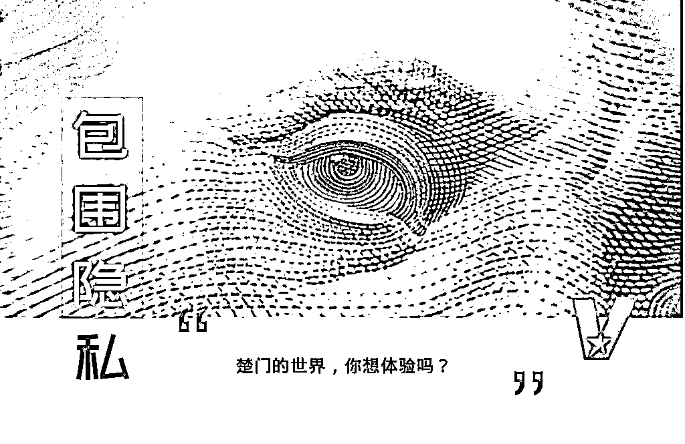
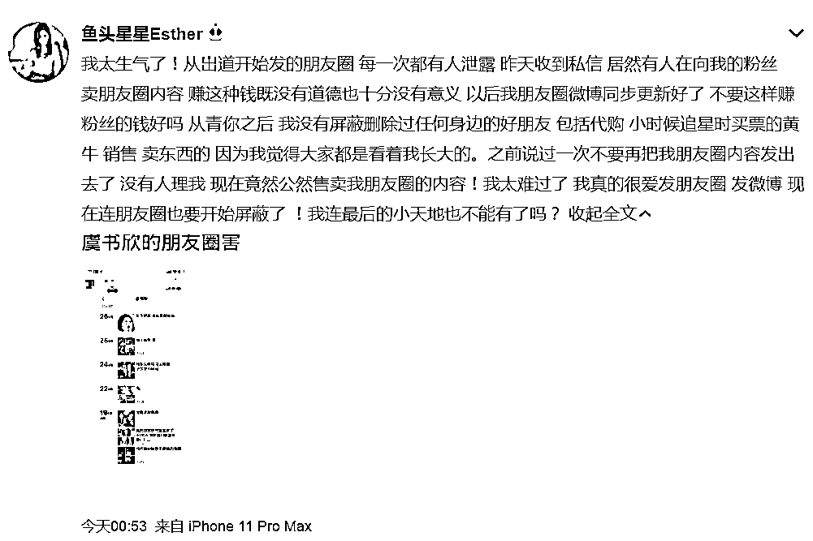
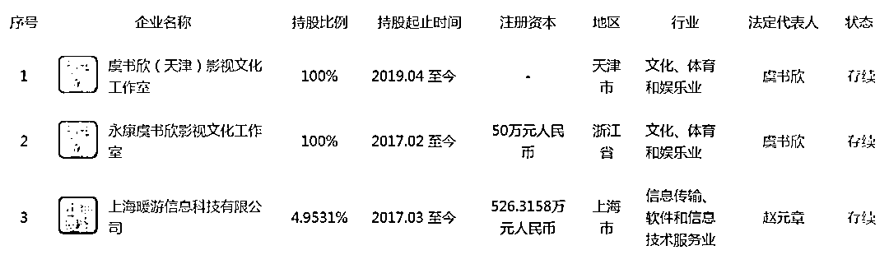
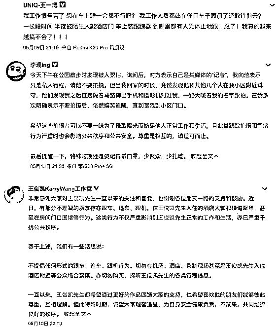
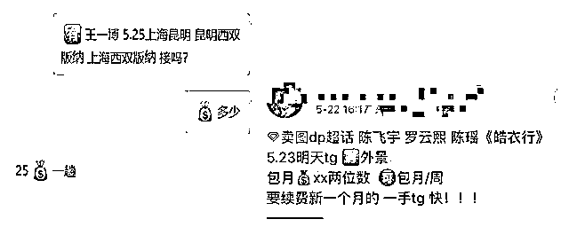
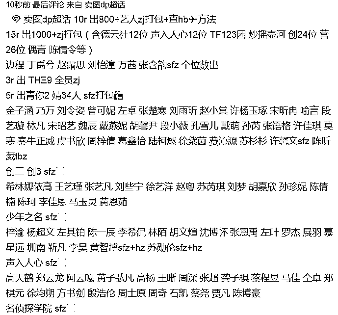
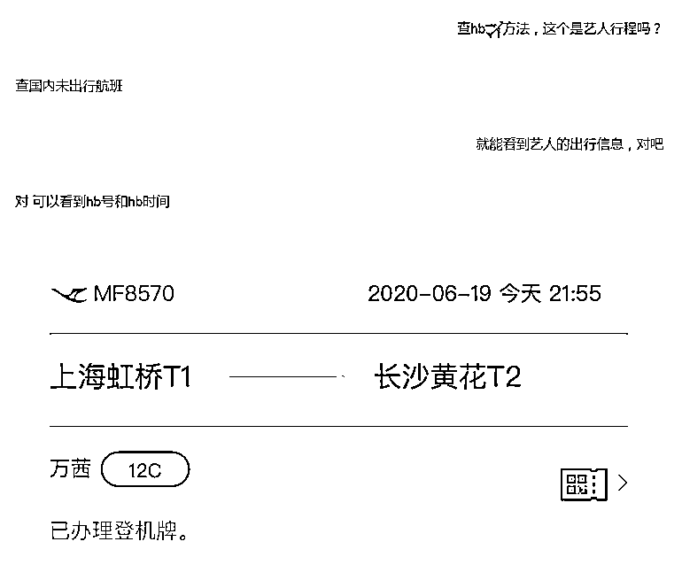
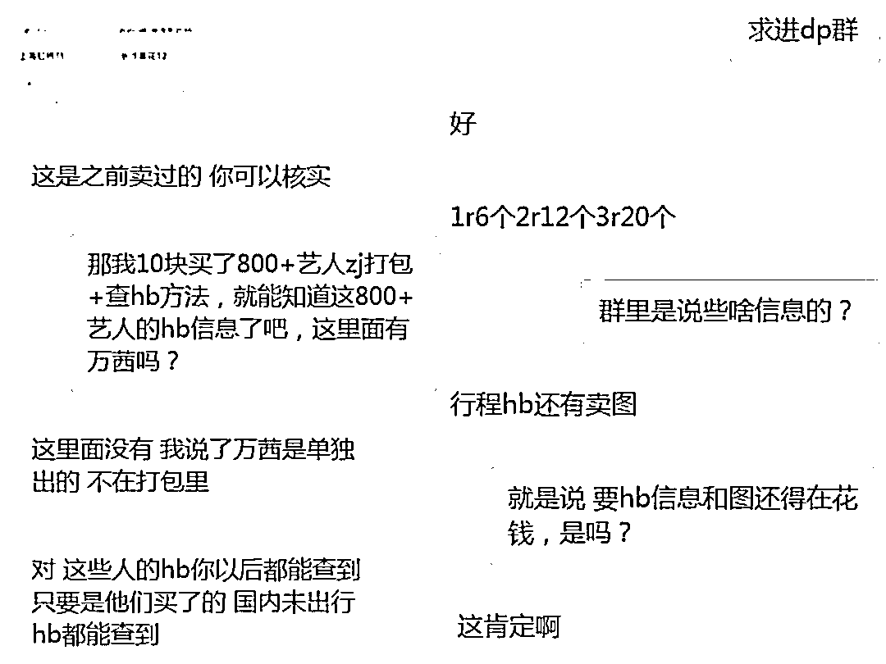

# 虞书欣被“出卖”背后：疯狂的明星灰产 ，或年赚 4.8 亿

> 原文：[`mp.weixin.qq.com/s?__biz=MzIyMDYwMTk0Mw==&mid=2247500570&idx=3&sn=4eb7a3782e882daecf88e23981196cf1&chksm=97cb0822a0bc813436c8150084d2d6e2e921f2f51395681a4595a0d95cecf447b91c4be85f86&scene=27#wechat_redirect`](http://mp.weixin.qq.com/s?__biz=MzIyMDYwMTk0Mw==&mid=2247500570&idx=3&sn=4eb7a3782e882daecf88e23981196cf1&chksm=97cb0822a0bc813436c8150084d2d6e2e921f2f51395681a4595a0d95cecf447b91c4be85f86&scene=27#wechat_redirect)

**点击上方蓝色字体免费订阅“灰产圈”**

作者 | 王新月   编辑 | 何珊珊排版 | 段梦兰   设计 | 王   颖火过的明星，谁没被明码标价的卖过？6 月 30 日凌晨，《青春有你 2》中成团的唱跳歌手虞书欣微博发文“我太生气了！公然售卖我的朋友圈……”让虞书欣愤怒的事，正是当代追星圈中从偷偷摸摸到明目张胆的黑色产业——明星隐私出售。从日常行程到朋友圈信息，从机场跟拍照片到个人身份证信息应有尽有。肖战、王一博、李现等多位明星都曾被“出卖”，肖战因身份证信息泄露，被人私自更改航班座位，不得不深夜改签；王一博在 5 月曾微博怒怼偷拍人，称被装跟踪器、半夜被陌生人敲酒店房间门……“出卖隐私”在无良人眼中意味着商机，但对于明星而言，则是无尽的痛苦。为什么盯上明星？**为什么出卖虞书欣？富二代 or 公司老板**
6 月 30 日，“虞书欣朋友圈内容被卖”登上热搜，阅读量超 6 亿，讨论超 7.6 万，明星隐私泄露困局又一次出现在大众面前。虞书欣微博小号发文称“从出道开始发的朋友圈，每一次都有人泄露，现在向我粉丝卖朋友圈，不要这样赚粉丝的钱好吗？”并抱怨“从出道从未删过任何人，现在连最后的小天地也不能有了吗？”为什么虞书欣会被“出卖”？五年前，虞书欣出演《新边城浪子》正式进入演艺圈，随后主演过几部情感剧和古装剧，也参加过综艺。她的背后，是推出过《亲爱的，热爱的》《三生三世十里桃花》《微微一笑很倾城》等爆款影视作品的华策影视，目前总市值超 125 亿，旗下艺人有胡一天、吴倩等。

除了背后有强大的靠山，虞书欣也不乏商业资本。企查查显示，95 后的她已经是虞书欣（天津）影视文化工作室和永康虞书欣影视文化工作室两家公司的法定代表人，投资了上海暖游信息科技有限公司，持股 4.9%。还曾被网传是富二代，节目上用过的首饰背包动辄数万几十万不等。

《青春有你 2》播出后，虞书欣更是打开了知名度。最终以第二的成绩作为女团 THE9 的成员出道。节目上，她贡献了一张大火的表情包“哇哦”，结果在微博获得 2.9 亿的阅读量，个人的名字阅读量在 9.4 亿，远超同期成团的其他人。拥有“富二代千金”的神秘标签，在综艺中又有上亿话题度，可以说是名副其实的明星了，应该把自己的生活隐藏得严实一些。但偏偏虞书欣称，自成团出道后，没有屏蔽删除过任何人，包括代购，小时候追星时买票的黄牛、销售等，因为觉得大家都是看着我长大的。”这也验证虞书欣之前微博曾说“有疼我爱我的父母，自己从小到大被保护得很好。”也许正因如此，虞书欣没有意识到，自己的信任会被贪财之人利用。鲁迅先生说得好，“我向来不惮以最坏的恶意揣测人”。明星在经历被“出卖”之前，大概永远想不到贪财之人的疯狂。**灰产或年赚 4.8 亿！800+艺人证件信息包卖 10 元**除虞书欣，王一博、王俊凯、李现等多位明星艺人近期都在微博吐露私生活被跟拍的无奈心声，接连登上热搜。私生饭这个词早已出圈，特指那些行为极端的粉丝，为满足私欲，喜欢跟踪、偷窥、偷拍明星的日常，他们的行为不仅扰乱个人生活，还给公共安全带来问题。 6 月中旬，有新闻称重庆渝中某小区就被私生饭围的水泄不通，当艺人经过，女孩们就会一拥而上，尽管居民多次报警，但每次都是警察前脚刚走，追星族后脚就会聚集起来，住户最后与私生饭发生冲突。被骚扰的艺人是时代少年团团员，时代峰峻公司想培养的第二个 TFboys。《偶像练习生》中出道的黄明昊也屡屡被私生饭困扰，以至于经常搬家。黄明昊透露，曾有私生饭偷拍被劝阻后正面怼他“人家都能拍就你不能拍，有意思吗？”据 Vista 商业研究所此前从业内人了解，当红艺人偶像的通告行程均有售价。例如，王一博一次通告飞机行程售价 25 元，偶像女团养成选秀综艺创造营 2020 里的成员希林娜伊高和刘梦一套 50 或 60 张图片价格在 80 元不等，要根据现场情况和人气高低来计算价位。**微博上就有个 1.2 万粉丝的超话“卖图 dp”，已有 3.3 万帖子和超 4800 万的阅读量。dp 为代拍缩写，指代粉丝跟随明星拍摄生活照片再出售，同时意味着代拍人能够清楚掌握艺人行程。**随手翻几个帖子，都是近几个月的流量明星行程，如《创造营三》决赛现场代拍、《极限挑战》喻言代拍，还有上百位明星机场活动图等。更有甚者的是直接卖艺人证件和航班信息。Vista 商业研究所假意购买艺人万茜的个人信息，联系上了一位卖家，对方称有身份证信息和护照信息，“都是号码，购买后，直接 word 文档发过来”，还能查艺人国内未出行航班。被质疑信息真假后，对方发来了一张“万茜 6 月 19 日晚 9 点 55 分，从上海虹桥 T1 飞长沙黄花 T2 的厦航 MF8570”的截图，称可以核实，随后又发来一张微博截图，是万茜超话 6 月 19 日的机场图。

贩卖信息者称 10 元就能买到 800+艺人的打包证件信息，还顺带教查询航班的方法，不过像近期因《乘风破浪的姐姐》而爆火的万茜，她的证件信息单独要 5 元。“万茜的证件很少有人拿到，已经很便宜了”。

除了直接卖艺人证件信息和航班的，还有卖群的，进群同样要钱。**“1 元可进 6 个群，2 元 12 个，3 元就 20 个”。群内发航班信息和卖图，想知道具体内容再花钱。**不过豆瓣上有豆友发帖称在代拍群 1 元买的“瓜”就是个笑料，下面也有不少跟帖称这是个“赚钱新方法”。至于消息真假，无人保证。虽然价位不高，但狂热粉丝的数量仍然足以让这条灰产存活。**假设以微博代拍话题的 4800 万阅读量、1 元进群或者 10 元信息包计算，则灰产人能够年赚 4800 万元~4.8 亿元！****隐私出售，在法律禁地的商机**
对于艺人隐私被泄露，一方面是人类天生的窥探欲，一方面是无良人对商业利益的渴望。**这门生意，两头逃不过“天性”二字。**不仅国内存在明星隐私灰产，国外也逃不过八卦的火焰。据美国纽约时报报道，疫情冲击美国之前，娱乐新闻摄影公司团队每月要拍摄出售数百套名人照片，营收高峰期月售 7000 至 8000 张照片。每张平均 200 美元(有特别价值图片另计)，月赚最高收入可达 160 万美元（折合约为 1.1 千万人民币）。不过，疫情期间，好莱坞影业进入寒冬，狗仔队生计随之大打折扣。2020 年 4 月起，摄影公司出售的照片量由每月 200 套暴跌到 30 套至 40 套，一张照片价钱跌至最低 40 美元（因为疫情期间没有特别画面）。**月收入最低约为 5 万美元（折合约为 35.5 万人民币），公司收入大跌 97%。**在这个社交媒体大大拉近距离的时代，艺人不再是只存在于银屏背后的影像，从微博到抖音，从快手到 B 站，从小红书到绿洲，艺人们都可以在其中分享自己的生活，但仍然无法满足粉丝需要。但不管是窥探欲作祟，还是明码标价的利益在招手，买卖艺人隐私信息均为非法行为。据华律律师所林春光律师分析，偷拍明星私人行程并网上出售已属于侵权行为。此前也有人较真，教训了泄密者。1990 年，刘嘉玲被拍裸照，12 年后被《东周刊》公布，刘嘉玲一怒之下将之告到停刊；2012 年，美国视频网站 Gawker 擅自公布了明星胡克·霍根的艳照门视频，随后霍根状告该网站，网站败诉需赔 3000 万美元 （当时约合 1.8 亿元人民币）。赚钱虽嗨，小心最终破财。 明星也该拥有自己的一方隐私天地。毕竟，没人想做楚门。

← 向右滑动与灰产圈互动交流 →

**点击****阅读原文****加入灰产圈高端社群**

