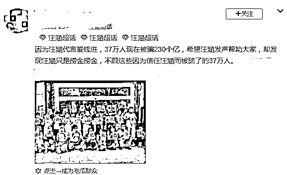
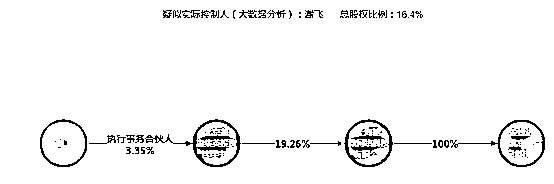
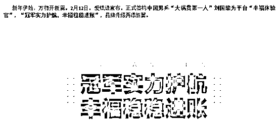
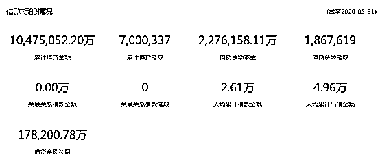
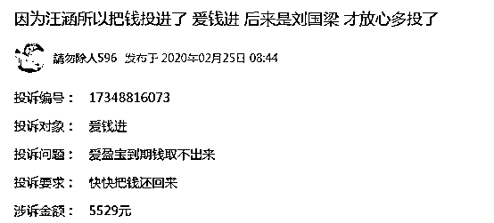
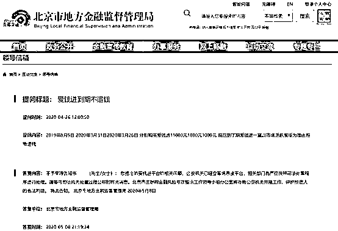

# 汪涵代言“翻车”，230 亿的锅，他该不该背？

> 原文：[`mp.weixin.qq.com/s?__biz=MzIyMDYwMTk0Mw==&mid=2247500570&idx=4&sn=93c2cff47086cc7afaf14359a4dbada5&chksm=97cb0822a0bc813482262f71bf86755600363d5c43eea8838b06893f052a97e99109d94ddabe&scene=27#wechat_redirect`](http://mp.weixin.qq.com/s?__biz=MzIyMDYwMTk0Mw==&mid=2247500570&idx=4&sn=93c2cff47086cc7afaf14359a4dbada5&chksm=97cb0822a0bc813482262f71bf86755600363d5c43eea8838b06893f052a97e99109d94ddabe&scene=27#wechat_redirect)

**点击上方蓝色字体免费订阅“灰产圈”**

最近的芒果台不太平。

仝卓自爆高考舞弊的热度才刚刚褪去，又传来了台柱子汪涵代言某金融类产品翻车的消息。 

虽然近两年 P2P 暴雷事件屡见不鲜了。但是由于有公众人物代言，爱钱进还是引起了广泛的关注。更有投资者举牌像汪涵喊话：“爱钱进诈骗汪涵退代言费，汪涵请出来还我血汗钱”

***”爱钱进“的前世今生***

爱钱进是一家互联网金融公司，也就是传说中的 P2P。天眼查显示，爱钱进为上海榕数网络科技有限公司的全资子公司，上海榕数科技还有 3 个曾用名——普惠金融信息服务有限公司、凡普金科企业发展有限公司，最近一次名称变更是发生在 2019 年 9 月份。

另外，董祺为爱钱进法人并任职执行董事，在简介中为普惠金融创始合伙人、CEO，张帆、杨帆为爱钱进监事及经理。穿透之后，谢飞疑为爱钱进实际控制人，其直接持有上海榕树科技 15.75%的股份，并且是上海榕树第一大股东北京普惠集英投资管理中心（有限合伙）（持股 19.26%）的执行合伙人。

爱钱进官网显示，该平台上线于 2014 年 5 月 6 日，可谓是 P2P 平台中的元老级平台之一，而且寿命及规模也超过了多数 P2P 平台。根据其平台信息，爱钱进累计服务用户 1679 万，已完成出借金额 2318.97 亿元。其产品名称为爱盈宝，产品展示虽然仍在首页，但点进去之后立即投资按钮已经变为灰色，无法操作。 

在 2018 年 P2P 暴雷潮之际，爱钱进却猛然发力，汪涵也是在 2018 年成为其代言人的，另外除了汪涵，2019 年 2 月刘国梁还成为爱钱进的“幸福体验官”，至今爱钱进官网媒体报道的第二条依然是去年 2 月签约刘国梁的新闻。

***早有暴雷苗头***

微博汪涵超话下面的爆料称，爱钱进 37 万人被骗 230 亿。该金额与爱钱进官网借贷余额数据相符，根据爱钱进平台运行数据情况，该平台截止 5 月 31 日借贷余额本金仍然有 227.62 亿元，借贷余额笔数为 186.76 万笔。 

**关于爱钱进疑似暴雷的消息，在今年初已经开始发酵。而平台下借款人数显示，今年 4 月份以来爱钱进平台已显示借款人数为 0。** 

在新浪旗下消费者投诉平台，今年 2 月份已经有投资者对爱钱进进行了投诉，并表示是“因为汪涵所以把钱投进了爱钱进，后来是刘国梁才放心多投了”。

另外，根据今年 5 月份网络媒体报道截图，亦有投资者去到北京地方金融监管局，对爱钱进到期不退钱进行提问。

今年 5 月份北京市地方金融监督管理局答复的“不予受理告知书”内容指出：“您提出的爱钱进平台的相关问题，公安机关已经立案调查该平台，相关部门将严格按照司法处置程序进行处理。请等待司法机关处置过程公布的有关消息。

这也意味着公安机关已经立案调查“爱钱进”这家平台，并严格按照司法处置程序进行处理。 

***公众人物与 P2P***

娱乐圈中，明星代言 P2P 类互联网金融公司并不罕见，每每暴雷后，不少明星被投资者声讨“还钱”。

黄晓明为快鹿集团旗下东虹桥金融的代言，唐嫣、李湘、瞿颖、钟丽缇、胡静等 5 位女星为 e 租宝做宣传，范冰冰成为紫马财行的形象大使，王宝强出人团贷网首席体验馆（代言人），张涵予代言人人贷款等等。

即使有明星代言，投资者们也要擦亮双眼，并不是有代言的产品就是万无一失的。同时也希望公众人物接代言的时候要谨小慎微。根据《广告法》第 56 条规定，公众人物如明知或应知金融产品广告是虚假广告，仍为其代言造成消费者损害的，则其应与广告主共同对消费者承担连带赔偿责任。

来源：菲凡烽火台

← 向右滑动与灰产圈互动交流 →

**点击****阅读原文****加入灰产圈高端社群**

