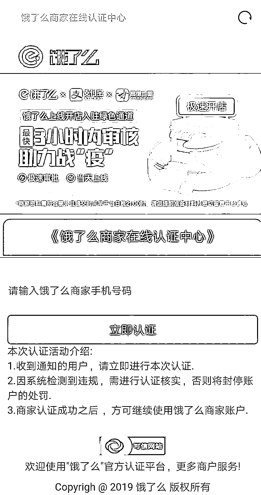

# 紧急预警！“饿了么”签约商家千万要小心这类骗局！

> 原文：[`mp.weixin.qq.com/s?__biz=MzIyMDYwMTk0Mw==&mid=2247500570&idx=5&sn=b051fde61dd0729c20f779a2f20b59e3&chksm=97cb0822a0bc81348179d64436411c1a9c657dbcd573c932fd00674f4ed7b151becf9c4cb2a6&scene=27#wechat_redirect`](http://mp.weixin.qq.com/s?__biz=MzIyMDYwMTk0Mw==&mid=2247500570&idx=5&sn=b051fde61dd0729c20f779a2f20b59e3&chksm=97cb0822a0bc81348179d64436411c1a9c657dbcd573c932fd00674f4ed7b151becf9c4cb2a6&scene=27#wechat_redirect)

**点击上方蓝色字体免费订阅“灰产圈”**

最近

据官方警情监测显示

**针对【饿了么】签约商家的诈骗案件**

非常高发

仅两天时间

已有数十名商家被骗

在这类案件中 

嫌疑人会广泛发送

含有虚假网址链接的短信

声称系统升级需要进入网站认证

在获取受害人的银行卡号等信息后

远程操纵、实施盗刷！

接下来

我们来详细了解下骗子的套路

**诈骗套路**

受害人先是会收到一条这样的短信：

短信主要内容有以下几个层面：

**系统维护升级（说明事由）**

**限期 24 小时认证（告知时限）** 

**否则将封停商户无法接单（警告后果）**

请注意网址：**elm7a.com**（注：该域名已被骗子弃用，更换为新的相似网址）使用了“饿了么”首字母缩写 elm，与其官方网站的网址类似，十分具有迷惑性。部分商家看到“警告后果”后，为不影响生意，都会点击网站进入，页面如下图：

这个钓鱼网站（虚假网站）的页面制作非常逼真，一般人很难分辨真伪。填写手机号码后进入下一步骤页面。

商家填完上述所有步骤后，骗子掌握到手的重要信息有四项：**姓名、银行卡号、身份证号以及手机号码。**

下一步，骗子设置了页面显示：需等待 2 分钟。这 2 分钟，足够骗子使用前面获取的重要信息进行银联快捷支付的注册操作。

2 分钟后，页面会显示“需要填入验证码”才能完成认证。同时，受骗商家会收到银行发来的短信验证码。

在焦急地等待了 2 分钟之后，多数人不会仔细看短信内容，而是直接输入收到的验证码，希望快点完成认证操作。

你以为成功了？

但是却并没有顺利的完成

而是显示“认证失败”

需重新输入验证码

为什么呢？

**因为骗子通过不断要求**

**重新输入验证码的方式**

**用以在免密限额之内**

**使用商家的银行账户**

**进行多笔的消费转账（盗刷银行卡）操作**

目前所接报警情

**只发现涉及冒充【饿了么】平台**

**怀疑该平台商家数据已泄露……**

预测近期

采用类似手法的案件

还将持续高发

请大家一定要注意！

来源：终结诈骗，深圳市反电信网络诈骗中心

← 向右滑动与灰产圈互动交流 →

**点击****阅读原文****加入灰产圈高端社群**

