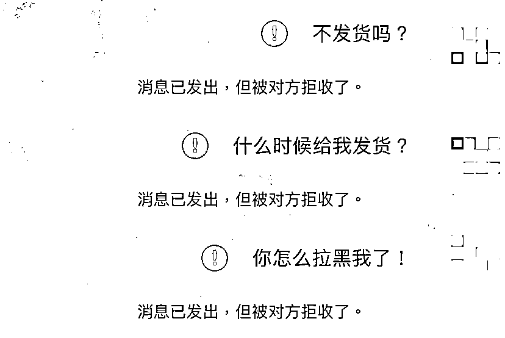
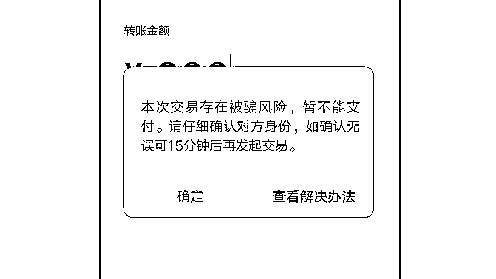
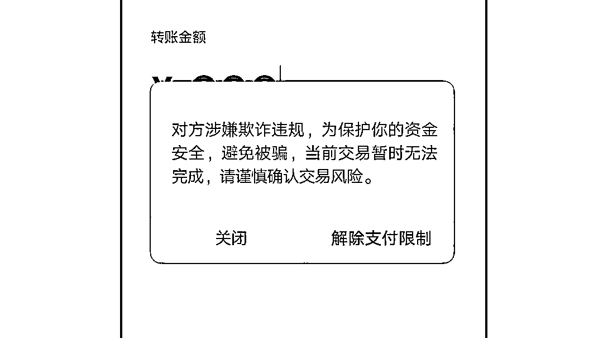

# 冷静一下，付款千万别冲动！

> 原文：[`mp.weixin.qq.com/s?__biz=MzIyMDYwMTk0Mw==&mid=2247500689&idx=2&sn=9df05cd365860be052d0f25144d74831&chksm=97cb08a9a0bc81bf050437809aeaa3fefd561176a794174f055c95671e0df0663ed99157e84a&scene=27#wechat_redirect`](http://mp.weixin.qq.com/s?__biz=MzIyMDYwMTk0Mw==&mid=2247500689&idx=2&sn=9df05cd365860be052d0f25144d74831&chksm=97cb08a9a0bc81bf050437809aeaa3fefd561176a794174f055c95671e0df0663ed99157e84a&scene=27#wechat_redirect)

**点击上方蓝色字体免费订阅“灰产圈”**

**工资到手，你准备好“剁手”了吗？**

小到一块香皂，大到一个限量名牌包包，遍布全球的商家永不停歇地为消费者搜集着任何你能想到的商品。与此同时，也衍生出一些利用社交平台进行交易的“卖家”。

不过，与传统“一手交钱一手拿货”的交易形式不同，这些卖家多半都会要求“**先付款后发货**”，**这就可能存在巨大的风险！**

[`mp.weixin.qq.com/mp/readtemplate?t=pages/video_player_tmpl&action=mpvideo&auto=0&vid=wxv_1412311829963046912`](https://mp.weixin.qq.com/mp/readtemplate?t=pages/video_player_tmpl&action=mpvideo&auto=0&vid=wxv_1412311829963046912)

1

轻信卖家先付款

货物没到人消失

大学生小芳是个“购物狂”，平日闲着没事，就爱看购物直播。最近，小芳看中了某位主播安利的一款特价商品，但该商品在各大购物平台上均已售罄；于是，小芳加入了该主播的粉丝群内，**想询问是否还有存货**。

入群后，群组内的“管理员”主动与小芳取得联系，表示他们手头就有“现货”，并且可以“**粉丝特惠价**”出售给小芳。

小芳心想，如此一来，**不仅价格比“直播价”更低廉划算，而且还能尽早拿到心仪商品**，简直捞着个大便宜，她赶忙给对方转去了货款。

没想到，数周后，满心期待的小芳没能盼到货品的到来，却只得到了**代表着****被对方拉黑时的红色感叹号**。

这时的小芳才明白，所谓的“**低价折扣**”、“**现货秒发**”，不过都是骗子**忽悠自己掏钱的诱饵**，很显然，自己遇到“收款不发货”的骗子了！

***如果付款前有人能给自己泼盆冷水，自己能冷静下来，仔细核实对方身份，是否就能避免因为一时冲动陷入骗局呢？***

2

“风险提醒”识异常

  冷静下来别上当

“**虚假交易要警惕，风险提醒要留心**”，有时候，多一分沉着小心、多一点冷静思考，就能躲避危险！

为了阻止诈骗行为对被害人造成财产损失，微信支付构建了**有效识别恶意账号和交易的安全风控系统**。

在付款过程中，当系统识别出收款方账户有异常特征时，微信会**根据风险的程度对用户进行交易风险提醒或拦截**。当系统识别出收款方账号涉嫌欺诈违规，或者恶意程度较大，微信会对交易进行拦截保护，提醒用户注意资金安全，比如短视频中**对付款用户进行 15 分钟的保护限制**。

*拦截示例 1*

*拦截示例 2*

***也就是说，当你收到上面这样的风险提醒或拦截时，很可能正身处骗局之中！***

在 15 分钟的“转账冷静期”内，你应该**尽量核实收款方的身份**，**仔细想想是否存在风险**。“转账冷静期”解除后，可以根据核实后的情况**选择是否继续支付**。

  微信支付团队提醒你：

**1.网购需谨慎。**“先付款后收货”的交易方式风险很高，在社交平台上进行交易要提高警惕，谨慎确认，尽量使用可信的官方交易渠道。这样即使出现问题，也可以通过平台申诉退款退货。

**2.使用微信支付时，若出现“风险提醒”要加倍小心**，你很有可能正在陷入骗局！

来源：守护者计划

← 向右滑动与灰产圈互动交流 →

**点击****阅读原文****加入灰产圈高端社群**

