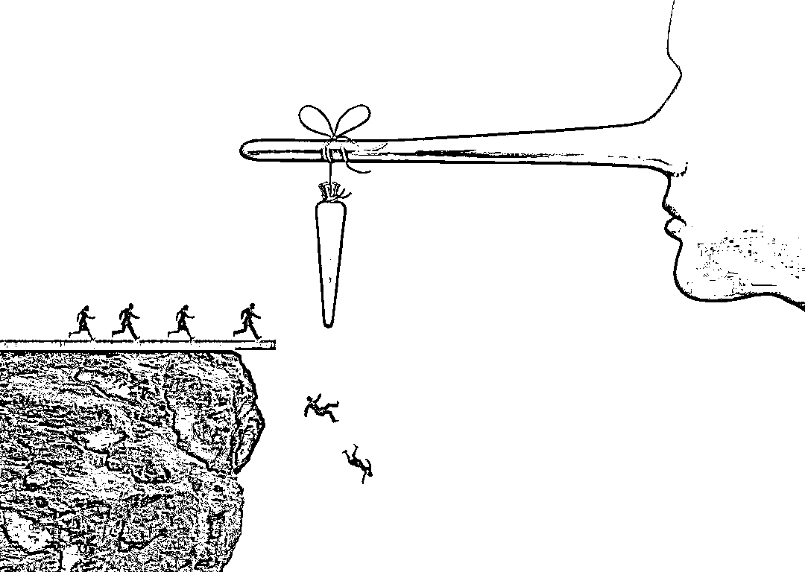
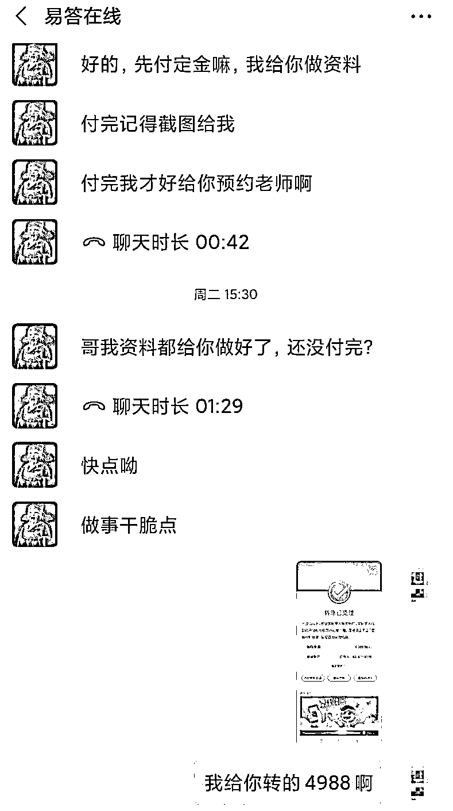
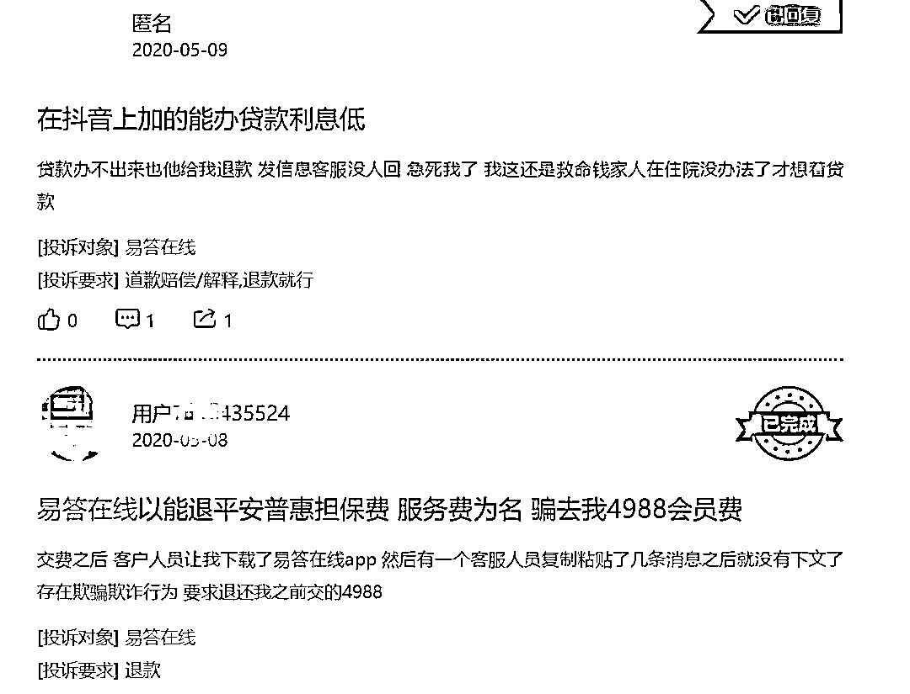
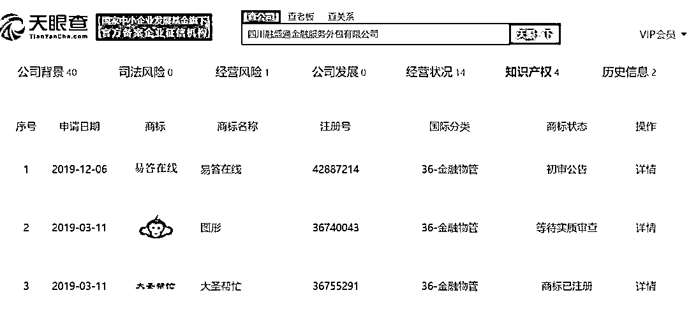
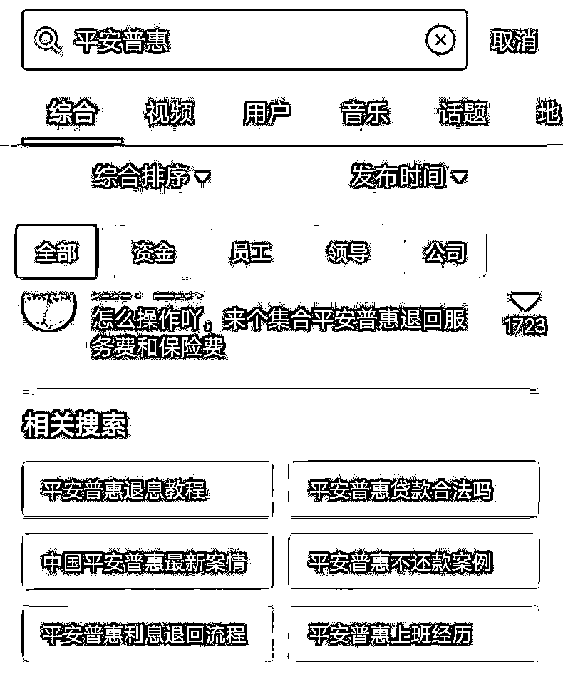
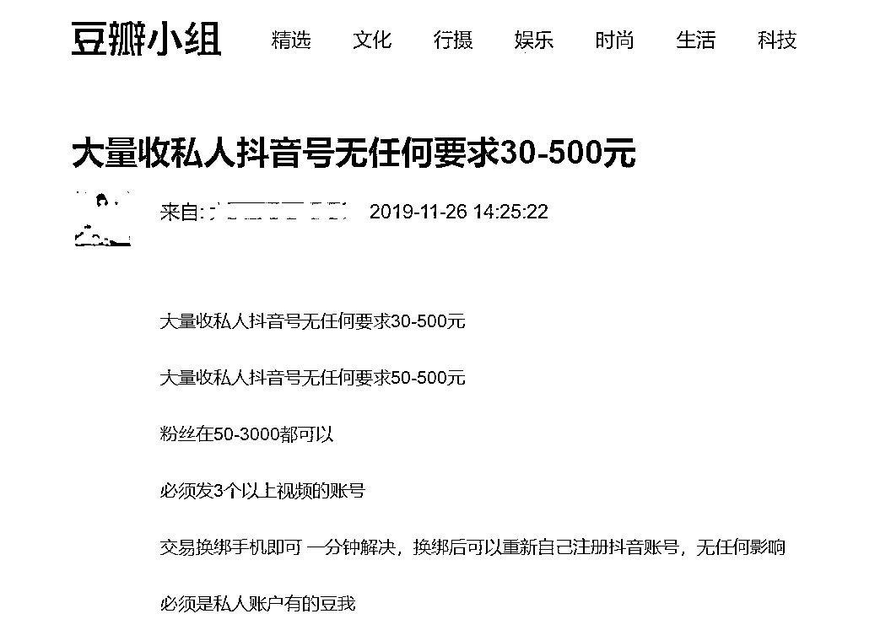

# 反催收联盟暗藏骗局：美女销售直播骗信任，交 4988 元被拉黑

> 原文：[`mp.weixin.qq.com/s?__biz=MzIyMDYwMTk0Mw==&mid=2247500689&idx=3&sn=ddb8572577c72db2822bd5af3989af4f&chksm=97cb08a9a0bc81bf5b263a06db9ef4f32bc73bf6b2a5ae50287fa238fcdee825f710fa3f472d&scene=27#wechat_redirect`](http://mp.weixin.qq.com/s?__biz=MzIyMDYwMTk0Mw==&mid=2247500689&idx=3&sn=ddb8572577c72db2822bd5af3989af4f&chksm=97cb08a9a0bc81bf5b263a06db9ef4f32bc73bf6b2a5ae50287fa238fcdee825f710fa3f472d&scene=27#wechat_redirect)

**点击上方蓝色字体免费订阅“灰产圈”**

反催收联盟的兴起，为一部分人带来了“暴利生意”。

“一个两人的小团队，一个月都能收入十万。”业内人士透露。

因为暴利，这个领域也吸引了诈骗集团的目光。

他们伪装成反催收联盟成员，在抖音、快手、咸鱼等平台收割借款人。

为了取得借款人的信任，他们甚至用美女销售，给借款人直播公司的情况——证明自己是正规的大公司。

借款人交费后，他们会敷衍两天，然后直接拉黑。

更为可怕的是，在这背后，已经形成一条完整的辅助产业链——为骗子注册账号、养号，甚至洗钱。

在这个尔虞我诈的江湖，人性莫测，骗局横生……

01 **上当受骗**

**随着抖音上反催收联盟视频的火热，兰州用户陈博已经多次刷到过相关视频。**

6 月 3 日，他又刷出了一个视频：一家公司称，能提供高级金融规划师服务，帮网贷用户退保退息，三到五天就可以成功。

视频中，还展示了各种网贷用户退钱成功的截图，说服力十足。

巧的是，陈博刚发现，自己在 2017 年借的 8 万元，被平台偷偷收了 9600 元的砍头息等费用，却没有告知。

难道这些钱真的能要回来？

视频末尾有一个微信号，他加上了一个 20 来岁的销售姑娘，后者开始兜售退保退息服务。“她面相善良，语气很诚恳，根本不像骗子。”

为了取得他的信任，销售姑娘打来视频电话，给陈博看自己和自己公司的场景。

**这家公司看上去很正规，工作人员也很多，“公司很大，像这样的小姑娘有二三十个”。**

**陈博彻底相信了。**

这家公司提供两档服务：指导退款，收费 1288 元；量身定做、全程协商，收费 4988 元。

陈博选择了 4988 元的。

对方承诺，没成功全额退款。

陈博算了一笔账：“要是能要回来那 9600 元，扣掉服务费，也能挽回几千元损失。”

微信对话中，销售姑娘催促陈博交钱

但交钱之后，他很快发现自己被骗了：

销售姑娘推过来一个“易答在线”APP 的二维码，要他下载并注册。

下载之后，陈博发现，这个 APP 里面有很多贷款口子。“我好不容易要上岸，这不是害人吗？”他很吃惊。

等他用自己的手机号注册之后，在 APP 里，易答在线的销售人员为他对接了一个所谓的老师。

但后者非常敷衍，只是复制粘贴过来三大段话术，让他自己去协商——这些话，全都是网络上的老生常谈。

没有所谓的全程帮助协商，“老师爱搭不理，一天才回一两次信息”。

陈博慢慢明白，自己成了被反复收割的韭菜。

先收割一遍服务费，再推荐新的贷款平台，用贷款再收割一波。

“能退款吗？”问完这句，陈博被销售姑娘拉黑了。

愤怒的他开始在各个平台上投诉，一定要讨个公道。

**最后，易答在线表示愿意退款，但扣除各种乱七八糟的费用后，他只拿到 1900 多元。**

和陈博的经历如出一辙，福州用户许华平在易答在线交了 1288 元，只退回来 300 多元。

02 **诈骗公司**

**实际上，易答在线是各大投诉网站的重点投诉对象：**

在黑猫投诉上，关于易答在线的总投诉量为 574 条。

黑猫投诉上，两条关于易答在线的投诉

在聚投诉上，4-6 月，关于易答在线的投诉有 27 条。

这家公司到底是什么来头？

天眼查显示，它背后的公司名为四川融盛通金融服务外包有限公司，成立时间为 2015 年 5 月。

陈博称，受骗之后，他拨打了成都 12315 市长热线投诉，当地工商管理部门实地勘察后发现，该公司已经不在原地址，“通过留的所有信息都联系不上”。

**天眼查显示，这家公司一共注册了三个商标，分别是：易答在线、图形、大圣帮忙。**

而大圣帮忙也有很多投诉——2020 年 3 月，就有用户在黑猫投诉上表示，大圣帮忙称可以协助下款，于是自己缴纳了 2880 元，此后再无音讯。

“这还是注册了的。还有更多的这类公司，是没有注册的。”一位从业者表示。

**这些公司“收割”老哥的主战场，就是抖音。**

比如说，在聚投诉 4-6 月关于易答在线的 27 条投诉中，明确提及是刷抖音才与易答在线联系上的，就有 9 条。

“这家公司有一二十个抖音号，都是换来换去的，但里面出现的，都是同一家公司。”许华平称。

他在 4 月被骗。现在他发现，当时活跃的那些易答在线的抖音号，现在都已消失了。

这样的骗局，正在各大视频平台上层出不穷。

百度贴吧有网友称，自己在快手上，看到一个 ID 为“快手小浩反网催”的人说能做停息挂账，“觉得比做老赖强，就安排了”。

他交了 922 元，之后再无消息。

**从表面上看，骗子和其他反催收联盟一样，发的都是“退保退息”“停息挂账”“协商还款”等偏专业性的内容。**

**唯一的不同是，一旦交钱，直接消失。**

目前，这种新式骗局也已经引起了监管部门的注意。

6 月，多地检察院和公安机关开始在网上转发一条视频，视频的标题，就叫“别被这种代理退保退息的新型诈骗忽悠咯！”

03 **诈骗链条**

金融诈骗团伙为何盯上抖音和快手这类短视频平台？

这些骗局其实并不稀奇，早在两年前，它们就出现在各种公众号上。

“微信收紧了监管，很多公众号都被封了。”中介海涛称，随后，骗子们就转战到了抖音和快手上。

**这些短视频平台，迅速成为金融骗局的巨大培养皿。**

这和抖音、快手的推荐机制直接相关——你喜欢看什么，算法就给你推荐什么。

比如，你关注金融产品，或者搜索过“信用卡”等关键词，就会被贴上金融用户的标签，这些内容会被反复推荐给你。

**于是，反催收联盟迅速集结了几百万的借款人大军。**

**反催收联盟也会利用算法，攻占“关键词”。**

比如说，在抖音上搜索“平安普惠”，下面的第一条，就是“来个集合平安普惠退回服务费和保险费”。

在抖音上搜索“平安普惠”出来的结果

**与此同时，诈骗号也被大量推荐过来了——机器不是人，算法对哪些号为真、哪些号为假，很难辨别。**

**因此，在算法机制下，使用者暴露在骗局面前的可能性也更大。**

海涛表示，自己就在抖音上刷到过很多次金融骗局视频。

除了视频之外，留言区也成为收割借款人的利器。

骗子会在点击量高的金融类视频下留言，话术极为高明。

比如，“我也欠了好几万元，现在还不上，大家加我一个联系方式，一起想办法吧”。

**“作为信贷用户，你对抖音越上瘾，被骗的概率也就越大。”海涛称。**

**而在这条暴利的产业链之下，开始形成完整的辅助产业链。**

骗子怕被追踪，一般会用虚拟手机卡注册抖音号。

“有卡商会提供专门的虚拟手机号和验证码，供人注册。去年这门生意刚兴起的时候，快手号卖 4-5 元一个，抖音号卖 5-6 元一个，并不贵。”海涛表示。

也就是说，一个虚拟号的成本，也就几元钱。

还有一些骗子，喜欢购买私人抖音号。

比如在豆瓣上，就有人大量收购私人抖音号，一个号的收购价在 30-500 元之间。

“粉丝在 50-3000 都可以，必须发 3 个以上视频的账号。交易换绑手机即可，一分钟解决。”

相比而言，因为需要绑定支付宝做人脸识别，所以闲鱼号没办法批量注册。骗子往往会去租闲鱼号，一天 5 元，此后在闲鱼里找人聊天，慢慢引流。

而进入这些账户的钱，很快就会被“洗掉”。

洗钱的方式，就是赌博行业最常见的“跑分”。

**值得关注的是，涉黄视频，也逐渐成为金融骗子获客的一大来源。**

海涛表示，抖音和快手上，有很多“色流”视频。它们的内容较为隐晦，存在性暗示，但因为未涉及暴露内容，机器很难分辨。

在这些号的签名处，会留一个联系方式，“懂的人就会加”。

“加了之后，当天不会同意，第二天才会同意，跟你互动。”海涛说。他加过一次，聊了几句之后，发现对方是机器人。

这些机器人会发来一连串话术，引导对话者去贷款、看色情直播、购物，或者去杀猪盘。

“在‘色粉’中，能捞出来很多金融客户，因为关注这些的人，大部分都无所事事，因此更好骗。”海涛称。

**在退保退息和停息挂账骗局背后，操盘者到底是谁？**

海涛表示，他们可以被分两类。

一类，是之前做色粉、杀猪盘的人，“转行杀到了金融圈”。

另一类人，是之前的现金贷从业者。

随着监管严打，从去年年底开始，很多现金贷从业者纷纷转行。“现在，这群人又开始抢杀猪盘的饭碗。”

故事到这里，并没有结束。只要是骗子，总会留下马脚。

陈博已经报警。他打算找到当时骗自己的那个销售姑娘——在他的手机上，有她的视频截图。

抖音号可以造假，手机号可以造假，收款账户可以造假，但人脸，无法造假。

他坚持认为，公安机关凭借人脸识别找到一个人，并非难事。

“他们应该在东南亚一带活动，不在国内。”警方告诉他。

一个反催收联盟的创始人和同行抱怨，说投诉这招，现在效果越来越弱了。

金融机构和催收行业，对此都开始免疫。

对方笑他傻：“金融机构免疫没有关系，只要借款人还信就行。”

对于他们来说，借款人不是客户，只是反复收割的韭菜……

*文中受访者为化名 文 ： 罗素 来源：一本财经

← 向右滑动与灰产圈互动交流 →

**点击****阅读原文****加入灰产圈高端社群**

