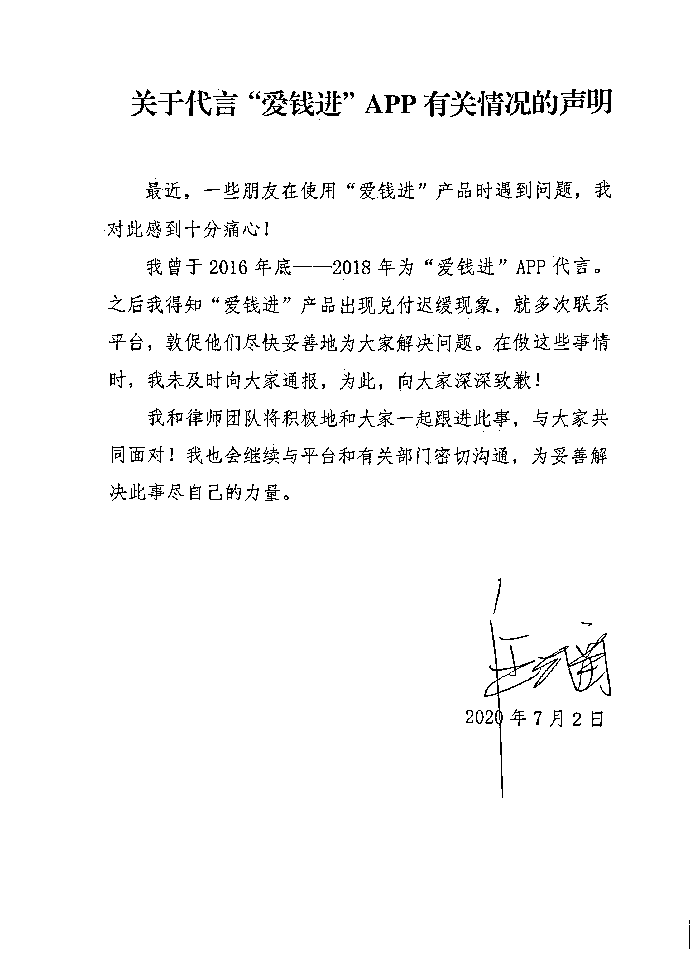

# 代言理财 APP 翻车？汪涵道歉

> 原文：[`mp.weixin.qq.com/s?__biz=MzIyMDYwMTk0Mw==&mid=2247500689&idx=4&sn=6d21272cab5c03be1330f54439444eb0&chksm=97cb08a9a0bc81bf0aec0494f2d6e1e8b2bc1b970ab6ddfe2bd3b0c19c6723ebf5250f492ef6&scene=27#wechat_redirect`](http://mp.weixin.qq.com/s?__biz=MzIyMDYwMTk0Mw==&mid=2247500689&idx=4&sn=6d21272cab5c03be1330f54439444eb0&chksm=97cb08a9a0bc81bf0aec0494f2d6e1e8b2bc1b970ab6ddfe2bd3b0c19c6723ebf5250f492ef6&scene=27#wechat_redirect)

**点击上方蓝色字体免费订阅“灰产圈”**

近日，有网文称汪涵代言的“爱钱进”APP 于 2020 年 6 月出现兑付困难，众多投资者在该产品上的资金无法正常提现，并表示希望曾是代言人的汪涵可以帮助投资者发声。

[`mp.weixin.qq.com/mp/readtemplate?t=pages/video_player_tmpl&action=mpvideo&auto=0&vid=wxv_1410852814657601537`](https://mp.weixin.qq.com/mp/readtemplate?t=pages/video_player_tmpl&action=mpvideo&auto=0&vid=wxv_1410852814657601537)

澎湃新闻：郑朝渊 实习生：靳佳 编辑：周妍 素材来源；相关人士 责任编辑：周琦

对此，汪涵团队回应称：对广大用户遭遇兑付困难感到痛心！2018 年底代言已结束。

汪涵本人及团队一直在联合相关部门、督促平台解决问题，希望能帮大家减少损失。随后，汪涵发签名声明，表示自己和律师团队会积极跟进此事，与大家共同面对。

据了解，汪涵代言该产品时曾喊话“小小幸福，天天进账”，如今，投资者不仅没有进账，反而面临着本金无法退出的困境。

目前，网贷平台“爱钱进”因非法吸收公众存款罪，被北京东城区公安经侦部门立案侦办。

除了汪涵以外，刘国梁也曾为爱钱进代言，一些投资者要求两人公开道歉，并承担民事赔偿等连带责任。

那么，作为代言人的他们应该承担相应责任吗？

***“爱钱进”被立案侦办***

“我是因为信任汪涵，才投钱到‘爱钱进’的。”

投资者陈先生称，他在 2017 年看到汪涵代言了“爱钱进”平台的广告，出于对汪涵形象的认可和信任，从那时起便开始在平台投资。

2019 年，乒乓冠军刘国梁成为“爱钱进”平台“幸福体验官”。“后来代言人换成了刘国梁，我更放心，投了更多钱进去。”

令投资者没想到的是，今年 2 月初，“爱钱进”突然暂停发标，并且在官网下线了刘国梁代言的页面，平台兑付也开始出现延迟等情况。

“从 2 月份到今天，平台才处理了差不多一周的债转，现在处理到 2 月 9 日的。今年 5 月平台上线债券商城企图收割出借人，6 月初上线打折通道，加大力度收割，一般打 3-5 折才能下车。”一名“爱钱进”投资者在微博写到。 

公开报道显示，2019 年 8 月，“爱钱进”母公司——凡普金科合肥第一分公司疑因贷后催收问题被当地警方入场检查。

对此，凡普金科回应称，网传“凡普金科遭警方控制”一事系凡普金科合肥呼叫中心接受当地政府部门合规检查，公司正在积极同当地监管部门沟通，全力配合检查工作，凡普金科及旗下平台运营一切正常。

“爱钱进”官网显示，截至 2020 年 1 月 8 日，爱钱进累计撮合交易额达 2275.08 亿元，累计撮合交易笔数约为 9.48 亿笔，累计服务用户数为 1627 万。截至 2019 年 12 月 31 日，借贷余额本金 292.88 亿元，借款余额利息为 24.11 亿元。

针对投资者曝料，北京东城区警方回复媒体询问时回应，这个案件目前还在侦办阶段，不方便透露相关信息。北京东城区金融办相关工作人员则表示，其接到通知爱钱进已被相关部门立案侦办。

***广告代言人要承担连带责任吗？***

网贷平台爆雷，作为平台代言人的汪涵、刘国梁是否需要承担民事赔偿等连带法律责任？

北京观韬中茂（上海）律师事务所律师葛志浩指出，一般情况下，代言人不需要为其承担连带的民事或刑事责任，但如果代言的广告被认定为虚假广告，代言人明知或者应当知道广告为虚假的，则应与广告主一起承担连带责任。

根据广告法第五十六条款的规定，明星是否承担民事责任一般分以下 3 种情况——

> 1、如果明星代言的广告的商品或者服务关系到消费者生命健康且是虚假广告，明星和广告主承担连带责任。
> 
> 2、明星代言的广告为虚假广告，但明星不明知，也不应知所代言的广告是虚假的，明星不和广告主承担虚假广告的连带责任。
> 
> 3、明星明知或应知所代言的广告是虚假仍然代言的应和广告主承担连带责任。

葛志浩表示，汪涵、刘国梁代言的是网络借贷信息中介服务平台，不是关系到消费者生命健康的商品或者服务，他们是否承担民事责任，主要看其代言的广告是否是为虚假广告，及他们是否明知或者应知这些广告是虚假的。

“如果汪涵、刘国梁在代言时明知或者应知广告虚假仍设计、制作、代理、发布或者作推荐、证明的，应当与广告主承担连带责任。

相反，如果代言人在代言前、代言时并不知道是虚假广告，则不需要承担连带责任。”

查询发现，汪涵的海报中提及“‘爱钱进’是网贷之家排名前 10 的互联网金融平台”，如该平台当时不是前 10 名，则汪涵的代言的广告会被认定为虚假广告，有可能要承担连带责任。

而刘国梁代言的海报中提到“稳稳进账”，虽然没有对进账金额作保证，但有明示或者暗示保本且有收效，或违反《广告法》第二十五条规定。“如果广告被认定虚假广告，代言人也将和广告主承担连带的责任。”葛志浩说。

此外，在特定情况下，代言人还需承担刑事责任。葛志浩表示，如代言人明知他人从事集资诈骗行为，仍为其提供广告宣传服务的，可能构成集资诈骗罪的共犯。

“仅存目前发布的广告内容看，无法判断汪涵、刘国梁是否有连带责任。”葛志浩说。

（综合自上观新闻、澎湃新闻 郑朝渊、新浪财经等澎湃新闻 综合报道）

← 向右滑动与灰产圈互动交流 →

**点击****阅读原文****加入灰产圈高端社群**

