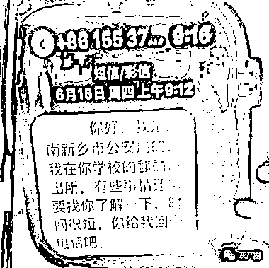
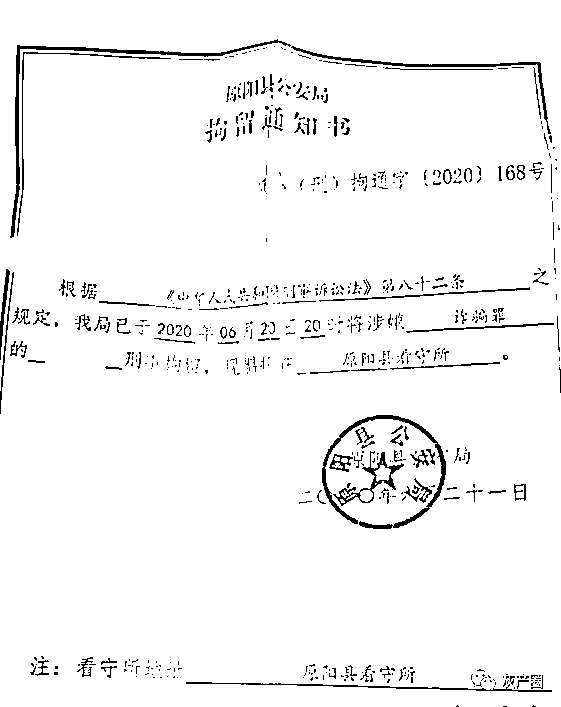
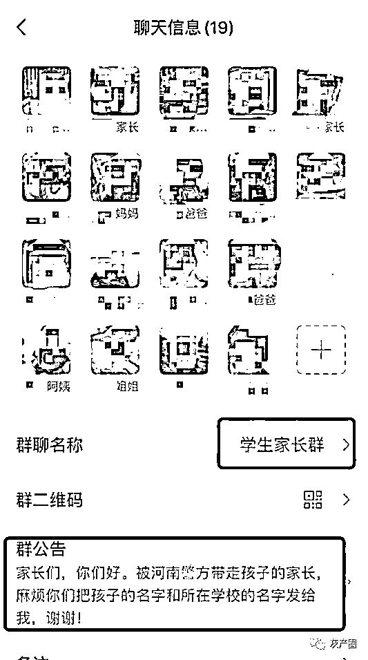
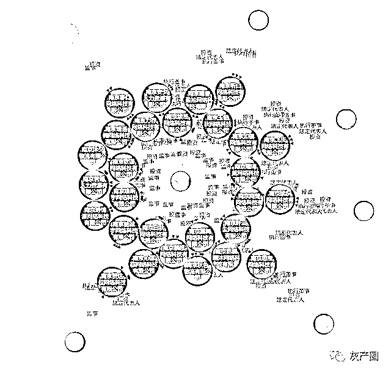
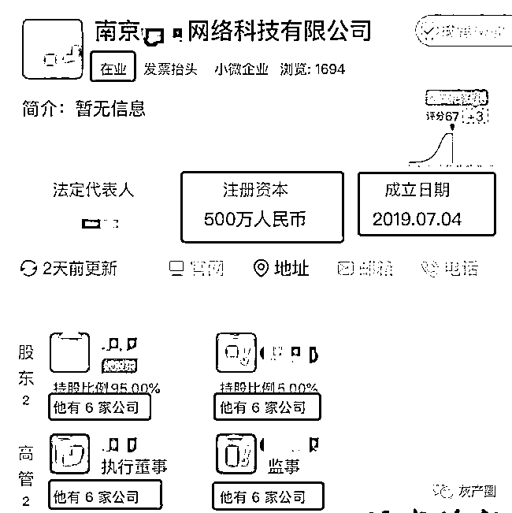
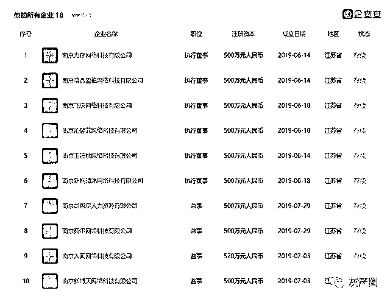
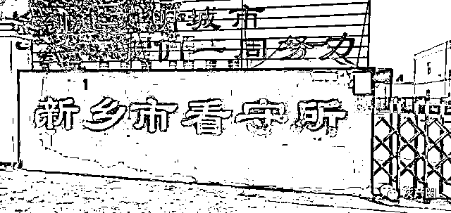

# 想做老板吗？享受监狱套房的那种！

> 原文：[`mp.weixin.qq.com/s?__biz=MzIyMDYwMTk0Mw==&mid=2247500728&idx=1&sn=41fcd1bee854630595bf01741606d6a3&chksm=97cb0880a0bc81961866ba437034dd49e5217aa44ff5d750b73f73bd8ce0de1b095db5b67c5f&scene=27#wechat_redirect`](http://mp.weixin.qq.com/s?__biz=MzIyMDYwMTk0Mw==&mid=2247500728&idx=1&sn=41fcd1bee854630595bf01741606d6a3&chksm=97cb0880a0bc81961866ba437034dd49e5217aa44ff5d750b73f73bd8ce0de1b095db5b67c5f&scene=27#wechat_redirect)

**点击上方蓝色字体免费订阅“灰产圈”**

***导语***

王女士已经整整 14 天没有儿子的消息了。

她的儿子在南京一所高职院校上学，6 月 18 日中午，儿子突然 " 失联 "。直到 6 月 21 日，王女士才从学校获知，儿子因为 " 涉嫌诈骗 "，被河南警方带走了。一同被带走的，还有同宿舍的另外 3 名男生。

7 月 2 日，记者从这些涉事学生的家长中获知，目前至少有江苏 5 所学校（含职校、技校和高职院校）的 9 名学生被河南警方带走。这些学生在有人组织下，前往南京市江北新区行政审批局注册数百家公司。据南京警方相关人士介绍，这些公司被注册后，又被用来诈骗，涉及到的金额很大。河南警方已经立案，很多家长也已收到刑事拘留通知书。这些学校的主管部门表示：已经获悉此事，正在调查。

***一宿舍四个男生全部被警方带走***

6 月 18 日中午，王女士（化名）下班回家，发现家里灯全开着，厨房里的饭还在灶上热着，但儿子小铭（化名）人不在家，微信、电话也不回。

直到下午四点，才接到儿子电话：" 妈妈，我被警察带走配合录口供了，你别担心。" 晚上儿子再次打来电话，" 妈妈别担心，这次录完口供，这个事就彻底结束了，以后就不用担心了。"

但当晚，王女士再也没能联系上儿子，6 月 21 日，王女士才通过儿子所在班级的班主任得知，儿子被河南警方带走了！而且，让她惊讶的是，同宿舍另外 3 名男生全部被带走。

7 月 2 日，记者联系上了其中的几名家长，经调查发现，目前能确认的，有江苏 5 所学校的 9 名学生被河南警方带走。

记者从这 9 名学生家长那里获悉，他们都收到了来自河南省原阳县公安局的刑事拘留通知书，涉嫌的罪名是诈骗罪。这些学生目前被羁押在河南原阳县、封丘县等不同的看守所。

△拘留通知书

王女士告诉记者，6 月 18 日接到儿子的电话，还以为只是一次普通的询问，儿子会很快回家。因为今年的 4 月 28 日，小铭的同学金某已经被警方带走，此后，他和同宿舍的其他同学就开始频繁和警方沟通。

***学生相互介绍，***

***每人拿到千元左右报酬***

" 我们一直以为孩子是在勤工俭学。" 王女士说。她和其他学生家长一起组建了一个群，想要了解更多的信息，但目前还是像无头苍蝇一样，" 其实我们也不清楚具体情况，最清楚情况的只有孩子。"

△涉事学生的家长们所在的微信群

记者从南京市公安局江北新区分局了解到，这些学生确实是被河南警方抓走的，多人注册皮包公司后，又实施诈骗，金额巨大，诈骗案发地在河南。目前南京警方做的是协助工作。

据王女士了解，儿子小铭和宿舍另外 3 名室友，都是被同校一名叫金某的学生 " 带下水的 "。

王女士告诉记者，2019 年，金某以假期一起打工挣钱为由，结识了钱某，又通过钱某认识了小铭和其他同学。有一天金某说，把身份证借给别人注册公司可以赚一笔钱，并声称自己有可靠渠道，承诺绝不会有任何损失，全程只需要去签字就可以了，其他什么都不用做。事后每人还可以得到 1000 元左右的报酬。

于是，小铭和另外几名同学在金某的介绍下，纷纷去江宁江北新区行政审批局赚了这笔 " 快钱 "。

" 我根本就不知道他把身份证借给别人了！" 直到今年 4 月 8 日，牵线人金某被警方带走后，王女士和其他几位家长在回家询问孩子时才得知此事。

有学生名下多达 32 家公司

记者通过天眼查输入这些涉事学生姓名发现，这些被注册的公司大多为网络科技、人力资源、物流运输等小微企业。注册资本皆为 500 万元。注册时间集中在 2019 年 5 月至 8 月之间。这些企业有股份公司，也有独资公司，涉事学生之间还互相兼任公司股东、执行董事、高管等职位，形成了一个庞大的关系网络。而且，绝大部分公司目前仍处于在业状态。

据南京市江北新区管委会行政审批局出具的一份警示函显示，去年 9 月，他们已对情况有所察觉，初步排查出疑似虚假注册企业近 300 家。其中一名学生就注册了 32 家企业。

△小铭注册的公司

" 我儿子注册公司的时候，刚满 18 周岁，这些孩子哪有钱去注册公司，肯定也是被人骗了。" 王女士说。

王女士告诉记者，让她感到蹊跷的是，这些孩子注册公司后，营业执照和公司公章都被人拿走了，所以她原本想去注销公司，都无法得到处理。

学校主管部门回应：正在核实中

记者了解到，涉事的学生来自南京交通技师学院、南京技师学院、江苏航运职业技术学院等学校。

其中南京交通技师学院隶属南京市交通运输局，江苏航运职业技术学院隶属江苏省交通运输厅，南京技师学院的上级主管部门是南京市人力资源和社会保障局。

南京市交通运输局的相关人员则表示，正在向学校（南京交通技师学院）进行核实，学校还没有给他们回应。从新闻上看公安机关已经介入了此事，以公安机关发布为准。

南京市人力资源和社会保障局的相关人士告诉记者，他们已经和公安部门取得了联系，事情发生后，公安部门已经通报过给他们，案件还在查处中。作为学校的业务主管部门，目前已经对全市的技工院校开始排查和整顿，让学校加强这方面的宣传教育。

***河南警方：已经成立专案组在侦查***

这些学生是否要承担相应的法律责任？江苏钟山明镜律师事务所的律师吕金艳表示，诈骗罪是重罪，关键要看他们有没有诈骗行为，如果只是出售身份信息、确实没有参与诈骗的话，那么不涉嫌构成诈骗罪。

另外，虽然他们自己注册了公司，但如果实际上并没有参与公司的经营的话，就只是名义上的股东，也不构成犯罪。

同时，要看他的主观目的，有没有犯罪动机。如果明知道注册公司是运用于犯罪，可能算前期参与，也有可能涉嫌犯罪。

" 还是要看警方查处的情况。这种情况我们遇到蛮多的，很多人出售身份信息，给别人办公司或者办银行卡。"

7 月 2 日晚，记者从河南省新乡市公安局办案民警处了解到，目前该案已经成立专案组，正在侦查中，不方便透露更多的情况。从拘留之日起算 30 日内，警方会将案件移送到检察院。

来源：现代快报

[`v.qq.com/iframe/preview.html?vid=w3110o9htn5&auto=0`](https://v.qq.com/iframe/preview.html?vid=w3110o9htn5&auto=0)

南京多名在校学生被河南警方跨省刑拘！原因令人震惊！

← 向右滑动与灰产圈互动交流 →

**点击****阅读原文****加入灰产圈高端社群**

