# “星座”是如何骗人的？

> 原文：[`mp.weixin.qq.com/s?__biz=MzIyMDYwMTk0Mw==&mid=2247500728&idx=2&sn=c26b97fa8a97dedf6b75e9318094b3ec&chksm=97cb0880a0bc819636fb86f749b133bb17660ad7b53b46e40792a92ab9b69107439ad45c4dae&scene=27#wechat_redirect`](http://mp.weixin.qq.com/s?__biz=MzIyMDYwMTk0Mw==&mid=2247500728&idx=2&sn=c26b97fa8a97dedf6b75e9318094b3ec&chksm=97cb0880a0bc819636fb86f749b133bb17660ad7b53b46e40792a92ab9b69107439ad45c4dae&scene=27#wechat_redirect)

**点击上方蓝色字体免费订阅“灰产圈”**

00

**星座**成了当代年轻人的一种信仰。
从衣服、眼影的幸运色，吃饭时的幸运位置，根据幸运数字决定出门时间，到交友谈对象先问星座，出门必看“今日运程”，预测考试成绩，甚至是生活里大大小小的选择，他们把人生全部托付给了星座。**在这些人眼里，星座是一本崇高权威的生活指南。**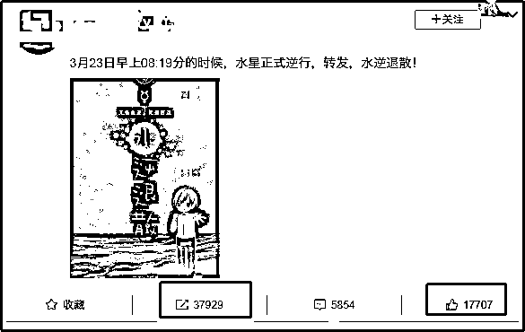▲某星座博主的一条简单的微博，就有 3 万多转发，近 2 万点赞。**星座之所以是年轻人的“社交神器”，主要是构建了一套识别“同类”的标准。**比如白羊和射手适合做死党，金牛和天蝎容易互相看不顺眼，巨蟹和处女只能做普通朋友。不同于上一代人的“今天你吃了吗”，年轻人这一套简单又朗朗上口的口诀，不仅能迅速打破尴尬，与陌生人找到共同话题，还能高效筛选掉损友和烂桃花，找到“合适”的朋友和对象。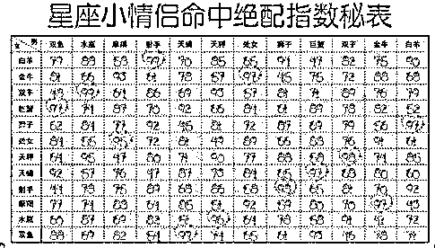▲星座所谓的“情侣配对指数”、“交友指数”，是许多婚恋网站、星座博主、占星师必备的吸粉法宝。
**明星和资本的鼓动，则是星座狂热的幕后推手。**我们都知道，**明星有很强的“带货”能力**，粉丝们往往爱屋及乌，偶像说什么就信什么。明星们在接受采访时，喜欢用星座委婉地夸自己，比如“可能我是金牛座的吧，人比较稳重踏实”，然后把负面新闻甩锅给星座，我性格有时候急躁，是因为白羊座本身就这样，不是我的问题。星座成了明星的“砖头”，哪里需要往哪搬，这也变相在观众心里强化了“星座很准”的假象。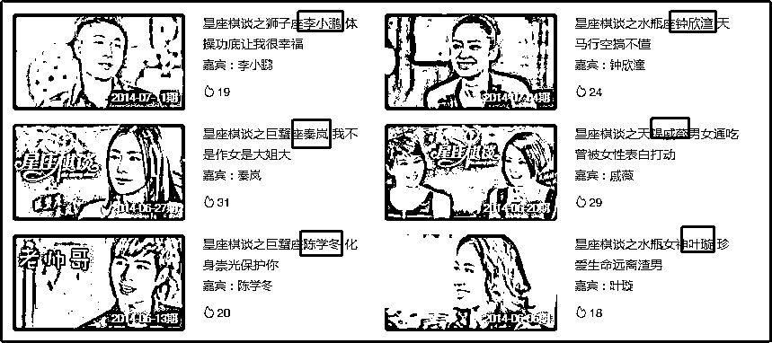▲来自爱奇艺的《星座棋谈》**资本有一个挣快钱的秘诀：****哪里有流量，哪里就有金矿。**全民星座热，让星座成了一门暴利的“迷信生意”，资本自然不能错过。腾讯、新浪、爱奇艺等网站专门开设相关的星座板块和综艺节目，提供生活、情感、工作上的运势预测，吸粉固粉。商家不断发起一波又一波的“星座营销”，从某哈哈矿泉水，到十二星座面膜、十二星座手机、配饰等，努力从中分一杯羹。资本还疯狂收购顶流的微博博主、公众号等星座自媒体，准备大割韭菜。这些大量的热钱在无形中推动了星座的野蛮生长。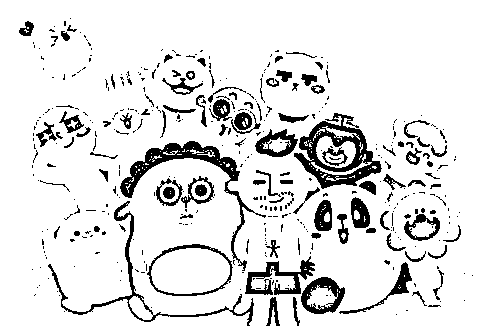▲微博上某星座博主成功变现，被资本收购，估值达 3 亿元。**实际上，星座是一种现代迷信。**在微博上转发星座运势的我们，跟在朋友圈分享养生、保健品的亲戚没有区别。

01

**星座：****披着天文学外衣的伪科学**20 世纪 70 年代末，改革开放的浪潮锣鼓喧天，再加上我们对老外的东西有一种天然崇拜，西方的“十二星座”趁虚而入，在我国遍地开花。“十二星座”，简单来说，就是根据生日，把人归入十二个星座，并赋予不同的性格和喜好。升级版还有什么天宫图、太阳星座、月亮星座、上升星座等理论。反正都一个意思：**天上太阳、月亮、星星的位置和变化能决定人的性格和一生的命运。**这类似于我国的五行八字，我们出生的时候，就已经注定 40 岁是否能发大财。不同的是，“星座”把我们的命绑到了星星身上。**星座就是一种洋迷信，属于文化入侵。**▲网上很火的“水逆”，就是来自“星座理论”，指水星逆行会导致人的运气不佳。既然是迷信，为什么许多人会觉得“星座很准”呢？
**“星座分析”看起来头头是道，本质上全是模糊笼统、普遍宽泛的描述，几乎适合每一个人。**我们可以先读读下面的文字：
1.你很需要他人的认可和喜欢，别人不经意的一句夸奖能让你开心很久。
2.你体内拥有尚未挖掘的巨大潜力。经过努力，你将获得更大的进步。
3.你尊重内心的想法，但又无法挣脱外在环境的束缚。4.你性格上有一些弱点，但一般来说能扬长避短。5.你有时开朗，喜欢社交，有时候又很安静，乐于独处。
6.你渴望安全感。 ......
看完上面的话，你是不是很有共鸣？其实这些都是人类的普遍心理，每个人或多或少都有一点：谁不希望得到别人的赞赏？谁不认为自己身上有很大的潜力？哪个上班族不想做自己，挣脱工资的束缚？谁性格没有缺点？
......**这在心理学上叫“巴奴姆效应”：****我们喜欢对号入座一些模糊、宽泛的描述。**比如金牛座，一般会写“稳重肯干的实业家，值得依靠的人”，虽然描述十分空洞，但“金牛”们仍然认为，它说的很准，自己就是这样的人。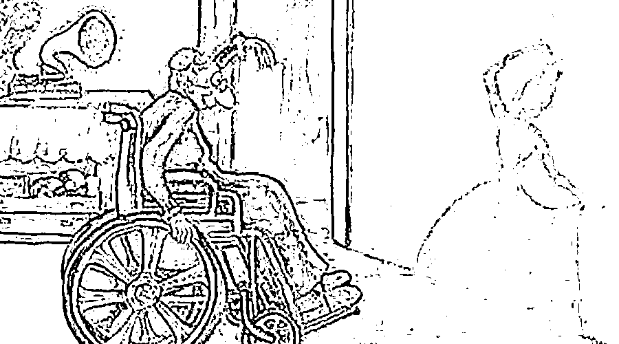▲人类具有强大的“脑补”能力。**此外，人的脑子会自我剪裁，总是对“准的内容”印象深刻，不准的部分转眼就忘，于是便产生了“星座很准”的幻觉。**我在网上曾看到一条热门评论，说魔蝎座的人最隐忍，底下一群魔蝎座的人纷纷共鸣附和。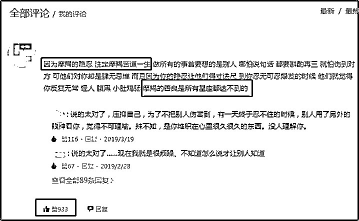于是，我又无聊地搜了一下别的星座，有趣的地方出现了，**每个星座都说自己最隐忍。**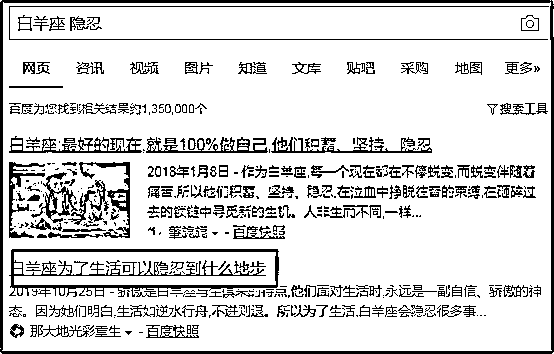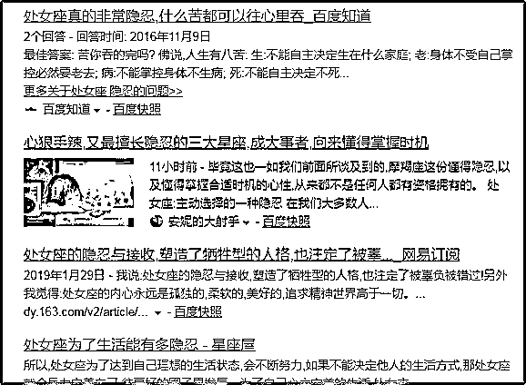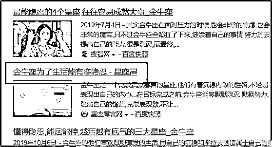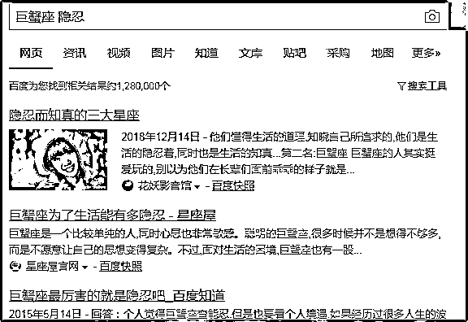向左滑动，查看白羊、处女、金牛、巨蟹的隐忍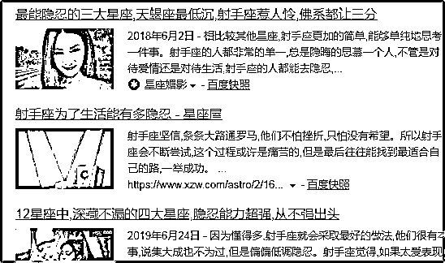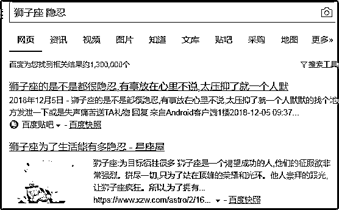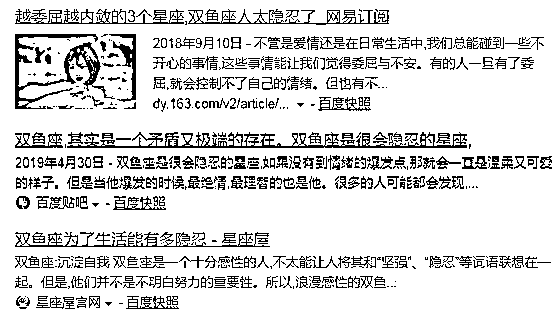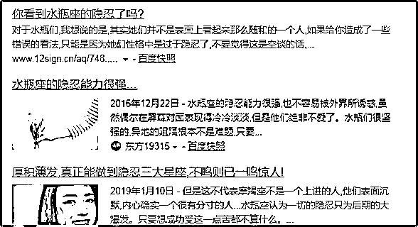向左滑动，查看射手、狮子、双鱼、水瓶的隐忍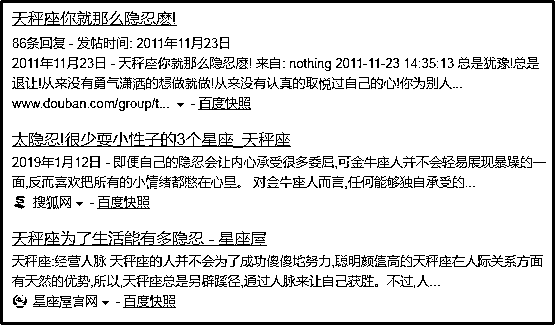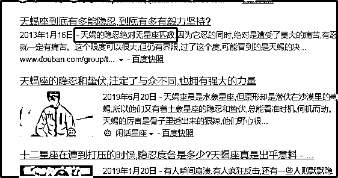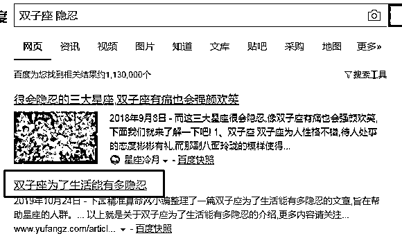向左滑动，查看天秤、天蝎、双子的隐忍**星座里乐观、抠门、洁癖等性格也是一个道理，百度“星座+特征”，你就会发现，每一个星座都沾边。**1971 年，美国加州大学伯克利分校做了一个“星座测试”。科学家们收集和分析了 1000 个成年人的星座和他们被天宫图影响的属性，比如领导才能、音乐才能、美术才能、自信心、创造力、职业、社交能力等。**结果表明，天宫图不同的人在这些方面都不存在差异，天宫图根本无法预测人生。**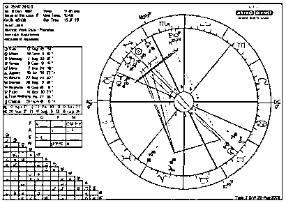▲天宫图是“十二星座”的升级版，也是占星术的核心内容。1975 年，包括 19 名诺贝尔奖得主在内的 192 名科学家公开声明:反对占星术。不信的朋友可以去网上搜一份“十二星座”，遮住星座名字后，你会发现，每一个星座都有你的影子。

02

**占星师真的能教你炒股吗？****占星师和星座博主，其实是披着星座外衣，靠贩卖鸡汤赚钱的算命师傅。**比如占星师，号称上知天文，下晓地理，手中的星盘包罗万象，无所不通。在占星师眼里，一切命中注定，从我是谁，我和他适不适合恋爱，到要不要跳槽，今天适合搬家吗，再到最近我的运气为什么这么差，该买什么股票，全都有章可循，有法可治。**事实上，占星师的“隔空把脉”是一种糅合了心理学和说话技巧的高级骗术。**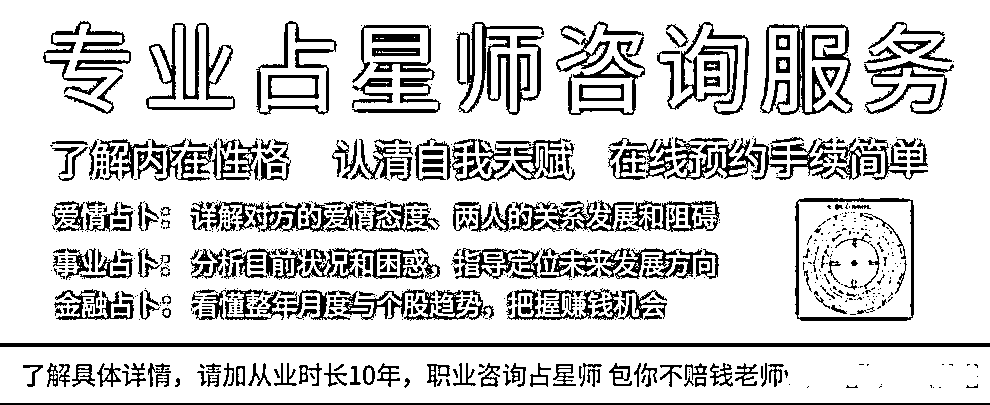纵观所有占星师和星座博主的说辞，它们都是把**模糊、普遍、适用于大多数人的描述当成自己独一无二、为你量身定制的推理，有点“大数据”那意思。**就像前面的星座性格分析一样，他们的说话大而全，一句话里正反面都有，让自己永远立于“不错之地”。比如说你有时勇敢，喜欢尝试新鲜的东西，有时胆小，不敢走出舒适圈。你是一个体贴、平和的人，但被人欺骗的时候，也会发火生气。试问谁不是勇敢或胆小，时而体贴又时而生气？正的反的，好的坏的，全让你说了，能不准吗？他们还会说，你小时候曾发生过一次与水有关的倒霉事。这简直是废话，谁小时候没跟水有过二三事?被开水烫过、游泳呛过水,或被水弄湿鞋和作业本......**预测疾病也是一个道理，把大数据的统计当成自己的预测。**如果你算的是老人，占星师通常会说他心脏不好，你会觉得很准。实际上，心脏病是中老年人的常见疾病，就像你随便问几个在深圳工作的人，十有八九是本科生。然后“心脏不好”又很笼统，你经常紧张心跳快，也能认为是心脏不好。每次碰到这种模棱两可的描述，我们会情不自禁地脑补，拼命往上凑。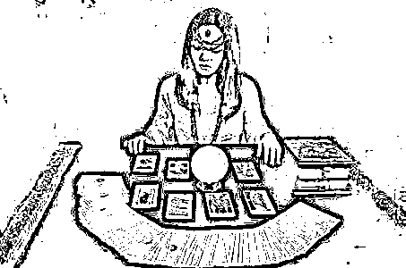▲算命大师、塔罗牌占卜师、通灵师都是换汤不换药的“话术骗子”。
掌握了上面的话术，你也能做一个占星术或星座博主了，甚至还能教教炒股，挣点股民的钱。你就根据他星座的幸运色，帮他推荐 logo 是一样颜色的上市公司，然后胡编股价的走势，说什么这个时期对应天上星星的位置，会如何影响市场的情绪，然后买还是卖。最后再来点“股市有风险，记得低买高卖”的废话忠告，完美！**大胆说，不要怕，就算是分析错了，我们可以学占星师编各种借口“甩锅”。**比如自己预测的时候刚好水逆，影响了准确性，或者过于考虑一颗星的影响而忽视了另一颗星的作用，或者当天拉肚子了，状态不好......总之就是，我很牛，我预测失误是受了外界影响，不是我能力不行。**事前模糊，事后诸葛，然后再加点鸡汤，比如充分的鼓励和善意的忠告，割韭菜就是这么简单。**

03

**时代焦虑与现代迷信****在不确定的世界里，人们渴望一种对生活的掌控感，星座等迷信便成了很多人获得确定性的救命稻草。** 这是一个信息爆炸、节奏飞快的时代。社会庞大浮躁，充满了不确定，我们像蝼蚁一样渺小，为工作熬夜，为前途迷茫，为房价失眠，命运如雾里看花。人心也复杂叵测，每个人都带着多重面具，知人知面难知心。再加上人生不如意事十之八九，每天朋友圈水逆的人堪比流感。于是，人人对现状焦虑，对未来无力，实在是压力山大。**在没有一种具体、高效的解决方法时，号称“知天命，懂人心”的星座理论便成了一碗精神寄托的“心灵鸡汤”，一颗病急乱投医的“万能灵药”。**有人说，星座就是一种解压的娱乐，无益无害，没必要大惊小怪。实际上，你越信一种东西，它也会反作用于你。这相当于一种心理暗示，对星座的痴迷，会让你不断用星座的特征和命运来催眠自己，失恋分手了怪水逆，工作失意怪自己星座的命就这样，整个人完全沦为星座的傀儡。也有人说，存在即合理。星座这么流行，自然有其优点。裹小脚这种习俗也存在过，在当时的大环境下也合理，它就是正确可信的？还有人说，人总得信点什么。是的，人总得信点什么，但不是星座这种迷信。你可以信科学，信功不唐捐，信天上没有白掉的馅饼，信我命由我不由天。
**参考资料**1.《“星座文化”在中国的创新扩散研究》，黄琼 2.《占星：撩拨大众心灵的生意》，中国新闻周刊 3.《“算命”是如何骗人的》，林垚 4.《命理信仰在当代的复苏》，邢婷婷

← 向右滑动与灰产圈互动交流 →

**点击****阅读原文****加入灰产圈高端社群**

