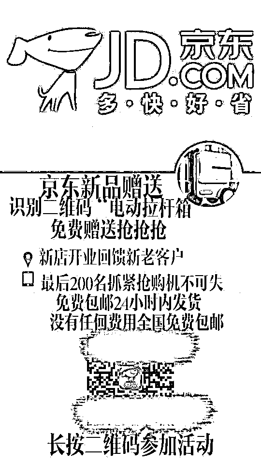
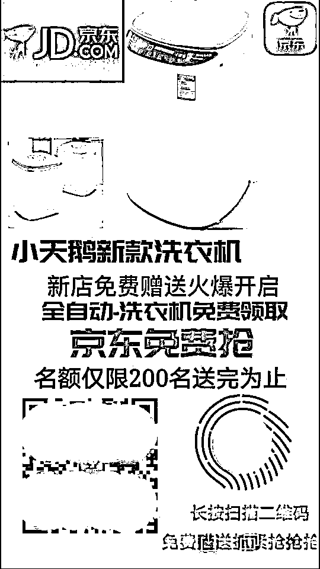
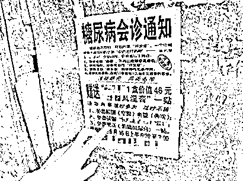
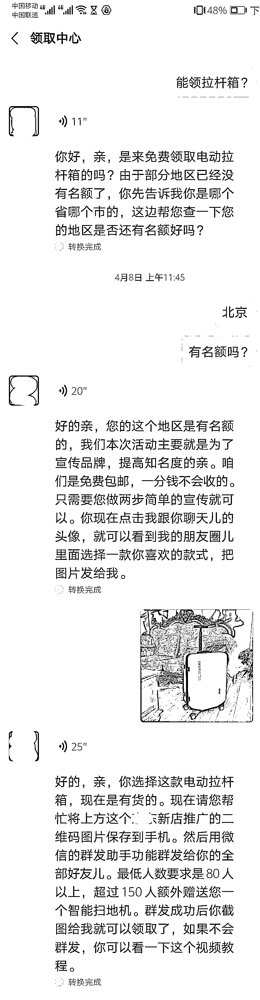
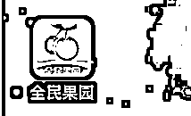
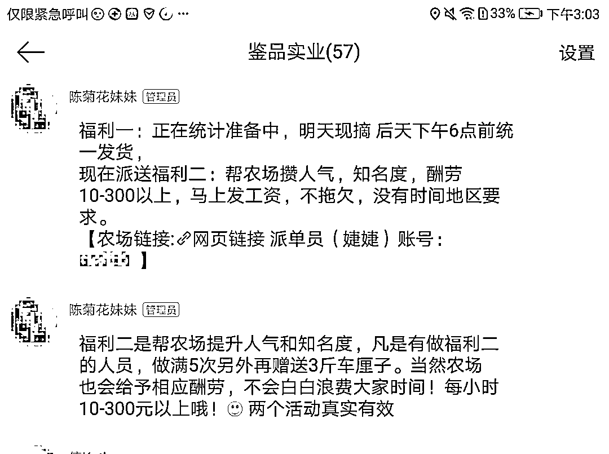
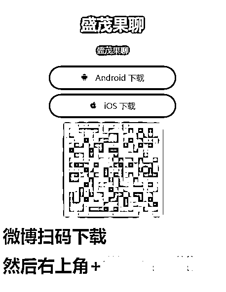
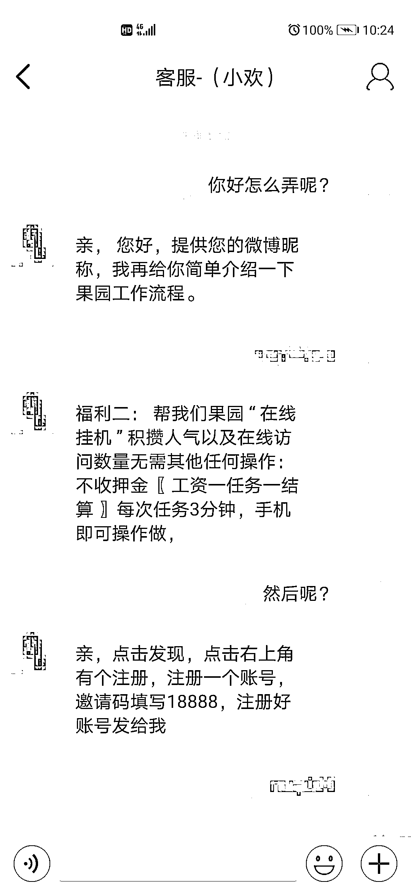
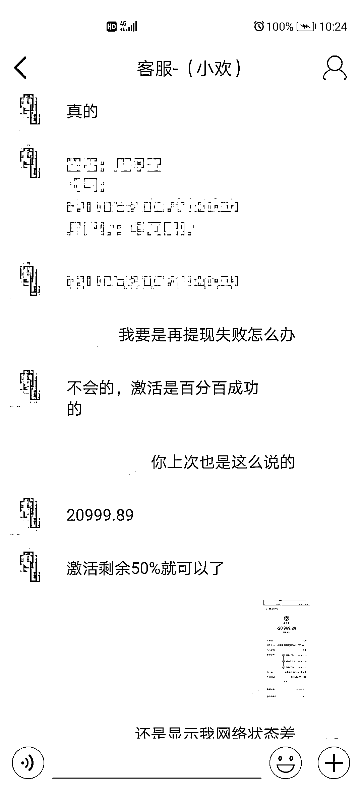
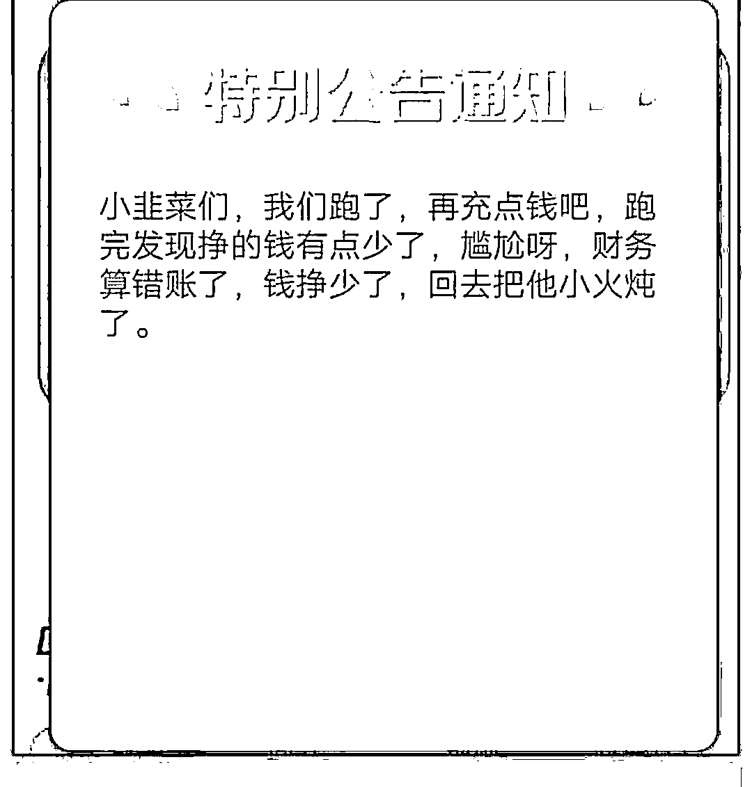

# “免费”的东西那么多，到底什么东西是真的？

> 原文：[`mp.weixin.qq.com/s?__biz=MzIyMDYwMTk0Mw==&mid=2247500728&idx=3&sn=9a743d4a95214327a34818d8fd3ffbc9&chksm=97cb0880a0bc819661862ca8f6edd3a81a3e74f433659c269ed78118ffacf3184cfe6c4fb334&scene=27#wechat_redirect`](http://mp.weixin.qq.com/s?__biz=MzIyMDYwMTk0Mw==&mid=2247500728&idx=3&sn=9a743d4a95214327a34818d8fd3ffbc9&chksm=97cb0880a0bc819661862ca8f6edd3a81a3e74f433659c269ed78118ffacf3184cfe6c4fb334&scene=27#wechat_redirect)

**点击上方蓝色字体免费订阅“灰产圈”**

**看到朋友私聊给你或者在朋友圈发的免费领取商品的广告，你心动吗？**

是否一边疑惑这些免费送的东西价格不低不像是真的，一边又觉得发广告的人自己认识，对方应该不会撒谎。

朋友发送的免费领取广告图片

**所以，免费领取的东西那么多,到底是不是真的？**

今天猎网要说的就是——免费赠送背后的黑灰产业链。

一个利用免费玩弄人心，掏空受害人口袋的诈骗。

**“免费”的演变进化****史**

**我们先来说说什么是免费。**

相对于收费而言，免缴费用；不收费，**不以货币交换形式供给的各种有形或无形的事物。**

**免费赠送的目标人群都是什么人？**

不用付出就想获得回报的人。

**他们的共同点又是什么呢？**

贪图蝇头小利，相信天上会掉馅饼，容易相信他人，私人时间充裕。

**免费赠送的由来。**

其实免费赠送由来已久，从古至今从未间断，其实世上没有免费的午餐，没有真正意义的免费。

古时天灾人祸大户人家会施粥救济穷人，他们出工出钱出力，也不会和穷人要什么东西，但是他们无形中还是得到了穷人对他们的赞誉（无论富人的出发点是什么，他们确实得到了好名声）。

而随着时代演变，免费赠送也慢慢的变了味。

**免费赠送背后的保健品崛起。**

不知道大家是否记，很久之前大街上突然出现了很多医学讲座在发传单，传单上除了明确讲座时间外，还有听课免费送鸡蛋/油/铲子等各种居家日用产品，而传单也都发给了中老年人。

此后，利用中老年人注重健康的心理的诈骗就来了。

●老年人在讲座中被普及了某些保健品的功效；

●讲座结束后老年人得到免费赠送的礼品，并留下自己的地址等联系方式；

●业务员登门拜访利用老人信任与注重健康的心理，欺骗老人以高价售卖三无保健品！

| 图片来源于猎网平台举报

如今，这些免费赠送保健品的讲座已经转移到了各地农村，更多的免费赠送活跃在互联网上。

**这些网络上的“免费赠送”是如何宣传？又为何被称为诈骗的？**

**“免费赠送”在互联网泛滥。**

“免费赠送”的图片、广告在制作完成后，通过微博、微信、论坛、贴吧、邮件进行传播。

**不法分子初期打着“免费赠送”的幌子收集网民的隐私信息。**

如文章开头处的两张图片，都是骗子制作的：

●他们冒充大型知名电商的名义，以赠送实物奖品，如洗衣机、拉杆箱、电动车等为由，要求用户将此免费赠送的广告发给 60-80 人进行推广，并要求其发布朋友圈；

●当用户完成要求并截图给不法分子后，其要求用户提供具体姓名、地址、电话进行邮寄；

●当用户长时间未送到赠品联系对方时，对方将受害人拉黑；

●不法分子将这些收集来的信息用来贩卖、甚至诈骗。

| 图片来源于猎网平台举报

**不满足的骗子很快在此基础上衍生出了，免费再赚钱的诈骗手法。**

**免费送水果还能赚钱的诈骗。**

**“果园”来袭！**

| 图片来源于猎网平台举报

此类 App 因其不合法性，不会出现在任何应用商店内，其宣传基本都是在微博，博主打出“水果免费送”的相关信息，吸引受害人加群了解。随后以做任务有福利引导受害人下载“果园”APP。

| 图片来源于猎网平台举报

此处为什么说是受害人呢？

**“果园 App”实为刷单 App。**

**而所有刷单皆违法，且都是诈骗。**

受害人下载 App 后按照不法分子要求注册账号并提供所谓联系特定账号的客服，并由客服指导用户完成接下来的任务操作。

| 图片来源于猎网平台举报

任务则为领取后挂机 3-4 分钟便可返款提现赚取佣金，充的越多返的越多。

| 图片来源于猎网平台举报

用户初期充值小额资金吃得甜头后，在客服诱导下越充越多。当充值到一定金额后，App 开始无法提现，受害人联系客服后，客服要要求充值激活账户提现。

| 图片来源于猎网平台举报

而当受害人无论如何充值都无法提现意识到被骗时，不法分子关闭 App，甚至在 App 发公告嘲讽。

| 图片来源于猎网平台举报

**所以，“免费赠送”有没有真的？**

**有。**

真的有人会在网上分享知识、分享经验，甚至愿意帮助他人解决问题。

但这些都有个度。

他们分享知识、经验，是为了解决别人的困难、难题，但他们也有自己的生活和工作，不会二十四小时随叫随到。

**也不会要求别人付出隐私信息、钱、帮助来获得回报，毕竟这些都不算是“免费”。**

天上不会掉馅饼，也不要把别人的帮助当成理所应当。

当遇到过于热情、不符合常理的“免费”时，一定不要被诱惑。记住，不管对方说什么，你只要记得要钱的都不给就可以避免财产损失。

← 向右滑动与灰产圈互动交流 →

**点击****阅读原文****加入灰产圈高端社群**

