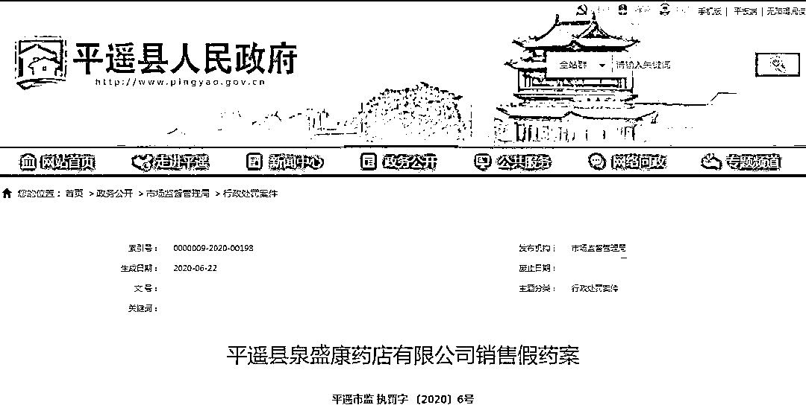

# 每年卖出 1 个亿，骗过 14 亿中国人：“印度神油”背后的罗生门

> 原文：[`mp.weixin.qq.com/s?__biz=MzIyMDYwMTk0Mw==&mid=2247500780&idx=1&sn=d24aa97ec7ad950554dc04db0e2eff03&chksm=97cb08d4a0bc81c2fb660f32639ce7e888ac55fd118d5e7f6ea1f9db766e117b696f3faca8af&scene=27#wechat_redirect`](http://mp.weixin.qq.com/s?__biz=MzIyMDYwMTk0Mw==&mid=2247500780&idx=1&sn=d24aa97ec7ad950554dc04db0e2eff03&chksm=97cb08d4a0bc81c2fb660f32639ce7e888ac55fd118d5e7f6ea1f9db766e117b696f3faca8af&scene=27#wechat_redirect)

**点击上方蓝色字体免费订阅“灰产圈”**

> 如果真因此次中印边境冲突事件，我们集体抵制了印度神油，倒也算是歪打正着，大功一件了。

《战国策·魏四·秦王使人谓安陵君》中，有这样一段对话：

唐雎曰：“大王尝闻布衣之怒乎？”

秦王曰：“布衣之怒，亦免冠徒跣，以头抢地尔。”

对比当下的中印两国关系，竟是一语中的。自边境冲突发生以来，在媒体的声浪鼓噪下，印度民间情绪高涨，跑到中国大使馆示威、砸中国电视、烧中国手机、扣押集装箱等恶性事件层出不穷，令人震（不）惊（耻）。

**抵制之心有多坚决，事实就有多打脸**。在手机业务上，仅小米、VIVO、OPPO、realme 4 家厂商就占据印度 2019 年份额的 65.5%；在汽车和电子工业上，印度高度依赖中国零部件，连抗疫中瓶装消毒液的按压泵也需从中国进口；截至 2020 年 3 月，印度 30 家独角兽公司就有 18 家获得中国投资，服务覆盖吃穿住行及教育娱乐各个方面，早已渗透印度人的日常生活。

▲2019 年印度出货量前五的手机品牌及市场份额 图/IDC

更为“讽刺”的是，去年印中双边贸易额约为 900 亿美元，其中近 2/3 是中国对印度的出口（值得一提的是，印度市场仅占中国出口总份额的 2%），从内到外，印度随处可见中国制造的印记，孰优孰劣，高下立判。

**从另一个角度来说，中国想要抵制“印度货”也非常难**。有网友调侃，自己挠破头皮找了半天，最后只能把气撒在印度神油上。

那么问题来了，**“印度神油”果然来自印度吗？**

**还真不是。**

01**谁创造了“印度神油”**

王小波在《寻找无双》里如此描述，王仙客来到长安后，波斯商人“向他推销有奇效的印度神油，可久战不疲。”

无独有偶，金庸老先生也曾在《神雕侠侣》中提及，天竺神僧为杨过来到绝情谷寻药，可见这类杜撰由来已久，深入人心。

但就像威露士并非德国的，新奥尔良不擅长烤翅，阿拉伯数字也不是阿拉伯人发明的一样，“印度神油”虽称得上伪造户籍的头号高手，却也难逃真香定律。

**维基百科上的一句话将印度神油背后的始作俑者拎了出来，印度神油产自中国香港（土生土长的中国制造），是一场人为缔造的，彻头彻尾的罗生门。**

事情还要从头说起。1958 年，何敏森、何敏祯两兄弟在香港九龙办了一个化工厂，取名“华仁行”，厂房最初设于一个猪栏的栏地上，直到 1974 年，才在古洞地皮兴建了新厂房。

在尚未开辟印度神油这条生产线之前，按照登记的资料显示，华仁行的主要产品包括杀虫剂、脚气喷雾、药膏等（诸君有没有觉得虎躯一震），工厂虽小但野心极大。

**在产品的宣传创意上，华仁行是当之无愧的时代先驱，以大胆前卫著称。**在杀虫剂广告里，一名黑衣忍者拔剑砍家里的螳螂未遂，随后掏出一罐黑旋风杀虫剂，将螳螂喷死：“月黑风高杀虫夜，黑旋风忍者为民除害，唔使用剑嘎，用黑旋风就得嘞——黑旋风够晒威，黑旋风的确好使！”

▲华仁行黑旋风杀虫水电视广告

**至于令其声名更上一层的“印度神油”，则是来自创始人何敏森旅差回来之后的灵感之作，从而开启光辉岁月。**

犹抱琵琶半遮面，为了将“玄学”贯彻到底，华仁行不仅未公开秘方，反倒借用产品说明里的背景故事吊足胃口，令人遐迩：“起源于印度教，由蟾蜍皮肤粘液制成。”神乎其神。

▲华仁行第一代印度神油

多年后据华仁行的老员工在采访中透露：“所有的成分配方都是自己配出来的，主要是一些有麻醉作用的药物，跟真正的印度半毛钱关系也没有。”放到今天，妥妥的虚假广告没跑。

至于为什么非要安上印度的名号，还不是因为印度宗教里一言不合就飙车，以及种种少儿不宜的神话，让“神秘的情欲药物”和印度产生高度关联，也使这种充满复古咖喱味的别样情怀深深扎根于广大男性同胞心中，精油还是印度好。

▲印度神庙雕塑

为了让自家的印度神油为更多人“造福”，深谙传播之道的华仁行又拉来一辆厢式卡车，上面印着：印度神油，妙不可言，佛国之宝，的确够劲，车子开到哪儿，广告放到哪儿。

不同于其他同行，华仁行剑走偏锋，广告拍一次就使用了 30 年，成为一代香港人的集体回忆，地位比肩娃哈哈、脑白金、蚁力神。

接地气的电影人，又将它巧妙衔接运用，在《喜马拉雅星》、《志在出位》、《食神》、《九品芝麻官》等多部经典影片里，都充斥着印度神油的身影。**随着 90 年代香港文化输入内地，充满暧昧想象的“神油”亦在内地广为人知。**

▲电影《食神》

▲电影《整蛊专家》

印度神油当年火爆到什么程度？一位印度的中文导游表示，每一个中国游客都会问哪里能买到正宗的印度神油，自己不厌其烦地被追问了几十年。

庞大的需求意味着市场的兴盛，后知后觉的印度开始行动。1980 年，印度著名的达丹尼父子制药厂花巨资购得了阿育吠陀精油配方的使用权，着手批量生产，标签上会特意印上中文，针对性不言而喻。

时至今日，国人对印度神油的钟爱有增无减。据阿里巴巴、京东等电商平台数据统计显示，2019 年 3 月～2020 年 2 月，男士精油近一年线上总交易额达 1.04 亿，销售同比上涨 86.17%。

▲图：神眸数据

不得不说，这真是一个营销界的神奇案例。

02**“印度神油”功效之谜**

X 度输入“印度神油”，可以跳出 637 万条相关信息，其中，关于“有没有用？”、“好不好用？”、“怎么用”的信息占了大半壁江山，众说纷纭下，答案并不统一。

拿“鼻祖”华仁行出品的印度神油来说，其主要原材料为蟾蜍，即从中华大蟾蜍或黑眶蟾蜍皮肤上的有毒分泌物制取而成。

现代医学上鉴定认为，蟾蜍对于跌打损伤有消肿止痛之效，适量喷涂皮肤可有麻痹之感，使得敏感度下降，从而起到延时作用。

看似为两性福音，但这种“立竿见影”，对于真正存在生殖障碍的患者来说，无异于饮鸩止渴。此外，频繁使用外用药极易导致受伤或发炎，操作手法也需严谨，否则麻到对方等于互相伤害，并非宣传中的安全无虞。

浙江大学医学院揭露，西医用于治疗男性障碍一般多为口服用药，这种外用药无法直接作用于内部海绵体，并不能起到实际作用，反而会延误病情的治疗良机。

**说到底，印度神油只是一款有着局麻作用的普通男性外用保健品，却因偷换概念而造成无所不能的假象，其充其量只能起到辅助作用，健康本体才是关键所在。**

不妨再来看看试图后来居上的“正统”印度本土精油，则更是噱头居多。据印度最新报告显示，印度神油目前有 6 大种类：皇帝油、延时喷剂、男士红油、阿育吠陀玉女油、阿育吠陀波霸油和男优膏（看中眼花缭乱有木有），尤以阿育吠陀最为出名。

印度传统医药“阿育吠陀”号称是全世界最古老的的医药体系，由 5000 年前的一群印度圣人于喜马拉雅山下论道而成，认为人体内存在五种元素：土、水、火、气、以太，类似我国的“阴阳五行说”。

在马斯洛需求里，生理需求才是原始动力。时间一长，难免出现三鞭大力丸这类神奇配方，更何况向来不拘一格的印度，名为“shilajeet shuddh”的药剂在多方推动下，顺理成章地诞生了（鼎鼎大名的《爱经》里亦有记录）。

这种草药的来源也极为特殊，据说是某些植物结合树脂在喜马拉雅山麓的岩石里腐化后流出的液体，再经过融化的冰雪或者雨水的混合“加持”后，最终形成凝练的沥青状，可外涂或内服，对适应并且提升耐力方面功效显著。

▲这能卖到上百美元

现代科学曾分析过，这里面富含至少 85 种矿物质离子形态及腐殖酸和富里酸，但特殊效果（提升性能力）和真实完整成分至今尚无定论。

有大胆尝试过的网友表示，印度药房并不会公然售卖这类精油，购买渠道相当隐晦，这种神油味道诡异，喝过之后百分百会拉肚子。

▲印度药房里售卖的神油 图/途 U 旅行

至于另一些代购渠道晒出的所谓印度神油，大多属于按摩油类（跟红花油之类差不多），如果想把它用于……只要下得去手就行。

**即便如此，也没人公开承认神油无效，被骗是小，面子是大，这或是“印度神油”畅销至今的另一秘诀所在。**

03**神油市场“鱼龙混杂”**

与传统精油不同，“男士精油”属于“情趣用品”一类，据 Market and Markets 预测，2018～2023 年全球精油原料市场的平均增长率或保持在 4.5%。

而“印度进口神油”这个关键词几乎成为行业代名词，其整体走势约等于整个行业走势。受产品属性影响，印度神油没有特别的年龄段偏好，40-49 岁的消费者需求最旺盛，但消费能力更胜一筹的是 20-34 岁的青壮年。

▲图：神眸数据

作为普适性需求，一、二线城市的消费者都乐于购买，山东省交易额遥遥领先，其次是广州省、河北省、江苏省及上海市。

▲图：神眸数据

**前（钱）景无限之下，入局者前赴后继，因为印度神油并非商标，导致谁都可以使用，谁都可以生产，久而久之，市场的混乱程度可想而知。**

在电商平台上随意搜索，就能轻易找到各类五花八门的“印度神油”，较常见的有两种外包装风格：一种以黄色为主色调，上面印着宗教文字，神秘魅惑；一种以黑色为主色调，上面印着热恋男女的剪影，性感撩人。

虽然价格参差不齐（30 元-500 元不等），但这类产品在介绍时都会不约而同地突出“本产品由印度 XXX 集团出品”、“本品选用印度秘方 XXX”等宣传词，月销量过万者比比皆是。

但实际上，国家药监局从未批准过从印度进口任何延时喷剂，这类山寨精油大多是私人作坊炮制出的三无产品，即便国内最正宗的印度神油，最多也不过是香港华仁行生产的罢了。

每年国家处理的“神油造假”类案件达数万起。一方面，利益熏心的商家们为增加销量，不惜铤而走险，不仅私自添加明令禁止的化学成分，很多配比更是经不起考量，轻则产生过敏反应，重则会对肝、肾产生不可逆转的副作用。

另一方面，因为涉及隐私，多数人宁可吞下哑巴亏，也不愿公开报案，使得造假制假事件屡禁不止，愈演愈烈。

▲6 月 22 日，平遥县盛康药店因购销“印度神油”等假药被查处

**如果真因此次中印边境冲突事件，我们集体抵制了印度神油，倒也算是歪打正着，大功一件了。**

再套用《我不是药神》里老大爷的台词：“你那玩意儿，没逑用。” 缘木求鱼，终是虚妄。

毕竟，打铁还需自身硬，您说是也不是？

 作者：朱末来源：快刀财经

← 向右滑动与灰产圈互动交流 →

**点击****阅读原文****加入灰产圈高端社群**

