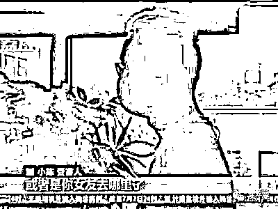
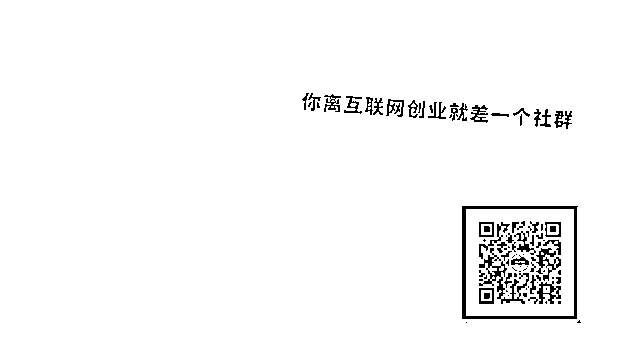

# “我”为和前女友复合，找“黑客”定位被骗 4 万多！

> 原文：[`mp.weixin.qq.com/s?__biz=MzIyMDYwMTk0Mw==&mid=2247500780&idx=2&sn=868ade9dcbbf5de43f67e55ca09308fb&chksm=97cb08d4a0bc81c2e4133b39122c23a9003d5e928296bcd7fa61eaba178f65a4c150c91023c4&scene=27#wechat_redirect`](http://mp.weixin.qq.com/s?__biz=MzIyMDYwMTk0Mw==&mid=2247500780&idx=2&sn=868ade9dcbbf5de43f67e55ca09308fb&chksm=97cb08d4a0bc81c2e4133b39122c23a9003d5e928296bcd7fa61eaba178f65a4c150c91023c4&scene=27#wechat_redirect)

**点击上方蓝色字体免费订阅“灰产圈”**

01

为了和拒绝联系的前女友复合，南京小伙子小陈,在网络贴吧上寻找“查人定位”服务，结果被一个自称能侵入公安内部信息网的人，以查询费、打点费为由，骗走了 40300 元。

02

网上那个自称能侵入公安内部信息网的所谓“黑客”称，“查人定位服务”分档次明码标价。

为查到女友的定位和微信聊天内容，迫切想挽回感情的小陈，选择了最贵的查询一次付 1000 元的服务：“当时神经真的比较脆弱，有怀疑的地方，也有当时比较相信的地方。”

03

交完第一笔钱后，小陈很快就收到对方发来的所谓前女友与他人的微信聊天记录。

看到那些信息，深陷失恋情绪中的小陈更加难以自持，他迫不及待地一次次付钱给对方，要求对方密切关注前女友近况：

“他是有套路的，在查完了这次信息后，故意设下一个套，想让你再查一下，比如说有人加你女朋友，或者说你女友去哪里了，接下来会去哪里，想让你继续查，当时脑子糊掉了，就同意了。”

04

在小陈付了 10300 元后，对方突然话锋一转称，因涉嫌非法查询公民个人信息，小陈已被警方侦查，如果想息事宁人，就必须支付打点费。

对方紧紧抓住小陈担心害怕的心理，诱惑小陈又支付 20000 多元。就在对方继续索要钱财时，小陈向警方报了案。

很快，警方锁定嫌疑人落脚点，今年 6 月初，警方在浙江余姚一出租屋外，将犯罪嫌疑人张某抓获。

05

张某其实是个无业游民，他冒充公安，谎称熟悉公安查询系统。

他供述：发出的所谓定位和微信内容都是自己编造的，目的就是为了骗钱。

目前，张某因涉嫌诈骗罪被刑拘。

警方提醒，公民个人信息受法律保护，包括警方在内任何单位和个人都无权私自查询，广大网民千万不要上当受骗：“查人信息本身是违法的，同时，公安机关也不存在他编造的这种违规查询个人信息的情况，不要通过网络查询这种信息。”

06

　　被骗后小陈反而对失恋这事儿看开了，他已经放弃了查询女友信息的念头，重新开始了正常的工作和生活。

[`v.qq.com/iframe/preview.html?vid=t31090d70xp&auto=0`](https://v.qq.com/iframe/preview.html?vid=t31090d70xp&auto=0)

侵入公安内部网络？求助“黑客”查询定位前女友 小伙被骗上万元

　江苏广电总台·融媒体新闻中心记者陈渝娜、徐明 报道 来源：江苏新闻

← 向右滑动与灰产圈互动交流 →

**点击****阅读原文****加入灰产圈高端社群**

