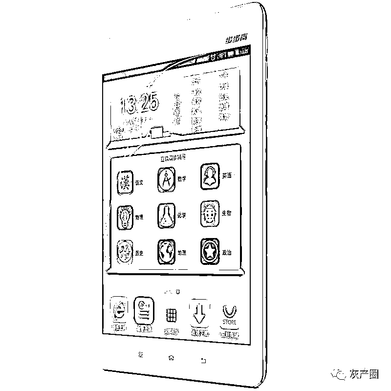
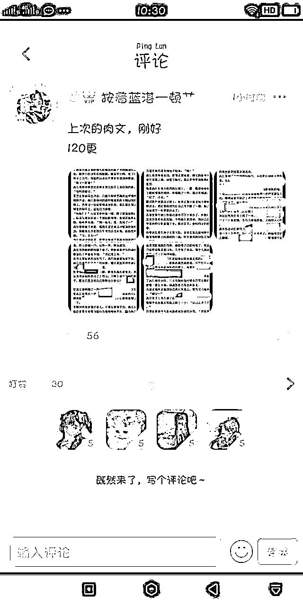

# 步步高点读机，哪里“色情”点哪里！

> 原文：[`mp.weixin.qq.com/s?__biz=MzIyMDYwMTk0Mw==&mid=2247500780&idx=3&sn=b903521e123ab78d63284d163bc26ba4&chksm=97cb08d4a0bc81c259acd35363afbe46de118fe2be2f4cdc312cc2c879a91b1befbfd8f7ecb6&scene=27#wechat_redirect`](http://mp.weixin.qq.com/s?__biz=MzIyMDYwMTk0Mw==&mid=2247500780&idx=3&sn=b903521e123ab78d63284d163bc26ba4&chksm=97cb08d4a0bc81c259acd35363afbe46de118fe2be2f4cdc312cc2c879a91b1befbfd8f7ecb6&scene=27#wechat_redirect)

**点击上方蓝色字体免费订阅“灰产圈”**

张先生去年给 8 岁的女儿买了一台步步高家教机，希望可以帮助孩子学习，没想到前不久他翻看家教机里的内容时，发现里面下载了一个名为“**小肚皮**”的 APP 软件，他打开软件看了没多久，就发现了一些不适合孩子看的“成人内容”。 

***8 岁女儿***

***的步步高家教机中含色情内容***

去年，张先生给 8 岁的女儿买了一台 S5 型号的步步高家教机，本意是希望帮助孩子学习。

张先生之所以选择步步高，是因为步步高家教机只能下载其本身应用商店里所载的软件，这样就不会让孩子接触网络上太多乱七八糟的东西。

没想到前不久，张先生在孩子的家教机上偶然看到有一个名为“小肚皮”的 APP，该 APP 实际上是一个交友社区论坛，用户可以在上面发帖。

张先生看了没几分钟就觉得不对劲，他发现“小肚皮”中的内容不仅有相对暴露的图片，甚至还有性爱漫画。

看到这些，张先生非常气愤，更令他生气的是，自己的女儿曾在该平台上和别人聊天发布“处对象”、“爱不爱我”之类的文字，他觉得这已经超出了一个 8 岁女孩对感情和性的认知。

张先生还发现，女儿是通过登录“**小肚皮计算器**”这款软件后，进入“小肚皮”APP 的。在“**小肚皮计算器**”的下方，有一个“**小肚皮**”APP 的推广，点击后可以直接登录“**小肚皮**”。

“防不胜防啊，这么小的孩子，怎么能看这东西，步步高对软件没有核查吗？”张先生气愤道。

***小肚皮******APP***

***中色情内容尺度***

堪比黄色网站

记者用手机在应用商店中下载了“**小肚皮**”APP，在安卓系统的应用商店内显示其下载量高达**657.3 万**，分类为社交聊天软件。其宣传语为“**超好玩的 00 后小窝**”。

打开“**小肚皮**”APP，除了可以用手机号注册外，还可以用微信和 QQ 等软件直接注册登录，登录进入可选择是男生还是女生，然后页面显示有“**圈儿”、“聊天”、“小窝**”三项，“**圈儿**”就是一个类似论坛社区，用户可以在上面浏览帖子或发帖。

记者注意到，从社区内发帖的内容看，该软件的用户都是学生，其中尤以初中生为主，也有一些小学生和高中生。

记者在网站中浏览时也发现了不适合未成年人观看的内容。

***步步高：***

***小肚皮此前已下架尽快核查小肚皮计算器***

记者针对此事致电**步步高教育电子有限公司**，公司客服称，经过查询在家教机后台没有找到“小肚皮”APP 的软件，其称，“**小肚皮**”APP 不是**步步高公司**研发的，而是第三方软件，**步步高家教机**无法安装其所载程序以外的软件，如果确实在家教机中发现了“**小肚皮**”软件，应该是以前下载的，而现在步步高已经将该软件下架。

对于记者反映的内容，客服称步步高家教机用户可以将家教机上的“小肚皮”APP 删除掉，由于现在已经下架，以后孩子也就不能下载了。

但记者质疑，目前仍可通过“**小肚皮计算器**”进入“**小肚皮**”。客服人员查询后发现，步步高家教机的应用商店内，确实有“**小肚皮计算器**”这款软件，其表示会尽快通知技术部门对该软件进行排查，如果内容属实将尽快下架“**小肚皮计算器**”。

记者在步步高官网上的论坛中查询发现，2017 年有家长质疑“**小肚**皮”软件并非是益智类游戏软件，里面有换装游戏，不应该出现在家教机的应用商城里。

步步高官方客服则回帖称，换装游戏是对孩子进行素质教育之后的一种奖励，能够培养孩子努力向上的精神，孩子在得到服装之后自己进行搭配，也能从小培养他们的审美意识。孩子完成好当日作业后可获得系统奖励，所以也能够促进他们更好的学习。

记者在网络上查询发现，很多人反映，从 2020 年开始，步步高家教机上已经找不到“**小肚皮**”APP 了。

***小肚皮：***

***或为审核疏漏将尽快处理***

记者随后致电“**小肚皮**”APP 的**北京九识佳科技有限公司**，将“**小肚皮**”APP 中的涉黄内容向工作人员进行了投诉，工作人员称“**小肚皮**”APP 平时也有专门负责审查的人员，出现类似问题可能是审查的疏忽，他们会马上组织技术人员查看，尽快处理。

随后，记者将“**小肚皮**”APP 内容涉嫌色情、低俗的相关证据，向中央网信办违法和不良信息举报中心进行了举报。

编辑：单镜宇 责任编辑：马涛  来源：中国新闻网，央视网

← 向右滑动与灰产圈互动交流 →

**点击****阅读原文****加入灰产圈高端社群**

