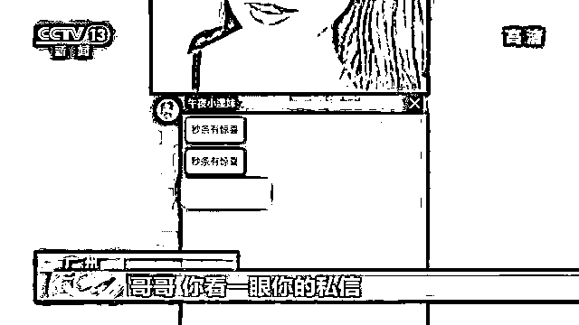
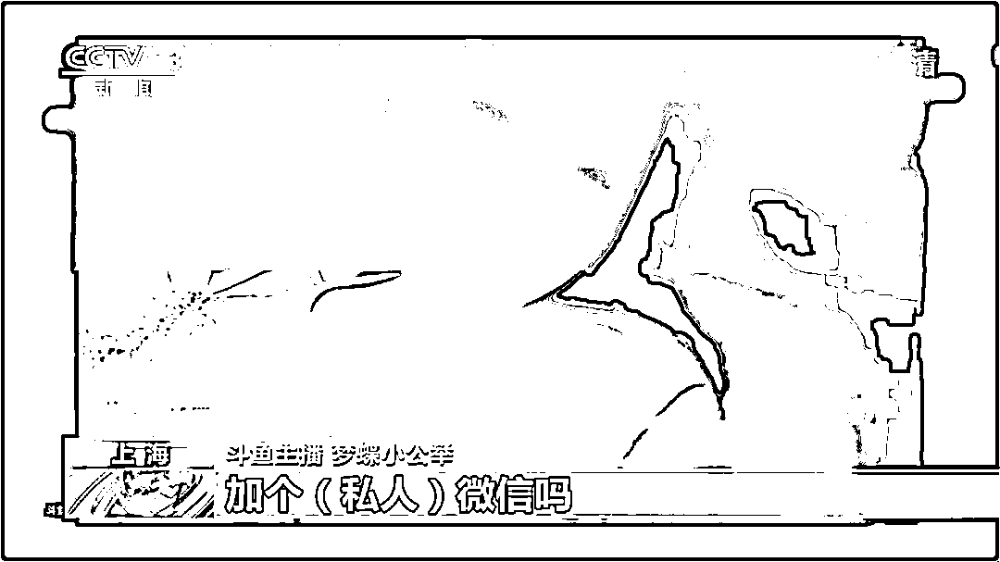
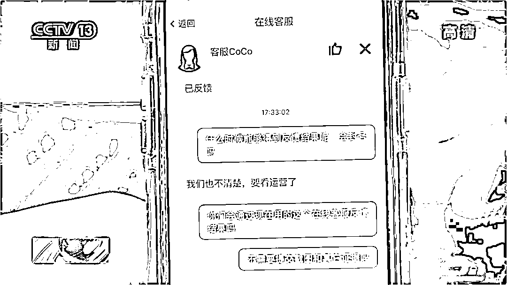
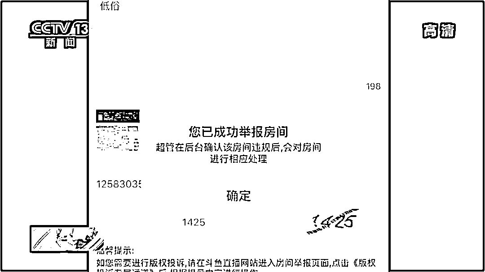

# 涉黄、“擦边球”、粗俗暴力……变了味的直播谁来管？

> 原文：[`mp.weixin.qq.com/s?__biz=MzIyMDYwMTk0Mw==&mid=2247500780&idx=4&sn=1088f76ce3f20aca762a13bd0902138f&chksm=97cb08d4a0bc81c26e88661892516ffec3c16d2ce711daccbf01ba2e83d4a7f0f180ce3e2ca5&scene=27#wechat_redirect`](http://mp.weixin.qq.com/s?__biz=MzIyMDYwMTk0Mw==&mid=2247500780&idx=4&sn=1088f76ce3f20aca762a13bd0902138f&chksm=97cb08d4a0bc81c26e88661892516ffec3c16d2ce711daccbf01ba2e83d4a7f0f180ce3e2ca5&scene=27#wechat_redirect)

**点击上方蓝色字体免费订阅“灰产圈”**

近日，国家网信办会同相关部门对 31 家主要网络直播平台的内容和生态进行了全面巡查，其中有 10 家网络直播平台因为存在传播低俗内容等问题被约谈。

然而，包括被约谈的平台在内的一些直播网站，低俗涉黄问题依然存在。

***内容涉黄 ***

***女主播公开要求用户刷礼物加微信***

在名为“夜魅社区”的直播平台，主播在白天时段基本上以唱歌、聊天为主。晚上 10 点以后，直播内容就变了味。

当晚，一名网名露骨、衣着暴露的主播不断怂恿网友刷礼物、加微信，还声称会发送更加精彩的节目。收到礼物后，主播通过私信发来了个人微信号，添加后发来多段色情视频。

***直播平台***

***以低俗涉黄内容博流量 ***

打“擦边球”

除此之外，一些比较知名的直播平台为提高直播流量，也经常打“擦边球”。**斗鱼是一家以游戏直播为主的直播平台**。

然而，部分主播与网友互动时，聊天内容并不是游戏。

> **斗鱼主播 梦蝶小公举：那你现在存款几位数啊？**
> 
> **网友：我现在存款就七位数吧。**
> 
> **斗鱼主播 梦蝶小公举：百万？老板你真的不打算两万块钱加个私人微信吗？**

在快手的直播间，名为四平阿厦的主播拥有 1200 多万粉丝，经常在晚上黄金时间进行直播。直播过程中，演出人员不但动作夸张、故弄玄虚，还经常爆粗口。

***投诉举报***

***社交平台违规内容 无果！***

我国《互联网直播服务管理规定》第 19 条规定，互联网直播服务提供者应当自觉接受社会监督，健全社会投诉举报渠道，设置便捷的投诉举报入口，必须及时处理公众投诉举报。然而，**记者对违规内容进行投诉，结果并不理想。**

“夜魅社区”

对该直播平台里的涉黄主播进行投诉时，电话客服告诉记者：**只能线上投诉。**

随后，记者向在线客服进行了投诉。当记者询问什么时候可以得到反馈结果时，**对方表示不清楚**。至于主播通过微信私聊的方式传播黄色视频问题，在线客服则表示**无法受理。**

斗鱼

针对有关主播的聊天内容，记者拨打了斗鱼直播平台的违法和不良信息举报电话，进行投诉。

> **斗鱼客服：后面会反馈到我们这边的一个调研同事去核查您说这个情况。**
> 
> **如果方便的话，您看能不能联系我们的在线客服，提供一下举报信息，我们这边也会根据您的举报信息去针对于这个事情核查处理。**

第二天，记者发现这位主播仍然准时上线直播，于是对主播进行了在线投诉，但在随后几天的时间里，**直播中依然出现了低俗内容。**

快手

记者拨打快手的举报电话，想向客服人员反映四平阿厦视频中存在的问题，但**电话一直占线**。 

记者又通过快手客户端反映视频中存在的问题，平台虽然很快将记者举报的视频删除，但当天晚上，四平阿厦的网络直播仍然准时上线，直播内容依然延续着之前的内容，在线粉丝数量最高时超过 10 万。

***专家：***

***社交平台必须落实企业主体责任***

针对社交平台涉嫌传播低俗、涉黄内容屡禁不止的现象，专家表示，社交平台不能为了拉升流量，放松、甚至放纵对平台内容的管理，必须落实企业的主体责任。

> 某社交平台负责人 潘滢：平台有责任有义务落实主体责任，即使是在测试阶段的直播功能，也需要对内容进行监管，如果对举报内容没有及时地反馈，甚至继续放任在平台内传播的话，那么社交平台就必须承担相应的责任。

据了解，多数社交平台已经具备了成熟的大数据技术和完备的人工审核力量，完全可以对直播内容进行精确查找和严格审查，并在第一时间封禁违规账号。 

除了社交平台没有严格落实主体责任，社交软件投放的技术门槛过低也是涉黄信息传播的另外一个原因。目前，社交平台软件的开发、运营和销售已经形成了一套成熟的产业链。开发一个简单的直播平台，只需要几千块钱。为了尽快提升知名度，尽可能多地吸引粉丝流量，同一个传播低俗内容的社交平台往往会变身多个 App。

> **手机安全专家 俞奎：**
> 
> **虽然应用的图标和名称不同，但是我们对应用分析后，发现它其实来自同一个开发平台，或是同一个开发作者。**
> 
> **如果被查封或者是被下架了，可以换个名字或是图标，再次进行传播。**

针对一些主播绕过社交平台，采取和网友私聊的手段传播淫秽信息的现象，法律专家认为，涉黄交易虽然没有直接在社交平台上完成，但由于**社交平台作为直播内容提供者，不能也不应该成为传播淫秽内容的帮凶。**

[`v.qq.com/iframe/preview.html?vid=y3110elrlix&auto=0&width=500px&height=375px`](https://v.qq.com/iframe/preview.html?vid=y3110elrlix&auto=0&width=500px&height=375px)

来源：央视新闻，新华网

← 向右滑动与灰产圈互动交流 →

**点击****阅读原文****加入灰产圈高端社群**

