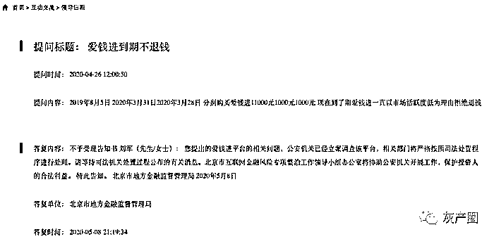
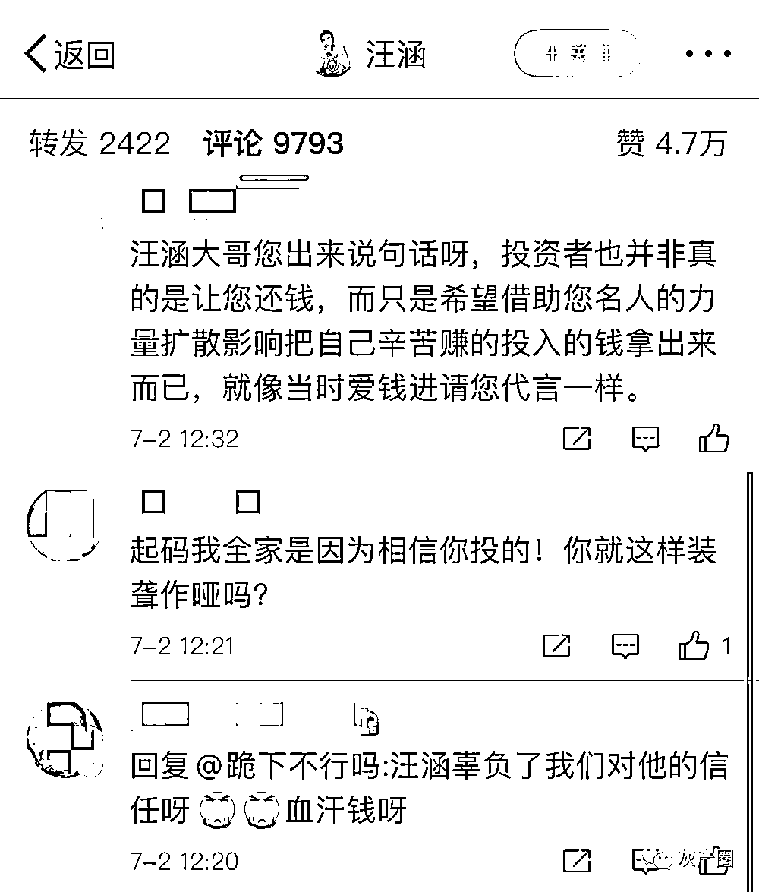

# 汪涵后，刘国梁为代言爱钱进道歉！37 万人合计 230 亿可能血本无归！

> 原文：[`mp.weixin.qq.com/s?__biz=MzIyMDYwMTk0Mw==&mid=2247500826&idx=1&sn=8575f4fa7077cdac9b080220ce5c96bf&chksm=97cb0f22a0bc8634492e22f7633125363bf309fe768d14d984c1cc50247c169a61c82fc02114&scene=27#wechat_redirect`](http://mp.weixin.qq.com/s?__biz=MzIyMDYwMTk0Mw==&mid=2247500826&idx=1&sn=8575f4fa7077cdac9b080220ce5c96bf&chksm=97cb0f22a0bc8634492e22f7633125363bf309fe768d14d984c1cc50247c169a61c82fc02114&scene=27#wechat_redirect)

**点击上方蓝色字体免费订阅“灰产圈”**

***导语***

“明星代言的 P2P 平台暴雷了，投资者蒙受了巨大损失。这种情况下，明星代言人是否需要承担相关责任？

就此问题，记者采访了几位律师，他们表示部分情况下，明星代言人确实需要承担相应责任。”

仝卓和高天鹤刚刚分别因为“伪造应届生身份”和“考试作弊”翻车，近日又有一位湖南卫视主持人因为坏消息而登上热搜，这次是汪涵。

7 月 1 日，汪涵代言的“爱钱进”发生疑似暴雷事件。有报道称，超过 10 万人被爱钱进骗超过 100 亿元，大量投资者血本无归。

网上流传的照片也显示：有投资者举牌喊出“爱钱进诈骗汪涵退代言费，汪涵请出来还我血汗钱”的标语。

图/网络

7 月 2 日下午，汪涵发声明回应代言“爱钱进”APP 涉嫌诈骗一事，**称曾于 2016 年-2018 年为该 APP 代言，之后得知“爱钱进”产品出现兑付迟缓现象，就多次联系平台，敦促他们解决问题。**

**在做这些事情时，未及时向大家通报，为此道歉。**他表示，将同律师团队积极和大家一起跟进此事，与大家共同面对。

针对此事，爱钱进联合创始人、CEO 杨帆 7 月 2 日回复称，爱钱进目前还在“正常运营”。记者进一步追问近日出现的#爱钱进 APP 被立案侦查##汪涵代言疑翻车#等微博热搜情况，杨帆则表示：“不知道，被人刷的吧”。

据中新经纬报道，北京东城区金融办相关工作人员表示，已接到通知称爱钱进被相关部门立案侦办，北京市公安局负责外宣的工作人员则表态：案件目前还在侦办阶段，不方便透露相关信息。

***爱钱进已被北京警方立案侦办？***

监管部门建议：及时通过司法部门解决

公开数据显示，爱钱进是一个 P2P 借贷和理财、互联网金融服务网站，是上海榕数网络科技有限公司的全资子公司，成立于 2014 年，注册资本 10 亿元。爱钱进官网披露，截至 2020 年 5 月 31 日，爱钱进借贷余额本金约 227.6 亿元，当前出借人数量约 37.6 万人。

据天眼查信息，谢飞为爱钱进的实际控制人，最终受益股份为 16.3952%；爱钱进法定代表人董祺则为最终受益人，最终受益股份为 23.0899%。爱钱进是上海榕数网络科技有限公司的全资子公司，后者法定代表人同为董祺，且曾多次更名，曾用名包括凡普金科企业发展（上海）有限公司、普惠金融信息服务（上海）有限公司等。而谢飞是上海榕树第一大股东——北京普惠集英投资管理中心（有限合伙）的执行事务合伙人，持股比例 3.35%；董祺则为第一大股东，持股比例 38.1095%。此外，上海榕数网络科技有限公司的股东中，还包含了高榕资本等。

图/天眼查

事实上，早在今年初，该平台的逾期事件就已在网络上发酵，并不断有投资者在网上投诉。在黑猫投诉平台中，涉及爱钱进的投诉数量达 4000 余件，其中投诉的主要内容包括理财产品到期未还钱，投资者被迫打折出售、恶意折让债权、借款到期无法兑现、实际借款金额与协议金额不符，收取高额服务费及利息等。

据悉，爱钱进目前设有“应急折让通道”，投资者可不断通过打折试探，最终以较低折扣“赔钱”出手。不少投资者表示：“现在爱钱进提供了商城和折扣的下车方式，把钱拿到手肯定是最重要的，不再抱有本息全回的希望！”

不过也有投资者爆料：“最低打到 0.69 折都没出来。”“打到 3 折想下车，但四天了还迟迟没入账”。爱钱进则回应称：“是否对自身持有资产进行折价转让是完全自愿的，折价的比例是您自行设定的，最终是否成交需要通过三方的评估。”

在舆论不断发酵的当下，爱钱进官方微博的评论区已“沦陷”，多数是出借人要求其还款的留言。

对此爱钱进表示：由于借款人的还款意愿和能力有所下降，借款人逾期未还款。平台及资产推荐方已建立一系列完善的贷后管理及催收制度，确保在合法合规的前提下，通过对接百行征信、央行征信、贷后跟踪等方式进行贷后管理及催收。

北京市地方金融监督管理局官网互动交流版块的内容则显示，今年 4 月 26 日就有投资人提问称：“2019 年 8 月 5 日、2020 年 3 月 31 日、2020 年 3 月 28 日分别购买爱钱进 11000 元、1000 元、1000 元，现在到了期爱钱进一直以市场活跃度低为理由拒绝退钱”。

随后在 5 月 8 日，北京市地方金融监督管理局在“不予受理告知书”中答复称：“您提出的爱钱进平台的相关问题，公安机关已经立案调查该平台，相关部门将严格按照司法处置程序进行处理。请等待司法机关处置过程公布的有关消息。北京市互联网金融风险专项整治工作领导小组办公室将协助公安机关开展工作，保护投资人的合法利益。”。

在北京市东城区人民政府的官网上也看到，针对有投资人就爱钱进到期不退钱一事的提问，北京市东城区人民政府回复称：东城区金融办将督促平台主动与投诉人沟通，协商进行债务和解。如合法权益收到损害，请投诉人及时通过司法部门解决。

另据中新经纬报道，2020 年 01 月 10 日，一名借款人爆料称，此前其向国家信访局投诉“钱站”催收人员频繁骚扰、侮辱其本人和手机通讯录联系人，国家信访局的一封答复意见书中称，经核实，爱钱进（北京）信息科技有限公司的兄弟公司钱站（北京会牛科技有限公司，“钱站”运营主体）注册在（北京市）房山区，负责放贷事宜，建议（北京市）房山区金融部门负责处理；二是爱钱进（北京）信息科技有限公司涉嫌募集资金已被北京东城区公安经侦部门以非法吸收公众存款罪立案侦办，由于案件已进入司法程序，行政部门无权干预，建议向北京东城区公安经侦部门询问。

对此，北京市公安局负责外宣的工作人员回复中新经纬记者表示，这个案件目前还在侦办阶段，不方便透露相关信息。北京东城区金融办相关工作人员表示，答复意见书内容是真的，其接到通知爱钱进已被相关部门立案侦办。

为进一步确认此事，于 7 月 2 日在微信上询问爱钱进联合创始人、CEO 杨帆，对方回复称，爱钱进目前还在“正常运营”。记者进一步追问近日出现的微博热搜一事，杨帆则表示：“不知道，被人刷的吧”。记者还多次尝试拨打爱钱进官网客服电话，均无人接听，随后收到爱钱进短信进入自助咨询通道，对面是机器人客服。

不过，有网友在微博晒出了与爱钱进在线客服的对话。当被问到爱钱进是否被立案后，在线客服回复道：“关于立案我司没有接到任何消息，请勿信谣言。百度百科词条的内容是有人恶意添加，我们正在积极协商解决。”

随后，在线客服表示：“近期各种舆情发酵，背后有老赖团体推波助澜，正常催收效果受到很大影响，我们会专注催收工作，尽最大努力降低舆情对还款的影响。”

值得一提的是，就在 6 月 9 日，爱钱进官网还公告称，按照 P2P 网贷领域征信体系建设有关工作安排，我司已接入金融信用信息基础数据库（即人民银行征信系统）。

在登上微博热搜之后，爱钱进的官方微信公众号也始终没有停更，昨天（7 月 1 日）下午 17 时还推送了一则消息。

***曾多次借“娱乐圈”造势，刘国梁也中招***

汪涵微博评论“沦陷”后回应：与大家共同面对

借助影视娱乐造势，是爱钱进等 P2P 平台热衷的方式之一。早在 2016 年，影视剧《老九门》热播，爱钱进成为其重要广告商之后，便掀起了 P2P 投资影视剧广告的热潮。此后，爱钱进还相继投资了《楚乔传》、《那时花开月正圆》等多部热门影视剧。

据了解，当时影视剧的广告投资分两种，一种为中间插播广告，另一种为贴片式广告。2017 年前后，一条中插广告最低价约 90 万元，均价大约 100 万一条，较高的约 300 多万，主要取决于网剧的质量。有原 P2P 平台工作人员曾表示：“那时上班唯一的事情就是挑剧本。”

在 2018 年 P2P 进入“暴雷潮”之际，爱钱进却还在发力。2019 年 2 月，刘国梁继汪涵后成为了爱钱进的“幸福体验官”，至今爱钱进官网媒体报道的第二条依然是去年 2 月签约刘国梁的新闻。

7 月 2 日下午，汪涵在微博发声明回应代言“爱钱进”APP 涉嫌诈骗一事，**称曾于 2016 年-2018 年为该 APP 代言，之后得知“爱钱进”产品出现兑付迟缓现象，就多次联系平台，敦促他们解决问题。在做这些事情时，未及时向大家通报，为此道歉。**他表示，将同律师团队积极和大家一起跟进此事，与大家共同面对。

但其微博评论区，早已被爱钱进的投资人所占据。不少网友认为，汪涵是知名主持人，影响力很广，很多人就是冲着他代言、相信他才买的。如今平台暴雷了，汪涵也有责任，甚至还有人直接喊话汪涵“赔钱”。

不过，也有不少网友认为，投资本来就有风险，要自己承担。

刘国梁的微博下也有很多投资人的留言声讨。

***明星是否该担责？***

律师：有些情况下，还真要担责！

明星代言的 P2P 平台暴雷了，投资者蒙受了巨大损失。这种情况下，明星代言人是否需要承担相关责任？就此问题，记者采访了几位律师，他们表示部分情况下，明星代言人确实需要承担相应责任。

上海大邦律师事务所高级合伙人、知识产权律师游云庭对记者表示，明星需要承担责任的前提有几点：第一、是否对代言的产品进行过体验和使用；第二、其在推荐前有没有对代言的产品进行过基础的风险研究，对所推销的商品或者服务的性能、效用等进行了佐证；第三、其有没有明示或者暗示的方式对代言的 P2P 产品进行过担保。

如果不符合以上任何一条的，明星就有可能要承担代言产品暴雷的法律责任。如果承担，情节严重的是连带责任，如果只是有疏失，但不是蓄意误导的，也可能是部分责任。

北京市中闻律师事务所合伙人李亚则对记者表示，明星代言人是否需要担责，涉及到广告的行为规范和法律责任问题。首先看广告代言人是否使用过推荐的产品或服务，其次代言的广告是否为虚假广告，最后代言人是否对虚假广告是否明知或应知。

他表示，代言行为会涉及行政责任或民事责任，代言人对其没有使用过的商品或服务，明知或者应知广告虚假仍在广告中对商品、服务作推荐、证明的由市场监督管理部门没收违法所得，并处违法所得一倍以上二倍以下的罚款。广告主应对发布的虚假广告依法承担民事责任，代言人明知或者应知广告虚假仍作推荐、证明的，应当与广告主承担连带责任。

事实上，我国广告法和相关的部门规章对金融理财产品的广告内容已经做出了规范。李亚表示，广告法及相关部门规章规定，不得明示或者暗示保本、无风险或者保收益，不得利用学术机构、行业协会、专业人士、受益者的名义或者形象作推荐、证明，不得对投资理财类产品的收益、安全性等情况进行虚假宣传，不得引用不真实、不准确数据和资料等。同时，广告法要求广告代言人不能对未使用过的产品或服务进行代言，其次不能对明知或应知虚假广告进行代言。

然而现实中，找代言明星担暴雷之责并不容易。

一位业内人士对记者说，从过去的案例来看，还没有明星代言人承担责任的先例。在之前的 e 租宝非法集资案中，创始人财产充公、终身监禁、24 位高管通通入狱。而在维权最盛时期，为其“站台”的某经济学家曾遭全国围堵，但最终也并未承担连带责任。

当时有媒体谈到，“因为在一个金融创新的草莽时代，我们盲目信赖于权威，再加上自身的投机和从众心理作祟，最终导致了如此大规模的悲剧事件。”而历史的多个事件已然告诉我们，越是狂热越需审慎，在鱼龙混杂的 P2P 市场中，更需如此。

不仅汪涵，此前也有不少明星因代言的 P2P 机构暴雷而被网友喊话“还钱”。

**黄晓明：因东融在线被“在线催债”**

2015 年 11 月，黄晓明成为快鹿集团旗下东虹桥金融的代言人，曾有广告语：“黄晓明，贷你圆梦，赚多多的钱。”东虹桥金融在 2016 年 4 月出现兑付逾期，随后微博上出现了#一起召唤黄晓明来还钱#的话题。不过，随后黄晓明工作室发声明称：黄晓明与涉事公司无任何投资和合作关系。

**范冰冰：代言“三三系”和紫马财行相继出事**

范冰冰不仅踩雷一家 P2P。她曾代言的“三三系”，号称“只要投入资金加盟，保证赚钱，一年赚十倍”。前前后后共向 48 万余人非法集资 530 余亿元，数额非常庞大。今年 5 月，浙江杭州中级人民法院正式宣判了“三三系集资诈骗案”：董事长王文俊被判无期，其余 14 人被判 7 年至 15 年不等。

她还接了另一家网贷公司紫马财行的代言，2015 年 10 月底紫马财行披露范冰冰成为公司形象大使，这家平台去年也已经暴雷被北京朝阳经侦立案。

**郎朗：“踩雷”88 财富**

2015 年 4 月，国际知名钢琴家郎朗签约成为 88 财富母公司中科创集团代言人。

2017 年，88 财富突然宣布停止运营。背后的股东被爆多个项目循环募资，涉嫌自融自保。据悉，彼时 88 财富待兑付本息总共达到了近 9000 万。

**唐嫣、李湘等 5 大女星：曾为“e 租宝”站台**

在 2015 年，五大一线女星唐嫣、李湘、瞿颖、钟丽缇、胡静，这五人在微博为 e 租宝打广告，影响特别大。但在 2016 年，这家公司却被认定为诈骗公司，涉及金额达到了 500 亿，而这当初在微博大肆宣传的五位女星，也先后将当初发出的广告删除。

（徐徜徉、刘洋/文 蒋诗舟/编辑本文部分内容来自中新经纬、21 世纪经济报道、澎湃新闻、中国基金报、第一财经等）

← 向右滑动与灰产圈互动交流 →

**点击****阅读原文****加入灰产圈高端社群**

