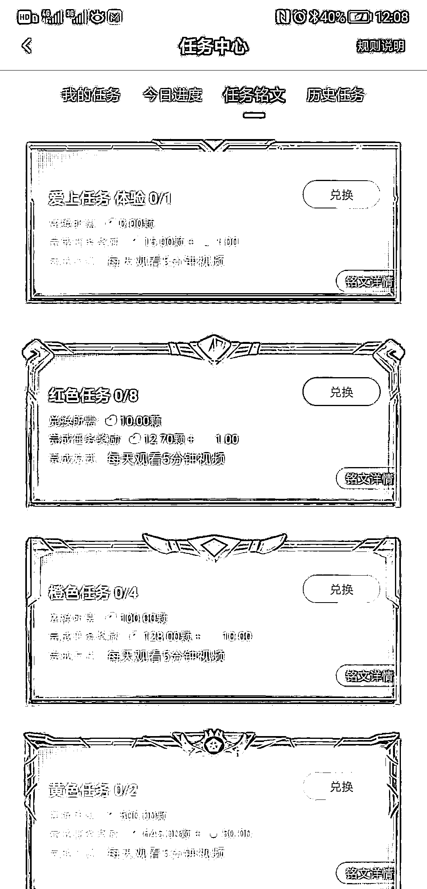
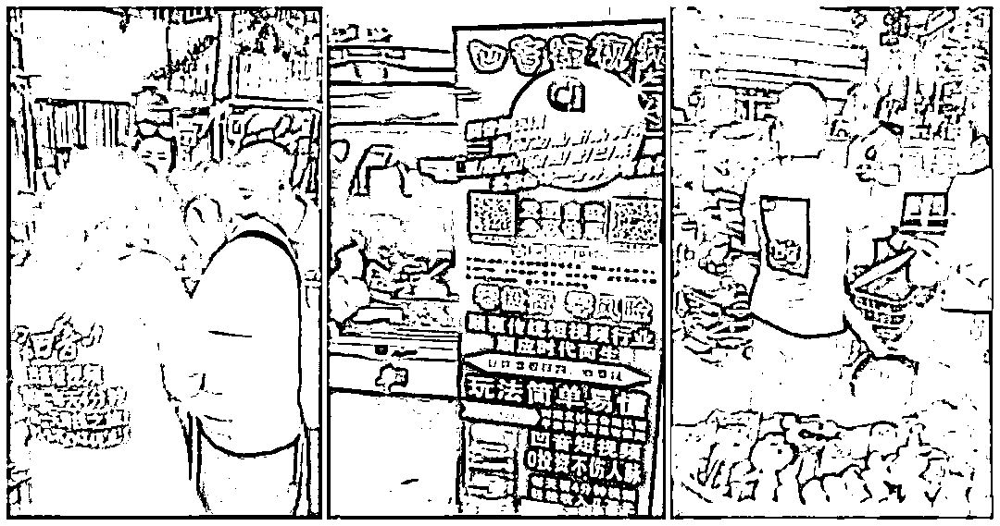
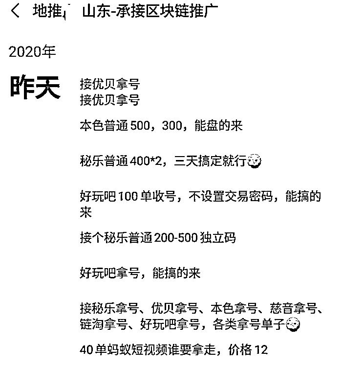

# 资金盘的地推大战：大学生兼职摆地摊，老年人成收割对象

> 原文：[`mp.weixin.qq.com/s?__biz=MzIyMDYwMTk0Mw==&mid=2247500826&idx=3&sn=e89a30d203930611adef2cc832e5f5d5&chksm=97cb0f22a0bc8634e6865d722b1fb73c50c46f14b94a525730fed8c3e3d1f6eb1c55a88bc5b4&scene=27#wechat_redirect`](http://mp.weixin.qq.com/s?__biz=MzIyMDYwMTk0Mw==&mid=2247500826&idx=3&sn=e89a30d203930611adef2cc832e5f5d5&chksm=97cb0f22a0bc8634e6865d722b1fb73c50c46f14b94a525730fed8c3e3d1f6eb1c55a88bc5b4&scene=27#wechat_redirect)

**点击上方蓝色字体免费订阅“灰产圈”**

借“地摊经济”的东风，盘圈的地推势力死灰复燃——靠着地推，资金盘秘乐短视频一度超越抖音，登顶 APP 下载榜榜首。

实际上，在盘圈，地推已经形成了一条产业链：职业化的地推团队，会收钱帮资金盘玩家做地推。

这些团队的成员中，有宝妈，也有在校大学生，他们往往是兼职，白天在居民区招徕爱占便宜的中老年人，晚上在商场门口吸引年轻人。

在这个过程中，也套路满满：有的地推负责人收了玩家的钱，却暗中给自己导流；有人根本不去做地推，而是利用工具“机刷”。

而这是一个显然无法长久的生意：“焦点访谈都说趣步是骗子了，你还去推趣步，这不是找骂吗？” 

在此情况下，盘圈地推热的退潮，已经是板上钉钉的事。

01 **火爆**

随着“地摊经济”变得火爆，多地工商、城管部门放开了对在城里摆地摊的管控。然而，在路边摆摊设点的，不止小商小贩，还有资金盘的地面推广员。6 月 10 日，一本区块链就在北京东北部的一个地铁口，目睹了秘乐短视频的地推活动。  6 月 10 日，北京某地铁口的秘乐短视频地推现场
当时，两个推广员身穿秘乐的黄色工作服，工作服上印有“秘乐魔方推广员”与“一天五分钟，看短视频就能赚钱”的宣传语。两人分工明确。一人负责发传单，并吆喝“注册就送气球，看视频还能赚钱”的口号，吸引路人注意。另一人则手持二维码，并指导路人下载和注册秘乐 APP。而路人得到的福利是，在通过实名认证之后，领走一个发光气球。短短 10 分钟时间，就有 4 个人下载注册了秘乐 APP。在推广现场，两个推广员还配置了一个小音箱，它循环播放口号：“秘乐短视频 APP，一款靠手机就能赚钱的软件。秘乐、秘乐，不为别人所知的快乐，赶紧扫码注册吧！”“秘乐和抖音一样，是看短视频的软件。”其中一位秘乐推广员对一本区块链表示，“但不一样的地方是，在秘乐上看短视频，还有钱赚。反正都是看短视频，在哪儿看不是看呢？”**资深资金盘玩家阿东对一本区块链表示，秘乐早已超过趣步，成为了地推势头最猛的盘圈项目。**七麦数据显示，秘乐短视频 APP 下载量巨大，一度超过抖音、快手等短视频 APP，登顶苹果 App Store 免费下载榜冠军。在安卓平台，仅腾讯应用宝一个渠道，秘乐短视频的安装量就高达 3575 万次。一本区块链发现，秘乐上的大部分热门视频都并非原创，而是搬运自抖音、快手等平台。而它真正的玩法并不是短视频，而是与趣步类似的资金盘。秘乐规则显示，用户连续 42 天、每天浏览 5 分钟短视频才能完成任务，获得 15 个平台虚拟货币“秘豆”。一旦中断，任务就会失败。**而要想靠秘乐赚钱，光看短视频是不够的，还需要投资。**在秘乐短视频 APP 上，玩家可以充值秘宝，购买秘豆，领取任务，进行投资。以最高等级的“蓝色任务”为例，玩家投资 1 万颗秘豆，42 天后可以获得 1.32 万颗秘豆，年化收益率 278%。此外，玩家还能通过拉人头，获得更多收入。秘乐短视频任务列表目前，秘宝的价格为 0.1 元，一颗秘豆的价格为 213.9 秘宝，合人民币 21.39 元。**显然，这是一个资金盘骗局。然而凭借着强大的地推大军，它成为了当下最火热的资金盘。**另一个主打短视频模式的项目“凹音短视频”，也在组建自己的地推大军。

凹音短视频地推现场 图源：网络视频截图

凹音短视频的模式与“秘乐短视频”几乎完全一致，只是将趣步、秘乐中的“糖果”“秘豆”，换成了“钻石”。

02 **地推产业链**

地推，是“地面推广”的简称，最早出现在互联网行业。2015 年前后，O2O 概念在互联网圈火爆，地推也开始兴起。美团、饿了么等外卖品牌，就曾投入大量地推人员，赠送礼品、优惠券，手把手地引导用户下载、注册 APP。北京望京甚至曾出现过“扫码一条街”，街上全是形形色色的地推摊位，注册 APP 就送小礼品。有人开玩笑说：“只要去‘扫码一条街’转一圈，一个月的日用百货都能制备齐全。”而把地推模式带入盘圈的始作俑者，当属 2019 年风行一时的趣步。当年，许多城市出现了数量众多的趣步地推团队，他们身穿印有趣步标志的服装，在商场、地铁门口摆摊设点，拉人注册。更有甚者，在自己的婚礼现场挂出了趣步二维码，邀请出席的亲友注册。**“趣步之后，地推模式在盘圈迎来高潮，圈内出现了很多专业地推团队。”阿东表示，“现在，盘圈至少 60%的新流量，都来自地推。”**这些地推团队专为资金盘玩家服务，只要出钱，他们就能帮着做地推。“费用按人头计算，一般 50 人起推，一个人头收费 20 元左右。”阿东说。而玩家只需要把自己的推广二维码发给地推团队，就可以做撒手掌柜。地推的地点、人工、物料，全部都是地推团队负责。“50 单，我们团队一晚上就能做完。”在山东领导地推团队的老夏说。老夏的朋友圈**老夏对一本区块链表示，地推是一门“大学问”，选址、模式、话术都有讲究。**例如，在白天，地推团队会在居民区摆摊设点，主要招揽爱占便宜的中老年人，礼品也要选择他们喜欢的米面粮油、鸡蛋等。到了晚上，地推团队就要转移到商场门口、地铁口等年轻人偏多的地方，礼品也要换成鲜花、气球等年轻人喜欢的东西。“气球要用会发光的那种。有些小孩看到气球就不走了，缠着妈妈要买。我们就会说：‘气球是免费的，扫码注册 APP 就能领。’这时，当妈的 99%都会扫码。”老夏称。**阿东表示，地推团队中的大多数人，都是宝妈、在校大学生，他们以兼职的身份参与地推，但收入却并不高。**“像老夏这样的地推老板，会拿走 20%-40%的抽成。剩下的钱里面，有一部分还要购买地推物料，最后才分给地推团队成员。”他表示。

03 **地推套路**

在盘圈，一个值得深思的问题是——有地推能力的地推团队老板们，为何不自己做资金盘？

阿东指出，做地推，每天都有收入进账，还不用担心崩盘跑路，比玩资金盘更加稳定。“许多地推团队的老板本身就是资金盘玩家出身，他有地推能力，但又厌恶风险，就转行专做地推。”阿东说，“做资金盘的，会把它当作一份‘事业’；而做地推的，就是做一份工作。”**其次，许多地推团队的老板，其实自己也在做资金盘，只是兼职帮别人做地推，还可以趁机渔利。**“这类地推团队非常不靠谱，推过来的都是死用户。”阿东说。这些地推团队大多会准备两个二维码，一个是团队老板自己的，另一个则是付了钱的客户的。遇到路人后，他们会看人下菜碟——发现路人像薅羊毛的，没有投资意向，就会引导他们扫客户的二维码。而如果觉得路人有钱，或者容易被洗脑，就引导他们扫描自己的二维码，并告诉他们，下载 APP 后可以参与投资，在 APP 上赚钱。“如果遇到这些团队，那你出了钱，收获的却是一堆死用户。”阿东说，“现在各个项目都不鼓励玩家无脑拉死用户，如果拉来的下线不投资，就带不来活跃度，连本钱都赚不回来。”甚至有的地推团队，根本不会出门做地推，而是靠刷量的方式欺骗资金盘玩家。“大多数资金盘项目，都规定一台手机只能注册一个账号。”阿东说，“但这段时间，盘圈出现了一种‘无限操作手机’，只要有一台手机，配合多张 SIM 卡，就能注册多个账号。”无限操作手机的原理并不复杂：每台手机都有一个独一无二的 IMEI 码，资金盘 APP 会识别 IMEI 码，以判断手机是否注册过 APP。而无限操作手机可以无限生成 IMEI 码，让 APP 误认为这是一台新手机。**“一些所谓的‘地推团队’，不过是买一台无限操作手机，再收购几百张 SIM 卡，然后就去骗资金盘玩家是在做‘地推’。”阿东表示，这种手段，在圈内被称为“机刷”。**他指出，现在，即便遇不到这些套路，盘圈的地推也变得越来越难了。原因也很简单——公众对于扫码送礼品的地推模式已经麻木，甚至反感。“焦点访谈都说趣步是骗子了，你还去推趣步，这不是找骂吗？” 在此情况下，地推市场逐渐不再火爆。“2019 年趣步最火爆时，地推团队的报价水涨船高，拉一个人的收费在 30 元以上。”阿东透露，“但现在，一些团队的报价已经降到了 17、18 元。”除此之外，许多地区的地推目标用户群体已经饱和，这也提升了地推难度。“像趣步、秘乐一类的项目，我们已经很少接了。很多人都已经注册过了，几乎推不动。”老夏对一本区块链表示。可以肯定的是，盘圈地推的黄金时代，已经终结。

从趣步到秘乐，地推已然成为资金盘项目的标配。如今，在淘宝上搜索“秘乐短视频”一词，搜出来的往往是各种地推物料，比如服装、易拉宝、宣传单。其中销量最高的一家店铺，出售的是秘乐短视频推广马甲，已经有 6000 多人付款。盘圈地推已形成一条完整的产业链，但随着市场饱和与假地推的泛滥，盘圈的地推时代正在渐行渐远。*文中受访者为化名 文 | 棘轮 比萨

← 向右滑动与灰产圈互动交流 →

**点击****阅读原文****加入灰产圈高端社群**

