# 电商刷单客“惊恐生存”：每刷 100 元补缴 20 万，有人转行地摊、有人照刷不误

> 原文：[`mp.weixin.qq.com/s?__biz=MzIyMDYwMTk0Mw==&mid=2247500929&idx=3&sn=d02167275e6e02a3b77d7f95f7317afa&chksm=97cb0fb9a0bc86afb7f730b8acc75711dbef72bf0ce15bba836445a9f42000597d57a8558e61&scene=27#wechat_redirect`](http://mp.weixin.qq.com/s?__biz=MzIyMDYwMTk0Mw==&mid=2247500929&idx=3&sn=d02167275e6e02a3b77d7f95f7317afa&chksm=97cb0fb9a0bc86afb7f730b8acc75711dbef72bf0ce15bba836445a9f42000597d57a8558e61&scene=27#wechat_redirect)

**点击上方蓝色字体免费订阅“灰产圈”**

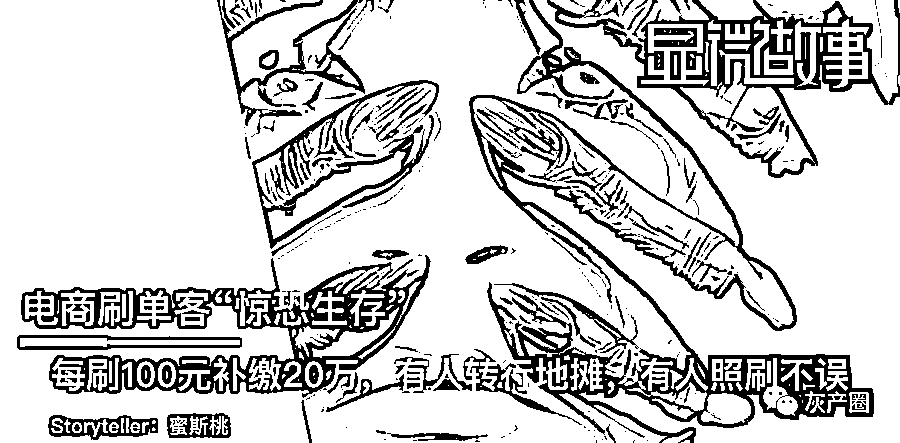

刷单一时爽，补缴火葬场。近期有媒体报道，部分网店店主收到来自税务局的自查通知，指出其销售额和实际缴纳税款不符，要求自查三年内存在的税款差额，自行补税。该通知还没得到正式宣布，但已在电商行业掀起一阵巨浪。网店为了冲排名曾大量刷单，这已成为电商行业内默认的”游戏规则“。如今忽然说要补缴，还一次性要交三年，不少店主表示此举能让他们**“几年白做”**、**“一朝回到解放前”**……本期显微故事讲述的是一群恐慌中的电商店主、刷单人：他们之中有的人收到了“通知”，正在凑齐补税款项；有的人曾被要求补缴，补缴税额近百万，如数“奉还”自己一年的所有利润；有的刷单机构声称，其一万多个客户依然持续刷单；也有人放弃了通过刷数据制造的“虚假繁荣”，转行摆起了地摊……以下是他们的真实故事：

**文 | 蜜斯桃**

**编辑 | 木蒙**

## 

**  **我补缴过 82 万税款**  **

****这一轮还要面临过百万损失****

陈颖瑜 | 36 岁 | 某电商品牌创始人

两年前，我遭遇了一次发票未足额而被补缴 82 万税款的噩梦。那天清晨起来，我突然收到一条信息：**42 万被某税务局划走**。紧接着，第二天**继续扣款 40 万**。前后没有任何征兆，没人跟我打过招呼，收到信息后我一身冷汗。第二天我马上赶去税务局申诉，到了才发现跟我一样的人不在少数，都在约谈窗口前排起长队。当时我经营着一家广告公司，一年有 200 多万收入。但扣除十几个员工的工资、公司拓展、客户维系的各项支出，也所剩无几。82 万对我来说，就是一年全部的利润了。这么一扣，**我整年都白干**。

结果我和排队的“难友”一交流，才发现自己还是被扣得最少的那个，最后只能自认倒霉。做过生意的都知道，**纳税所申报的销售量一定低于其实际销售量**。客户日常采购如非报销用途，很少有人会主动申请开票，写税号、单位明细太繁琐，此外开发票的商品价格也可能相应提升，客户也不乐意。当时我还傻乎乎地好心帮别人开发票，其中收到不少无效的假票据充税。这也导致我自己的票据不够了，账目对不上金额。为了减少运营成本，我没请财务和律师，我对这些法规知识也匮乏，栽了大坑，广告公司的业务就这么黄了。从那以后，我转行做了直播，**直播更是一个刷单泛滥的行业**。

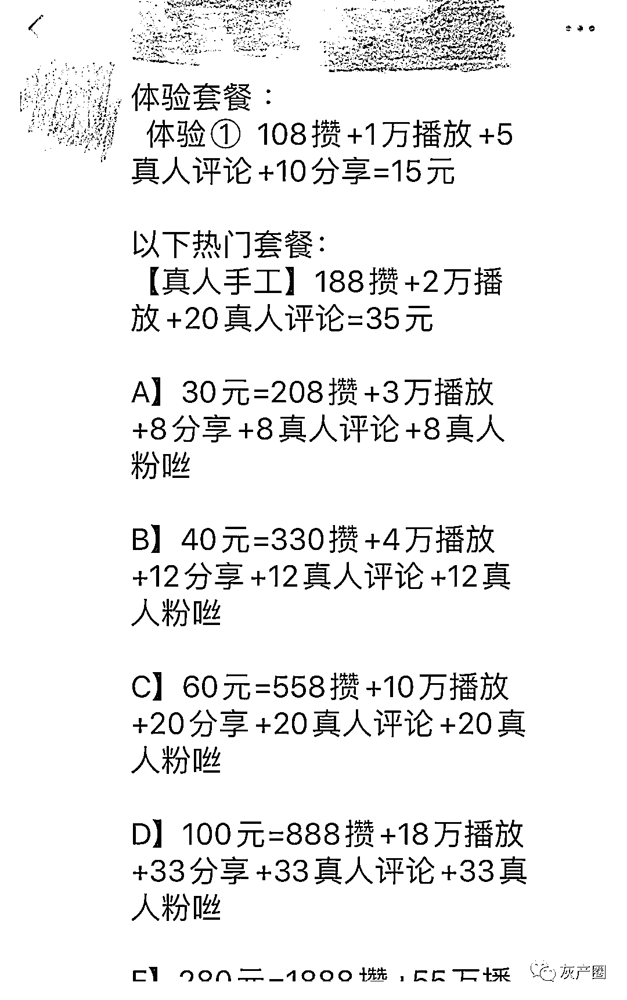

刷单机构的直播刷单报价不仅客户有刷单要求，我们为了面子上好看，主播带货时也一定会购买一点数据制造气氛。新的店铺、直播，**啥数据都不刷，傻等人来，你说这可能吗？****光有数据绝对不够，你要有实打实的产品，这些刷出来的数据才会创造真的顾客，让他们带动更多顾客购买，这才走向良性循环。****谁能想到，这行刚做没多久，又碰到现在刷单补缴这事儿。**这时让我们补缴刷单的税，就是实打实地赔钱。****

**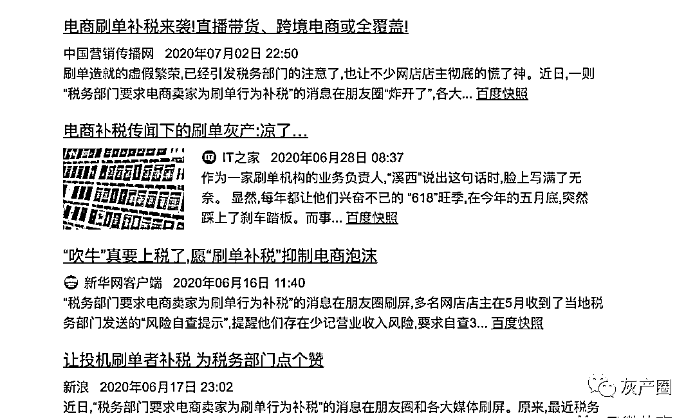**

**网络上关于刷单补税的新闻比比皆是****举个例子，假设一款产品的**客单价是 100 元**，**按 12%的税点补缴**，那就是每单需要补缴 12 元。 ****一般我们平台上，每个产品会刷 500 单的销售量（这还不算狠的），那么每个月就要**为这不存在的收入补缴 6000 元。******现在传闻**三年内的刷单都需要补缴**，那一个产品起码**补缴 21.6 万**。****我们目前在销售的品类大概有 50 种，这个数字就要再乘以 50 倍……****如果是直播带的货，那刷的单量更往几千单的方向飙升，**每款产品动辄百万的补缴税额**，我已经不敢再往下想了。****我在补缴上吃过亏，所以对账单对账格外小心，也不敢跟其他主播那样疯狂刷单。我们现在只做新品内容的好评刷单，来引导消费者购买。****但我还是想说，**为什么只查三年内的补缴金额？******这三年电商并不好做，行业巨头早就已经在十年前起飞，他们**享受着电商起飞的红利、用最低的价格刷最多的单、还能够逃避缴税，**拜托能不能不要只割我们这个阶段的韭菜？****       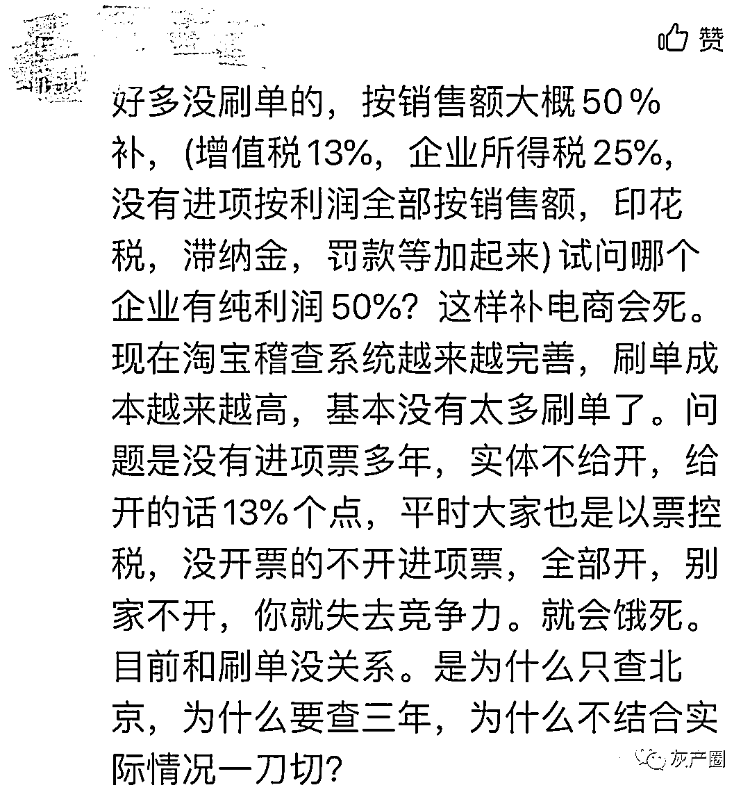店主同行给陈颖瑜的留言      ****听说有些人收到了风险提示的自查信息，但火还没烧到我身上，我还是以观望为主。**

## 

****  “补缴”是电商界的“阴阳合同”  ****

****枪打出头鸟、暂时轮不到小店主****

**林一鸣 | 32 岁 | 杭州 | 淘宝店主**

**刚听说电商刷单补税的消息时，我心里咯噔了一下。****如果真的要补缴，**所有做电商的都没法活了！******我试探了几个店家的反应，大家都彼此安慰，刷过单的店铺比比皆是、那些销量排行前几名的淘宝商家刷得不比我这样的小店主更厉害？ ****他们都没动静，应该还轮不到我。 **

**       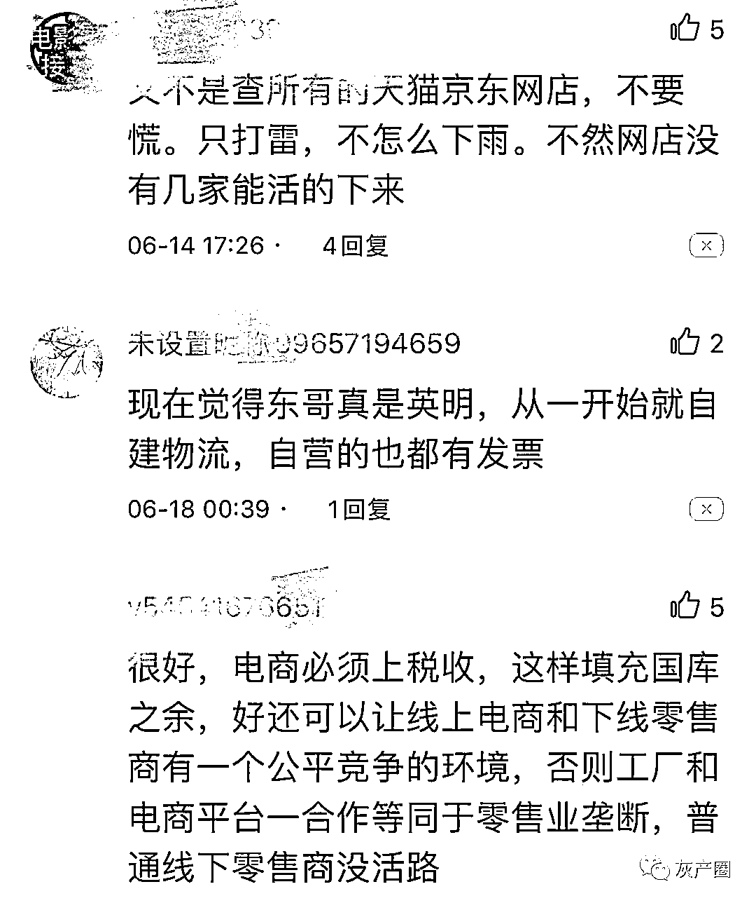**

**同行间的讨论  **

**我认识一个淘宝店主则真的收到了补税通知。她做的是服装和时尚饰品的跨境电商，**跨境电商被列在了补税的重点名单内**。****她和我抱怨了很久，但也无可奈何。****“刷单就是鸡生蛋、蛋生鸡的问题。**枪打出头鸟，做大了，自然会被盯上**”，她说道。**

**       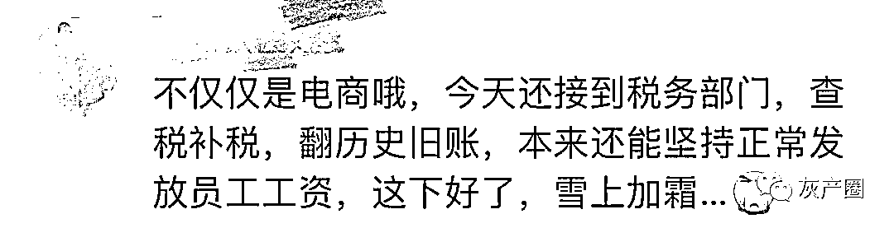       **

**现在的局势让她想起之前明星的“阴阳合同”。****当时编剧税涨到了 16%，补缴也让许多作坊公司直接宣告破产，几年辛苦挣得钱一次性被掏空。 ****不过她在很早就创立了自己的店，月销售额超过 300 万，因此就算是补税也承担的起。****和她相比，我只是个**小本经营的淘宝店主，风吹草动就会被拖垮**。****我是一对双胞胎的妈妈。五年前我所在的广告公司业绩下滑，开始裁员，我不幸成为被裁员工之一。为了能够保证家庭正常开支，我才选择做淘宝店主。****相比天猫动辄 10 万以上的保证金，淘宝店主的成本低、相对自由、不用压货的优势，可以减少经济压力。 ****为了能够把小店做起来，我和别的店主取经，刷了一些销量和评价。******没有经过优化的店铺是绝对做不起来的：****一个新店没有销量就没有信誉数据，如果不刷一些基础销量，根本不会有人来下单。********但我本身创业也十分努力，没有周六日，起早贪黑和厂家谈合作，最近还在各种直播平台研究如何带货。********为什么这么累？因为我知道，如果只刷量，不做后续长尾运营，你一样赚不到钱。 ********我确实刷单了，但之前也没明文规定不能刷。现在忽然通知补缴，就像运动员都开始比赛了才宣布改规则，**就算被犯罚下场，也应该提前知道游戏规则吧**？********但看到“刷单补税”的新闻后，我也更注意细节，减少刷单，并建议消费者开票。********同时我也希望，媒体对我们这些做电商的“温柔”点，别一味强调数据作假。********电商的世界里，刷单不是造假，只是一种策略：大家都刷，你不刷肯定会落后。****

********  **不刷单“死”更快**  ********

**********但这一轮只****针对跨境电商****补税**********

## 

********安庆 | 26 岁 | 男 ********

********刷单机构刷单人（主做天猫淘宝店铺优化）********

********作为一个职业刷单的人，我觉得一切都是传闻而已，目前官方渠道没有通知任何刷单补缴的消息。********

********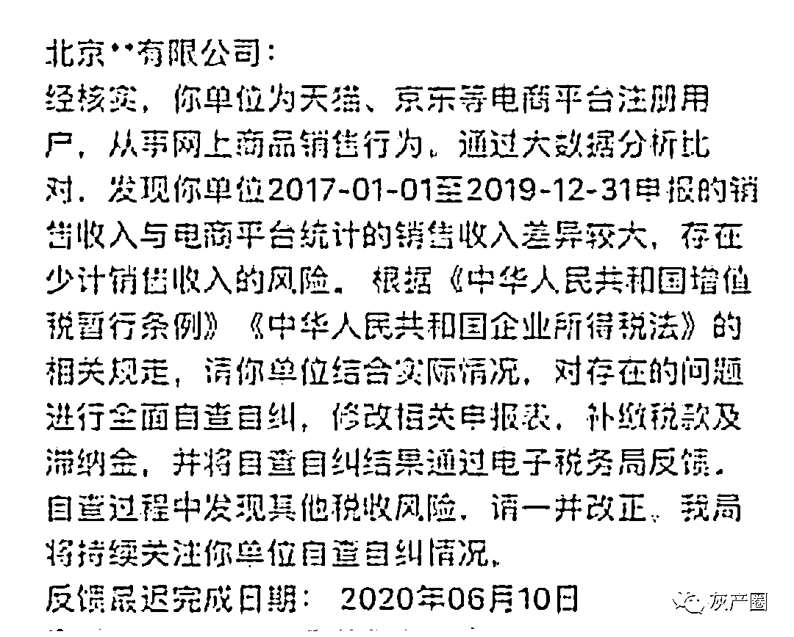********

********网传刷单补税通知的截图********

********我有好几个刷单的客户群，超过一万多个商户在我这里刷过单，但他们都没有和我反馈过刷单补缴税款的信息，**这都是媒体在断章取义**。****************新闻里只提到“相关部门”，但却没有明确的官方信息。****************我不相信这些信息来源，如果要补缴三年刷单的税，**大部分店铺都没法继续开了**。 ****************目前国家还支持摆摊，怎么可能在这些地方要求补缴税款？还要不要人活了？********

********    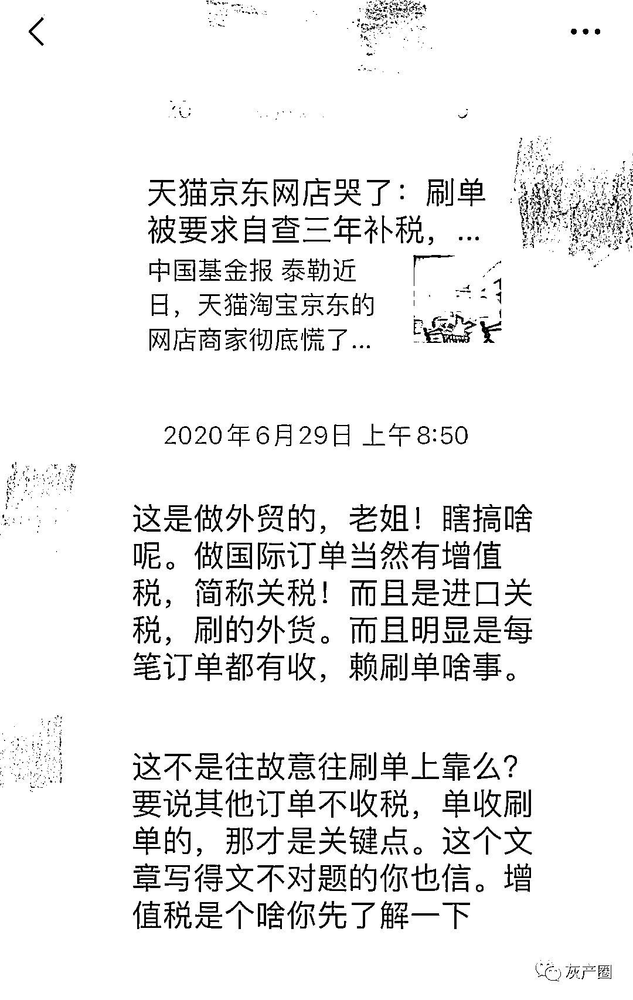********

********看到别人动不动说害怕，安庆觉得小题大做     ********

********可以确认的是，**刷单补缴**主要针对跨境电商****，和国内电商平台关系不大。********

******做国际订单必然涉及关税，那是部分做跨境电商的商户偷税了，需要他们补缴，跟刷单没关系。******

******至少目前为止，我的业务还没收到任何影响。当然也有些胆子小的刷单机构开始两手准备，**一边继续刷单**，一边**转型升级做非销售量刷单**的业务（好评、阅读、点赞、转发等）。 ******

******电商界流传着这样一句话：**“做电商，刷单是死，不刷单死的更快！”********

******             ******

******一般新人入行开店，权重很低，想把店铺做好只有三个途径：**刷单、降价亏本甩卖、直播带货。********

******除了第二种，其他都需要通过刷量才可以帮你把店铺名次提高。**不刷单，就是赔本送货。**大家都是为了赚钱，怎么可能一开店就赔本甩卖？******

******      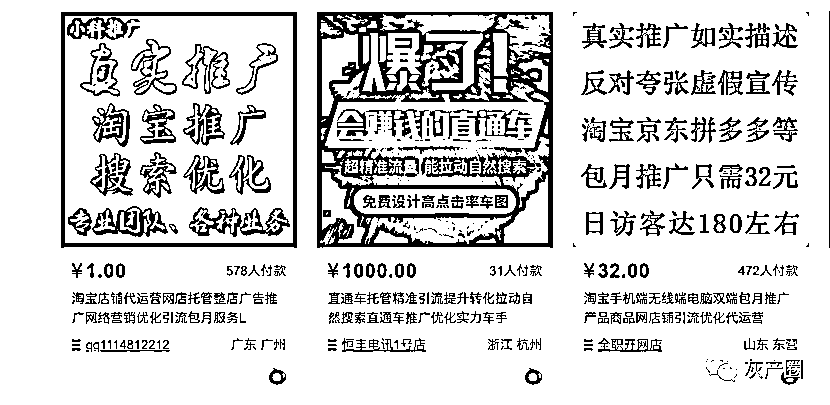******

******在淘宝上搜优化相关内容，会出现很多刷单相关店铺     ******

********做电商，不刷单是不可能的**。******

******我在淘宝上做刷单两年多了，店铺上挂着“优化”两字，这是我们行话，总有懂的人会来找我。 ******

******这是行业刚需，大家都需要通过销量做排名，吸引客流。**有销量排名的一天，就有刷单人的一天。********

******      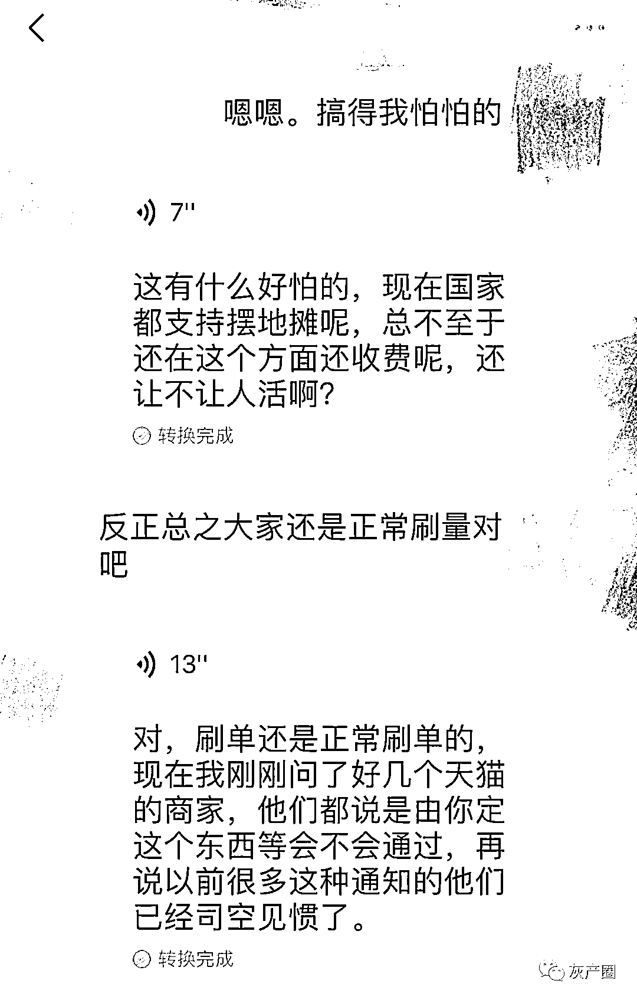******

******该刷的还是继续刷，******

******大部分人和安庆表示 “拟定是一回事，通过是一回事”  ******

******很多天猫的商家和我也聊过，说他们之前也收到过类似的通知，已经司空见惯了。**************“拟定是一回事，通过是一回事”**，他们都这么说。小店就更不要担心了，反正有天猫、京东的企业店铺在前面，**真要补缴，两年内也轮不到你。********

##  **********  不刷私单就交“保护费”  **

**没有 20 万别想网上开店**

孙茉 | 28 岁 | 女 | 前电商公司运营总监 | 现地摊摊主

我创立过跨境电商品牌，讲句良心话：**不刷单，别想做电商**。

我也曾尝试过官方优化的方式，例如淘宝大学、淘宝直通车，但最后都没什么效果。

所谓的淘宝大学，充其量也就是一种**“保护费”**：没上过淘宝大学的，在平台发布广告会被罚，但上过以后，平台就不管你了，放任自由。

淘宝直通车也是类似的机制：一个新店铺，直通车一个星期砸 10 万块，并不会给你的排名提升多少。**如果不砸，别人连你的店铺都搜不到。**

天猫或许会更正规一点，但**初期投入太高**，**普通创业者根本做不起**。

天猫商城按品类收费，如果是护肤和彩妆这类假货率高的品类，光申请**®️标就需要 10 万元**， **™️标则需 20 万元**。

更贵的是天猫店小二的运营费：每个月**至少 10000 元**的基础工资，运营好一个店铺平均需要 5 个店小二，每个月光人工就要**5 万元成本**。

如果再加上直播车、淘宝大学、天猫严选之类的活动，还有主播，那每个月的成本**20 万起步**。

我曾做的跨境电商品牌主要销售零食、服饰等，现在成了**补缴重灾区**。

最初我也靠刷量，找了一个深圳的刷单团队合作，他们从我**每单利润中返 30%-40%的佣金**。当时最流行的刷单方式有以下两种： 

**1、不产生实际购买的“量化”刷单：**通过马甲帮你刷数据；

**2、产生实际购买和评价的“真订单”：**刷单人通过他们的方式引流，让真人购买你的产品和评价。

“刷单”的实质都是店家为获得单品/店铺更好的排名而采取的作弊方式，往往同时配合发送快递空包等做法。

后来淘宝监控系统优化后，第一种类型的刷单就很难做了。

这也导致很多商家为了能“更合规”地“刷量”、被更多客户搜索到，只好选择淘宝直通车进行“官方刷单”。 

疫情爆发后，跨境电商的业务受到重创。产品无法运输，物流成本徒增，我也很难支付得起直通车的“刷单成本”。

**电商平台给予了一些补助政策，但杯水车薪。**这也导致今年很多做跨境产品的分销公司都垮了。

因为运营困难，我现在只维持店的基本运转，不再主动刷单。

适逢前段时间，国家提供了一些摆摊的政策扶持，我直接转行在杭州吴山夜市里摆地摊了。

       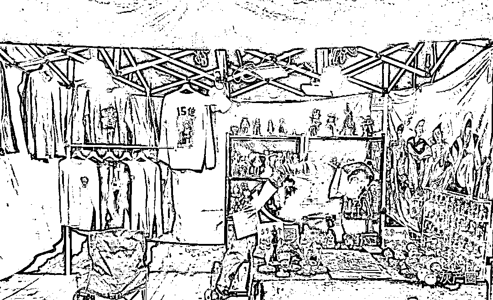

孙茉的地摊铺位 

我们一共四个摊位，加上之前负责线上运营的小伙伴，一起在摊位上销售一些二次元手伴、现场打印的 T 恤、时尚潮牌服饰。 

       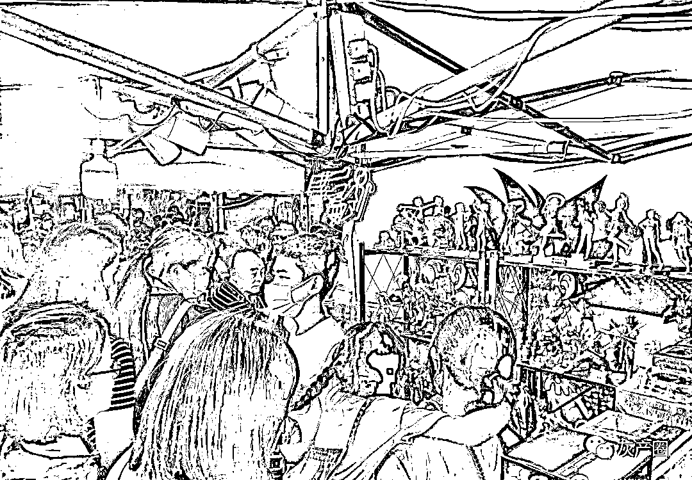

吴山夜市人挤人，也有不少二次元铁粉儿

每天卖个百十件，赚上个千八百的不成问题

相比时刻担心被查、被补缴，摆摊让我彻底放心下来，至少这个钱我赚得踏实。

← 向右滑动与灰产圈互动交流 →

**点击****阅读原文****加入灰产圈高端社群**

********