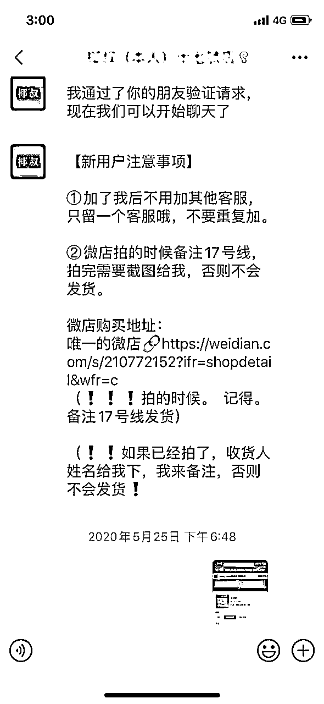
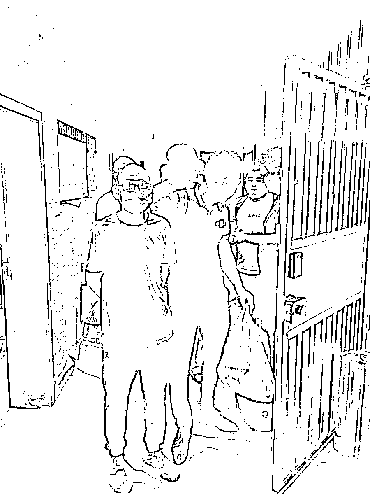
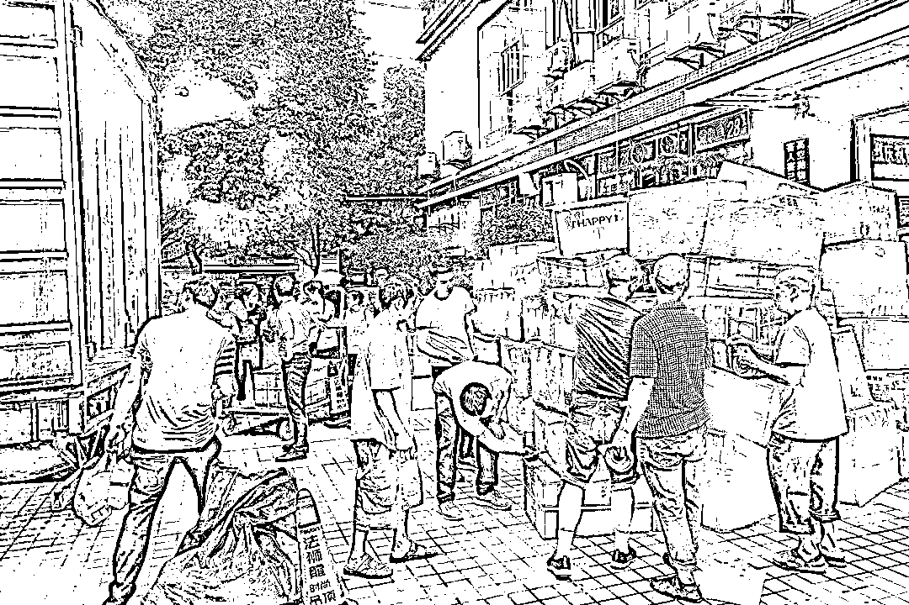

# 95 后小伙卖假鞋超 7000 万，被抓时手机订单每秒十几单！

> 原文：[`mp.weixin.qq.com/s?__biz=MzIyMDYwMTk0Mw==&mid=2247500972&idx=3&sn=8ab09eace2b68c0734a4a9616837b2e2&chksm=97cb0f94a0bc8682f245b45be905c903f7664c2a4fa98875e9c46d0965a75db042bd4715f886&scene=27#wechat_redirect`](http://mp.weixin.qq.com/s?__biz=MzIyMDYwMTk0Mw==&mid=2247500972&idx=3&sn=8ab09eace2b68c0734a4a9616837b2e2&chksm=97cb0f94a0bc8682f245b45be905c903f7664c2a4fa98875e9c46d0965a75db042bd4715f886&scene=27#wechat_redirect)

**点击上方蓝色字体免费订阅“灰产圈”**

重庆市一名 95 后小伙子组织亲友组团卖假鞋卖了 7000 余万元，被抓时手机订单每秒有十几单。

7 月 9 日，澎湃新闻从浙江省宁海县公安局获悉，该局日前破获一起特大销售假冒注册商标的商品案，涉及耐克、阿迪达斯、迪奥、LV、CUCCI 等知名品牌鞋子，涉案金额 7000 余万元 。该案犯罪团伙首脑为 95 后的郭某，团伙骨干均为郭某亲属。

今年 5 月 25 日，宁海县大佳何镇居民张某网上发现有人售卖假冒 yeezy 品牌的鞋子，卖家自称这款鞋是目前市面上最高版本的，完全可以以假乱真，质量与正品无异，且比正品便宜好几百块钱。

通过卖家的微信朋友圈和微店信息，张某还发现卖家还放了所售商品、正品及市场其他仿冒产品的真假细节对比图。张某最终花 842 元购得一双高仿 yeezy 品牌鞋。收到货后，张某发现鞋子质量与卖家介绍的差异很大，遂到宁海县公安局大佳何派出所报案。

本文图片 宁海公安微信公众号

接警后，民警经鉴定发现送检鞋子系假冒注册商标商品，已涉嫌犯罪。宁海警方判断售假行为非个例，后成立专案组调查。

经近半个月的侦查，专案组发现该起售假行为背后是郭某为首的一个犯罪团伙。该团伙在重庆市璧山区设有窝点，通过微信、微店等网络途径，大肆销售假冒注册商标的阿迪达斯、耐克、迪奥等潮流品牌的鞋类、衣服等，销售金额达 7000 余万元。

6 月 14 日~18 日，专案组派出派民警赶赴重庆分成多路实施抓捕行动。当民警赶到前期侦查发现的其中一个仓储窝点时，郭某等人正在打包货物，准备发给买家，被民警当场擒获。

民警还当场查获假冒阿迪达斯、耐克、迪奥等品牌鞋子、衣服上万件，货值近千万元。此次行动，郭某、郭某强、王某、陈某、廖某、贺某等 6 名主要犯罪嫌疑人无一漏网，3 个仓储窝点也被即时查封。经过进一步调查，专案组还查封了郭某犯罪团伙名下持有的房产、豪华汽车，并冻结了犯罪嫌疑人银行账户存款、保险等若干。

“我们不敢相信，这个团伙首脑郭某是一个 95 后，才 20 岁出头，团伙的骨干成员都是他的亲戚。”

宁海县经侦大队副大队长王宗联介绍，随着郭某“生意”火爆，他的父母和一些亲属都加入到他的生意中，有的作为主管，安排进货、出货、宣传等事项，有的负责仓储，负责理货、出货、安排模特拍产品的特写照片，有的当起客服，负责产品的宣传推广。他们都根据自己的工作业绩，收取一定比例的提成。

郭某向警方交代，他从 2017 年开始在网上卖椰子鞋，2018 年后以名牌商品的代工厂出品的名义在微信号和论坛等网络渠道进行宣传。

他们仿冒的包括耐克、阿迪达斯、迪奥、LV、CUCCI 等知名品牌，一旦市面上有新产品推出且热度较高，他们就立刻进行仿冒并快速安排客服在网上宣传。最多一次，半小时就卖出数千双鞋子。

王宗联告诉澎湃新闻：“我们抓到郭某时，他的手机上订单数一直在刷屏，可以说每秒钟都有 10 余条。查获的鞋子足足有十吨重，拉回来以后，堆成了一座小山，我们专门找了仓库来存放，十几个人清点了一个多星期，还没清理完。”

[`v.qq.com/iframe/preview.html?width=500&height=375&auto=0&vid=g3112u3gy4h`](https://v.qq.com/iframe/preview.html?width=500&height=375&auto=0&vid=g3112u3gy4h)

年牟利 7000 万 制售假鞋嫌疑人被控制时手机订单每秒 10 余条

本期编辑 邢潭澎湃新闻首席记者 葛熔金 通讯员 周国亮

← 向右滑动与灰产圈互动交流 →

**点击****阅读原文****加入灰产圈高端社群**

