# 被割过的“韭菜”是否还能再割一波？可以的！

> 原文：[`mp.weixin.qq.com/s?__biz=MzIyMDYwMTk0Mw==&mid=2247501008&idx=4&sn=ac6813ec983c5b90158ec193686f37b7&chksm=97cb0fe8a0bc86fe2af35e6181d616130270ca38d8d2be077f5200d964cf5bdae1d0313cf087&scene=27#wechat_redirect`](http://mp.weixin.qq.com/s?__biz=MzIyMDYwMTk0Mw==&mid=2247501008&idx=4&sn=ac6813ec983c5b90158ec193686f37b7&chksm=97cb0fe8a0bc86fe2af35e6181d616130270ca38d8d2be077f5200d964cf5bdae1d0313cf087&scene=27#wechat_redirect)

**点击上方蓝色字体免费订阅“灰产圈”**

**因为想要追回损失。**

被网络诈骗的受害者，损失有多有少，有的高达几十万上百万，少的也许只有几十元，**但是被骗金额的多少并不是衡量一个受害者再次被骗的标准，这些钱占据家庭生活的比重多少才是。**

**即：家庭更需要被骗钱财的受害者更容易再次被骗，因为更需要追回损失。**

很多诈骗受害者在被骗后都有焦虑、愧疚、后悔等负面情绪，尤其是损失的钱给家庭带来更大的负担时，或者得到更多的指责时，这种情绪将持续时间更久，受害人想要弥补的心情也更急迫。

所以，当**“我需要做点什么来弥补我的过错”，**这种情绪出现时，很多受害人会去网上搜，被骗之后怎么追回钱款？

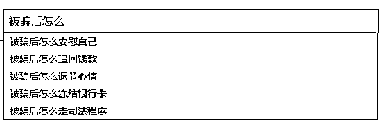

**可乘之机就来自于此。**

之前很多文章我们都聊过，骗子能诈骗成功，百分之八十要归功于诈骗话术，这些话术是骗子经过千百次的失败，总结出的经验。

用什么样的语言、语气、语速可以达到什么样的目的，都是他们研究的课题。

**把控受害人的心理对他们来说不值一提。**

**制作虚假反诈中心网页，假冒警察帮忙追回钱款。**

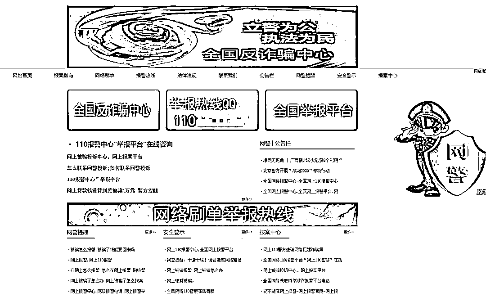

| 图片来源于猎网平台举报

骗子制作假的全国反诈中心网站，以提供举报线索为由要求受害者加 QQ 提供线索。

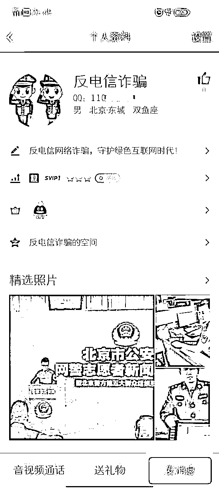

| QQ 空间中的警察图片是为了迷惑受害人

而当受害者按照要求加了对方 QQ 后，又会有怎样的套路呢？

**想要钱，先给钱。**

我们一直强调：**警察不会用 QQ 办案。更不会把自己的工作证发给任何人。**

而骗子为了取得受害者的信任，在受害者加了骗子 QQ 后，骗子会先将“警官证”的照片发给受害者以证明身份。

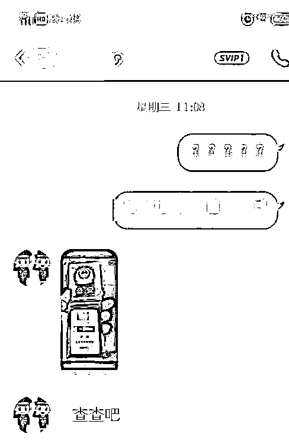

| 图片来源于猎网平台举报

当受害者相信骗子的身份后，骗子会要求受害人提供被骗的经过，包括受害者手里的证据；随后，“警察”表示受害者需暂时将当时被骗时付款的银行卡卡号交给其查看，把卡里的钱暂时交由其保管，才能追回被骗款项。而有的受害者迫切想要追回被骗钱款，按照“警察”要求转账，遂导致二次被骗。

其实，警察不会用 QQ 办案，所以上边的号码是假的；公安机关没有安全账户，不会要求大众转账付款，所以这么说的都假的。

**“受害者”追回钱款后现身说法推荐“黑客”。**

**同病相怜的人更容易感同身受。**

**即同是受害者说的话，更容易被受害者相信，****骗子亦深谙此道。**

所以骗子冒充“受害者”在微博、贴吧、论坛发表自己钱款被追回的信息，当有人留言询问具体流程时，向受害者推荐“黑客（骗子的同伙）”，表示是对方帮自己追回被骗钱款，如果想要追回被骗钱款，可以联系“黑客”。

**黑客的话都是套路****。**

**保证可以追回钱款**

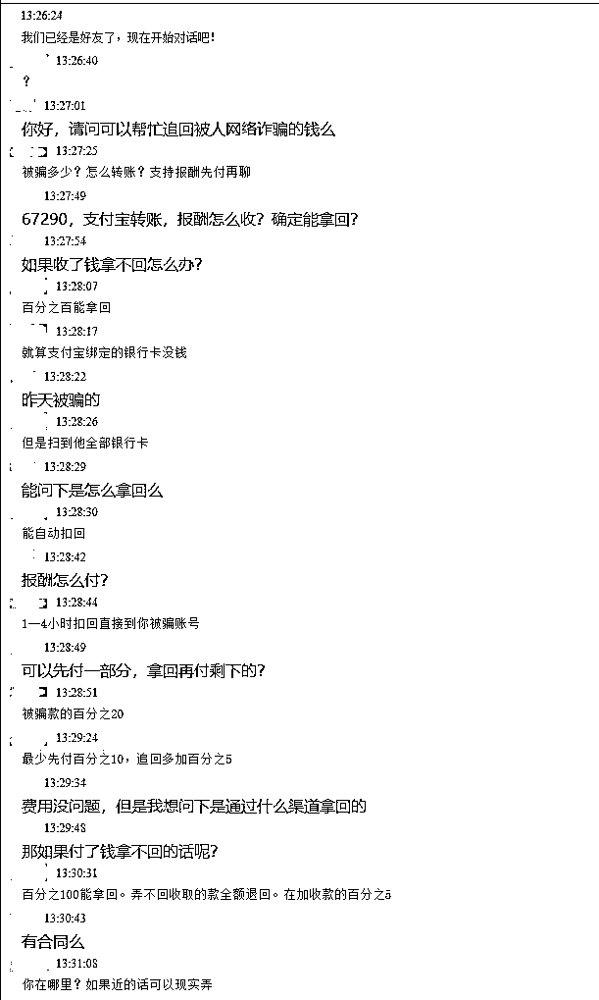

| 图片来源于猎网平台举报

**从上边的对话中我们提取了什么有用的信息？**

保证百分百能追回钱款

收费为被骗金额的 20%

可先付 10%，追回后再加付 5%，合计 25%

无法追回赔付 5%

“黑客”要的钱不多，还有“成功案例”在前，很多受害者都会心动。

**户口本以证身份**

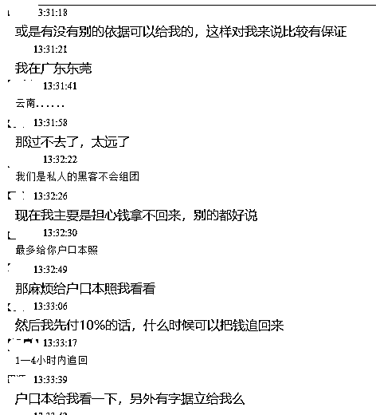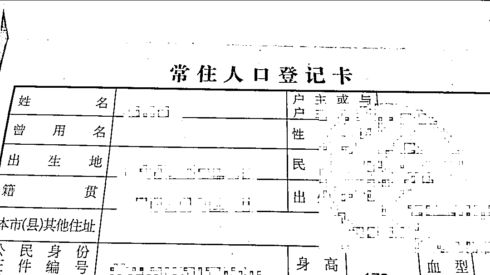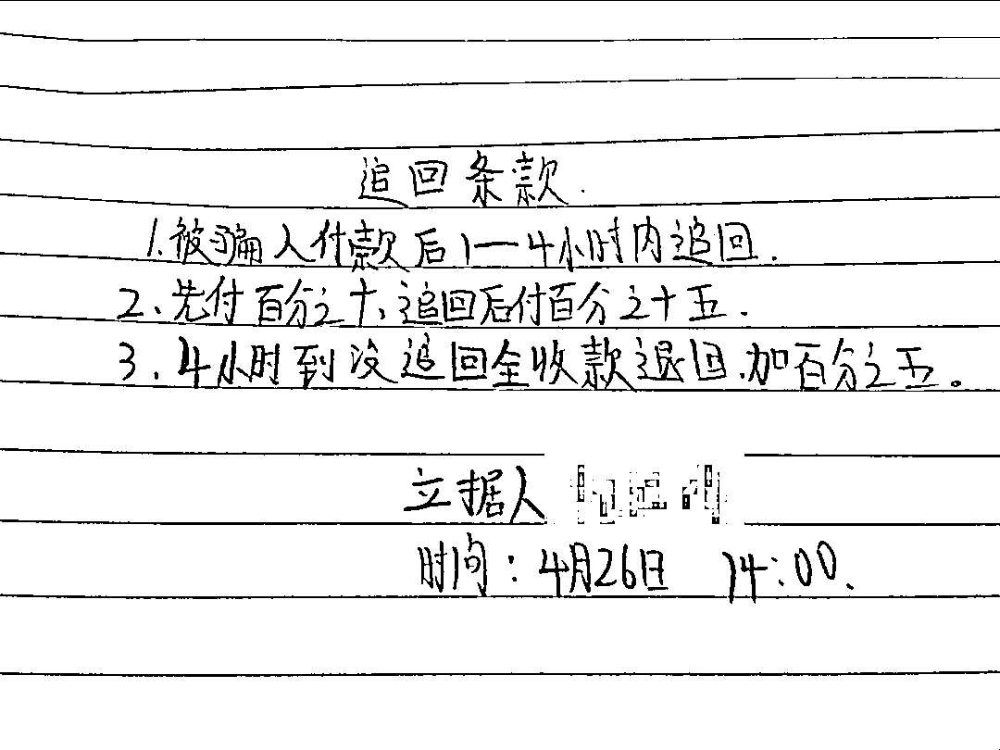

| 图片来源于猎网平台举报

而有的受害者为了求心安，会要求“黑客”提高保证，如身份证、户口本，而“黑客”也会以非常为难的口气同意将**身份证、户口本（从网络上搜集或者购买的他人隐私照片）**发给受害者。

**“成功者反馈”提高可信度**

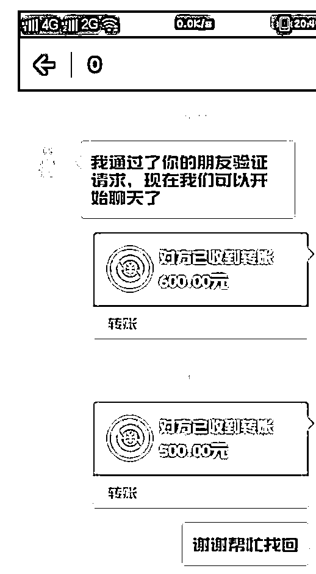

| 图片来源于猎网平台举报

随后，“黑客”还会发送曾经追回成功的案例截图给受害者，以增加可信度。此时，很多受害者在得到重重保证后，按照要求支付 10%或者 20%的金额给“黑客”。

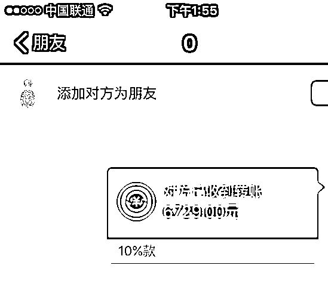

| 图片来源于猎网平台举报

**煎熬让受害者再次付款**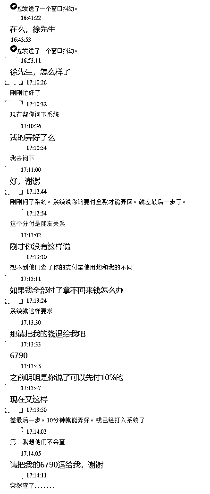

| 图片来源于猎网平台举报

之后的时间里，“黑客”不会再联系受害者，而受害者则会在马上要到约定追回时间之前询问“黑客”具体情况；此时，**“黑客”会表示马上就能追回钱款，但是因为受害者的原因，必须先把剩余的报酬付了，否则不退回钱款。**

当然，就算受害者真的按照要求支付了，也不会得到所谓“追回的钱款”，而会遇到“黑客”的其他理由，一次又一次的要求付款。

如果受害者想要“黑客”退回支付的定金，“黑客”也不会理会。

**吃进去的钱没用吐出来的道理。**

**到底怎样才能追回钱款？**

**找警察比在网上找答案靠谱一百倍。**

**所以被骗后保留证据并报案是一定要做的事情。**

很多案件侦破需要线索、证据，警方根据这些做调查、分析，更多的报案、线索能更快的协助警方破案。

如果在网上遇到人说报警没有用，别报警了，我这有办法的人，不管什么办法，**假的，别信。**

← 向右滑动与灰产圈互动交流 →

**点击****阅读原文****加入灰产圈高端社群**

