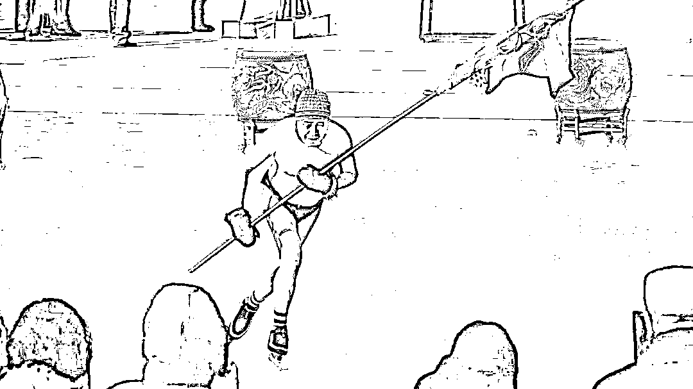
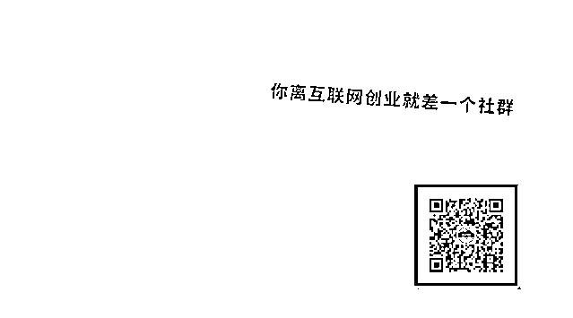

# 量子内裤、玻尿酸内衣，服装行业也开始割韭菜

> 原文：[`mp.weixin.qq.com/s?__biz=MzIyMDYwMTk0Mw==&mid=2247501008&idx=5&sn=85722225d50179e89dbde3ff683d792c&chksm=97cb0fe8a0bc86fe3e4757a2831e20c2299fdedd392efcbd913abf839a452634e236e1f06d1f&scene=27#wechat_redirect`](http://mp.weixin.qq.com/s?__biz=MzIyMDYwMTk0Mw==&mid=2247501008&idx=5&sn=85722225d50179e89dbde3ff683d792c&chksm=97cb0fe8a0bc86fe3e4757a2831e20c2299fdedd392efcbd913abf839a452634e236e1f06d1f&scene=27#wechat_redirect)

**点击上方蓝色字体免费订阅“灰产圈”**

随着服装公司生存日益艰难，营销概念逐渐成为他们收割消费者的关键方法：“量子暖宫内裤”、“美容护肤纱线内衣”、“玻尿酸纤维内衣”、 “石墨烯抑菌内裤”等概念层出不穷。不少消费者购买之后，才发现自己成了韭菜。

******花式养生保健内衣******

*作为纺织品重镇，深圳国际针织博览会（针博会）是服装品牌的重要集会。虎嗅大湾腹地在针博会看到，多个内衣品牌推出了“生姜暖宫裤”和“量子暖宫内裤”等保健性产品。其中，一款“古方宫廷生姜暖宫裤”就被展出，参展工作人员表示：“这款内裤融入了老姜精华素，有发热暖宫、驱寒的效果。”*

*在淘宝、拼多多等电商平台，也能见到不少打着“养巢暖宫”、“温经散寒”、“延缓子宫衰老”、“平衡内分泌”甚至“舒缓痛经”等卖点的内衣销售商。*

*这些夸张的字眼看似是“新科技”的诞生，但生产原理和技术却不是什么新鲜事。*

*具体来看，面料生产包括前处理、染色、后整理三部分。具有特殊功能的面料被称为功能性面料，功能性面料在后整理部分运用了功能整理剂，如远红外整理剂、抗紫外线剂、弹性剂、防风剂、柔软剂等。由于功能整理剂与纤维面料亲和力较低，需要运用粘合剂或架桥剂使它们粘合，或是让功能整理剂在纤维上成膜，防止脱落。*

*A 股上市公司德美化工纺织品化学工程师姚蔚铭解释，暖宫内裤生产是通过浸轧法或涂层法，将远红外整理剂运用到纤维上，远红外整理剂能反射红外线，减少人体热量流失。同时，暖宫裤也利用了纤维吸湿放热的原理，从而强化保暖效果。*

*早在 2003 年，日本服装品牌优衣库就利用纤维吸湿放热的原理，推出了 HEATTECH 保暖内衣，目前该产品销量已经突破 10 亿件，一直是优衣库秋冬季服装销售主力产品。*

*姚蔚铭同时表示，姜黄素可以打开人体热感神经，若是在人体外敷姜黄素，会有明显的发热效果，面料和纤维中的姜黄素也可以起到作用，但效果强弱取决于加入的剂量。*

*“老姜精华素是通过微胶囊缓释或直接浸渍的技术，加在配桥剂和粘合剂里，但（商家）加入的剂量和释放的量都说不准（不一定能产生作用）。” 姚蔚铭称。*

*除了生姜，量子也是商家宣传暖宫裤的重要噱头，“量子暖宫内裤”也是针博会上一大热门展品。*

*一款 “量子暖宫内裤”如此介绍自己，“将量子芯片植入到内裤中，量子与人体结构产生高频共振能量波，可使人体血液管道内的污垢和血栓剥落，并排除体外，从而改进人体结构回旋。同时，该款产品还能帮助女性缓解经期不适，实现暖体排污。”*

*姚蔚铭直言：“当前高端电脑和手机使用的仍是普通芯片，量子芯片怎么会最先用到内裤上呢？加量子芯片的一看就是忽悠人，最多用碳化硅反射红外线，有取暖效果但不明显。”*

*量子芯片是将量子电路集成在基片上，进而承载量子信息处理的功能。量子信息技术应用具有巨大的潜力，无论是发达国家还是发展中国家都投入了大量的人力财力，但目前量子信息技术应用技术仍有局限。欧盟于 2016 年所发布的《量子宣言》显示，量子通信、量子模拟器、量子传感器和量子计算机的应用至少需要 5 至 10 年，甚至更长的时间。*

*由此来看，“暖宫裤”勉强能起到保暖驱寒的效果，但也仅止于此，想达到“延缓子宫衰老”、“平衡内分泌”、“舒缓痛经”等效果听起来更像是异想天开。*

*******神奇的美容护肤衣*******

**同样的，“美容护肤纱线内裤”、“玻尿酸黑科技皮肤衣”等产品所宣传的保湿补水、增加皮肤紧致度等护肤效果，也大多是商家收取的“智商税”。**

**虎嗅大湾腹地注意到，展会上一款内裤的标签显示，该产品运用电气石技术，由“能够保养肌肤的智能美容纱线”制作而成，有“减少脂肪囤积、增加肌肤紧致度和光滑度、格外舒适和健康”的效果。同时，水洗次数对该纱线性能毫无影响。**

**“电气石最初是制造压电陶瓷的技术，我实在是想不到这怎么起到效果。美容纱线 100%是收智商税，很多专门的功能整理剂能水洗 20 次就已经很好了。部分面料商只购买了印染厂的布料，对生产也一知半解，夸夸其谈炒概念却是他们的共性。”姚蔚铭称。**

**实际上，宣传服装具备养肤效果的商家并不少见，为此消费的顾客也比比皆是。**

**2019 年 10 月，一位网红博主在其淘宝店上架“玻尿酸黑科技皮肤衣”，宣称“该皮肤衣加入了保湿玻尿酸，贴身穿可以让皮肤不干燥”，并晒出了相关机构的检测报告。预售期间，产品销量就超过 3 万件。**

**姚蔚铭介绍到，“玻尿酸黑科技皮肤衣”的生产原理是，玻尿酸可以吸收空气中的水分、皮肤新陈代谢散发出的水蒸气，可以提高衣服的吸湿性，从而达到皮肤水润的效果。**

**因此，玻尿酸充当了吸湿剂的作用，但玻尿酸易溶于水中，需要添加粘合剂使之更牢固地附着在纤维和面料上，而粘合剂中含有甲醛和有机溶剂，会使得面料变硬变粗糙。**

**姚蔚铭提到，当前市面上还未规模化地生产玻尿酸纱线，使用较为广泛的吸湿剂为“聚酯聚醚类高分子聚合物”，成本和性能都优于玻尿酸，“只是玻尿酸为大众熟知，很多厂商以此为噱头，即便是真的，可能洗一两次性能就极大减退了。”**

**至于成分含量检测，姚蔚铭称：“其实随便一所成规模大学的化工学院都能做这些基础性能检测，测元素成分去做能谱分析就好。”**

**尽管拿到检测报告的门槛不高，但检测的成分含量结果却值得考究。**

**虎嗅大湾腹地记者以面料厂家身份咨询了一家第三方检测机构，该检测机构的技术工程师小田表示：“前两年没有接到这种相关的检测需求，这两年开始多起来，有客户的产品添加了玻尿酸成分。”她提到，这种功能性面料的护肤成分含量非常低，可能一吨面料就添加了几滴，只是商家的一种夸张的宣传手段。**

**小田还提醒记者，目前国家对功能性面料生产没有出台相关的规定，没有明确规定成分含量标准，但在销售功能性面料时不能过分宣传。"销量太好可能会遇上打假，打假可以揪住产品宣传的关键词，需要负法律责任或者赔钱。”**

********并非所有都是噱头********

***养生、护肤等功能性纺织品带来的效果不明显，但并非所有的功能性纺织品都是噱头。***

***姚蔚铭表示，常见功能性纺织品可以达到吸湿排汗、抗菌抗病毒、芳香、驱蚊、抗紫外线等效果，如防水的冲锋衣、吸湿速干的健身衣、防静电衣、防晒衣等就较为可信。***

***“服装的功能性取决于整理剂，这些整理剂非常便宜。”他提到，抗静电助剂市场价格 1 公斤几块钱，最贵的整理剂也就 100 多元，而一件衣服只需要采用几克助剂就可以达到抗静电的效果。***

***正逢炎炎夏日的针博会，不少品牌推出了“冰爽纱内裤”、“冰丝透气内裤”、“冰感超柔纱线内裤”等应季产品，主打“降温”、“透气”的效果。***

***姚蔚铭分析，这类产品利用了硅油良好的导热性和柔软性，通过浸渍硅油并烘干。“冰感硅油市场上卖得不少，疫情期间口罩戴着不舒服，有的厂家就购买冰感硅油助剂，用在口罩上减少刺痒感和不适感。”***

***此外，“石墨烯抑菌内裤”也成为展会上的热门产品。***

***据悉，石墨烯是仅有一层原子厚度（0.334nm）的二维蜂巢状晶体，是目前世界上最薄、最强韧的材料。石墨烯可以将细菌包裹起来与外界环境隔离，使得细菌无法吸取营养达到抑菌效果。***

***通过不同的制备方法得到的石墨烯，功能也存在差异，价格也在几十元至上万元不等。姚蔚铭称：“性能差但便宜的石墨烯只能用在对纯度和性能要求低的产品，比如石墨烯抑菌内裤，但这样的产品卖出来最少也要一两百块。”***

***但他也提到，当前市场上的石墨烯抑菌内裤鱼龙混杂，大部分商家所加的石墨烯含量太少，很难起到抗菌的作用，炒概念炒噱头的也非常多。***

******************

***← 向右滑动与灰产圈互动交流 →***

***********点击****阅读原文****加入灰产圈高端社群*****

******