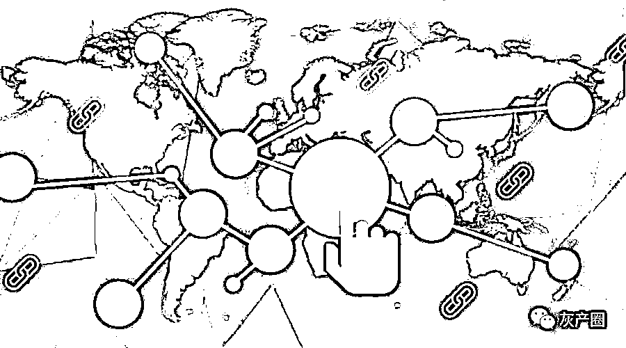
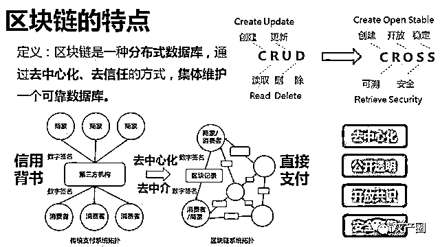
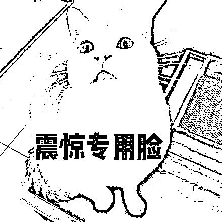
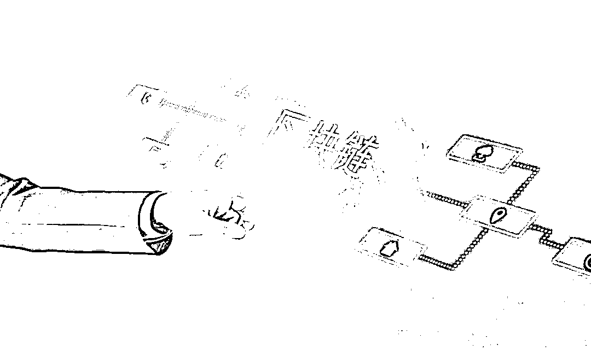
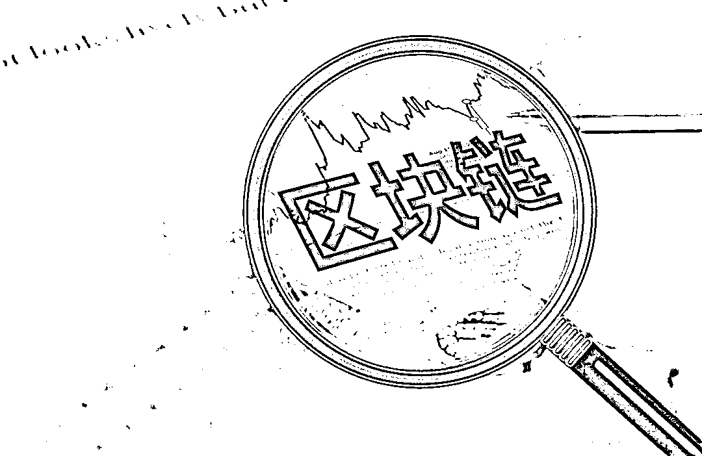
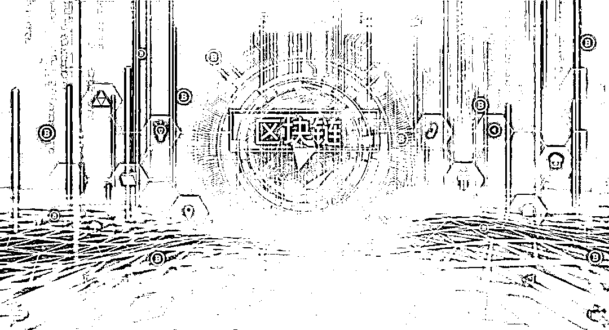

# 一夜暴富？小心掉进区块链骗局！

> 原文：[`mp.weixin.qq.com/s?__biz=MzIyMDYwMTk0Mw==&mid=2247501041&idx=1&sn=c8383ff6bfe23b92ab187097c83104f5&chksm=97cb0fc9a0bc86dfc57875a46267c26a6ee835f4bac8b53a869a66da35d22c2866f23becc2f2&scene=27#wechat_redirect`](http://mp.weixin.qq.com/s?__biz=MzIyMDYwMTk0Mw==&mid=2247501041&idx=1&sn=c8383ff6bfe23b92ab187097c83104f5&chksm=97cb0fc9a0bc86dfc57875a46267c26a6ee835f4bac8b53a869a66da35d22c2866f23becc2f2&scene=27#wechat_redirect)

**点击上方蓝色字体免费订阅“灰产圈”**

近年来，有个词特别火：

区块链的确，区块链是好东西然而，一些不法分子打着“金融创新”“区块链”的旗号通过发行所谓“虚拟货币”“代币”“积分”“数字资产”等方式吸收资金炒作区块链概念进行非法经营、非法集资、传销、诈骗

今天，小菲就给大家揭秘区块链骗局都有哪些套路

**骗局 1**

**名人背书就是好项目**

骗子声称，他们的项目比其他的项目更优质，投资人都是著名的某某某，其技术在业内是很有知名度的。一些新手小白就会被这样的“名人效应”所欺骗。但是，我们要知道，任何行业的名人站台，都可以理解为商业行为，即项目方通过花钱聘请名人来获得曝光度，而名人通过站台来获得钱财。名人背书的项目不一定是真实项目或优质项目。

**骗局 2**

**去中心化能解决所有问题**

骗子会在洗脑的时候一直说：去中心化才是世界趋势，去中心化改变世界，去中心化解决所有问题；实现了去中心化，你们就是新世界的缔造者。但实际上，去中心化并不适用所有场景，也不能解决所有问题。盲目吹嘘去中心化能解决所有问题的项目，需要提高警惕。

**骗局 3**

**区块链就是发币**

骗子利用投资者迫切想赚钱的心理，告诉投资者：区块链是跨时代的技术变革，以区块链为技术支撑投资某种虚拟货币比投资比特币更赚钱，能更快地实现财富自由。实际上，区块链是技术变革，但是买币不能实现财富自由，骗子是将这两个概念同一化了。目前绝大多数以发币、炒币为主的区块链应用都有违法犯罪的嫌疑。 

**骗局 4**

**炒币就能一夜暴富**

早在 2017 年牛市的时候，“一币一嫩模”“一币一别墅”等口号随处可见，“炒币月赚 3 亿”的故事也被传得神乎其神，炒币一夜暴富似乎成为现实。然而，这些骗子的套路都是以代币为骗局，仅仅只是将币种肆意冠名，直接建个网站卖数字货币收钱；而骗子们的宣传口号不变：一定能一夜暴富，让你得到千倍的回报等等。但事实上，普通投资者想要靠炒币实现财富自由的机率微乎其微，就算是代币，目前法律定性也是特殊商品，不具有法定货币的流通性、强制性、法律定位，稍有不慎，就会掉入投资陷阱，极有可能血本无归。

**骗局 5**

**区块链慈善公益**

当区块链骗局假以慈善，利用“XX 慈善工程”“XX 公益项目”“为人类做多大贡献”等为噱头进行吹嘘某某币，其中就以“环保币”最为典型。当你投资的项目沾上慈善和公益，一定要注意擦亮双眼，可以说，这些项目大部分都是骗局。这些骗子动不动就用爱感化你、谈感情、聊梦想，营造一种很有感情的氛围，经常用一些比如“家人”之类词语来称呼你，麻痹你的警惕心。但实际上，这些都是骗子的套路。

**骗局 6** 

**有了矿机就能躺着赚钱**

这些骗子一般都是让投资者购买他们的虚拟矿机并谎称：躺着就能赚钱、等代币流通到市场上就可以坐等升值。但其实，这些虚拟矿机只是骗子手里的几行代码，其后台可以随便篡改，骗子想怎样改就怎样改，投资者挖来挖去最后也就是看一些骗子给的数字而已。

**骗局 7** 

**区块链传销**

许多不法分子假借区块链名义，行传销诈骗之实。不法分子没有实际落地的项目，滥发空气币，拉拢不明真相的投资者入坑，并承诺高额回报，怂恿入坑投资者继续发展下级，组成庞大的传销网络，之后无法兑现承诺便携款跑路。大家要注意，这些“跑路”的项目本质上是传销诈骗，而不是真正推动技术落地的区块链项目。

**小结**

区块链作为一种底层协议或技术方案，可以有效地解决信任问题，实现价值的自由传递，在数字货币、金融资产的交易结算、数字政务、存证防伪数据服务等领域**具有广阔前景****。** 但是，在区块链项目鱼龙混杂的发展初期，投资者要**认真分析、综合考量、谨慎投资。**最后，小菲提醒大家要树立正确的投资理念 

切实提高风险意识

投资者须自行承担投资风险希望广大投资者谨防上当受骗

关注小菲，带你了解更多案例和骗局识别攻略助你守护“钱袋子”！

来源： 深圳经侦，菲凡烽火台

← 向右滑动与灰产圈互动交流 →

**点击****阅读原文****加入灰产圈高端社群**

