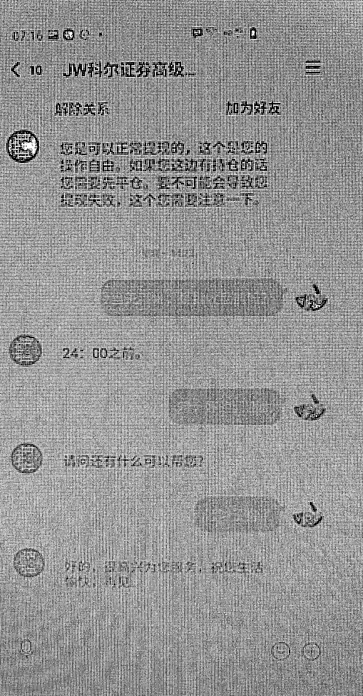

# 股市大涨！有人下载“股神”推荐的 APP 后，66 万元打了水漂……

> 原文：[`mp.weixin.qq.com/s?__biz=MzIyMDYwMTk0Mw==&mid=2247501041&idx=2&sn=08730e47d8229b073aa039afab0b1c21&chksm=97cb0fc9a0bc86df191776f1393afad3307986c1bf49172491975e5f900a180160631f7d8be7&scene=27#wechat_redirect`](http://mp.weixin.qq.com/s?__biz=MzIyMDYwMTk0Mw==&mid=2247501041&idx=2&sn=08730e47d8229b073aa039afab0b1c21&chksm=97cb0fc9a0bc86df191776f1393afad3307986c1bf49172491975e5f900a180160631f7d8be7&scene=27#wechat_redirect)

**点击上方蓝色字体免费订阅“灰产圈”**

相信不炒股的朋友也知道了

近期股票市场形势一片大好

A 股的成交额创近五年新高

这让许多股民们热情高涨

**蓄势待发准备斥巨资冲进去**

虽说股市行情好得让人心动

但股民们也一定要当心

别被利益冲昏了头脑

**因为针对股市的骗局也出现了**

☟☟☟

近期，罗湖分局接报多起“荐股投资”的诈骗案件，涉案金额高达 100 多万。

**被骗子收割的“韭菜”**

6 月 16 日，桂园派出所接到一受害人报案，称有人拉他进了一个群，里面都是讲股票 K 线图之类的，还有一些股票的代码，让群里人尝试购买。

其在购买了几只股票后小赚了一笔，**群管理员便让其购买该群公司的股票，同时下载一个投资软件 APP。**

受害人通过该 APP 第一次投入了 3 万元人民币，看到自己账面赚了 1 万多人民币，**更加信任这家公司**。这时对方告知有一支股票会有好几个涨停板，赶紧入手。

受害人毫无顾虑地在该 APP 内投资了 30 万元人民币，却发现该投资软件打不开了，联系其管理员，**对方告知需要继续投钱才能提现，这才发现被骗。**

**环环相扣的骗局**

6 月 23 日，黄贝派出所也接报一起案件，受害人称自己在微信上加了一人，对方称是一个从事直播的炒股老师，受害人遂每天到其直播间去签到，在几次签到后，对方给他推了一个助理的 QQ 号，让其找助理拿一个直播平台的账号密码，**随后，该助理发了一个网址，在网页中继续观看直播。**

几日后，该助理让受害人去开通港股账户，并推了一个证券客服帮其开户，之后该客服发送一条链接，受害人点击后下载并注册了一个 app，同时往里面充值了 10 万元人民币。

（点击可看大图）

其后多次转账至平台账户上并按照“炒股老师”的指示进行股票交易买卖，几日后收益就达到了 38 万元港币。**这时受害人想提现，页面却显示“等待中，预计下周到账。”**

不日，受害人所购买的股票开始下跌，其咨询“炒股老师”，对方告知是主力股在清仓，其账户在大跌后被系统自动卖出。

这时，受害人尝试将所有账户的资金进行提现，**却发现显示提现等待中或是提现失败。**找客服询问，客服便找理由推脱。

受害人随即报警，**其被骗金额达 66 万元人民币。**

经警方调查了解，诈骗嫌疑人伪装成“股神、大 V、老师、专家”等，以“分享内幕信息、炒股技巧、推荐黑马股”等方式忽悠投资者，**号召大家一起买卖股票，保证赚钱，从而实施诈骗。**

**投资类诈骗手法分析**

此类不法分子极为狡猾

**采取“欲擒故纵”的方法**

先以曾许诺的小额利益予以兑现

在取得你的信任后

**让你在不知不觉中蒙受重大的损失**

**Step 1.**

首先采取“广撒网”的方式，总会有部分投资者买入其推荐的股票后会上涨，这部分投资者遂对其深信不疑。

**Step 2.**

然后针对一些投资力度大的，愿意相信其公司平台进行股市操作的，进行下轮的“教学”，推荐其下载公司 APP 或是登录网站链接，将投资金额扩大。

**Step 3. **

最后利用平台操作进行收割，骗取投资者的本金，同时解散 QQ 群、微信群、拉黑联系方式卷钱跑路。

骗子推荐的投资网站或手机 APP，待下载注册后会有“客服”及“专家”进行指导操作。由于没有取得认证，这类 APP、网站投资平台的充值途径一般是转账给私人账户。

这种网络投资类诈骗

主要以高回报为诱惑

冒充“股神、老师、大 V”等

前期让投资人赚小钱降低防备心

引导投资人增加投资额度

后面就让投资人亏完本金

**受骗金额一般在几万到上百万不等**

**#转发给身边的朋友吧#**

来源：罗湖公安

← 向右滑动与灰产圈互动交流 →

**点击****阅读原文****加入灰产圈高端社群**

