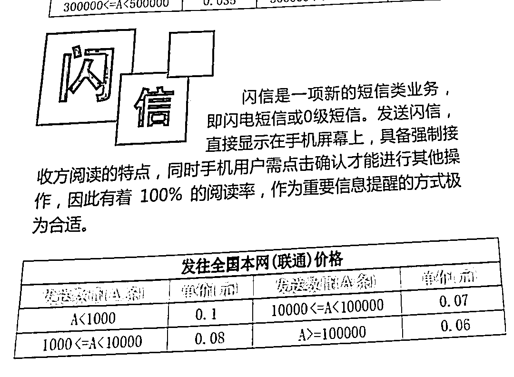

# 阅后即焚，无法拦截，运营商卖垃圾短信，无敌了

> 原文：[`mp.weixin.qq.com/s?__biz=MzIyMDYwMTk0Mw==&mid=2247501041&idx=3&sn=b80611c5c56c77f08077d3aead198c87&chksm=97cb0fc9a0bc86df8f3f5f742d9e3f0e73f716f93a83e1883f73ff9f97d9233e40f2fe084fb3&scene=27#wechat_redirect`](http://mp.weixin.qq.com/s?__biz=MzIyMDYwMTk0Mw==&mid=2247501041&idx=3&sn=b80611c5c56c77f08077d3aead198c87&chksm=97cb0fc9a0bc86df8f3f5f742d9e3f0e73f716f93a83e1883f73ff9f97d9233e40f2fe084fb3&scene=27#wechat_redirect)

**点击上方蓝色字体免费订阅“灰产圈”**

前些日子，工信部发了一个通知：要求各地通信局、呼叫中心和三大运营商，加强骚扰电话的监管。

**主要有以下三个核心内容：**

> 经营呼叫中心业务，首先要取得经营许可，通信管理局**必须实地核验资质**。 呼叫中心电信业务号码原则上**只开通呼入功能**，想开通呼出功能，需提交不违规呼出承诺书，不得转让、出租号码。禁止为骚扰电话或拨打骚扰电话提供便利，不得以任何方式隐匿或修改号码，**确保呼出电话溯源可查**。

总的来说，以后再想利用呼叫中心拨打骚扰电话，几乎是不可能的。
但是，在现实生活中，我们还是接到不少骚扰电话。很多电信业务号码都不是企业直接运营的，而是选择了呼叫中心帮忙运营。
这样一来，呼叫中心手里就会有很多服务号码，空闲停用的电信业务号码就会被这些中间商转卖出去，让不法分子有机可乘。更可怕的是，**竟然还有专门的申请代办公司**，帮助各种名不见经传的小企业申请电信业务号码，同时还能办理经营呼叫中心许可证。想要找到这种申请代办公司，其实并不难，在某搜索页就能找到很多这样的公司。

麻雀选择了其中两家咨询了一下。 第一家，很直接的告诉我，现在查骚扰电话查的特别严，没办法直接办下来。但是如果有公司转让的话，是可以转让的。这里，麻雀就要跟大家划一下重点了！工信部下发的通知，**明确指出电信业务号码是不得转让、出租的。**可是这位“张老师”，却让我加他微信，说有人转让号码的话再联系我。 

这第二家公司也是绝了，直接告诉我只要满足他们四个条件就能够办理，**总共花费 4.5 万元，**我就可以得到一张全网呼叫中心经营许可证和 95 的号码。

如果说，号码转卖只是三大运营商的监管不力，那么麻雀就要跟大家扯一扯“闪信”这个东西了，看完你就不会这么认为了。

“闪信”又叫 0 级短信，能够在屏幕上直接显示，强制收到的人阅读短信，一般手机会被设置为直接显示。 当你正常使用手机时，屏幕上会突然自动弹出，必须点击关闭，才能继续之前的操作。关键的是，**不能被拦截，并且“阅后即焚”**，让你在短信里找不到任何的蛛丝马迹。莫名其妙收到这些垃圾短信，还没有办法拦截拉黑它，让人真的很恶心。

其实“闪信”是用来给大家发送一些非常紧要的信息的，**比如自然灾害、防诈骗的提醒。**但是不知道什么时候，“闪信”就变了味道，直接公开叫卖。中国联通有关“闪信”的传单就被网友发了出来。

仔细看下面这张图，小于 1000 条，每条 1 毛。 **甚至卖到了 8 分 、7 分、6 分这样的价格**。量大还有优惠。

麻雀在中国移动的通信开发平台上，也找到了”闪信“的踪迹。

其中最让人无语的是，竟然把**无法拦截和霸屏显示**作为他们的亮点来做营销。

相比联通“闪信”的价位，移动的价位让麻雀大跌眼镜。**标准价每条才 5 分钱，最便宜能够达到 4 分钱！**

呼叫中心的骚扰电话、个人信息能够被拦截、还有关不掉的“闪信”。
对于以上惹人厌恶的行径，麻雀只想说：一个巴掌拍不响。让我们忍受这被骚扰的痛苦，你们良心不会痛吗？

← 向右滑动与灰产圈互动交流 →

**点击****阅读原文****加入灰产圈高端社群**

