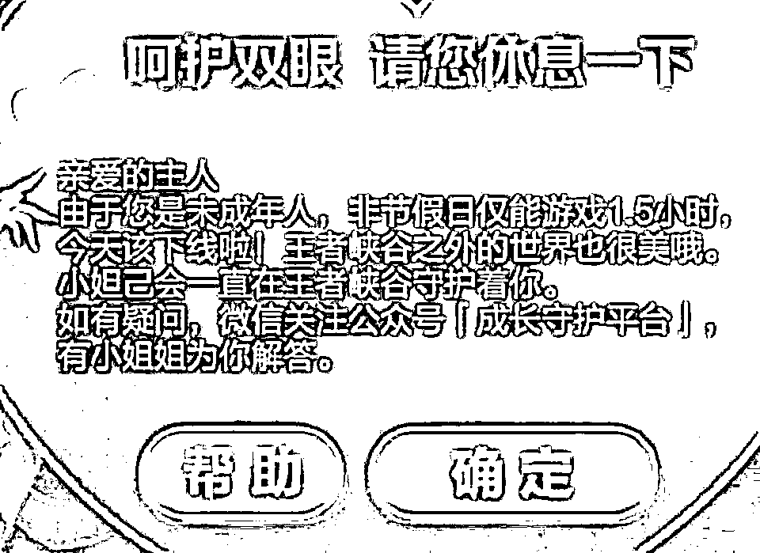
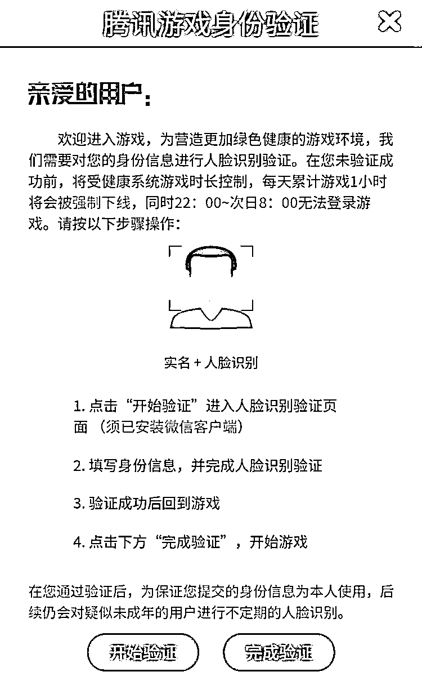
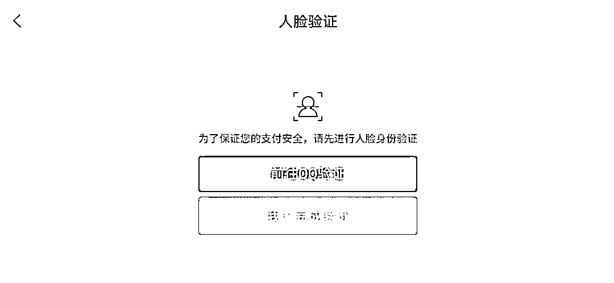
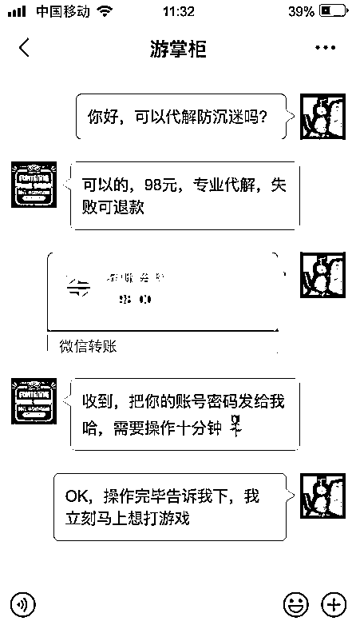
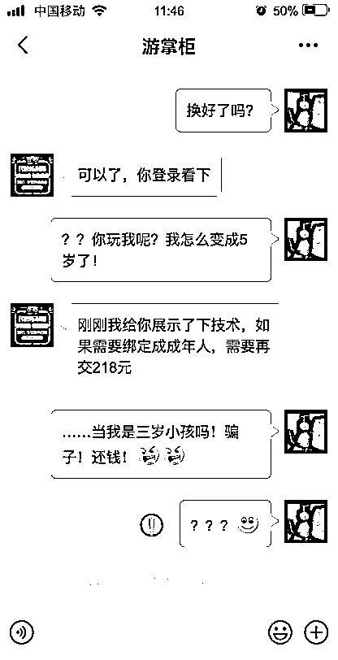
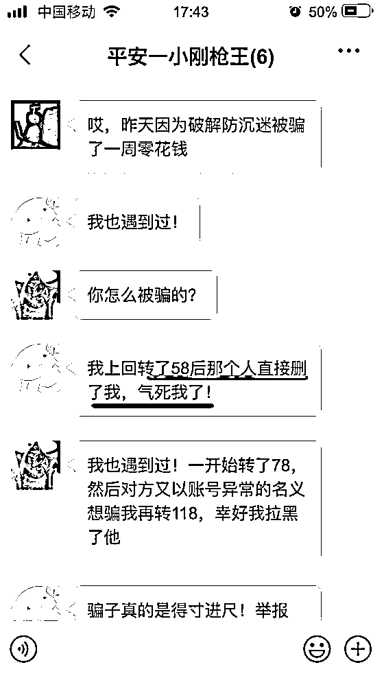
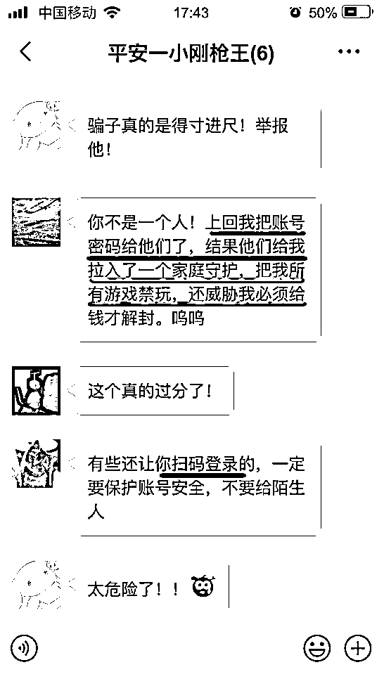
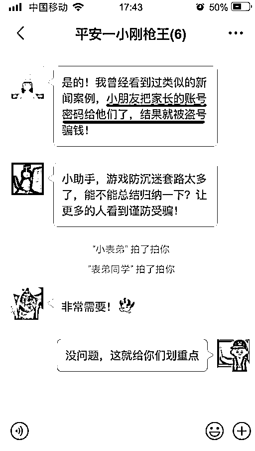
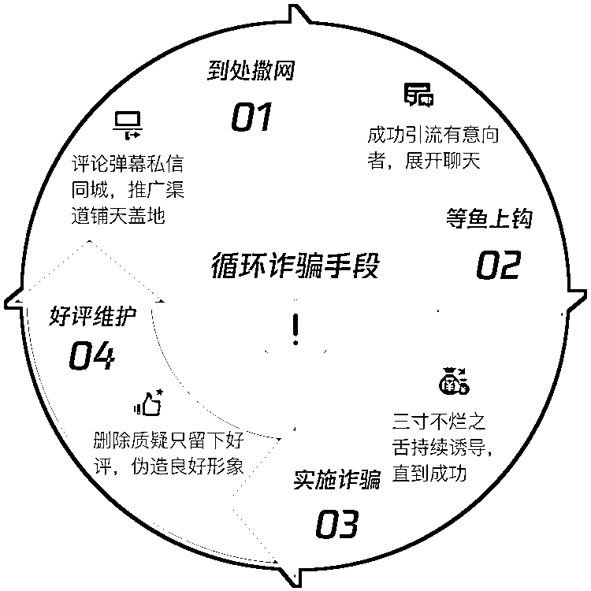
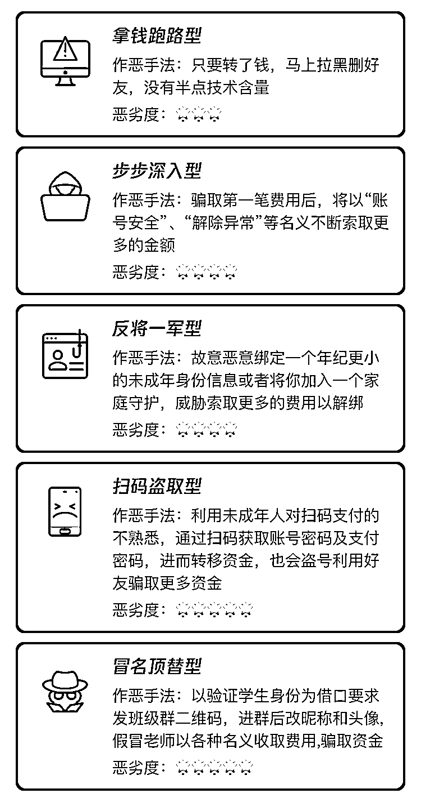

# 代解防沉迷真相｜我的全部身家，终究还是错付了…

> 原文：[`mp.weixin.qq.com/s?__biz=MzIyMDYwMTk0Mw==&mid=2247501041&idx=4&sn=720b697b6f002294c2ed0f9af04e8df8&chksm=97cb0fc9a0bc86df68b80c2934154289583737ac8e037d19bc8c6b28d8167c398e993f2df134&scene=27#wechat_redirect`](http://mp.weixin.qq.com/s?__biz=MzIyMDYwMTk0Mw==&mid=2247501041&idx=4&sn=720b697b6f002294c2ed0f9af04e8df8&chksm=97cb0fc9a0bc86df68b80c2934154289583737ac8e037d19bc8c6b28d8167c398e993f2df134&scene=27#wechat_redirect)

**点击上方蓝色字体免费订阅“灰产圈”**

曾几何时

小助手也是个沉迷游戏的年轻人

但自从干了举报这一行

便退出游戏江湖 

长江后浪推前浪

小助手的表弟也成为了十足的游戏少年

这不，暑假才刚刚来临小表弟就已经跃跃欲试迫不及待地准备向游戏最高纪录冲刺一番然而万万没想到的是**一道“防沉迷”成为他上分的最大障碍****▼***“凭什么每天只能玩 1 个半小时？”**“不能尽情玩游戏的假期和上学有什么区别！”*为了实现游戏自由他耗尽“毕生所学”▼

**第一计 金蝉脱壳 冒充成年人**

[`v.qq.com/iframe/preview.html?vid=u31064ve8wj&auto=0&width=500px&height=375px`](https://v.qq.com/iframe/preview.html?vid=u31064ve8wj&auto=0&width=500px&height=375px)

Excuse me? 我没听错吧为了玩游戏竟然说自己是孤儿还从石头里蹦出来？ 真是只有想不到，没有做不到

**第二计 偷梁换柱 借他人帐号 **

尽管首战以失败告终

但小表弟毫不气馁

接下来，他心生妙计

**——借来一个已绑定家长身份证件的帐号**

…… *“嘿嘿！成功登陆帐号“*正当他准备大展身手的时候却被眼前的这一幕惊呆了▼

**小朋友，你是不是有很多问号？**

“自 6 月 17 日起，腾讯游戏正式升级未成年人保护措施，对疑似由未成年人操作的成年人帐号，**在游戏登录和支付环节两种场景发起**人脸识别验证**。**”

——针对熊孩子冒充家长的行为，腾讯游戏建立和优化了“疑似由未成年人操作的成年人帐号”画像池，并开启了金融级别的人脸识别。这种金融级别的人脸识别就算拿父母的证件照也是无法通过的

**我们早就盯上你了！放弃挣扎吧！**

**第三计 江湖救急 寻求“专业帮助” **

*“既然自己解决不了，那只好请专业人士出马了！” *

于是

小表弟开始四处搜寻**“代解防沉迷**“的办法

功夫不负有心人

终于，他看到了希望的曙光

▼

 

小表弟满心欢喜地加了对方的 QQ 二话不说先转了 98 元让对方尽快帮他解除防沉迷

▼

然而事态的走向却令人瞠目结舌对方声称**如果要绑定成年人，需要再交 218****▼**

 哎~

小表弟信以为真的“最后一根救命稻草”

不仅没能帮他解除防沉迷还骗走了他所有的零花钱！

随着**人脸识别技术被提上日程**以及**游戏防沉迷系统的进一步升级**，网上“破解防沉迷”相关搜索多达 2100 万条。骗子们也瞄准这些费尽心机、企图“实现游戏自由“的孩子，编造出各种套路骗取钱财。

像表弟这样竹篮打水一场空的孩子不在少数

小表弟的游戏群里 

很多同学也纷纷表示上当受骗了

**▼**

究竟骗子们是如何诈骗这些懵懂少年的呢？

一个典型的防沉迷诈骗

可以总结为以下步骤

▼

围绕上述防沉迷诈骗模式，可以衍生出多种多样的套路，并会随着政策的改变而不断改进，可谓花样百出，防不胜防。

防沉迷诈骗常见套路 ▼所以，醒醒吧**游戏防沉迷系统是无法破解的！****所有的“代解防沉迷“都是诈骗！**连我鹅都避不开的智商税，你们就更要长点心了！*“老干妈可以认错**但，人脸识别不会认错！”*（如有不解，自行某度）

← 向右滑动与灰产圈互动交流 →

**点击****阅读原文****加入灰产圈高端社群**

