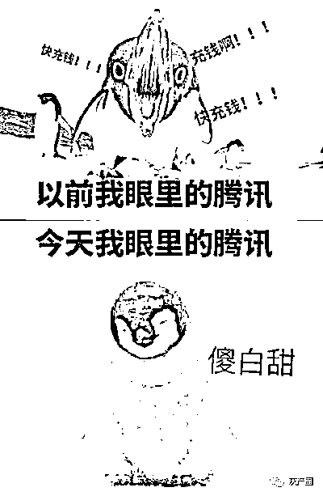
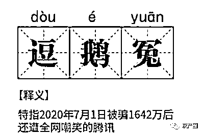
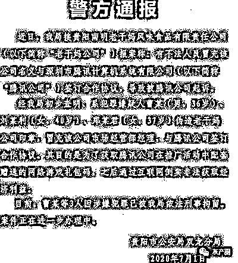
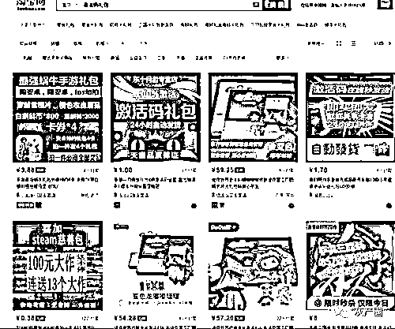
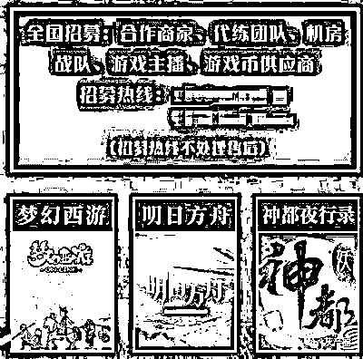

# 老干妈 KO 腾讯火爆事件背后，竟然是年入百万的灰色产业链！

> 原文：[`mp.weixin.qq.com/s?__biz=MzIyMDYwMTk0Mw==&mid=2247501095&idx=1&sn=f983f541f9d52aa7976d0136c8acdb21&chksm=97cb0e1fa0bc87091a8844983e3da02dceaee67ed47e99db9906a40c592a72f890878b71bd9c&scene=27#wechat_redirect`](http://mp.weixin.qq.com/s?__biz=MzIyMDYwMTk0Mw==&mid=2247501095&idx=1&sn=f983f541f9d52aa7976d0136c8acdb21&chksm=97cb0e1fa0bc87091a8844983e3da02dceaee67ed47e99db9906a40c592a72f890878b71bd9c&scene=27#wechat_redirect)

**点击上方蓝色字体免费订阅“灰产圈”**

 “老干妈”与腾讯签订了 1642 万的投放合同，投放后迟迟不交钱。无奈之下，腾讯选择状告老干妈，最终冻结了老干妈 1600 万的资产。

      老干妈通过其官方微信发布正式声明称，经核实，公司从未与腾讯公司或授权他人与腾讯公司就“老干妈”品牌签署《联合市场推广合作协议》。

      网友大呼：

      “腾讯，你被骗了！”

      “傻鹅子，以后长点心吧！”

网友纷纷“吃瓜”，更衍生出“逗鹅冤” 

***      一、事情的过程其实很简单***

警方的官方通报已经说明 

事实是三名犯罪嫌疑人，冒充老干妈市场经营部经理，对腾讯进行诈骗。

      一切的起源，也就是前面说到的《联合市场推广合作协议》，就是这个犯罪团伙利用假公章和腾讯签订的。

      虽然没能从腾讯处骗到钱，但是通过推广活动赠送的礼包码，这伙犯罪嫌疑人就能倒卖从而获利。

      简单来说，空手套 白鹅 白狼。

      具体真相咋样的，可能还需要案件进一步审理，大家才能了解其中的真相。

      不过这三个人的玩法非常值得玩味，为了获得游戏礼包码，就签下 1600 万的合约，怎么看都不是很合理。不禁让人好奇，冒这么大风险能赚多少钱？

      这三个人，能在腾讯和老干妈两个龙头企业之间自由游走，手段多高明。

      倒卖游戏礼包码这个项目，靠什么吸引这种“人才”的？ 

***      二、年入百万的游戏礼包市场***

根据腾讯的诉讼文件里的描述，这次合作进行了两拨活动：

      1、2019 年 4 月的 QQ 飞车手游 S 联赛春季冠名；

      2、2019 年 10 月的 QQ 手游时装、车型合作。

      这两拨合作腾讯开发出了两款游戏礼包：

      1、线下老干妈+QQ 飞车联盟款：小周边加辣酱

      2、游戏里的老干妈礼盒：包括时装、永久 A 车、888 点券

      游戏里的礼盒官方充值价格在 30 元左右。而游戏的礼包码，在淘宝售价则是 3.9、8、15 块。

      2019 年腾讯发出的礼包数量超过 50 万，其中腾讯新闻、手游助手等平台居多。

      《QQ 飞车》项目，推广费“1600 万元”，客户礼包至少也是几十万。

      就以 30 万个为例，8 元/个，这批礼包码能卖 240 万元。

      如果按 15 元的高价算，则有 500 万之多。

      空手套白狼，靠资本的羊毛获利数百万也是一种本事。不过这三个人实力来看，不至于只赚这点钱才对。

      在我看来，他们之所以选择这条歪路，更可能的原因这行好做。 

***      三、礼包码项目，究竟变现价值在哪里？***

其实这就要说起一个灰产行业：游戏外挂。

      早些年，我们玩游戏的时候经常会碰到开挂的人。比如魔兽世界、冒险岛、DNF、梦幻西游等等。这种有着大量玩家的游戏，研发出一款外挂出来，获利都是上百万的。就以梦幻西游为例，一个顶级无级别的武器，能卖出几十万的高价。

      走捷径，是所有人的天性。

      后来随着游戏产业的没落，以及游戏 BUG 的修复，很多产业已经倒下了。如今更多的是靠代练、代充、陪玩、礼包/道具售卖为主。

      之所以这几个还能存活的原因，大概是：

      1、成本低，利润率高

      2、需求量大并且足够稳定

      3、行业内产业链体系完善，各个环节分工合作

      礼包码倒卖属于游戏道具倒卖里的一个分支，成本最低、需求最大。主要分为货源和分销两块。

      首先聊聊，为什么会有礼包码这个东西？

      因为它是个好东西

**      于用户而言：可以低价抽取游戏道具和游戏币。**

      于游戏公司而言：礼包码推广最省钱，拉新效果最好。如《英雄联盟》初期都和媒体直接合作做皮肤、道具激励的拉新，效果不必多说。

      一般来说，可获得免费礼包码的人，除了游戏公司官方，还会有渠道、媒体、同品牌或同公司下产品。总之，用户属性越相近、用户体量越大，给的越多。

      礼包码倒卖的第一步，就出现在货源发出的环节，灰色的分销也从这开始。 

***      四、礼包码这种免费资源优势如何成为灰产货源的呢？***

 **      1、产品拉新**

      比如腾讯出了一款新产品，或者是为了增加产品的用户量。会做出一些游戏奖励，比如下载并注册腾讯新闻，免费获得一个码。

      一些倒卖游戏道具的工作室就会用大量的小号或者虚拟 IP 的手段短时间撸走大量的平台礼包码。

**      2、渠道商低价流出**

      前面讲过，一般能拿到礼包码资源的除了官方之外还会有品牌合作方。合作方有人低价将礼包码资源售出赚取利润。官方卖 10 万的，8 万卖给工作室。

      游戏的红利其实已经很低了，一些渠道商为了加速回款，或者是某些人群的贪腐，便会利用这种方式牟利。

      其实在商业圈，这种出售商业信息的行为并不少见。比如我们注册一些软件之后，经常收到骚扰电话，多数情况就是我们的信息被人卖掉了，这是所有 APP 都可能存在的**安全问题。

      当这些礼包被工作室拿到之后，有的会将礼包码用作自己品牌的营销活动奖励，自行消化。

      而像卡盟类的平台，则会把码信息稍作调整，比如夸大奖励价值，放在网站上招收分销代理，赚差价。

      还有一些呢会通过电商平台、游戏社群、游戏论坛等渠道销售给玩家，或者是层层分包给更小的团队，最终卖到玩家手里。 

网店运用自动调价（卖的越好价格上涨或不变，越少，价格自动调低）、自动发货插件实现交易，全程人工成本极低。

      月销量高至 8 万，低至 3000，同店内 30 余款游戏礼包码平均月销量在 1 万以上，即便按 0.5 元最低价算，月入也有 15 万。

      当然，除了礼包码，这些店大多也做代练、游戏账号交易一类的业务，规模大的，还会团队合作和再次级代理。 

网店“商业合作”专区   

      目前稳定的大店月销售额近百万，普通店也能月赚几万。

      现在国内并没有明确的法律规定限制游戏礼包码交易，所以很难证明整个链条源头的违法嫌疑。

      相比被定性的外挂等等，游戏道具、礼包的倒卖更安全，在规则内操作，还是年赚外快的一个好选择。

      其实游戏行业里发展了 20 多年，有不少的灰产项目都是很稳定。而大多数项目之所以能赚钱原因，还是玩家永远不变的“以小博大”侥幸心理。

来源：涛涛捞金

← 向右滑动与灰产圈互动交流 →

**点击****阅读原文****加入灰产圈高端社群**

