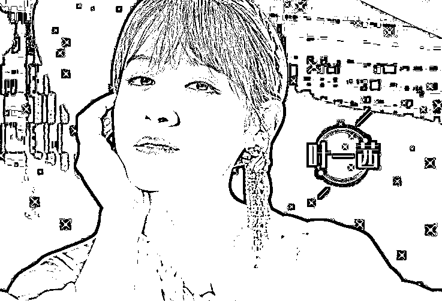
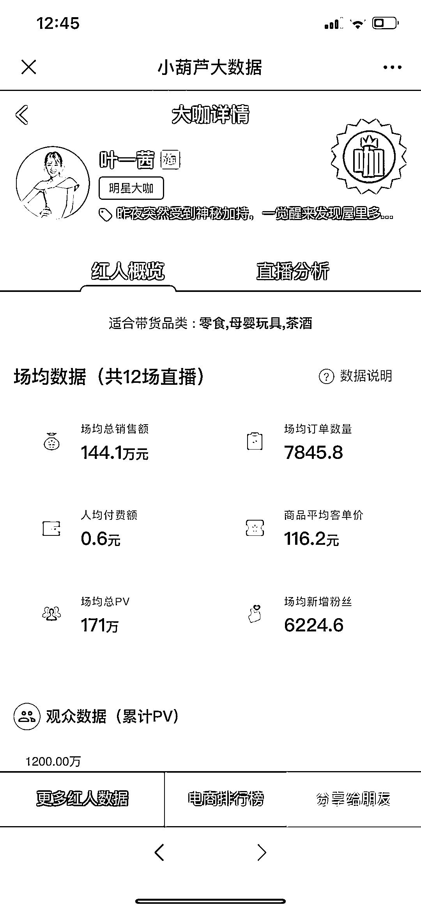
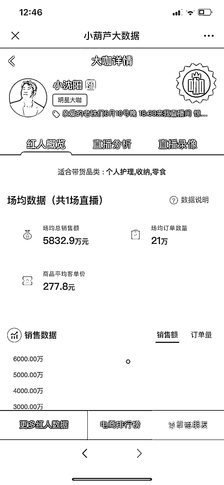
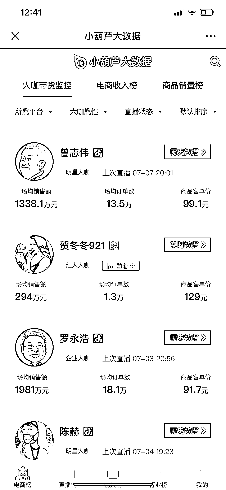
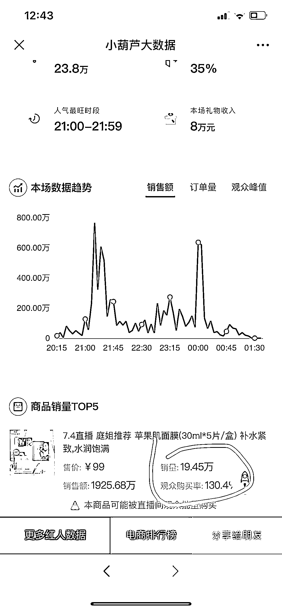

# 戳破明星直播泡沫：90 万人观看成交不到 10 单，谁在“裸泳”？

> 原文：[`mp.weixin.qq.com/s?__biz=MzIyMDYwMTk0Mw==&mid=2247501095&idx=2&sn=728089ddf12121a2f47e6a595c5b3955&chksm=97cb0e1fa0bc8709d5a221de9a56e053dba03b03d28e73e1b5972e805ea8de4829a401485c9b&scene=27#wechat_redirect`](http://mp.weixin.qq.com/s?__biz=MzIyMDYwMTk0Mw==&mid=2247501095&idx=2&sn=728089ddf12121a2f47e6a595c5b3955&chksm=97cb0e1fa0bc8709d5a221de9a56e053dba03b03d28e73e1b5972e805ea8de4829a401485c9b&scene=27#wechat_redirect)

**点击上方蓝色字体免费订阅“灰产圈”**

在直播的风口上，泥沙俱下。而在巨浪滔天的泡沫过后，似乎各方都有一肚子苦水。 

自 2016 年进入元年以来，电商直播行业发展迅猛。公开数据显示，2017 年，中国直播电商 GMV 为 310 亿元，这一数据在 2019 年为 3900 亿元，超过 20 亿元资金投入了 40 多家电商直播企业。 

2020 年的前两个季度，受疫情影响，大量以线下销售为主的商家也加入了电商直播大军。他们以为自己抓住了“起死回生”的灵丹妙药，而真实的市场要残酷的多。 

“我们和小沈阳合作了一场直播，卖一款白酒。**当晚下单 20 多单，第二天一看退货 16 单。**”7 月 8 日，北京某企业负责人耿新华（化名）郁闷地告诉 21Tech，没想到带货效果这么差，好在对方退回了 1.5 万元坑位费。 

这一成绩着实令人费解。小沈阳目前在新浪微博上粉丝数为 1743 万，抖音粉丝数为 1915.2 万。粉丝不再为明星带货买单了？答案是肯定的。 

21Tech 了解到，**直播翻车令商家亏损的明星不在少数，所谓的流量与粉丝注水严重。**

***高额坑位费与惨淡销售额***

**“现在请明星直播，简直就是被诈骗。因为她们很多的数据和粉丝量都是造假的。”**上海某品牌负责人林昊（化名）对 21Tech 直言，品牌看中的正是明星的影响力，但是如果掺水严重的话，就是直接的欺骗。 

此前，林昊公司的一款爆款茶具，邀请艺人叶一茜在淘宝直播中进行推广。一场直播下来，卖出的商品只有寥寥数单。**“我们客单价是 200 多，叶一茜卖出去的总金额不到 2000 元。”**林昊对此感到十分气愤，当时直播间显示的在线观看人数近 90 万。 

而第三方数据平台小葫芦大数据检测显示，叶一茜在淘宝平台的 12 场直播中，场均总销售额为 144.1 万元，场均总 PV171 万。林先生认为这一数据注水严重，以叶一茜直播间每场销售商品在 25 件计算，场均总销售额可能只有几十万。 

遭遇这一尴尬的结果后，他与叶一茜所属的 MCN 机构快乐讯广告传播有限公司多次协商无果，对方表示从始至终就没有承诺过销售金额。在林昊多次投诉后，该公司最终同意退回一万元坑位费。 

无独有偶，林昊与快乐讯广告传播有限公司合作的另一名艺人大左，销量也十分惨淡。“**总共销售额是 5 千块**，但是他收的服务费只有 2500 元，销售佣金是 10%，最后拿到手的是 3 千元。”林先生说，之所以对于大左的合作结果还算能接受，是因为对方态度较好。 

对于直播的真实成交和数据，快乐讯广告传播有限公司相关人士拒绝了 21Tech 的采访。此后，林昊又断断续续与多位明星进行合作，效果并不如他预计的那样理想。“一般来说，场均 PV 数基本对应的就是销售额，像薇娅的场均 PV 数在 2000 万左右，她一场直播销售额几千万也十分正常。” 

同样的遭遇也发生在耿新华身上，他的公司名下有几家网店，同时还登陆了天猫和京东。今年也陆续请了一些快手大 V 直播、并参加了拼场的明星带货，效果均不理想。“小沈阳卖的那款白酒，下单了 20 多单，第二天退了 16 单。最后对方退回了 1.5 万元坑位费。”他透露。 

遭遇这样的情况，对 ROI（投资回报率）有要求的企业很着急。耿先生就表达了这种焦虑，**“小沈阳方面承诺 ROI 能到 10，结果 2 都没有。”**

他同时提到，业内为了营造销量大好的假象惯用的手法：**“就是刷单，然后第二天退货。”**

***吴晓波与罗永浩的两极***

多次合作下来，林昊对于明星直播已经基本掌握了合作的原则，他把问题归结为高额的坑位费。“坑位费这些太高的话，只有微商品牌能受得了。我们算过，**如果承担坑位费，商品的成本得在两折以下才能赚到钱。**” 

对于利润空间相对较小的电商产品来说，也只有通过降低商品本身的质量才能获利。耿新华也有同感，“我们公司参加的直播带货基本都是拼场，单个坑位费太贵，扛不住，也不敢赌。接受 21Tech 采访的多家品牌方人士都认为，电商直播市场已经进入红海。直播带货这一模式的品效与行业的规范，均存在问题，根本无法达到各方的期待值。 

网红直播带货火爆，其实也逃离不了基本商业规律。即足够大的流量、足够低的折扣和精准的客户群体。但是，在精准定位这个层面上，翻车的主播也不在少数。6 月 29 日晚，知名财经作家吴晓波在淘宝直播“新国货首发”专场，完成了自己的淘宝直播首秀。 

当晚 5 小时的直播吸引了 830 万人次观看，带货销量 2.72 万件，客单价高达 826.31 元，预估 GMV2200 万元。由于一般算法抓取的是直播间价格，领券购买的优惠并未减掉，实际成交额要低于上述估值。参与了吴晓波直播首秀的某品牌负责人告诉 21Tech，赞助秒杀产品和其他一些大品牌的坑位费在 30 万元，但是统一对外口径报价是 60 万元。 

“**我们付了 60 万元坑位费，但是实际成交 5 万元都不到。**真是令人大跌眼镜，当时我预估能卖 50 万，乐观的说能到 150 万，按照 100 万备的货，还好我只进仓了一半。” 

他安慰自己，就当是品牌形象露出和强化，坑位费当作是品牌广告费。对比同是“文化人”的罗永浩直播首秀，成绩显然要优秀得多。当天在抖音的观看人次为 4892 万，预估销售额 1.68 亿。 

显然，吴晓波的粉丝定位为企业主和一线白领等高端人群，但是在线购买的动力并不强。相反，罗永浩的粉丝多为宅男死忠，加上选品非常精准，如投影仪、剃须刀、办公用品等等，因此需求也广泛得多。 

针对明星直播品效不佳的现状，某电商市场总监对 21Tech 表示，大流量不等于大转化，在当前的带货直播模式中，常常出现明星人设与带货货品有“违和感”，且明星对待带货直播的态度往往倾向于“捞金”，缺乏对产品的筛选和了解，这些都是导致大流量无法大转化的原因。 

**直播环境考验以下三种能力：**

*   第一，明星对产品的基础卖点、应用场景必须熟悉，以此来带动消费者体验与认知；

*   第二，明星带的货要与人设匹配、货品匹配、人群匹配，围绕其粉丝画像与购买力选择货品；

*   第三，运营需要前置，优化货品筛选、前期宣传、话术优化、复盘总结等。

***卖方进化、买方跟进的未来***

针对直播行业的乱象，6 月 24 日，中国广告协会发布国内首份《网络直播营销行为规范》，对直播电商中的各种行为都作出了了全面的规范。《规范》从 7 月 1 日起开始正式实行。 

《规范》中规定，营销主体不得利用刷单、炒信等流量造假方式篡改交易数据和用户的评价信息；不可以有虚假或者引人误解的宣传行为，欺骗、误导消费者。在网络直播营销中发布商业广告的，应当严格遵守《中华人民共和国广告法》的各项规定。 

除了遵守新出台的《规范》，买卖双方建立更好的合作机制，也是保证这一商业模式走得长远的保障。但是，上述规范尚未提出明确的惩罚机制。 

第三方数据平台小葫芦大数据监测显示，艺人张庭在 7 月 4 日的一场直播中，其销售的一款面膜观众购买率达到了 130.4%。这一数据存在刷单造假的嫌疑，因此被系统外显提示为“数据异常，本商品可能被直播间观众批量购买。”

第三方电商大数据行业人士解释称，“通过抽样抓取全网 3000 万下单商品模型计算后，**得出了 96%直播商品购买率仅有 10%，全网仅有 2%商品购买率超过 50%。**” 该商品购买率超过了 130%，说明在该商品上架后的短短 5 分钟的时间内，其实际订单数已经远远超过了在线观看人数，这显然是不合理的。

种种刷单造假行为，最终伤害的是整个行业的信任基础。林昊吸取了与艺人叶一茜合作失败的经验，决定与国际钢琴大师郎朗合作带货。郎朗不收取坑位费，只收取比例略高、但双方觉得合理的分成。“郎朗更看重产品力，且与公司的产品更契合。直播带货这个模式，不共赢是不行的。”林昊认为。 

这与上述电商市场总监在采访中提到的“人设匹配”不谋而合，共赢也是当下的电商直播行业从业者常常提到的词。如何通过相关规范与行业内部的磨合运作，让这一模式长远发展，让“热量+销量的化学反应”更为强烈，是各方都在思考、期待的未来。 

该总监直言，明星带货直播的现状并不完善：“目前明星带货已经逐步冷静下来，回归到直播本质上，但目前还存在一些问题，如明星报价高，企业 ROI 要求高。双方都有点着急，功利性都有些强。” 

他认为，未来的明星带货会常规化。直播带货，对于明星而言是宠粉圈粉的一个补充手段。对于企业品牌而言，明星效应降低产品导入成本，明星提升产品信任度，是一个产品竞争力的补充手段。 

**“目前大家对这件事期待有点过大了。**明星带货本身在企业运作中，就是游离在品宣部门和销售部门的产物。每个企业对明星直播的诉求是不一样的。这是一个卖方市场进化，驱动买方市场跟进的场域。”他总结道。 

随着消费者越来越理性，即使明星的流量再强，也难以号召他们买单。而另一些流量明星，即使有粉丝“撑腰”，也难以形成可持续性的消费。无论是平台还是商家，抑或是准备来割韭菜的明星，都需要思考什么是真正的价值。

来源：21Tech(News-21) 作者：陶力 编辑：李清宇、刘雪莹

← 向右滑动与灰产圈互动交流 →

**点击****阅读原文****加入灰产圈高端社群**

