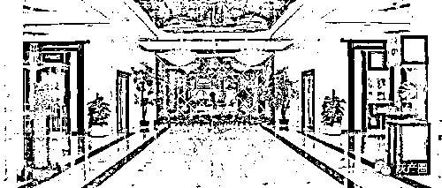
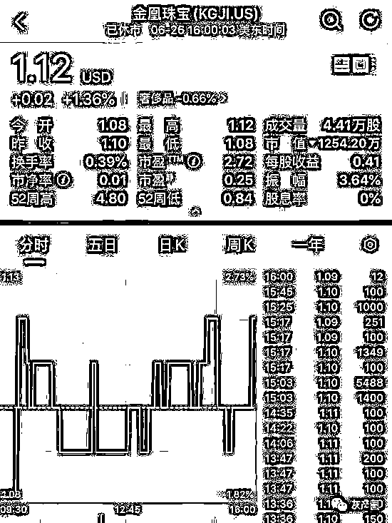
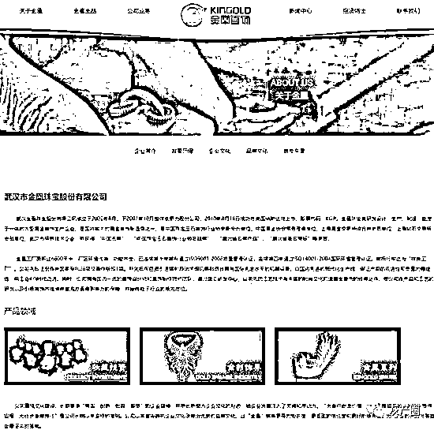
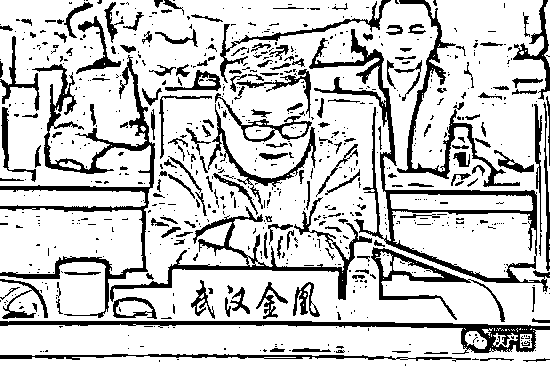
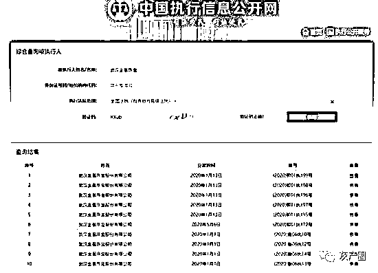
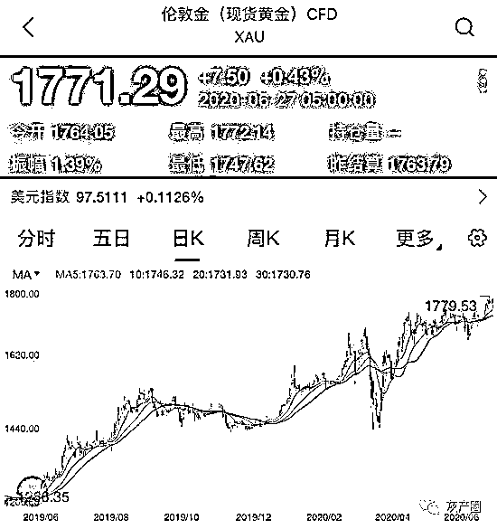

# 武汉金凰珠宝融资 100 多亿，抵押的 80 吨黄金是假的？

> 原文：[`mp.weixin.qq.com/s?__biz=MzIyMDYwMTk0Mw==&mid=2247501095&idx=5&sn=773cbd31b4a13b8545dba21d4be84912&chksm=97cb0e1fa0bc8709730fb46ea69daae9bcc0b716538d5fad917726fb9121c6ed9264b16fef61&scene=27#wechat_redirect`](http://mp.weixin.qq.com/s?__biz=MzIyMDYwMTk0Mw==&mid=2247501095&idx=5&sn=773cbd31b4a13b8545dba21d4be84912&chksm=97cb0e1fa0bc8709730fb46ea69daae9bcc0b716538d5fad917726fb9121c6ed9264b16fef61&scene=27#wechat_redirect)

**点击上方蓝色字体免费订阅“灰产圈”**

> 做为国内最大的黄金首饰制造商之一的公司——金凰珠宝，向多家金融机构质押了大量黄金融资，结果这些黄金被拿去检验，发现竟然是假黄金。

***上市公司爆了大雷！***

  　做为国内最大的黄金首饰制造商之一的公司——金凰珠宝，向多家金融机构质押了大量黄金融资，结果这些黄金被拿去检验，发现竟然是假黄金。

　　据悉，目前未到期融资额约 160 亿元，对应质押黄金超过 80 吨。未到期的融资金额 160 亿元中，超过 10 亿以上的的信托公司包括民生信托 41 亿、东莞信托 34 亿、安信信托 19 亿和四川信托 18 亿。

     仅此四家信托公司未到期信托超过 112 亿元；另外恒丰银行约 39 亿元。多灾多难的安信信托和四川信托赫然在目。其他信托公司还有长安信托 8 亿，北方信托 8 亿、昆仑信托 3 亿、天津信托 6 亿，中航信托 2.9 亿。

***　　金凰珠宝***

　　金凰珠宝成立于 2002 年 8 月，于 2007 年 10 月整体变更为股份公司，2010 年 8 月 18 日成功在美国纳斯达克上市，股票代码：KGJI。

　　其官网介绍称，金凰珠宝集研发设计、生产、制造、批发于一体的大型黄金首饰生产企业，是国内较大的黄金首饰制造商之一。

　　近几年来，武汉金凰珠宝通过信托融资非常频繁，而 2019 年下半年开始，金凰珠宝涉及长安信托、东莞信托、民生信托等公司的多期信托计划均出现逾期，相关产品规模合计达数十亿元。涉事的多家信托机构遂提起司法程序，法院依法查封了金凰珠宝所质押的黄金。

　　2020 年以来，金凰珠宝作为被执行人案件已达 22 次，累计执行标的额达 102.57 亿元，其中有多个标的被重复执行。最大的一笔执行标的达 16.36 亿元，公司董事长贾志宏持有的金凰系相关公司的股权也已被冻结。

　　而我们知道，今年的黄金价格，涨疯了。

　　但是在这样涨了一年的黄金牛市行情之下，连作为笑谈的中国大妈都解套了，为什么有家做黄金的公司竟然成为被执行人？

***　　“黄金质押+保险保单” ***

　　据了解，上述涉及金凰珠宝相关信托成立时，即通过质押实物黄金和保险公司承保的方式，设置了“双保险”的风险控制措施。

　　其中，保险人交付给受益人的标的黄金应经过双方认可的具有黄金鉴定资质的第三方检测机构检测合格。如质量和重量不符合保险单约定，即视同发生保险事故，由保险人承担全部赔偿责任。

**　　拿长安信托-金凰珠宝贷款 2 号集合资金信托计划的风控措施来看：**

　　1、黄金质押：

　　金凰公司提供其合法持有的不低于上金所 AU9995 标准的实物黄金质押（静态质押），信托放款前，质押物本金质押率控制在 70%以内。

　　2、保证担保：

　　公司法人代表贾志宏承担个人无限责任保证担保。

　　3、监控措施：

　　【质押物管理】

①质押实物黄金直接保存于武汉本地商业银行保管箱中（中国工商银行(5.220,-0.16, -2.97%)），保管箱封存。

②质押期间内，不进行查库（保证质押物安全），保管箱不开封，做到静态质押。

【质押物保险】质押实物黄金在中国人民财产保险股份有限公司购买财产保险（基本财产险附加盗抢险，同时保险公司承保黄金的重量及质量），该保险的第一受益人为信托受托人；质押黄金接收并存放于银行保管箱后，保管箱将封存，长安信托及人保财险公司分别持有保管箱钥匙及密码；项目存续期间，保管箱不可开封，做到静态质押。

***　　产品违约，黄金还是假的***

　　早在此前，已有多家媒体爆出，2019 年开始，金凰珠宝的经营情况开始恶化，多期信托计划出现逾期。

　　“公司在注意到金凰珠宝相关情况后，作为受托人严格履职、严密监控，并采取了相应措施。上述项目项下均设置了黄金质押担保，且全部质押黄金均在保险公司进行了投保，民生信托为保险单项下第一受益人。”民生信托方面表示。金凰珠宝用于信托融资中所质押的黄金，在信托公司进行违约资产处置时检测发现质量和重量不符合标准。

　　由于所质押的黄金已被投保，信托公司转而向承保的保险公司要求索赔，结果遭拒。

　　据悉，民生信托依照合同于 2019 年 12 月 27 日向金凰方发送《贷款提前到期通知书》，宣布相关融资提前到期，并提起司法程序，此后武汉市中级人民法院依法对部分质押黄金进行了查封。

　　不过，2020 年 5 月 22 日，武汉市中级人民法院向民生信托送达的检测报告显示，质押黄金质量和重量不符合保险单约定。

　　据民生信托方面透露，在相关金凰信托计划中，保险公司作为保险人主持了质押黄金交付的全过程，包括但不限于质押黄金的出库、检测、运输、清点、封存过程，此外民生信托与人保财险和大地财险为共同管理人，只有“指纹+身份证件+钥匙”验证通过时，存放黄金的保管箱方可开启。

　　而在对抵押物黄金进行处置前，第三方机构再次对抵押物做了检测，结果却显示黄金质量和数量不符合保险单约定。

　　这次事件源头要追溯到 2018 年。公开资料显示，2018 年，武汉金凰实业集团有限公司通过增资和收购股权以 69.98 亿元获得三环集团(28.290, -0.59, -2.04%)有限公司 99.97%股份，进而间接持有上市公司襄阳轴承(5.300, -0.09, -1.67%)27.93%股份，被称为“湖北国企改革新样本”。

这笔近 70 亿的交易中，有 42 亿是向外寻求的融资，其中金凰系旗下的金凰珠宝以黄金抵押贷款为底层资产的信托计划，是融资的一大“主力”，涉及长安信托、民生信托、北方信托、安信信托等在内的多家信托公司。

　　“踩雷”信托公司向保险公司索赔 。

***　人保回应：“不符合保险合同约定”***

　　公开信息显示，在金凰珠宝所的信托产品出现违约后，信托公司纷纷提起司法程序，并且对部分质押黄金、股权进行了查封及冻结。

　　据人保方面介绍，金凰案件中，人保财险武汉市分公司承保的是财产基本险，与武汉金凰订立的保险合同条款为在银保监会正式备案的《财产基本险条款（2009 版）》（下称“保险合同”）。其中保险合同第 5 条明确约定：“在保险期间内，由于下列原因造成保险标的的损失，保险人按照本保险合同的约定负责赔偿：

（一）火灾；（二）爆炸；（三）雷击；（四）飞行物体及其他空中运行物体坠落。”由于保险合同第 7 条将“盗窃、抢劫”责任免除，武汉金凰附加投保了“盗窃、抢劫风险”。因此，人保财险依据保险合同约定，只对上述 6 种原因导致的黄金“质量和重量不符合保单约定”承担保险责任。

　　同时，保险合同第 3 条明确约定：“本保险合同载明地址内的下列财产未经保险合同双方特别约定并在保险合同中载明保险价值的，不属于本保险合同的保险标的：

（一） 金银、珠宝……”鉴于上述条款的限制，双方通过增加特别约定的方式，将黄金标的扩展承保。特约条款作为保险合同的附件，无法离开保险合同而独立存在；双方对于投保险种、保险事故发生、责任免除等事项的约定，仍以保险合同，即《财产基本险条款（2009 版）》的约定为基本遵循，财产基本险的属性没有发生变化。

　　此外，保险合同第 26 条明确约定：“被保险人请求赔偿时，应向保险人提供下列证明和资料：……”且“投保人、被保险人未履行前款约定的单证提供义务，导致保险人无法核实损失情况的，保险人对无法核实的部分不承担赔偿责任。”除本条明确约定保险金请求权主体为被保险人外，保险合同和特别约定条款，均未约定“受益人”具有保险金请求权。

　　人保方面表示，目前被保险人武汉金凰并未向人保财险提出任何保险索赔，信托公司等机构提出保险索赔，不符合保险合同约定。

　　“一叶障目，不见泰山”

　　金凰实控人贾志宏声称，自己质押的黄金是上金所的“原料金”，无法在市面上大量流通，只能采取质押方式；此外，还提到，历史原因没有对收购的黄金做大规模检测，可能有部分金子“成色不足”。

　　这里其实已经有了心虚的味道，但是，这个理由被接受了。

　　为什么有这么多家信托公司集中“入坑”？

***总结来看，有三个原因：***

　　一是“项目随人走”。某银行高管跳槽到长安信托，长安就上马了金凰项目；后来长安内部股权关系变革，新高管收缩项目规模。

　　这个旧高管团队分散到了东莞信托、民生信托等，项目也就跟着这些人在信托业“遍地开花”。

　　雪上加霜的是，正在漩涡之中的安信信托、四川信托也各自牵涉其中，且规模不小。

　　二是有保险公司财险增信。“黄金质押+保险增信”，大多数保单注明了黄金重量和质量由保险公司承保或鉴定；本来就是低风险的业务又加了一道“保险杠”。

　　三是武汉金凰融资的项目参与“三环集团”已经改制竞标成功，项目本身“钱”景广阔（仅靠土地改性就能收益翻倍）。

　　这样一“捋”，逻辑就通顺了。

　　回过头去看，武汉金凰项目，其实有两个极端：

　　一端是融资主体财务状况不好，主营业务没什么亮点，靠一个“改制并购”的前景来融资，混改过程中间又矛盾重重；

　　另一端，是“黄金质押+财险承保”这种看上去低风险的融资模式，偏偏还能提供高收益、大体量融资；高收益意味着投资者接受度高，大体量意味着巨额管理报酬，这对信托公司无疑是巨大的诱惑。

***　　谁在造假？***

　　此信托模式中，参与者有金凰实业、黄金检测机构、保险公司、黄金保管方（银行等）、信托公司，在案件水落石出之前，我们仅从逻辑上分析谁在造假：

　　信托公司没有参与黄金造假。在该信托融资模式中，金凰珠宝共获得了 10 家以上的信托融资，要让 10 家以上有竞争关系的信托公司联合欺诈各自的投资者形成合谋，无异于集体自戕，几乎没有可能；同时，融资方若要让游戏持续下去，亦需更多的信托公司参与进来，这便需要信托公司在不必合谋的情况下便可参与进来。从逻辑上可以判定信托公司没有参与黄金造假。

　　金凰珠宝必然造假，假黄金皆出自其手，这一点不必讨论。

　　涉事的黄金检测机构可能造假，也可能检测到的确实是真黄金而无责。

　　保险公司有可能造假。保险经办人被买通，该经办人需要一颗天大的胆子，比贾老板的胆子还要大，即拿比贾老板少的钱，干比贾老板还要大的事。

　　黄金保管方有可能造假。银行内鬼在黄金入库后狸猫换太子的可能性无法排除，即调包发生在黄金保管方，前有“农行 39 亿票据变报纸”的先例。

　　从逻辑上分析，在黄金保管方造假的中间环节最少，嫌疑最大。即涉事的黄金检测机构每次检测的黄金都是真黄金，保险公司看到的是真黄金，信托公司经办人看到的也是真黄金。看完之后，则换成了假黄金，真黄金拿出来进行下一次融资。按此逻辑，需且仅需融资方买通保管方，检测机构无责。

***信托公司的责任***

　　信托在经历重重风控之后，却受伤如此之重，那么问题出在哪里？真的就只是保险公司的问题吗？信托公司的主要责任在哪里？

　　投后管理不力是信托公司管理失职之一。东莞信托早在 2020 年 2 月，便抽检了所质押的黄金为假，但直到 2020 年 6 月，假黄金的信息才暴露出来。由此可见，在“黄金质保+保险保单”的信托融资上，必有瑕疵，保险公司对承保财产的投保后管理、信托公司投后对质保品的管理上都难逃其责。

       若在投后管理中，无论抽检方是保险公司，还是信托公司，对质保品有那么几次抽检，早日将风险暴露，便不会形成今日之惊天大雷，此为信托公司管理失职之一。

　　信托公司对资金流向缺乏有效监管是其管理失职之二。我们知道，每一个融资类信托计划中，在资金流上，资金用途与还款来源是重中之重。如果还款来源断流，才是处置抵（质）押物。那么，在此案件中，还款来源又是什么？

       即使我们不追究还款来源，我们只关注质押品处置价值。我们从黄金价格走势来看，黄金价格自 2015 年起，便处于上升通道，COMEX 黄金价格已从 2015 年底最低价 1046 上涨至今日的 1785，涨幅达 71%，如果金凰珠宝，把融到的资金全部用于购买真黄金，再用真黄金抵押再融资，亦可还本付息。由此可以推断，信托公司没有或者不能有效监管资金流向。

　　以上两点，或将成为信托违约后投资者追责的切入点。

来源：金融八卦女

← 向右滑动与灰产圈互动交流 →

**点击****阅读原文****加入灰产圈高端社群**

