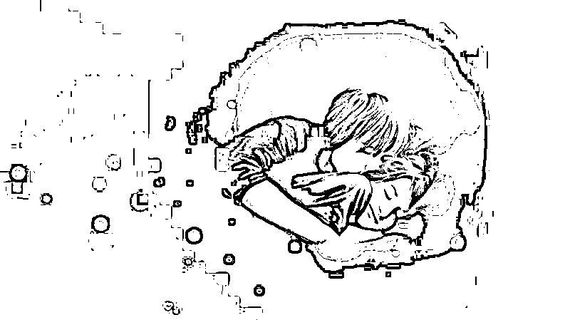
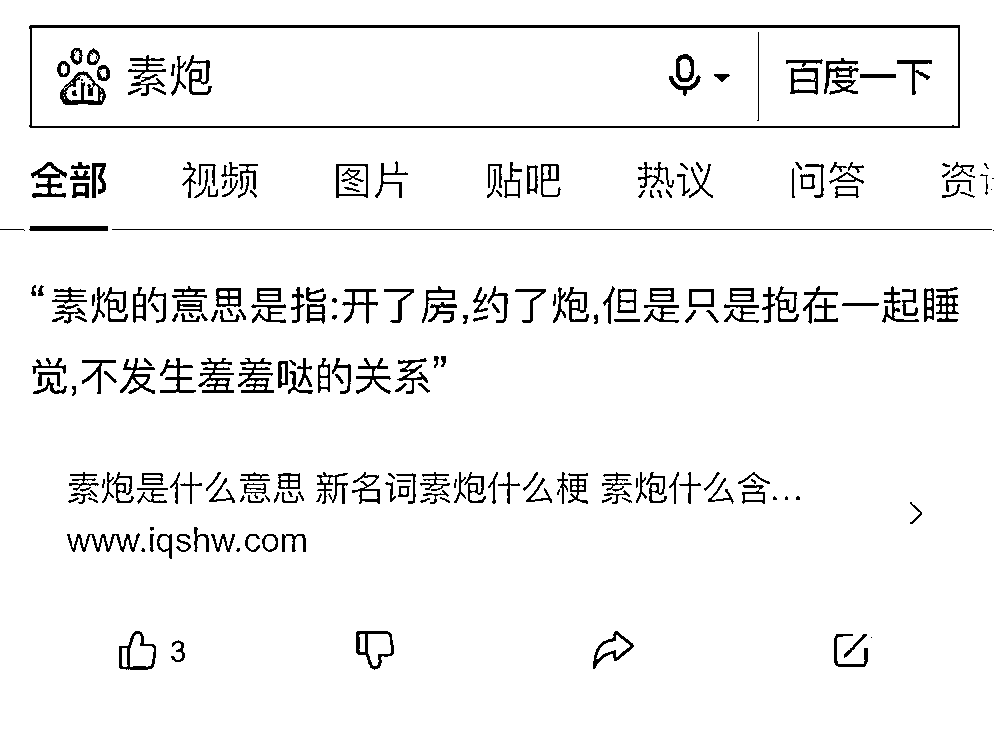
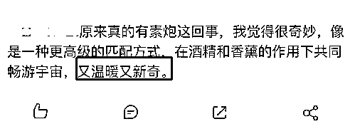
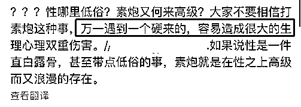
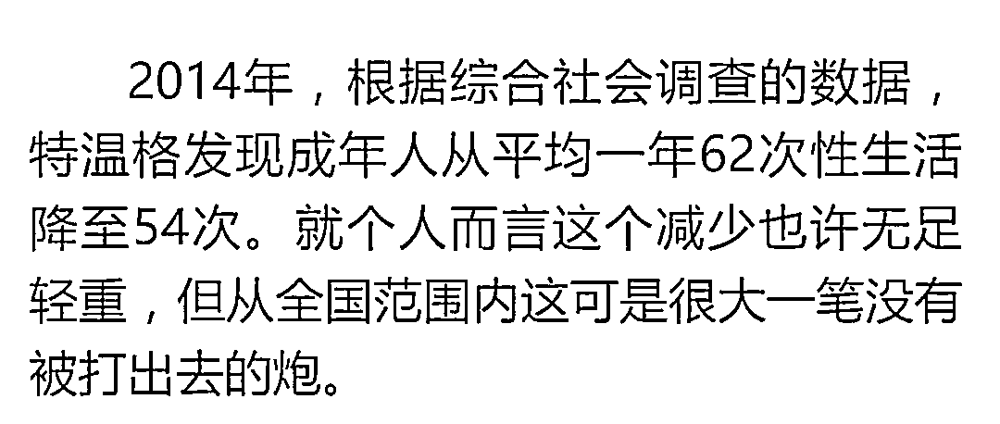
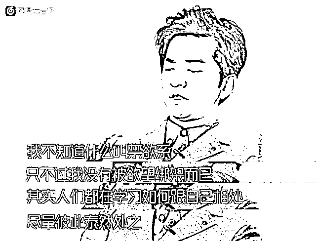
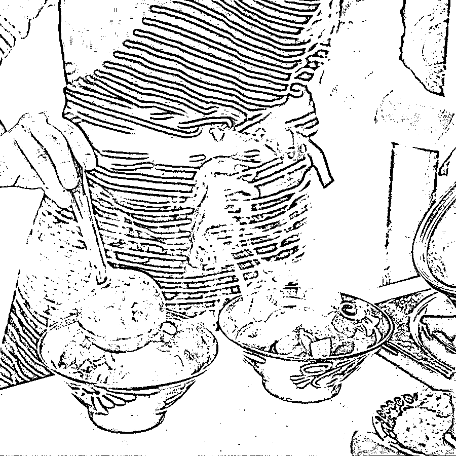

# 90 后流行“约素炮”：越来越多的年轻人正变得性冷淡

> 原文：[`mp.weixin.qq.com/s?__biz=MzIyMDYwMTk0Mw==&mid=2247501139&idx=1&sn=16e74e90007d96148998f880d3f2edae&chksm=97cb0e6ba0bc877daf50278292b003720654eb73be39b7e38588383e41a0f3d00062bbd0f20f&scene=27#wechat_redirect`](http://mp.weixin.qq.com/s?__biz=MzIyMDYwMTk0Mw==&mid=2247501139&idx=1&sn=16e74e90007d96148998f880d3f2edae&chksm=97cb0e6ba0bc877daf50278292b003720654eb73be39b7e38588383e41a0f3d00062bbd0f20f&scene=27#wechat_redirect)

**点击上方蓝色字体免费订阅“灰产圈”**

来源：木棉说（ID：mumianshuo）

# 

天朗气清，万里无云，突然间，晴空炸响惊雷，一道奇异闪电掠过长空，瞬间消散。　　流风城外的乱葬岗上，一处刚刚掩埋好的坟堆，突然伸出一只手。　　一个身穿补丁衣服的少年，从坟堆中艰难地爬了出来，双眸空洞，一脸茫然地望向四周。仔细望去，他的脖子上有着一圈淤青，似乎被人用力掐过。　　“这里是哪儿？” 　　“我明明还在宿舍里，通宵码字写小说啊。怎么会突然出现在这个鬼地方？难道是舍友的恶作剧？” 　　“等等！” 　　少年突然想起了什么，“我在码字的时候，好像外面响起了一道惊雷，一道闪电直接将我和笔记本电脑一块劈中。” 　　就在此时，少年的脑海开始剧烈的疼痛起来。各种记忆碎片，疯狂地用入脑海。　　“啊！” 　　少爷跪倒在地，抱着脑袋，发出一道撕心裂肺地惨叫声。　　这个身体的主人，名叫楚云帆，十六岁，孤儿。十六年前，被义父苏千河抱养回来，一直居住在流风城。　　楚云帆从小体弱多病，资质低下。被苏家的人看做是耻辱。虽然如此，但是义父苏千河，乃是苏家的嫡系子孙，楚云帆作为他的义子，可以享受一定的修炼资源。　　不久前，苏家召开家族会议，宣布一个月后，便是苏家本族的家族考核。凡是通过考核者，都可回归本族。　　流风城苏家，只不过是苏家本族的一条分支而已。苏家本族，乃是赤虎郡四大家族之一，无比强大。　　苏千河乃是嫡系子孙，楚云帆作为他的义子，拥有一块子嗣令，可以让参加家族考核。　　这让很多人眼红。　　终于，有人忍不住，对他下手了。　　记忆碎片慢慢的拼接，最终停留在了两张狰狞地面孔上。　　“没有想到你也叫楚云帆。”少年跪在地上，双手抱着头，苦痛的脸上，艰难地扯出一抹笑容。　　很显然，他穿越了，穿越到了一个和他同名同姓的人身上。　　“果然是和小说中的套路一样，一旦穿越，绝对要穿越在废柴身上。”楚云帆心中苦笑道。　　玄武大陆，以武为尊。所有的人，都会练武。　　楚云帆的资质非常差，已经十六岁了，修为才堪堪达到锻骨三重天，是个十足的废柴。　　玄武大陆，将修为境界化为分七大境界。　　分别是：灵旋、先天、紫府、灵动、通天、碎虚、问鼎。每个境界，又细分为九重。分别是一重天至九重天。　　而所谓的锻骨境，就是最基础的境界，是普通人迈向修士的过渡期。　　但凡资质不错的人，十六岁最少也是锻骨六重天、七重天。更有天赋妖孽者，十六岁已经成为灵旋境修士了。　　“楚云帆，我占用了你的身体，虽然很想替你报仇，但是无奈实力有限，帮不了你。” 　　“杀死你的那两人，虽然都只是苏府的下人，只有锻骨五重天的实力。但我根本不是对手。除非我有主角光环。” 　　楚云帆突然一愣，“对啊，我可是穿越者，我是主角！怎么可能没有主角光环！” 　　他搜遍全身，想找到传说中的金手指，但是连根毛都没有找到。　　“不应该啊，主角在穿越之后，要么会发现绝世功法，要么就是得到绝世神器，再或者就是身上的某个物件，会突然蹦出个老头。可是我身上，怎么什么有没有发现？难道我不是主角？” 　　“不对不对”楚云帆用力摇了摇头，闭上眼睛沉思。突然他脸上一喜。　　楚云帆在他的脑海深处，发现了一页粉色的纸张，上面画着一个纯白的图案，好似一个 W。　　“这个东西，怎么这么眼熟……”楚云帆心中，突然涌起了一丝不好的预感。　　当他的意识，触碰到粉色纸张时，异变突起。　　粉色纸张瞬间与他的灵魂融合，消散不见。　　“叮！” 　　一道轻微的声响，在楚云帆的脑袋中响起，把他吓了一跳。　　“恭喜宿主‘楚云帆’，绑定 WPS 文档系统。” 　　楚云帆愣了愣，看着脑海中熟悉的操作界面，忍不住爆出了粗口。　　“我艹！人家穿越异界，绑定的都是什么神级系统、无敌系统、升级系统，我特么竟然绑定的是，WPS 文档系统！我艹，没天理啊！” 　　WPS 文档系统，就是楚云帆前世写小说时，所用的文档系统。地球上很多人都在用这个文档系统办公，操作非常简单、方便。　　但是，这样一个文档系统，绑定它有卵用啊。它能加速修炼么？它能提供逆天功法么？它能让主角变得强大么？　　楚云帆心中暴怒，恨不得指天怒骂。　　过了一会儿，冷静下来的楚云帆屏气凝神，进入 WPS 文档系统。　　虽然它只是一个文档系统，但是楚云帆心中，还是抱有一丝侥幸心理。万一呢，万一这是个逆天系统呢？　　楚云帆的意识，进入 WPS 文档系统，看着熟悉的页面，心中顿时凉了半截。　　原本是一张空白文档，但是与楚云帆绑定之后，空白文档上，显示出了他的基础信息。　　“什么是任务完成度？”楚云帆皱了皱眉头，除了基本信息外，他还发现了复制、粘贴、删除、空白文档四个功能。　　这四个功能，都是 WPS 文档系统中，最基础的功能。　　“不对啊！”楚云帆突然意识到了什么。　　“复制、粘贴、删除、空白文档，这四个功能，都需要用鼠标进行操作，才能显示出来。现在怎么突然出现在功能栏了。” 　　楚云帆的意识，好像鼠标一样，点在复制功能上。关于它的信息，全都展现在楚云帆的脑海中。　　复制功能（一星）：任何黄阶低级功法、武技，都可使用复制功能，将其复制、记录下来。注：粘贴功能与复制功能，相互配套。宿主可以配套使用。显然，海无涯所受的伤势，已经非常严重。使得他连简单的传音，都进行不下去了。　　“海无涯前辈说，他只剩下两个月的时间了。这两个月的时间，一定要开启序列之战，进入战界。才能救出海无涯前辈！” 　　楚云帆双眉紧紧拧在一起，脑飞速运转，不断思索着对策。　　此时，神念连接断后，身处黑暗空间的海无涯。重重地咳嗽了几声。每一次咳嗽，都会伴随着一大口鲜血地喷出。　　此时的海无涯，双眸无光，一脸的虚弱。他的脸苍白无，原本魁梧的肉身，现在只剩下了皮包骨头。看不见一点血肉。　　海无涯的皮肤，布满了血色的神。闪烁着殷红的光晕。　　如果有人在这儿，会骇然发现。那些血色的神，像是成千万的虫子，竟然在海无涯的身涌动，抽取着他的生命精华！　　海无涯原本那身材魁梧的肉身，是被这血色神，生生吸成了现在这幅，皮包骨头的模样、 　　“以我现在的状态，最多只能坚持两个月的时间了。两个月之后，云帆若是不能开启战界。到时，我死不死都无所谓。但是，白虎帝君一定会沉睡苏醒，那将是三千大世界的灾难！” 　　海无涯眼露惊恐，浑身颤抖地说道…… 　　灵剑圣地内，楚云帆像是热锅的蚂蚁一般，在房间内来回踱步。　　“虽然现在，已经出现了九名神子序列。但是最后一名神子序列，谁知道多久才能出现。他若是两个月内出现不了，海无涯前别岂不是死定了。” 　　楚云帆的眉毛，紧紧拧成了一个川字。　　三千大世界，只有最顶尖的天才妖孽，才有资格成为神子序列。　　这样的天才妖孽，是几十年，乃至百年才出现一个，都很正常。　　“短短两个月的时间，怎么样才能让三大圣族，找到最后一次神子序列呢？” 　　突然，楚云帆的脑海，闪过一道灵光。　　“两个月时间，三大圣族肯定找不到，最后一个神子序列。既然如此，那我便送给他们一个。” 　　楚云帆立刻找到灵剑圣主。　　“圣主，我想引荐一名超级天才，加入我灵剑圣地。”楚云帆直奔主题道。　　“哦？此人是谁？天赋如何？”灵剑圣主感兴趣地问道。　　楚云帆躬身回答道：“此人名叫黑凰，乃是我的老师。他同样是一名系统者，体内绑定着强大无的剑之系统，和我灵剑圣地正好相符。” 　　“虽然我的老师，修为还没有达到圣王境。但是以他实力，对付圣王八重天、九重天的强者，没有任何问题。” 　　神子序列，必须是三千大世界内，最顶尖的天才妖孽。以系统者的天资，绝对可以达到要求。　　楚云帆之所以选择黑凰，是因为黑凰的实力，是他手下一众系统者最强的。　　楚云帆望着灵剑圣主，接着说道：“以我老师的天赋，绝对可以获得三大圣族的认可，闯过小战界，取得序列令牌，成为第十名神子序列。” 　　“这样的话，剔除我斩杀的段鼎峰。剩下的九名神子序列，我灵剑圣地独占两名神子序列，到时开启战界，进行序列之战的时候。我也有更大的把握获胜。” 　　楚云帆的话，让灵剑圣主眉毛一挑，眼光芒大放。　　“那人竟然圣子的老师，而且还是一名系统者？圣子赶紧邀请他，加入我灵剑圣地。本圣主一定好好培养他！” 　　对于楚云帆的话，灵剑圣主还是十分信任的。　　况且，正如楚云帆说的那样，如果九名神子序列，灵剑圣地独占两名的话。夺得神子之位的几率，将大大增加。　　“是，我这将我的老师接来。” 　　楚云帆躬身一拜，离开灵剑圣地。通过传送阵法，来到了玄武大世界外。　　因为超链接功能，每天只能使用一次。楚云帆今天已经联系过了海无涯，所以只能等到第二天，才可以联系黑凰。　　楚云帆在玄武大世界外，等了一天。　　第二天，他通过超链接功能，将所有事告诉黑凰。黑凰立刻动身，离开玄武大陆、玄武大世界。跟随楚云帆，来到了灵剑圣地。　　灵剑圣主亲自检测了，黑凰的体质后。笑容满面地说道：　　“你是圣子的师傅，让你成为圣地内，太长老或者是本圣主的亲传弟子，都不合适。” 　　“所以，本圣主决定。代我的师傅，一任圣主收你为亲传弟子，成为本圣主的小师弟，你可愿意？” 　　黑凰连忙跪地，行礼道：“师弟黑凰，见过师兄！” 　　“好好好！” 　　灵剑圣主一连说了三个好字，足以表明他内心的高兴。　　灵剑圣主立刻联系三大圣族，向他们汇报，灵剑圣地又出了一名绝世天才。　　当天下午，三大圣族的大长老，便来到灵剑圣地，检测黑凰的资质。　　“经过检测，灵剑圣地亲传弟子黑凰，天资卓越。可以得到，进入小战界的资格。” 　　天后圣族的大长老，开口宣布道。　　“灵剑圣主，三天之后你带着黑凰，前往天后圣族。到时，我们将为苏云，打开一个小战界。” 　　说罢，天后圣族大长老，便带着金鹏圣族大长老，和龙龟圣族大长老离去。　　三天后，黑凰在灵剑圣主的带领下，前往天后圣族，去闯小战界。　　虽然黑凰的修为，没有到圣王境。但是剑之系统，本是战力极强的系统。　　在剑之系统的辅助下，黑凰成功在小战界内，找到了序列令牌，成为了第十名神子序列。　　天后圣族大长老，当即向所有拥有神子序列的势力，宣布道：　　“按照帝君大人定下的规矩，十名神子序列全部出现。七天之后，我三大圣族将在白虎神庭内，打开战界。开启神子争夺战。” 　　“最终获胜的神子序列，将晋升成为我白虎神庭的神子，并将被帝君大人，收为亲传弟子！”

**-1-**最近看微博，学习了一个新名词，叫“约素炮”。俩人开房不发生关系，就是单纯的抱在一起睡个觉。这个词的起源是一个有男朋友的女生，和陌生男的在酒店开房，被熟人撞见后，她解释说自己仅仅只是约了个“素炮”。女生非常坦荡：“我是和他开房了，但我们没发生关系，只睡觉了。”男朋友显然对这个说法不够满意，觉得女生可能没有别的想法，但男的肯定“刹不住车”。一部分网友真诚的讨论了“约素炮”这个现象，觉得这个东西真实的解决了当代年轻人的某些需求：

# 

以般若智慧观照自心而获得解脱自在的菩萨，修行极深的般若智慧时，观察洞见到集聚构成人我的肉体，感受，思想，意志，心识等五种要素，是因缘相依的生灭关系。他的本质是空，而非实体的存在。菩萨因彻见这五种集聚的要素是缘起性空，所以脱离生老病死苦以及一切的痛苦。　　舍利弗啊！肉体以及一切的物质现象，不是真实的存在，不外乎是因缘相互依存的生灭关系，所以物质和空并无差别；而空和 物质二者在本质上也没有不同，因此空不异于物质。有人认为空是没有，物质是有，而菩萨以般若智慧观照彻见到物质就是空，空就是物质，犹如水和水波的关系，二者既是各别的，也是一体的。感受，思想，意志， 心识，同样也是如此。　　舍利弗啊！这五种集聚的要素，从它缘起性空的本质来说，它既没有生起或灭失，也没有所谓污垢或清净，更不会增多或减少。所以，在缘起性空的本质上，物质，感受，思想，意志，心识都不是真实的存在，而是空。人对外界的认识，需透过眼，耳，鼻，舌，身体，意识六种感官与物质，声音，香臭，味觉，触觉，其他一切事物及概念等六种外境，分别相对应而认知一切，这些都不是真实的存在，而是空。人的一切认识作用各有不同，包括眼，耳，鼻，舌，身体，心识，物质，声音，香臭，味觉，触觉，其他一切事物及概念，甚至于眼，耳，鼻，舌，身体，心识的识别作用共十八种，它们都不是真实的存在，而是空。　　不经由佛教导而独自开悟的缘觉圣者，因观照十二因缘而了悟，但菩萨以般若智慧照见十二因缘是缘起性空的，所以不论是导致生死轮回的主因无明；或是灭尽无明， 甚至于生，老，病，死，或是因灭尽无明而脱离甚至于生老病死，也都不是实体的存在。亲自听闻佛说法而证悟得声闻圣者，因观照四谛而了悟，但菩萨以般若智慧见苦，苦的原因，灭苦而解脱，灭苦的方法这四谛是缘起性空的，不是实体的存在。　　菩萨所证得的境界中，既不存有能证悟得般若智慧，也不存有所证得的境界，因为菩萨彻见一切是缘起性空的，一切是不可得 的，心不执著于一切。使自己及一众生都获得开悟的菩萨，由于修行可至生死彼岸的般若智慧，而通达空得真理，所以心中没有一丝牵挂及烦恼障碍；因而不恐惧生死，远离一切错误，不合理的思想，行为，妄想等等，终于达到寂灭无为的最高境界。过去，现在，未来三世一切佛，都是由于般若智慧，才能证得无上正等正觉而成佛。因此，由以上可得知般若智慧是具有不可思议力量的密咒，是可破除一切愚痴黑暗的密咒，是至上的密咒，是可达成涅磐妙果无与伦比的密咒。它能去除一切的痛 苦，灾厄，是真实不变的真议真议。因此，宣说般若智慧的密咒如下：去！去！去到生死的彼岸！与众生一起去到生死的彼岸！愿迅速同证正觉，获得大成就！                         

也有人理性地站出来表示担心：**约“素炮”的最大伦理问题，就在于安全性。**本来双方说好只是靠在一起睡个觉，万一其中男方反悔，女方的境地将变得非常危险。

但话说回来，在约“素炮”这个现象背后，最值得让人深思的是，越来越多的年轻人，开始过那种“不占有”的生活。

需要的个人物品越来越少，欲望越来越低，人也越来越佛系。不需要的东西，扔掉；复杂的人际关系，扔掉；疲惫的男女关系，扔掉。连性生活，也不想要了。他们需要的，仅仅只是打着折扣的陌生人的拥抱，来慰籍自己日渐冰冷的心。他们越来越倾向于那种简单的、不用过多参与的情感关系。**性冷淡，开始成为一部分疲惫的年轻人的常态。****-2-**在《低欲望社会》书中就阐述了年轻人们的状态：没有欲望、没有梦想、没有干劲，成了这代年轻人的写照。美国《大西洋月刊》发布了性生活报告：

> **从 90 年代后期到 2014 年，根据综合社会调查的数据，特温格发现成年人从平均一年 62 次性生活降至 54 次。 **

年轻人的欲望越来越低，越来越孤独。按理说，社会越来越发达，本该是所有年轻人欲望最繁盛的时代，因为获取什么东西成本都相对较低。我们再把视线拉近一点，我发现：**越来越多的人对更好的业绩没有追求，对更优质的生活没有渴望，甚至对整个人生都没有期待。**他们越来越宅，越来越去生命化，不社交、没有物欲，活得很丧也很低落。这就是典型的性冷淡。他们心里其实也很想过得好点，但好像很难去行动，心中攒不住那份热情。他们好像才 30 来岁，但人已将没有了活力。北野武说：“人这种东西啊，不管外表修饰得多么光鲜亮丽，剥掉一层皮后就只剩下了一堆欲望。”什么是人？**有欲望、有攻击性，充满活力的，才叫人。**
在合理的范围内，人因为有欲望，有渴望，有烦恼，才具有人性，才能舒展自我，活得更好。蔡康永在《痛快日记》中提到：

> **“没有欲望的人生，真是空洞的吓人。****文明向我们展示品味，这品味的功能，就是让我们得以分辨欲望是低劣的，或者是高贵的，却不是教我们变成没有欲望的人。****没有欲望，恐怕只能变得乏味，而不是得到智慧。”**

没有欲望的人，真的麻木没有人味儿。人类整体充满欲望，就是文明的来源，我们勤勤恳恳，用双手去争取，去获得，真的不要太好。就像一个电影里，女主想要走出大山，为家人带来更好的物质生活，她努力学习，凭借勤劳聪明，得到一切。她每次去上学都对着大山呐喊：**“我一定会赚很多钱，让家里所有人都过上好日子。”**欲望并不可耻，可耻的是你有想要实现的梦想，却告诉自己平凡可贵，什么都不想要。人应该学会和自己相处，就像李健说的这样。**适当的满足自己，不要怕占有，去活出自我。****-3-**黄磊曾在节目里晃晃悠悠地做着饭，平静幸福地说：

> **“我现在 46 岁，我想活久一点，让家人过得更幸福一点。大家都胖一点，我也胖一点，吃得多一点。”**

# 

以般若智慧观照自心而获得解脱自在的菩萨，修行极深的般若智慧时，观察洞见到集聚构成人我的肉体，感受，思想，意志，心识等五种要素，是因缘相依的生灭关系。他的本质是空，而非实体的存在。菩萨因彻见这五种集聚的要素是缘起性空，所以脱离生老病死苦以及一切的痛苦。　　舍利弗啊！肉体以及一切的物质现象，不是真实的存在，不外乎是因缘相互依存的生灭关系，所以物质和空并无差别；而空和 物质二者在本质上也没有不同，因此空不异于物质。有人认为空是没有，物质是有，而菩萨以般若智慧观照彻见到物质就是空，空就是物质，犹如水和水波的关系，二者既是各别的，也是一体的。感受，思想，意志， 心识，同样也是如此。　　舍利弗啊！这五种集聚的要素，从它缘起性空的本质来说，它既没有生起或灭失，也没有所谓污垢或清净，更不会增多或减少。所以，在缘起性空的本质上，物质，感受，思想，意志，心识都不是真实的存在，而是空。人对外界的认识，需透过眼，耳，鼻，舌，身体，意识六种感官与物质，声音，香臭，味觉，触觉，其他一切事物及概念等六种外境，分别相对应而认知一切，这些都不是真实的存在，而是空。人的一切认识作用各有不同，包括眼，耳，鼻，舌，身体，心识，物质，声音，香臭，味觉，触觉，其他一切事物及概念，甚至于眼，耳，鼻，舌，身体，心识的识别作用共十八种，它们都不是真实的存在，而是空。　　不经由佛教导而独自开悟的缘觉圣者，因观照十二因缘而了悟，但菩萨以般若智慧照见十二因缘是缘起性空的，所以不论是导致生死轮回的主因无明；或是灭尽无明， 甚至于生，老，病，死，或是因灭尽无明而脱离甚至于生老病死，也都不是实体的存在。亲自听闻佛说法而证悟得声闻圣者，因观照四谛而了悟，但菩萨以般若智慧见苦，苦的原因，灭苦而解脱，灭苦的方法这四谛是缘起性空的，不是实体的存在。　　菩萨所证得的境界中，既不存有能证悟得般若智慧，也不存有所证得的境界，因为菩萨彻见一切是缘起性空的，一切是不可得 的，心不执著于一切。使自己及一众生都获得开悟的菩萨，由于修行可至生死彼岸的般若智慧，而通达空得真理，所以心中没有一丝牵挂及烦恼障碍；因而不恐惧生死，远离一切错误，不合理的思想，行为，妄想等等，终于达到寂灭无为的最高境界。过去，现在，未来三世一切佛，都是由于般若智慧，才能证得无上正等正觉而成佛。因此，由以上可得知般若智慧是具有不可思议力量的密咒，是可破除一切愚痴黑暗的密咒，是至上的密咒，是可达成涅磐妙果无与伦比的密咒。它能去除一切的痛 苦，灾厄，是真实不变的真议真议。因此，宣说般若智慧的密咒如下：去！去！去到生死的彼岸！与众生一起去到生死的彼岸！愿迅速同证正觉，获得大成就！                         

**欲望，就是幸福生活的底色，有欲望有渴望的生活，才会有期待，才会有美好。**
纪录片《二十二》里面，90 岁的老人还说：**“这世界红红火火的，吃野东西都要留出这条命来看。”**老人活过半个世纪，他们懂得生命的真谛就是层层叠叠的欲望，交织成喜怒哀乐，让人感受到爱、感受得到、感受失去。欲望让人真正的活着，没有欲望，就是一具行尸走肉。 很多人或许是太害怕求而不得，所以连努力都不做，静静地看着一切，然后自己枯萎。**其实大可不必，这世界哪有什么定数，请你不要太悲观，想要什么就努力争取，只有拼命向前，才真的有机会得到啊。**世界真的很美好，请你不要太“性冷淡”，活出自我，尽你所能。来源：木棉说（ID：mumianshuo）幸福小酒馆

← 向右滑动与灰产圈互动交流 →

**点击****阅读原文****加入灰产圈高端社群**

