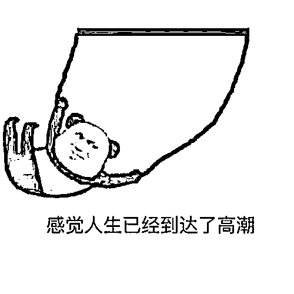
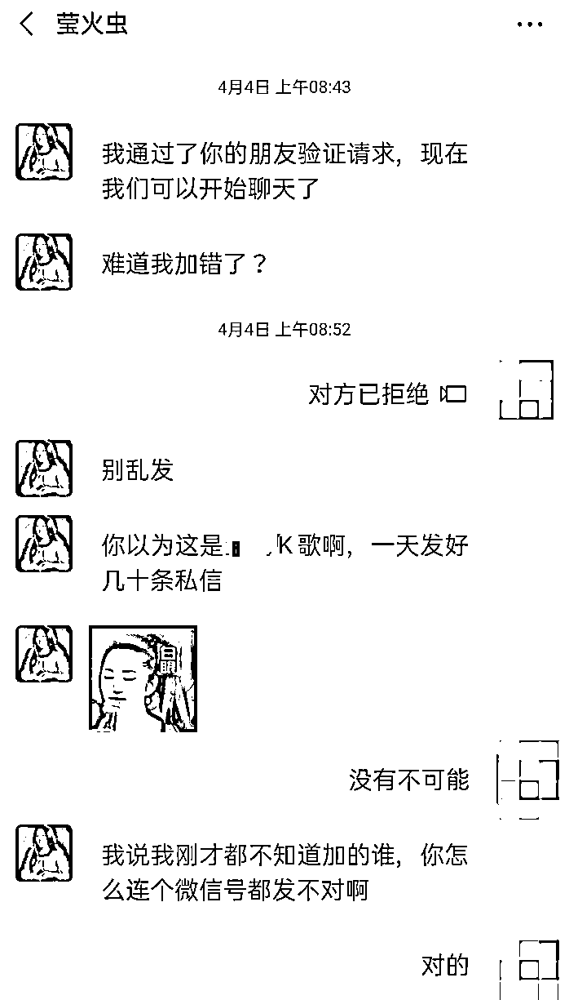
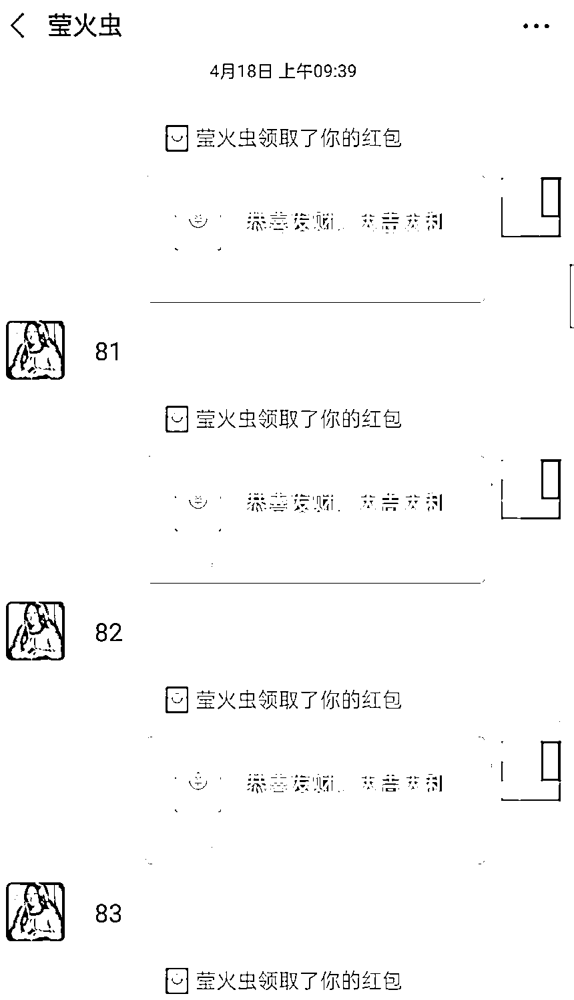
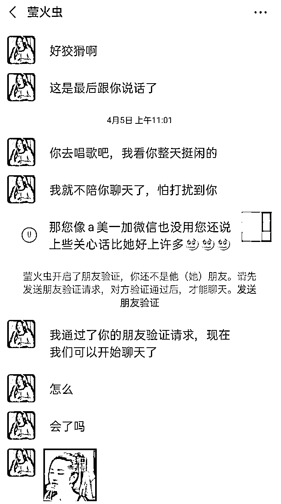
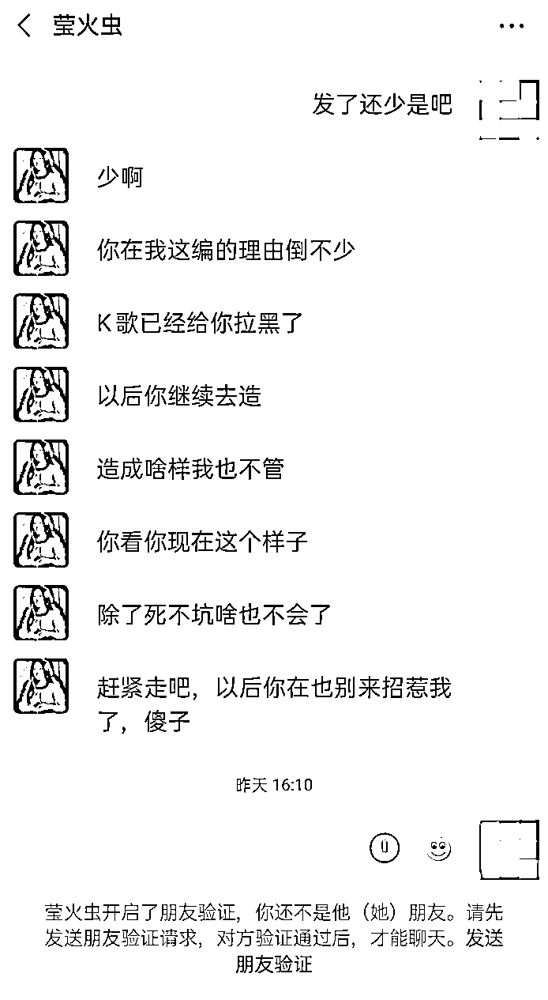
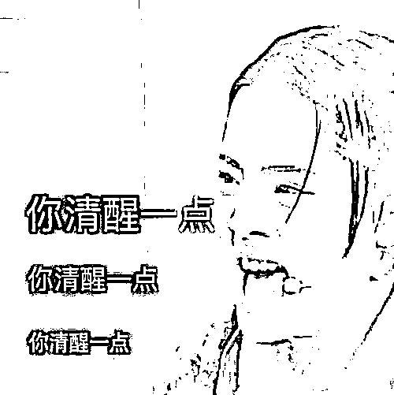
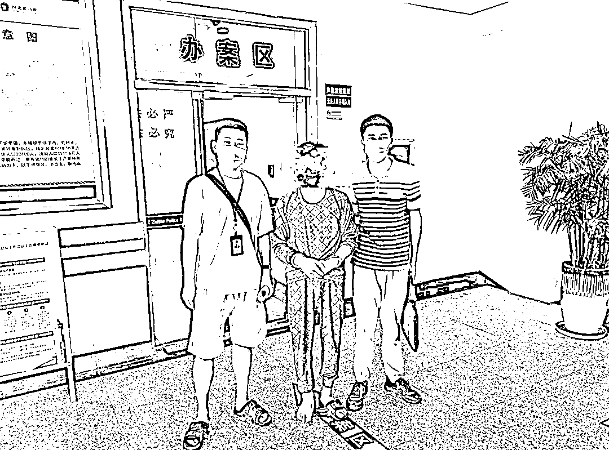

# “女艺人”主动私聊，抱怨工作太累？

> 原文：[`mp.weixin.qq.com/s?__biz=MzIyMDYwMTk0Mw==&mid=2247501139&idx=2&sn=906ec51a9aa9844864eea6b5c26ddcaa&chksm=97cb0e6ba0bc877d20a472aa39ef8ebc5a8979a487cfc26c1ab36d4eb101545e0d34434bacae&scene=27#wechat_redirect`](http://mp.weixin.qq.com/s?__biz=MzIyMDYwMTk0Mw==&mid=2247501139&idx=2&sn=906ec51a9aa9844864eea6b5c26ddcaa&chksm=97cb0e6ba0bc877d20a472aa39ef8ebc5a8979a487cfc26c1ab36d4eb101545e0d34434bacae&scene=27#wechat_redirect)

**点击上方蓝色字体免费订阅“灰产圈”**

每个追星族

都会有这么一个梦想

“能见见喜欢的明星就好了！”

如果你喜欢的明星、偶像

主动来找你聊天

简直是追星史的巅峰时刻

  

近日有一男子

就收到了自己喜欢的女明星的私信

没想到这不是美梦成真

而是噩梦的开始……

↓↓↓

因疫情影响

来自安徽省芜湖市的何某
未外出打工

平时喜爱唱歌的他

为打发时间在某 K 歌 APP 唱歌 

何某不仅自己唱

还在该平台上看各大当红主播唱歌

遇到主播需要冲榜 PK

他也会慷慨解囊

短短两个多月时间给主播打赏 3 万余元

如此大方的他，被盯上了...

  

 今年 4 月初

何某收到昵称为“杨钰莹”的私信

△杨钰莹，被称为“甜歌皇后”

**“杨钰莹”私聊何某做什么呢？**

“杨钰莹”指责何某

不应该给那些主播们打赏

让何某不要把钱花在

这些虚无缥缈的东西上面

并且主动要求添加了何某的微信

何某见对方使用的

昵称和头像都是“杨钰莹”

以为真成为这位女明星的好友

兴奋不已

遇到熟人便会炫耀一番

刚开始时

**“杨钰莹”对何某嘘寒问暖**

**偶尔还会夸赞何某歌唱的不错**

并传授何某歌唱技巧

何某对这位明星身份深信不疑

四月中旬

这位“明星”以让何某请吃饭为由

发几个红包给她意思一下

何某认为这么个大明星

平时对自己很是照顾

发几个红包给她也是应当的

**于是**

**何某连发了 13 个 200 元红包给对方**

 收到红包的明星

对何某的态度更好了

亲切的称何某为“我们家的老何”

让何某萌生了

与“杨钰莹”见一面的冲动  

于是，何某要求与其视频通话

对方也爽快答应了

**但要何某表示诚意**

**发送 100 个 200 元的微信红包**

为了凸显诚意

何某将 2 万多元

全部存进了银行卡

用于给对方发红包

**结果没想到的是...**

4 月 17 日，对方在微信上让何某证明诚意，何某发红包，对方数数，直到第 100 个 200 元红包发送完毕，**对方以何某发错表情包，惹其生气为由，让何某追加 20 个红包道歉，否则拒绝与何某视频语音。**

何某只得硬着头皮追加诚意红包

在发到第 115 个红包时

何某的银行卡中余额不足

对方责怪何某故意惹她生气

没有诚意并将其拉黑

然而十余天后

**“杨钰莹”又主动将何某加为好友**

**并主动与何某聊天**

何某仍然没有放弃见一面的想法

于是再次提出视频语音邀约

对方答应了何某

约好了晚上 10 点视频聊天

约定视频聊天的时间一到

“杨钰莹”便发来消息抱怨工作太累

需要何某的红包来安慰

何某声称自己已经没钱

疫情期间自己也有没有工作

给她发红包已经花掉了自己的积蓄

**对方以何某小气为由**

**拒绝了与其视频聊天**

  

何某一看对方生气了

就把仅剩的几千元钱

以红包的方式全部发给了她

此时对方不仅没消气

反而更生气了

责怪何某为什么要骗她，惹她生气

随后将何某拉入了黑名单

**两次被“杨钰莹”拉黑的何某**

**终于意识到自己可能被骗了**

就在他到无为市公安襄安派出所报案时

向民警发出灵魂拷问：

**为什么“杨钰莹”那么真实**

**两人还在 K 歌平台上一起拍了合唱视频**

**怎么会是假的呢？  **

  

经过警方调查“杨钰莹”

**不但是假的还是个男的**

经过缜密侦查，无为警方基本掌握了冒充“杨钰莹”实施诈骗的犯罪嫌疑人姚某（男）活动轨迹。7 月 7 日，办案民警前往浙江湖州进行抓捕，在当地公安的协助配合下，成功将涉嫌诈骗的犯罪嫌疑人姚某抓获归案。目前案件还在进一步办理中。

哎，就当是一场梦

别再轻信网络上的

美女帅哥主播、明星歌手

私聊自己想交朋友

多半是看上你“人傻钱多”****

来源：广东公共 DV 现场 Police

← 向右滑动与灰产圈互动交流 →

**点击****阅读原文****加入灰产圈高端社群**

