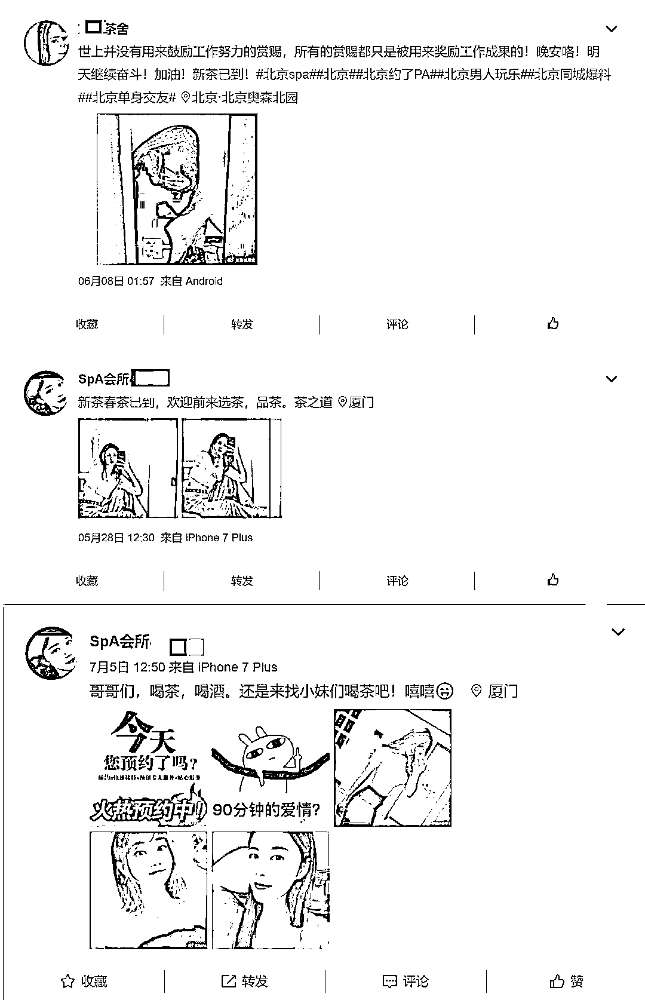

# 为什么处罚了 2 万多个涉黄黑产账号后，他们依旧活得很好

> 原文：[`mp.weixin.qq.com/s?__biz=MzIyMDYwMTk0Mw==&mid=2247501139&idx=3&sn=61e9d7046d2d85873e7413fd4c21f057&chksm=97cb0e6ba0bc877d1bb5be4eb34d6deb1dbab177d89e203146bb4f85d2875775f7de306650f3&scene=27#wechat_redirect`](http://mp.weixin.qq.com/s?__biz=MzIyMDYwMTk0Mw==&mid=2247501139&idx=3&sn=61e9d7046d2d85873e7413fd4c21f057&chksm=97cb0e6ba0bc877d1bb5be4eb34d6deb1dbab177d89e203146bb4f85d2875775f7de306650f3&scene=27#wechat_redirect)

**点击上方蓝色字体免费订阅“灰产圈”**

依赖各大互联网平台流量生存的黑产，将“AARRR”转化漏洞模型用到了极致，也将小步快跑的迭代思维在实战中发挥得淋漓尽致。

曾经在微博、抖音、百度、微信上见过有人聊“新茶”“喝水”“喝茶”，文字下的配图中却是一个个年轻的姑娘，就算用显微镜也找不到一片茶叶。

“喝茶”“喝水吗”“新茶已到”，已成为色情行业引流获客的重要暗语，经常出现在微博、微信、抖音、百度等各大主流 APP 中。

近日，郑州警方、中山黄圃警方、梧州市警方、安徽宿州市警方接连打掉数个涉黄违法犯罪团伙，而这些天南海北犯罪窝点有一个明显的共通点——**组织者通过线上获客，导流至线下完成交易，形成了一条 O2O 招嫖涉黄产业链。**

值得注意的是，**这些或打擦边球或涉黄的黑产，仿佛学了乾坤大挪移，总在各大平台辗转腾挪。**

*（随手搜索“新茶嫩茶”关键词出现首条链接截图）*

1

从抖音、微博，到微信、闲鱼，再到微博

2019 年 11 月，郑州警方打掉一个网络招嫖团伙，抓获犯罪嫌疑人 20 多人，揭开了网络“喝茶”的神秘面纱——**原来很多时候在网上与人搭讪，“喝茶”和“茶叶”并非指常说的“喝茶”和“茶叶”，它们跟“你今天来喝茶吗？”“最近茶叶怎么样？”“最近有新茶”等一起成了网络招嫖暗语。**

在这则新闻消息后，我们再尝试在多个平台搜索类似关键词，会出现什么情况呢？**在抖音搜索“新茶模特”后，综合版块中就会出现不少相关推荐的视频。**其中名为“依依”的用户，其视频中的文案就足够露骨和直接。

*（抖音搜索新茶模特相关截图）*

点开用户信息后，能发现在个人介绍中写着：微信不回，红氏足道 88 号，微信：ZH……

我们对显示的微信号进行了检索，找到了一个名为“惑乱倾山河”的微信用户。从**微信显示的地区来看，该用户位于广东汕头，其头像与抖音一致。**

在地图中进行查找发现，广东汕头也确实有一家名叫“红氏足道养生”的门店。

**事实上，被这类“牛皮癣”缠上的平台，并非抖音一家。**

**在微博搜索“新茶已到”后，出现多个涉嫌涉黄的招嫖信息。**与抖音有所区别的是，微博上的招嫖信息还会带上相关的话题和打擦边球的关键词，如#SPA#、#约了 PA#、#男人玩乐#等，同时微博还会配上坐标位置，以便“同城服务”。

**点进微博主页后则能发现，这些账号会在个人介绍签名中标注地区和联系方式，联系方式多为 QQ 或微信。**

而在这些招嫖信息中，**有不少用于发布露骨文案的微博账号，为黄 V 认证。**

如话题#北京单身交友#，截止发稿前已累计阅读 814.8 万，讨论 2.3 万，话题主持人为“重庆女神交友”，官方认证的身份是“宁波威旗汽车销售服务有限公司法人代表周军”。

从企查查查询发现，这位周军名下关联的企业有三家，其中宁波威旗汽车销售服务有限公司，注册地在浙江，目前状态已注销。

从 2017 年之前发布的微博来看，这位周军的内容主要集中在生活工作分享、足球、吐槽、吃瓜，甚至还花了 1 元围观了王思聪的回答。过去发布微博内容图片中的水印为“我系军军军军军军”。

**怎么看，都是一个好久没上微博，被盗了号而不知的路人。**

事实上，“**大号做招牌，小号当炮灰，大小号之间互为宣传，保持粉丝不掉队**”，早就成了在微博上发布淫秽色情信息的“潜规则”。

这些或盗或新注册的小号，禁封后，换个名字和马甲，依然可以继续营业。**如不断提到的微博老酒馆等你在被封后，换了个号，并改名为“烟火里等你”。**

与此同时，在#北京单身交友#话题导语部分的内容，吸引了我们的注意：“**交友公重号：老酒馆里等你，weibo@老酒馆等你。**”

顺着这些指向微信、微博的信息，我们发现，微博老酒馆已因投诉已无法查看，**而微信公众号中则能找到两家，分别为“热气球里等你”和“老酒馆等着你”。**

其中“热气球里等你”5 月 16 日注册后便发文，认证企业名为“五指山畅好翰晨网络科技工作室”。企查查显示，该公司经营者名为杨封云，今年 5 月 6 日成立，所属地在海南。而另一号为个人号。

这两个公众号中，在注册成立至今都只发了一篇题为《很高兴你能来，我也不遗憾你离开》的推送。**两篇推送的内容一模一样，在文章的末尾，以性别为区分，加上了两则联系方式。**

于是，我们又找到了两个微信号，女生专用的在个性签名中标注了：此号女生号，男加拉黑。5 年深耕靠谱智商。微博@老酒馆等你。男生专用的则在个性签名中标注了：频繁咨询+扣：3187143799；老酒馆等你，入会收费。

从微博推送的消息来看，**这一涉黄平台，主要的盈利模式为针对男性收取入会费。**

从店铺关联的闲鱼号信息来看，这家店的老板，还有一个新浪微博，名为森下的川。而微博上，恰好有一个名为“森下的川”，粉丝数为 11 万多的用户认证为“财经博主”。

从微博到公众号，到闲鱼，我们又绕回了微博。

而这里涉及到实名认证的，也出现了一个可能被盗号的周某，一个在海南的杨某，和一个自称现居嘉兴懂社群运营和理财投资的财经博主。其中，涉及到的变现方式，包括了会费、情趣用品、闲鱼二手买卖等，暗语更是包括新茶、spa、单身交友等。

其中，哪些是被盗号的，哪些是真实使用者，单从某一个平台来衡量，难以判断。

上述案例只是冰山一角。

2

流量隐秘角落的黑色生意

2019 年 7 月，微博公布“蔚蓝计划”最新成果时，也表示：有涉黄内容诱导用户流向微信并最终实现交易。“针对利用涉黄低俗内容、打擦边球、制造噱头博取关注，向其他平台引流或产业化获取不正当利益的高粉丝量账号，微博持续加大处置力度。截至目前，共关闭、处罚相关账号 6.4 万个，其中粉丝量在 10 万至 100 万的账号共 67 个；粉丝量在 100 万以上的账号共 8 个。”

这里的“涉黄内容诱导用户流向微信并最终实现交易”，**主要指的就是通过发布涉黄或擦边球内容，向微信公众号导流，并在此通过付费模式收取“小黄文”的阅读权限。**

**黑产的多平台横向联动运营，不是个案。**

事实上，精明的涉案人员，利用各平台的不同特质和属性，在产业链中扮演不同的角色

如，刚才我们发现的模式十分明确：**从微博、抖音、百度这类广场式平台，引流至微信、QQ 这类客厅社交平台，最后在较为隐蔽多级跳转间，链接至闲鱼等交易平台，最终通过支付宝、微信支付完成付款交易流程。**

 “AARRR”这 5 个字母，分别对应用户生命周期中的 5 个重要环节。即 Acquisition*（获取用户）*、Activation*（激发活跃）*、Retention*（提高留存）*、Revenue*（增加收入）*、Referral（传播推荐）。

从以上隐藏在流量平台中的黑产来看，**他们将各大平台产业链中扮演的角色做了明确的定位，哪些是入口，即用来获取用户的，哪些是出口，即用来变现的，还有哪些可以用来刺激下一次消费的。**

据了解，色情引流账号在各大平台的引流方式有两种。

**一是，直接在平台流量大的地方发放引流地址，导流至站外色情网站、色播 app、赌博网站等。**

这类多出现在热搜的热门评论下，最终导向独立的付费或诈骗网站，形成闭环。值得一提的是，现在黑产用小号抢占热搜热门评论楼层，是迭代后的新模式。微博专项整治前，热搜底下的评论是黑产的重点资源位。

**二是，在流量大的地方先引流至个人主页，再利用个人主页中的用户资料、UGC 内容等方式发放引流地址。**

例如在热度比较高的微博、帖子、短视频下面，发出吸引人眼球的正常评论内容，并通过团伙作弊的方式使得评论热度上升，吸引用户点击进入账号的个人主页。此类引流方式较为隐蔽，导流分为两步走：先将流量引流至个人主页，再将流量引流至站外。

从上数引流方式可发现，**在历经多次打击后，黑产的反侦察能力也在逐步增强。**

**跨平台多次跳转、产业链化、产品多元化、分工协作明确、组织体系小微复杂**，都是黑产在逐步对抗平台禁封手段中演变迭代出的趋势。

而这种演变的反侦察的核心手段就是跨平台。事实上，除了上述提到的微博、抖音、微信、百度、闲鱼等平台外，喜马拉雅、网易云音乐、荔枝 FM、Soul、小红书等 APP 都曾因此分别被采取了约谈、下架、关停等阶梯处罚。

上述曾被处罚的平台，也多是黑产中的一环。

如果说最赚钱的方式都在刑法上，那最有效、最接近用户的运营方式，一定在互联网黑产，背后的共通点是高风险、高收益。

2017 年上海静安区某会所被查，轰动一时，被称为“上海最大卖淫案”。

2017 年 8 月 10 日晚间的这次抓捕行动，有关部门决定一窝收网。数据显示，仅在当天，公安机关就在会所缴获营业款人民币 8239398 元、港币 226920 元以及其他不同金额的外币。

收益可见一斑。

3

这不是猫和老鼠的游戏

先来看看近几年平台为了清楚此类问题，做了什么。

2019 年 7 月，小红书曾联合公安刑侦力量共同“打黑”，跨广东、福建、山东、上海四省市，协助捣毁重大刷量黑产窝点。2019 年第四季度，小红书继续与上海警方紧密配合打击黑产，实现了国内首例针对刷量黑产团伙的抓捕。此外，通过智能算法技术和精准追踪，小红书向执法机构成功举报并捣毁了十几个黑产网络服务站点。

阿里本地生活 2019 年全年配合公安机关打击黑灰产案件超 290 起，查处近 400 人；抖音在过去 3 个月推“啄木鸟 2019”行动，拦截虚假刷量行为 4.6 亿次，刷量黑产账号直接封了 171 万个。

2019 年 10 月开始，抖音开始了“啄木鸟 2019”行动。字节跳动安全中心称，截至 12 月 31 日，“啄木鸟 2019”行动共封禁抖音账号 203 万个，其中粉丝超过 100 万的大号 293 个，10 万粉以上的账号 4638 个，涉嫌黑产等活动的账号 17089 个。

此外，针对刷点击刷粉等黑产，抖音举报相关网站 113 家，拦截相关账号注册请求 9199 万次，拦截刷赞刷粉等请求 5.51 亿次。

7 月 6 日，抖音发布了一则《打击网络色情、黑产专项行动公告》，公告中指出：有用户利用抖音账号昵称、签名、视频评论等功能，发布色情内容或色情招嫖广告信息。经核实，相关涉嫌违法犯罪的行为都是社会上的黑产团伙诱导用户添加其微信、QQ 等社交软件帐号，并在这些社交平台上最终完成了对用户的交易、诈骗。

同时还公布，通过对犯罪分子不断变化的犯罪、作弊手法的监控和分析，抖音安全中心升级完善技术模型，6 月期间共永久封禁 27114 多个传播色情、黑产信息的帐号。

今年 4 月 30 日，微博公布了为期两个月的内容生态治理专项行动“蔚蓝计划”，两个月内，共治理重点位置的内容*（包括热门微博主贴和色情低俗相关信息）*约 26.5 万条 ，处罚相关账号 2.3 万个，其中高粉丝量账号 225 个。在打击明星黑粉方面，共处罚黑粉用户 164 个，处罚售卖明星隐私账号 441 个。在打击黑产方面，平台主动拦截和清理黑产信息约 1130 万条，接到网友和监督员巡查举报处置黑产信息约 710 万条。

现实是，**在微博处罚了 2.3 万个涉黄账号后，依旧还能直接从平台上搜到或擦边球或涉黄招嫖的信息；在都抖音刚集中处理 2 万多个账号后，依旧还能通过“新茶已到”这类隐秘的暗语，继续做着招嫖引流的 O2O 生意。**

各大平台重拳出击下，为何还屡禁不止？

我们回到这些互联网流量平台中的招嫖组织。

参与破获“10.08”涉恶涉黄网络犯罪团伙案的长沙市公安局刑侦支队专案组民警胡紫星，介绍说，该犯罪团伙分三个层级：“顶层是以招嫖平台为主，包括招嫖平台的老板、键盘手、聊单手和技术员，主要是为了物色招嫖的对象；第二层是以地区负责人为主，他们负责从上线接招嫖的单，然后再下派给底层的人员；底层由卖淫小姐、司机还有护嫖的‘马仔’组成，接单之后就到各个酒店的房间。”

而线上获客引流的平台一个在黑龙江，一个在贵州，在两个平台操控下，操控了 40 多名技术员和“聊单手”——**这一足以媲美不少创业公司规模的涉案组织，在这条产业链中，做的仅仅是获客和引流部分。**

**这不是一场猫和老鼠的游戏：你跑我抓。**

平台禁封后，重新注册换个新号继续纳入组织架构，依样画葫芦，其成本并不算高。目前来看，单一平台就算下足了功夫，进行了严厉的处罚和禁封，效果依旧有限的主要原因便在于此。

预防胜于治疗，网络环境、平台环境的健康与否也在于预防。各大平台联合，提高犯罪成本，阻断他们在各大平台的流量合流动作，或许是相对可行的办法之一。**这是一场持久战，更是一场团体战。**

← 向右滑动与灰产圈互动交流 →

**点击****阅读原文****加入灰产圈高端社群**

