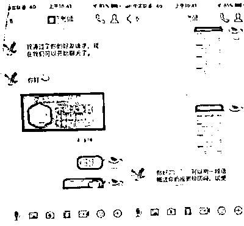
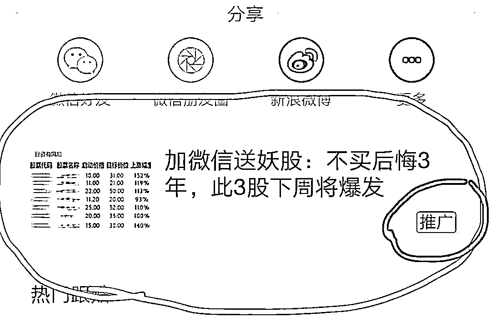
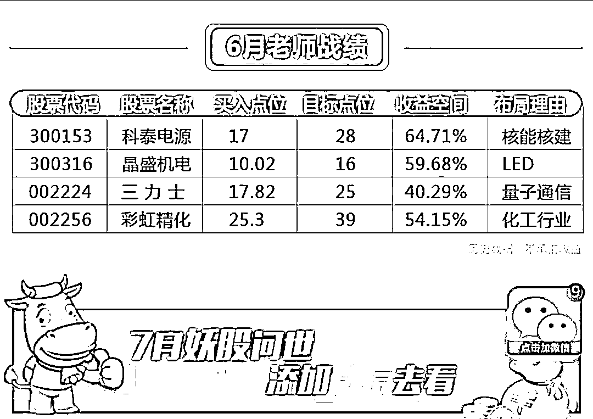
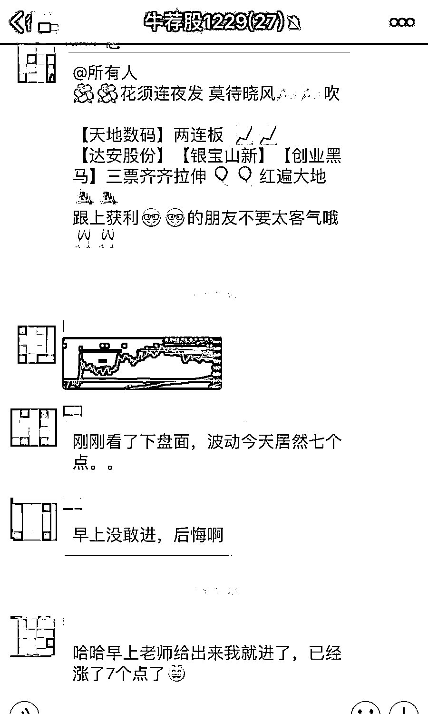
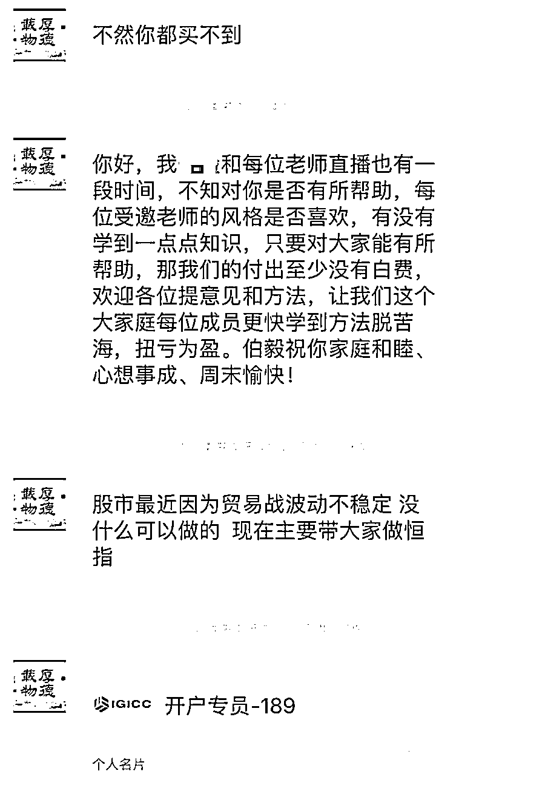
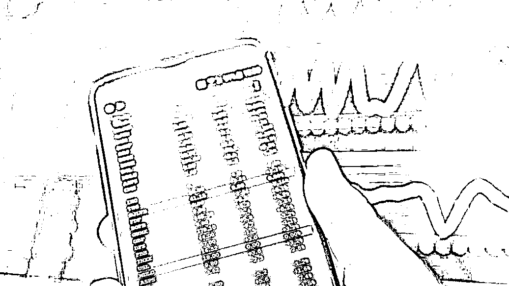

# 尽快退群！

> 原文：[`mp.weixin.qq.com/s?__biz=MzIyMDYwMTk0Mw==&mid=2247501139&idx=4&sn=f082ec991eeb9d4bced9d4e3e112df6a&chksm=97cb0e6ba0bc877d6e7d1fe4f358b1a20a840d23f38a5b1a64256b3467788b95e89f4068527c&scene=27#wechat_redirect`](http://mp.weixin.qq.com/s?__biz=MzIyMDYwMTk0Mw==&mid=2247501139&idx=4&sn=f082ec991eeb9d4bced9d4e3e112df6a&chksm=97cb0e6ba0bc877d6e7d1fe4f358b1a20a840d23f38a5b1a64256b3467788b95e89f4068527c&scene=27#wechat_redirect)

**点击上方蓝色字体免费订阅“灰产圈”**

最近股市上最热的字就一个：牛随着行情的爆发点燃了股民的参与热情

网络社交平台上的一些“荐股黑群”开始活跃

群内所谓的“庄家”“大 V”进行忽悠式荐股

「荐股诈骗」也随之而来

先看看这个案例

**  01 **

今年 3 月，常州的田女士（化名）收到一条微信好友申请，对方自称是某炒股授课学校的助理，可以介绍田女士进班学习，起初田女士仍将信将疑，但禁不住对方的“试听”邀请，开始“看直播学炒股”，就这样学习了一个多月，田女士在对方推荐的某投资平台开通了账户，对方要求田女士将钱转到他们指定的银行卡，由他们向平台内进行充值，每当平台显示小有收益，授课老师就会让田女士“买进加仓”，没过几天，田女士“充值”的 55 万元竟全部亏损！对方却仍然要求买进，田女士这才发现被骗。

** 02** 近日，深圳的刘先生被拉进一个炒股交流群，当时交流群中的人经常提到某信托平台。刘先生在网上查询后，发现该平台确实存在，于是便在平台上注册账号。了解到投资后会有五倍的盈利时，想要多赚钱的刘先生很快花 300 万元在该平台投资了一只股票。之后，他跟投了 20 万。本以为很快能赚得盆满钵满，不料平台却突然显示无法交易，投入平台的钱也无法取出。紧接着，刘先生便发现自己被移出群聊。意识到自己掉入了骗子的圈套，刘先生急忙报警。**03**“41 人的荐股群，40 人是‘托儿’，就我是‘韭菜’。”投资者顾某被上海嘉定警方告知，他差点被骗得血本无归。

顾某称，他被网上认识的“炒股大师”拉进了荐股群，“大师”强烈推荐顾某充值 10 万元，加入炒股“战斗营”赚大钱。

据警方调查，顾某所在荐股群内，仅他一人是真实投资者。另外，“大师”推荐的炒股 APP 也被动了手脚，其显示市场信息会比真实市场滞后 1 至 2 分钟，这让“大师”的涨跌判断几乎百发百中。

“荐股诈骗”是反诈界的行话其实就是“通过推荐股票来进行诈骗”之意大概有三种类型第一种：卖会员

骗子通过购买一些股票开户人的信息，随机分成若干组，并向这些人发送股票上涨信息。比如把 1000 人分成 100 组，每天选取 100 个有上涨潜力的股票分别推送给这 100 组人，总有几个组的人每天接到的都是股票上涨的信息，进而对骗子的“专业性”深信不疑，便要求交钱开通高级会员。其实骗子都是瞎蒙的，会员和非会员没什么差别。 

第二种：炒软件

这种方式很多人都遇到过，骗子通过各种手段推荐所谓“牛股”、“黑马”等预测软件，开始会让免费试用。一旦有人使用后受到损失，就说软件版本不够高，需要升级才行。等缴纳了高额升级费以后发现，还是一样。毕竟中国的股票，是没有任何一个人能够向他承诺的一样“神预测”的。 

第三种：假平台

这是当前荐股诈骗的最高级手段。诈骗团伙通过各种平台筛选目标，搭建一个虚假股票交易平台后迅速把目标拉进微信群。为了获得受害者信任，他们往往会建一个数十人的微信群，专门蛊惑一个投资人，把虚假的平台推荐给受害者，把跌率较高的股票推荐给受害者。利用投资者越亏越想回本的心理，蚕食受害者的资金。等到资金差不多耗尽时，他们再以平台维护为由，强制结束交易。

**假平台荐股诈骗的主流套路**

一般说来，目前这些假平台的“身份”其实并不假，他们不但都注册了正规的公司，还招聘了诸多业务员（有很多是刚毕业的大学生），同时还有严格的培训、管理制度和绩效考核。他们是如何开展工作的呢？

0 1**推广引流**

无论什么骗局，都要吸引人入局才有可能成功。他们推广引流的方式我想你一定见过。 

比如在各大门户网站、手机 APP、电视台、广播电台、报纸做广告、写软文、搞推广。

你一不小心点进去，就是老师牛到令人发指的战绩，收益低于 50%都算差的，但无一例外，并在下面留下一个联系方式，引诱你添加。

还有一种，就是从号商处购买大量“美女”账号，用一些群控工具添加你为好友。可以通过手机号成千上百地批量加好友，还能任意定位添加好友，哪怕有 0.1%的人通过，数目也非常可观。

0 2 忽悠洗脑在添加了你为好友之后，他们紧接着就会把你拉到一个小群（一般 30 人以下）。请放心，这个群除了你，基本都是公司的业务员，也就是骗子。有的骗子扮演股票高手，有的扮演金融小白，还互相聊骚，好不热闹。 在这个小群中，骗子们轮番登场发送各类推荐股票成功上涨的信息，吸引你的注意。其实他们并不是专门给你发，而是通过群控工具给几百上千个群发同样的信息。

聊了一阵子后，骗子估摸着你已经注意到他们成功的战绩之后，就会话锋一转，说明这些股票之所以这么成功，是由于某位专业老师的推荐，还会“热心”地把老师的微信名片发到群上。你只要一心动加上这个老师，就等于把自己当做猎物主动送到了他们的嘴边。

0 3**欲擒故纵**你加的这个老师已经被前面群里的人包装成为炒股专家，而且看看他的朋友圈，也基本都是全部成功的案例，很多人便放松了警惕。专家一般会在一些网站开设有直播间，每天开市时间就讲解要买哪些股票、卖哪些股票。瞎猫总能碰着死耗子，再加上直播间里的托把每一次股票上涨都吹嘘为专家牛逼，所以很多人会好奇跟着买，有的也确实能赚一点。在赢得你的信任之后，他们会在视频直播中透露这样一个信息：现在股票行情不好，老师我现在做外汇、黄金、石油期货、恒生指数赚了不少钱，有想赚钱可以找我的助手开户。 

04 **彻底收割**进行到这一步，骗子就要开始收割了。等成功把你的钱转移到他的账户，就会和你说拜拜了。

在投资时

部分人会听信所谓的“专家”内幕

却不知道自己已经掉进陷阱

最后结局往往血本无归

这份鉴定指南值得收藏 

遇到可疑投资记得打开

👇

**认清非法荐股套路**

**01.****看官网信息**

通过中国证监会网站、中国证券业协会网站、中国期货业协会网站查询合法证券期货经营机构及其从业人员信息。

**02.****看营销方式**

不法分子往往自称“老师”、“股神”，以“知道内幕信息”、”能够挑选黑马股”、“只要跟着做就能赚钱”之类的说法吸引投资者。谨记：证券期货交易有风险，投资需谨慎。

**03.****看网址信息**

非法证券期货网站的网址往往采用无特殊意义的字母和数字构成，或在合法证券期货经营机构网址的基础上变换或增加字母和数字。投资者可通过证监会网站或中国证券业协会、中国期货业协会网站，查看合法证券期货经营机构的网址，识别非法证券期货网站；通过查询网站备案和服务器所在地，可以识别不正规网站。

**04.****看收款账号**

合法证券期货经营机构只能以公司名义对外开展业务，也只能以公司的名义开立银行账户。投资者在汇款环节应当格外谨慎，如果收款账户为个人账户或与该机构名称不符，请果断拒绝。

**05.****看负面舆情**

投资者可以在搜索引擎上输入荐股机构或个人的名称、手机号码等信息，搜索网上相关信息，看该机构是否已经被投资者投诉、举报，是否已涉嫌违法违规。

**06.****看营业场所**

合法证券期货经营机构一般会在营业场所悬挂取得的经营资质，并且会设立各职能部门，分工协作，有效运营。而非法的经营机构办公场所不仅没有经营资质，而且有大量的电销人员在进行电话营销。有些非法机构甚至没有实体办公场所。建议投资者在作出决策前先去看看他们的营业场所。

✎ **警 方 提 醒** 

推荐股诈骗套路复杂，但又有明显的特征。没有人能准确预测股票走势特别是中国股票走势，也没有人能在各种投资中稳赚不赔。

千万不要听信忽悠去购买高级会员、必赢的炒股软件，更不要去到不明平台炒石油、贵金属、国外股票，这些都是诈骗！

来源：中国警察网，深圳市反电信网络诈骗中心

← 向右滑动与灰产圈互动交流 →

**点击****阅读原文****加入灰产圈高端社群**

