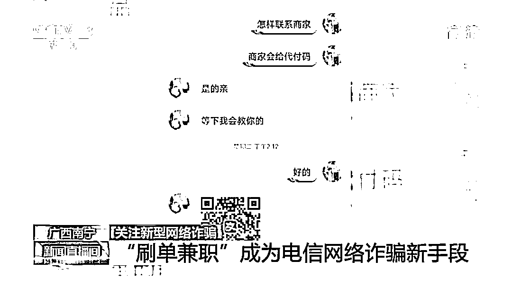
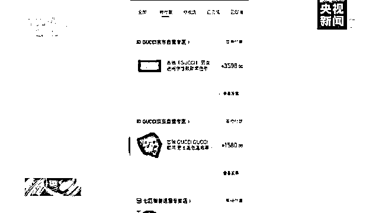
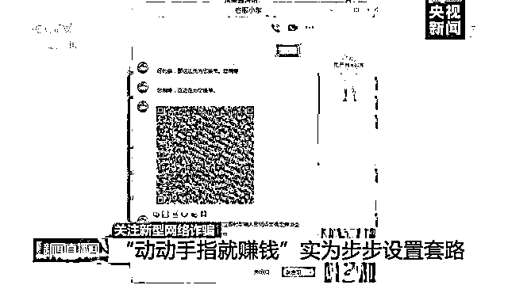
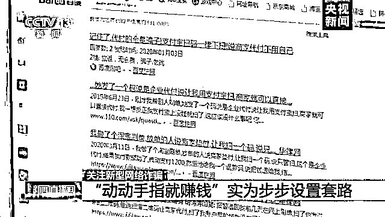
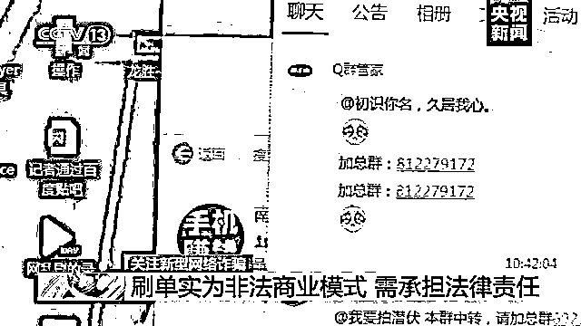

# 动动手指就能赚钱？央视曝光刷单兼职骗局

> 原文：[`mp.weixin.qq.com/s?__biz=MzIyMDYwMTk0Mw==&mid=2247501139&idx=5&sn=fb417987f2c0c09c006585d859b2f815&chksm=97cb0e6ba0bc877d86bac9a27860c9ae59cac3287ebf44f1e91c130cb8bdb94982e87cc9aa52&scene=27#wechat_redirect`](http://mp.weixin.qq.com/s?__biz=MzIyMDYwMTk0Mw==&mid=2247501139&idx=5&sn=fb417987f2c0c09c006585d859b2f815&chksm=97cb0e6ba0bc877d86bac9a27860c9ae59cac3287ebf44f1e91c130cb8bdb94982e87cc9aa52&scene=27#wechat_redirect)

**点击上方蓝色字体免费订阅“灰产圈”**

从今年上半年开始，网络上出现了许多“刷单兼职”。这些所谓的“兼职”，打着“足不出户、日入斗金”“点点鼠标、轻松赚钱”的旗号，其实都是不法分子在实施网络电信诈骗。

[`v.qq.com/iframe/preview.html?vid=f3115qnqmy4&auto=0&width=500px&height=375px`](https://v.qq.com/iframe/preview.html?vid=f3115qnqmy4&auto=0&width=500px&height=375px)

***骗局一：***

***扫码“刷单”  一扫钱就没***

前不久，南宁的蒙女士在某网站上投了一份兼职简历，很快就有陌生人邀请她从事“刷单”兼职。对方告诉他，“刷单”就是网上兼职，在家操作就可以，最高一单会有 20 到 30 元收入。

随后，对方又让蒙女士添加了派单员的 QQ 号。派单员立即给了她一个二维码，并告诉她，只要刷这个码就可以“刷单”了，谁知道蒙女士扫完码后，立即就损失了 900 元钱。 

之后，对方告诉蒙女士，是她流程搞错了，并给让她登记退款。按照对方的要求，蒙女士做了退款登记。这时，对方又出示了一个二维码，蒙女士继续去扫，结果银行卡里的 2.7 万元立即被划走。为了能退回钱，着急的蒙女士又按照对方的要求，接连扫了几个平台的二维码，钱没退成，储蓄卡、信用卡前后共被刷走了 6 万多元。 

***骗局二：***

***先垫订单钱再返佣金？一步步落入圈套***

还有一位黄女士，下载了一款刷单 App，对具体的网店进行“刷单”操作。按照“刷单”规则，她需要先垫付订单的钱，完成一次“刷单”任务，就能返还本金，并能挣到订单额 5％的佣金。

在刷了 3 单并成功赚取了佣金后，刷单 App 的客服告诉黄女士，由于她信用良好，可以开始进行福利单任务，每一单的佣金提高到 8％到 10%。黄女士为了拿回福利单的本金及佣金，一步步陷入了圈套，先后投入了 8 万多元，直到客服失联，她才发现自己被骗了。 

黄女士、蒙女士先后向当地警方报了案。

***刷单类诈骗发案数居第二 ***

***手法如出一辙***

据了解，近年来，刷单类诈骗作为电信网络诈骗的一种违法行为，受害群体涉及面广，作案手法形式多样，因此刷单类诈骗成了目前各级公安机关打击电信网络诈骗犯罪工作的重中之重。今年以来，仅广西南宁警方就抓获电信网络诈骗犯罪嫌疑人 647 人，刑事拘留 122 人，其中刷单类诈骗就占南宁市电信网络诈骗案发案总数 21.5%，发案数位居第二，这些刷单类诈骗的手法都如出一辙。

警方介绍，犯罪嫌疑人通常都是以高回报、工作轻松作为诱饵，称足不出户就可以每天赚取两三百元甚至三四百元，引诱一些工作相对没那么固定或者没有工作的年轻人，特别是在家里面带小孩的家庭主妇。

***曝光刷单套路：***

***预先垫资、事后结算***

刷单通常的手段都是利用预先垫资、事后结算的方式欺骗垫资款。

记者随机添加了一个兼职赚钱的 QQ 群，有网名为“小芳有点甜”的客服添加了记者 QQ，询问是否需要兼职刷单，并附带了工作内容，让记者考虑。几分钟后，客服“小芳有点甜”说审核已通过，让记者添加网名为“小东”的客服 QQ 号开始接活，并发来了一份视频教程。 

这份视频教学中的刷单流程十分简单，即客服发来的“商家二维码”，刷单人扫描后，会跳出一定金额的支付界面，让刷单者输入支付密码，之后会跳出所谓的联系商家支付界面。客服“小东”通过 QQ 电话语音具体指导记者“刷单”，并发来了一个二维码图片，让记者赶紧扫码，还说这个二维码是有时限的，需要记者尽快完成“订单”向弹出企业付款，随后记者按照他的指示，扫描了二维码。 

之后，客服“小东”一直催促记者赶紧输入支付密码。为保证资金安全，记者终止了支付。过了 10 分钟，前面与记者对接的客服“小芳有点甜”则通过语音电话，催促记者赶紧处理“订单”，并告诉记者，如果不支付订单，商家会扣他们的押金。

记者输入支付密码后，真的会有“企业代付”吗？记者在网上搜索“扫码商家代付”关键字，发现输入支付密码后，钱就被划走，客服随即失联了，并没有所谓的“企业代付”，“刷单兼职”的风险由此可见一斑。

***刷单为非法商业模式 ***

***各方都需承担法律责任***

商家为了获得更多关注和销量选择刷单，一方面被刷单者欺骗，另一方面，选择刷单本身就是违法行为。无论是刷单者，还是选择刷单的商家，都要受到法律的制裁。

记者在电商平台上搜索某个商品，不难发现都会有一个“按销量”的搜索按钮，在成千上万的电商商品中，销量越大、好评越多的就能排在搜索结果的最前方。专家认为，导致电商平台刷量屡禁不止的重要原因，是电商平台的排名机制，以及大多数消费者习惯的购买参考，不少商家都通过刷量这条途径，获得更多消费者的关注和访问量。 

[`v.qq.com/iframe/preview.html?vid=h3115z0djok&auto=0&width=500px&height=375px`](https://v.qq.com/iframe/preview.html?vid=h3115z0djok&auto=0&width=500px&height=375px)

北京师范大学法学院教授刘德良表示，就受害者一方来说，刷单作为一种非法的商业模式和营销行为，本身就是一种欺骗消费者行为，是一种违法行为，因此即使作为受害人，也很难获得社会公众的谅解。

而对于商家来说，刷单行为是一种虚假广告宣传和不正当竞争行为，侵害了消费者的知情权，违反了广告法、反不正当竞争法、电子商务法等法律。刘德良表示，这种行为一经发现，不仅承担民事责任行政责任，甚至还可能承担刑事责任，另外还要被列入诚信黑名单。

来源：央视新闻，澎湃新闻

← 向右滑动与灰产圈互动交流 →

**点击****阅读原文****加入灰产圈高端社群**

