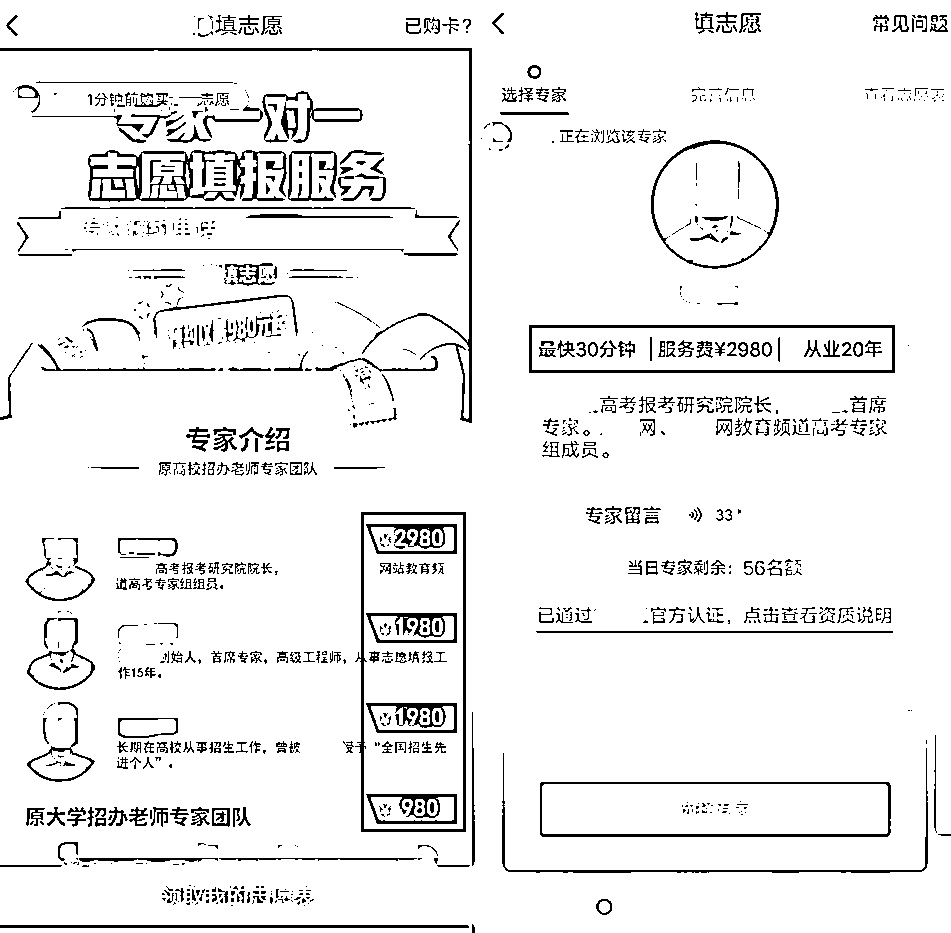

# 高考后你还在知识巅峰吗？挑战你的骗子来了！

> 原文：[`mp.weixin.qq.com/s?__biz=MzIyMDYwMTk0Mw==&mid=2247501188&idx=4&sn=34c4b6267e90a2ff22f54da5f42c0e58&chksm=97cb0ebca0bc87aa14c0180986fa08a5650cfb2788c0b7eb6540e02b616bc66a7ba478701710&scene=27#wechat_redirect`](http://mp.weixin.qq.com/s?__biz=MzIyMDYwMTk0Mw==&mid=2247501188&idx=4&sn=34c4b6267e90a2ff22f54da5f42c0e58&chksm=97cb0ebca0bc87aa14c0180986fa08a5650cfb2788c0b7eb6540e02b616bc66a7ba478701710&scene=27#wechat_redirect)

**点击上方蓝色字体免费订阅“灰产圈”**

回想高考后那段日子

等待分数的时光漫长无比

学校和专业还在思来想去

不管轻松还是忐忑

有的骗局我们一定要警惕

2020 年高考已落下帷幕，愿天下学子都能金榜题名，前程似锦！

在未来一段时间，考生和家长可能会接到一些陌生电话，可能会感受到一些“热情服务”，不过要小心，这可能是“穿上新衣”的网络骗局。

* * *

01 

**高考后频发诈骗总览**

数据显示，高考结束后兼职诈骗和游戏诈骗呈高发态势，其中游戏诈骗相比去年同期有显著增长。

**从被举报帐号分布区域来看，国内主要在广东地区。**

**国外主要还是盘踞在东南亚，以菲律宾、柬埔寨为主，分别占比 24.7%和 21.8%。**

当前网络欺诈正呈跨境化、产业化运作趋势，并向智能化、多平台方向发展，凡是有需求的地方，就可能遇上骗局。

* * *

02

**陷入狂欢的不止考生**

高考一结束，大部分考生都陷入狂欢，放松了警惕，在关注分数和报考信息的同时，考生一定要仔细甄别信息，所谓知己知彼百战百胜，我们先来了解他们的诈骗套路。

1

**“我们内部有人”**

每年考试结束，都会有人自称是内部人员，可以帮忙修改成绩，从考生家长手里骗取大量钱财，下面来看真实案例。

受害人称“对方说能修改考试分数，骗了我们一万三千元”。该案例中他们自称认识内部人员，可以修改原试卷成绩，只需要支付 10000 元的封档费和原试卷修改费，就可以操作。

看对方言之凿凿，“新建档案封存、修改原试卷成绩”似乎驾轻就熟，不明就里的考生，容易被误导，从而支付高昂的“修改费”。

显然，他们是没有能力修改考试分数的，他们的目的就是骗钱，当受害人支付后，又会以其他名目收费。

如果受害人不愿意继续办理，对方承诺可以退款，但退款**需要再缴纳盖章费**，这时考生就被套进去了，不付盖章费就不会退款，付了盖章费又可能损失更多，该怎么办呢？

实际上，如果熟悉一般诈骗的套路，就能看出这些**要钱理由多么荒谬**，在另一起修改分数诈骗中，套路略有变化，却离不开**反复要钱的本质**。

另一位受害人称“有人冒充内部人员加分，要先付 2000 元，我打钱后，他又说需要更新数据，还要再付 4000 元更新费”。

该案例中，某“老师”声称可以帮助加分，以此要**加分费**，并称可以提供“后台加分操作”的录制视频。待受害人支付加分费用后，对方又以更新数据要钱，这时受害人才察觉被套路了。

上述案例可以看出，不管是加分还是改分，对方都是以要钱为唯一目的，至于名目，随便都可以编出来，比如“**关系费、风险费、保证金、保密费**”等，他们会一直“坚持”到受害人不再支付，才逃之夭夭。

**高考改卷会录入国家内网，且有严格监控，考试成绩是不可能通过内部人员，给好处费就能更改的，根据教育部招生政策规定，以虚假成绩报考，也会被记入考试诚信档案，涉嫌犯罪的，也会被移送司法机关。**

（图片来自教育部阳光高考信息平台）

考生一定要通过官方网站查询成绩，凭真实成绩报考院校，勿轻信网络上付费改分的说辞，所谓“内部有人”，都是精心编造的骗局。

2

**“我们是志愿填报专家”** 

对考生和家长而言，进入一所理想高校是全家的头等大事，有人利用这一心理，在填报志愿阶段也设下各种骗局。

一位受害人称“他们并未提供一对一的高考志愿填报服务，完全和他们描述的不一致，付费了又叫付费”。在专门做反诈的同事来看，一眼就能洞穿骗术，但作为考生或家长，一般是首次遇见，了解这些套路就显得十分重要。

该案例中对方以“一对一志愿填报服务”的名义收费，并自行给自己加了很多头衔，如“高考报考研究院院长、首席专家、高级工程师”等，这些自封的官阶，偏偏有人买账。

考生几乎是第一次填志愿，可能有很多不懂的地方，有人便利用这一需求进行欺诈，甚至夸大其词地宣传：“很多同学高考后不会填报志愿，每年都有几十万学生复读了，更多人因为分数线选择了不适合自己的学校，后悔了四年”。

他们一般是打着指导填报的名义，诱导考生拉人进群，而所谓的指导，不过是**随便摘取的政策解读**。在拉到足够人后，他们便露出了凶狠的獠牙。

另一个受害人就举报了类似诈骗：“她以高考填志愿为诱饵，让我给他转钱”。该案例中他们先是以“填报志愿服务量大”为借口，诱导扫码入群，然后收取**指导费**。

通过链接付费后，确实能看到他们的指导内容，不过都是些往年填报的注意事项，并没有实质性指导帮助。考生最后才发现，这钱是白交了。

学校对高考填报志愿有专门的指引，根据教育部招生政策规定，考生应认真阅读高校招生章程，按有关规定和要求填报学校。

（图片来自教育部阳光高考信息平台）

考生应按照自己的意愿进行填报，不要被网络上的“专家”误导，那些骗局都有一个共性，即反复向你要钱。

3

**“我们有额外名额”**

除了改分数、填志愿的套路外，还有人打着“内部招生名额”、“额外招生指标”的名号到处骗钱。现在高考录取都实行阳光招生，对每个考生公平公正，花钱就可以上大学的话是不可信的，我们来看真实案例。

一个受害人称“他冒充高校招生老师，以**内部名额**为由收取 39800 元的费用”，该案例中，对方称不管高考分数如何，只要交几万元，就能包进，而且入学后学费也是全免的。

该“招生老师”还以招生名义，搜集考生信息，如“身份证号码、准考证号码”等，这些都是非常隐私的信息，切勿在网络上随意填写。

这种声称可以走关系，甚至自称招生老师，以“内部名额”的名义收费，是录取阶段较为常见的骗局。根据教育部招生政策规定，**正规的招生录取不会产生任何附加费用**，凡是需要收取保证金、录取费的“招生指标”，都是“无中生有”。

（图片来自教育部阳光高考信息平台）

除了以上骗局外，不法分子还有其他招数，比如：

*   以发放助学金的名义，收资质审核费；

*   以伪造通知书的方式，让考生付学杂费；

*   以跳档录取的名义，让低分考生付跳档费。

他们的骗术并不高端，但如果想走捷径，就容易误入歧途，请牢记：

**天上不会掉馅饼，如果遇到电话、短信、链接要钱的，一定要多方核实，不要急于汇钱。**

凡是以非正常途径操作录取的，几乎都涉及诈骗，请家长和考生正确对待入学问题，严格遵守高考规则，认真了解招生政策，切忌将孩子的高校梦想寄托在这些虚假信息上。

* * *

03

**当准大学生遇到经典骗术**

考生们历经三年苦读，经过高考冲刺，熬过了志愿填报，似乎所有事情都已“尘埃落定”，准备迎来真正狂欢的“人生巅峰”，然而这时骗子仍在暗处伺机而动。

其中，兼职诈骗以诱人赚钱为噱头，游戏诈骗以价格低为噱头危害网络安全，尤其需要考生们注意。

1

**做群管成拉人狂魔**

有的考生会在假期兼职赚钱，这本来是独立自强的表现，也是一次锻炼自己、接触社会的机会，但网络上充斥的兼职招聘，却遍布陷阱。

网上常见的有“入职打字”、“招群助手”等兼职，这些足不出户又简单轻松的工作，往往能吸引到部分学生，不了解内情就容易上当。

有受害人举报称“她们是一个团伙，感觉学生好骗，她们创建了特别多的群，然后招聘助手帮忙拉人，说是每天有工资，但拉完人他们就不理我了，真的是，高考结束了，她们是专骗我们学生吗？” 

该案例中，对方声称不收任何费用，招人做群管理，**只要一部手机就能完成**，帮忙管理学习资料群，日结 30-50 元。

这种兼职贴合考生心理，他们先是给大家普及大学生活，拉近群友好感，再以招收群管理的名义，让考生邀请自己的好友。

这也是比较典型的骗术，**熟人拉进群可信度较高，却不知会被利用，信息也有泄露风险**。

另一个有受害人举报称：“我是穷学生，他们骗我说能做兼职，要保证金，交了几次都不管我，还一直要钱，我今年刚高考完，没钱”。

这类案例中的诈骗分子多为团伙屡次作恶，平台根据大数据审核，会在添加他们为好友初期，提示“**请注意核实对方身份，谨防诈骗**”，并设置投诉渠道。

尽管如此，涉世未深的准大学生们仍然对风险前置的提醒置若罔闻，即使再低级的骗术都有人中招。 

他们先是要入职**保证金**，等学生交钱后，对方又会以“激活帐号”的名义，要**激活费**，并称该费用在激活后立马退回。 

这是较为常见的入职押金诈骗，**“激活后退钱”的****本质还是反复要钱****。**

利用假期锻炼自己，充实生活是可取的，但一定要到正规平台，遇到“花样繁多”的交费噱头，不要盲目付款。

2

**北大多少分来着？**

除了兼职，有的考生会宅在家里打游戏，不法分子会在网上发布卖装备信息，如果遇到卖游戏装备、游戏帐号的，也要当心。

有受害人举报“对方卖号，我给了钱他就不卖了”，该案例中，对方要卖出游戏帐号，并以询问“北大分数线”拉进关系，如果知道分数线，就便宜点卖了，待考生支付后，却得不到帐号。

**先不要笑！我们来拆解这个“高级”骗术**：对方先是放低姿态，和受害人交朋友，以“北大清华在哪里、哈佛麻省多少分”等话题让受害人放下戒备，然后开始了他们亘古不变的模式：**要钱，要钱，还是要钱！**

个人游戏帐号、微信帐号等都是不允许买卖的，而且交易过程中，往往都涉及诈骗。也提醒各位同学，游戏放松的同时，多长个心眼，小心落入圈套。

3

**高考结束了，爱情还会远吗？**

当一切“尘埃落定”，考生们不仅放松了绷紧的神经，年轻的心也开始躁动起来，这时就容易遭遇交友诈骗团伙。

在未见面的情况下，把钱借给陌生人，很容易被骗钱，下面就是鲜活的案例。

受害人描述说“这个女生在抖音上面加人，然后在微信上借钱，借了一次还借，后面又说过生日，要我发红包，我现在觉得她不是女的，说不定是抠脚大汉”。 

该案例中对方也自称是高考毕业生，从其他平台引流到微信后，以暧昧的话语聊天，诱导考生们借钱、请客等。

这类“学生”往往加的是一群人，然后用相同的话术和不同的人聊天，披着“单纯可爱”的外衣，在网络上招摇撞骗，从落地打击的案例看，他们确实大多都是男性。

以上这些令人哭笑不得的案例，其实就真实发生在我们身边。“处心积虑”的不法分子潜伏在“各个角落”，随时准备给即将开启人生新旅程的准大学生们“上一课”。

然而值得深思的是，“寒窗苦读”十余载的莘莘学子，面对这些并不高明，甚至令人捧腹的诈骗手法，却难以招架。

最近有个很有意思的新闻， 12 岁的小雪在网上遭遇“转 888 元返 8888 元”的诈骗，1300 余元压岁钱被骗走。

被骗后她迅速冷静下来，根据骗子透露的号码打过去，自称是银行客服，然后以“你资金出现问题，请提供姓名、身份证号码”的话语反套路对方，获得多条重要线索并第一时间报警，警方迅速将 9 名嫌疑人全部抓获。

小女孩的沉着冷静、处变不惊、迅速报警，让结局大快人心，但我们不能指望每次都这么幸运。无论年龄、性别、学识，**一旦心存侥幸、妄图不劳而获，就会身陷“诈骗泥沼”。**

最后，祝福各位学子都有一个灿烂的前程！你们即将开启人生的新篇章，未来还有很多险峰要攀登。如果自己或亲友遇到类似骗局，请及时报警，并使用**微信客户端或腾讯 110 小程序**举报，我们携手为共筑清朗互联网环境贡献力量！

来源：腾讯 110

← 向右滑动与灰产圈互动交流 →

**点击****阅读原文****加入灰产圈高端社群**

