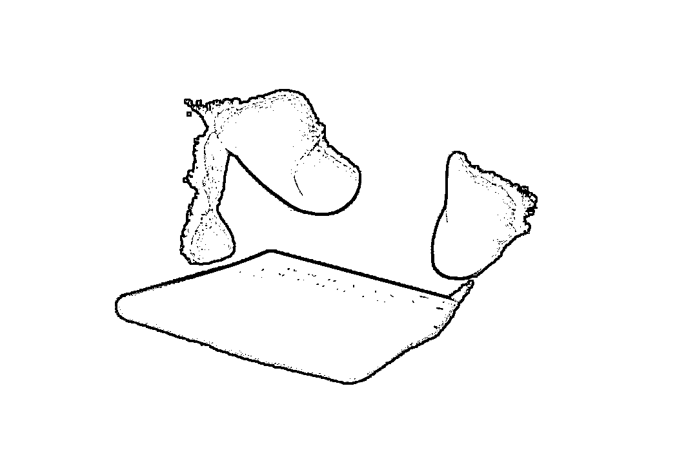

# 顶级黑客入侵理财平台盗走 5000 万！

> 原文：[`mp.weixin.qq.com/s?__biz=MzIyMDYwMTk0Mw==&mid=2247501289&idx=2&sn=2070ae6d7b3e5147d446ae49f5d0b6a3&chksm=97cb0ed1a0bc87c776f041a79965b3b012b772692907b821e2006ebc936e7833c7663240cceb&scene=27#wechat_redirect`](http://mp.weixin.qq.com/s?__biz=MzIyMDYwMTk0Mw==&mid=2247501289&idx=2&sn=2070ae6d7b3e5147d446ae49f5d0b6a3&chksm=97cb0ed1a0bc87c776f041a79965b3b012b772692907b821e2006ebc936e7833c7663240cceb&scene=27#wechat_redirect)

**点击上方蓝色字体免费订阅“灰产圈”**

成功办理本案的第一检察部检察官张政斌（右）和检察官助理陆玔

站在法庭被告席上的黎一，眼神不时瞟向公诉人面前的笔记本电脑，手指不由自主地弹跳几下。

在他手里，笔记本电脑是一架“神器”，用它通过网络侵入重重设防的理财平台的“金库”系统，可以“吐”给自己数千万的钞票。

而其在检察官的操作下却犹如抛出一条条锁链令其罪行昭彰。

攻克重重壁垒联手窃得巨款

2018 年 6 月 1 日，是总部设在上海的“天兑”理财公司月度盘账的日子，员工发现其备付金第三方平台账目出现 5 千多万亏空，经过紧急核查，排除内部原因。**5 千多万在计算机系统被神不知鬼不觉地划走了**——员工们顿时惊出一身冷汗。

6 月 3 日报警，案发！

警方迅速立案，**经过 10 多天侦查，6 月 13 日将有重大作案嫌疑的黎一、温迪 2 人缉拿归案。**

黎一，男，八零后，大学文化，是一家小型计算机技术服务公司的老板，主要从事网站漏洞检测业务。

警方经过调查发现，黎一曾就职于某专业网络机构下属单位，是负责电脑网络的技术总监，擅长网站漏洞检测。

温迪，黎一的朋友，男，八零后，大学文化，无业人员。

相貌普通的黎一，**在网络“黑客”界却是“大师级”的存在**。

在他眼里，绝大多数“网虫”皆为“屌丝”，一般的专业工程师，与他“过手”的结局无不如“菜鸟”般被“秒杀”。

虽然在网络虚拟空间里是神一般的人物，可在现实世界中仅靠经营一家小公司过着不温不火的日子。

“赚钱不多，来钱太慢”，这种状况如何改变呢？去抢银行吗？何不施展自己的“黑客”绝技，到“金库”去“扫荡”一番，打打键盘百万千万轻松到手……。

于是，一个个罪恶的念头占满脑海并逐渐酿成越来越具体的方案。

黎一的作案计划主要由三部分组成：

一是通过网络偷钱、二是用银行卡将其偷来的钱变现、三是把钱兑换和洗白。梦想“一夜暴富”的温迪、笃信“富贵险中求”的袁鹏（另案处理）被其相中，彼此一拍即合，于是“三人成虎”。

明确分工后，各自紧锣密鼓地进行作案准备。

黎一着手寻找防范薄弱的“软柿子”和进入系统的“假面具”；温迪负责筹备银行卡、手机号和必要的设备器材；袁鹏则负责物色持卡取现的人员。

他们约定，**以后尽量少见面少联系，相互通信时使用十分冷门、不易跟踪的社交软件。**

经过一段时间的“嗅探和窃听”，黎一发现**“天兑”理财平台和 P2P 公司之间充值系统的漏洞比较容易被利用，并可改变一级账户的充值数额，然后通过与一级账户绑定的二级账户（银行卡）随时随地地取现**。

另外，黎一还筛选出山西某大学（VPN）作为进入“天兑”理财系统的公共服务器，并在网络上盗得该大学一名员工的电子账号及密码，这意味着黎一可以戴着“假面具”大摇大摆地到达“金库”随意“搬钱”。

温迪的本事也不小，他采取各种办法搞到了 10 多张银行卡和一些电话卡，当然登记的持卡人与他们一点关系都没有，还考察了兑换外币和洗钱渠道并购置了笔记本电脑、随身无线 wifi 等。

袁鹏的动作也不慢，黎一和温迪拉其入伙时，借口有数额较大赌资让他帮助取现，并许以取款金额的 5%作为好处费，袁鹏便以取款金额的 1.5%作为报酬找来了其他 6 人(均另案处理)，随时准备用银行卡到各地取钱。

**2018 年 5 月 4 日，黎一、温迪觉得万事俱备，决定对“天兑”理财公司备付金第三方平台下手！**

先小试牛刀。在广西南宁的一间办公室里，黎一打开了他的笔记本电脑，在温迪的辅助下，熟练地连上移动 wifi，用事先盗取的账号和密码登陆某大学的 VPN（网络服务器），然后攻破“天兑”理财公司的防火墙，侵入第三方支付平台计算机系统。

黎一时而手指在笔记本电脑上上下翻飞，时而停顿观察屏幕上一串串眼花缭乱的数据，如同网络游戏中的超人，逢山开路、遇水架桥，绕过层层陷阱跃过重重障碍，直插对方的心脏——“金库”。

“

开始时有点紧张，毕竟就像真的潜入银行金库似的，既怕攻击受阻又怕引来警察，但随着对方系统被一点点攻破，目标账户里的数额不断增加，“成功”的喜悦逐渐冲斥了恐惧，黎一说。

**两天不到的时间，预先开具的理财账户上的金额由几块钱变成了几十万元。**第一次作案到手的钱，黎一、温迪各分一半，以后基本也是五五分账，彼此都讲义气。

初战告“捷”、欣喜万分。特别是黎一感慨万千：想自己练就的一身绝技原来只是落得“拾漏补缺”、“为人作嫁”，得利甚薄，而今却能利用漏洞直入“金库”，肆意转款归为己有，真是“酷毙了、帅呆了、爽翻了”！ 

然而，区区几十万对“黑客”大盗来讲连塞牙缝都不够。兴奋之余，黎一、温迪不失冷静，他们仔仔细细反反复复地查验，确认被盗的网络平台没有任何反应，才放下心来，并决意放开手脚、大干一场。

温迪提议，到广州去搞，那里洗钱门路多，可以快速将钱变现和兑换。于是黎一和温迪从南宁乘高铁到广州，辗转多家宾馆酒店，两人深居简出，表面上行色如常，但谁也想不到他们干着“江洋大盗”的勾当。

**20 多天时间里、他们故伎重演，疯狂作案，在“天兑”理财公司第三方支付平台用 200 余元变造了 400 多笔下单金额，总共窃取 5000 多万元。**

就这样，上海“天兑”理财平台巨额钱款，被人悄无声息地偷走了。等到次月盘账发现时，窃贼留下的只有淹没在海量电子数据中的一些异样字符。“黑客”大盗终于作下惊天大案。

布置层层迷雾施展脱身诡计

“黑客”是靠玩电脑扬名立万的，那可是一个“烧脑”的行当。黎一认为，小偷扒手偷钱尚讲究“技术含量”，作为“黑客大师”，理所当然要将偷钱富有“设计感”。

常言道：捉贼捉赃。廓清全案，看得出黎一、温迪在“贼”和“赃”这两个字上做足了文章、下尽了功夫。

**销声匿迹，隐藏“贼”踪**是他们的设计之一。黎一在作案过程中，戴的是“假面具”、“走”的是公共网、用的是“抓包”软件、使的是“独门绝技”，来去自由、收放自如、无踪无影，作案后将使用过电脑等硬件设备器材悉数销毁。一旦被抓，完全可以用“贼”不是我、我没做“贼”来蒙混。

**借手取“赃”、变幻“赃”影**是他们的设计之二。赃款提现的任务他们安排不知内情的袁鹏和其雇来 6 人执行，接到袁鹏汇聚的钱款后火速进行套现、转移和兑换。他们认为，取“赃”之人不知“赃”，“赃”过手即不为“赃”，何况偷的是人民币，拿在手上的却是美元，何以确“赃”？

**网上网下、“贼”“赃”分离**是他们的设计之三。一方面他们在人员上采取 1+1+1+X 的结构, 最容易暴露的袁鹏等 7 人不知“赃”从何来、“贼”在何方，另一方面黎一、温迪即使被擒，也可凭有“贼”无“赃”、或借有“赃”无“贼“的理由得以全身而退。

由此看来，黎一、温迪作案前就已设好“假想敌”，并进行了周密的反侦查设计，作案中他们一路在网上偷钱、一路在网下取赃、一路在地下洗钱，各个环节配合默契、进退有序，简直可以达到“天下无贼”的境界。

黎一曾自诩，**“黑客”最不怕的就是“烧脑”。**

神技屡屡破功终被定罪惩罚

黎一、温迪到案后，警方根据黎一的交代从其久不住人的老宅内，搜到藏匿的 248 万美元。袁鹏等人也相继落网。如果这是一件普通的盗窃案，办理起来并不很难。

然而，**由于此案特殊的作案手法和较为周密的反侦查设计，加上黎一对犯罪事实先交代后翻供，温迪始终矢口否认，而侦查取得的证据又颇为“零星、零散和零乱”，给办案工作带来了更多的复杂性。 **

负责该案审查起诉工作的是上海市检察一分院第一检察部检察官张政斌和助理检察官陆玔，这对办案组合一位睿智细腻、经验丰富，另一位外柔内刚、坚韧不拔。

“接手这个案子时，因为直接证据相当缺少，我们都觉得是十分棘手，但是越是棘手越激发了我们一定要把罪犯绳之以法的决心”，检察官张政斌说。陆玔说：“这次，与他们'杠上'了。”

雁过必留痕！检察官更新了思路和方法，不断克服困难打破僵局。“那段时间里，我们几乎时时刻刻都在寻找突破口，反复论证完善证据体系”，检察官说。

鉴于此案的主要犯罪事实虚拟空间和现实空间相互交错特点突出，检察官绘制了人物关系图、作案活动图、赃款走向图、电子数据图等多张案情图表，用时间坐标进行串联。

使“零星”的证据绽发闪光、“零散”的证据整序归列、“零乱”的证据串珠成链，三维空间+一维时间的“四维”参考系让案件事实脉络一目了然、每个作案细节定位准确，不同空间不同维度证据的关联性纵横分明。

整个证据体系在时间法则的连接下更加全面和稳固。

在此基础上，按图索骥，提出更有针对性指导性的补充侦查意见，引导公安机关补全补强证据。

针对该案原来的证据中有大量的技术性结论，司法证明作用严重不足的短板，检察官要求公安机关增加司法鉴定，将机器语言向法律文书转换，提升证据的直观性和证明力，增强证据的支撑力。检察官说，此案对我们提出了许多新挑战，案后也留下了许多新课题。

虽然黎一、温迪态度对立，但每次提审中检察官都劝其交代、认罪，**可惜他们依然执迷不悟。而另案处理的袁鹏等 7 人先前已纷纷认罪**。2019 年 8 月 2 日，上海检察一分院将此案向上海市第一中级人民法院提起公诉。同年 9 月 9 日，法院公开开庭审理。

法庭上，法官正襟危坐、检察官胸有成竹、辩护人踌躇满志、两名被告人抱定一副“你奈我何”的模样。

黎一当庭翻供，温迪以沉默和“不知道”作回应，但当听到检察官运用时间坐标将他们在网上网下两个空间作案的证据相互比照印对时，他们作案中费尽心思的“辗转腾挪”和绞尽脑汁的反侦查设计，反而为检察官提供了更多的证据点。

终于明白一条法理严谨、环环相扣的锁链已将其紧紧套住，在检察官的“四维场景”中，他们的“三维设计”只会是被“碾压”的下场，此时他们觉得再辩解也没多大意义了。

检察官又特别指出，他们为犯罪合谋合伙、冒用他人名义非法侵入理财公司的网络系多次盗窃，冒名取现、洗白赃款，并在到案后对客观的犯罪事实拒不承认的行为，进一步证明其犯罪故意的强烈和对抗法律的嚣张。

此刻，两名被告人的身形一下子“佝偻”起来。一位参加旁听的人士说：“**看得出来，他们是口不服心服**。”

检察机关认为，被告人黎一、温迪**利用上海“天兑”理财平台和 P2P 公司之间充值系统漏洞，采用变造方法将小额实际充值虚增为巨额金额，再从备付金账户将巨额资金划转至 P2P 账户，从而非法占有**，黎一、温迪盗窃数额分别为 5731 万余元和 5311 万余元，其犯罪事实清楚、证据确实充分，应当依法予以严惩。

 2020 年 6 月 18 日，法院作出一审判决：黎一、温迪分别伙同他人，以秘密手段非法窃取他人财物，其行为已构成盗窃罪，并系共同犯罪。**黎一、温迪均被判处无期徒刑，剥夺政治权利终身，并处没收个人全部财产。**司法机关将继续追赃挽损。 

（文中黎一、温迪、袁鹏及被害单位均为化名）

作者 | 吴跃红 成起萱  编辑 | 谢钱钱

← 向右滑动与灰产圈互动交流 →

**点击****阅读原文****加入灰产圈高端社群**

