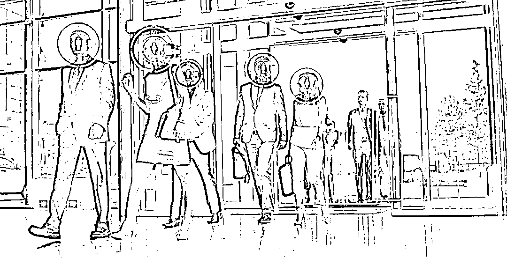

# 0.5 元一份！谁在出卖我们的人脸信息？

> 原文：[`mp.weixin.qq.com/s?__biz=MzIyMDYwMTk0Mw==&mid=2247501289&idx=3&sn=69140b8a69829e0def9278b4ef8b93e3&chksm=97cb0ed1a0bc87c7aab668ceb5f4f448bd04f5e796dda23895a562bc7ef318aa73c8ac205c50&scene=27#wechat_redirect`](http://mp.weixin.qq.com/s?__biz=MzIyMDYwMTk0Mw==&mid=2247501289&idx=3&sn=69140b8a69829e0def9278b4ef8b93e3&chksm=97cb0ed1a0bc87c7aab668ceb5f4f448bd04f5e796dda23895a562bc7ef318aa73c8ac205c50&scene=27#wechat_redirect)

**点击上方蓝色字体免费订阅“灰产圈”**

**记者调查发现，一些网络黑产从业者利用电商平台，批量倒卖非法获取的人脸等身份信息和‘照片活化’网络工具及教程。**

“要的话五毛一张打包带走，总共两万套，不议价。”一位卖家用微信语音对记者说。他还发来两套手持身份证的人脸照片截图。

**记者近日调查发现，****一些网络黑产从业者利用电商平台，批量倒卖非法获取的人脸等身份信息和“照片活化”网络工具及教程。**专家提醒，这些人脸信息有可能被用于虚假注册、电信网络诈骗等违法犯罪活动。

**人脸数据 0.5 元一份**

**修改软件 35 元一套**

记者调查发现，在淘宝、闲鱼等网络交易平台上，通过搜索特定关键词，就能找到专门出售人脸数据和“照片活化”工具的店铺。

在淘宝上，部分卖家以“人脸全国各地区行业可做，信誉第一”“出售人脸四件套，懂的来”等暗语招徕买家。记者随机点进一家出售“××同城及各大平台人脸”商品的店铺，旋即跳转到闲鱼界面。在该卖家的闲鱼主页中，售卖的商品为部分平台包含用户人脸的信息数据。

在闲鱼平台，不少卖家公开兜售人脸数据。为了保证店铺的“正常运营”，卖家常怂恿买家通过微信或 QQ 沟通议价。记者近日随机咨询其中一位卖家，对方用语音答复道“加微信聊吧，这个说多了会被封”，并向记者发来了微信号。

**除售卖人脸数据外，一些“胆大”的闲鱼卖家还出售“照片活化”工具，利用这种工具，可将人脸照片修改为执行“眨眨眼、张张嘴、点点头”等操作的人脸验证视频。**

“一套（‘照片活化’）软件加教程 35 元，你直接付款，确认收货后我把链接发你。”一位闲鱼卖家在闲鱼对话框内使用语音与记者议价。在记者完成支付并确认收货后，卖家通过百度网盘给记者发来一个文件大小约 20GB 的“工具箱”，“工具箱”里有虚拟视频刷机包、虚拟视频模拟器和人脸视频修改软件等工具，还有相关工具的操作教程文件。

还有一位卖家在添加记者 QQ 好友后，先发来了一些单人手持身份证的样本照片，随后向记者展示了其利用工具修改上述照片后欺骗某网络社交平台人脸识别机制的效果视频。

目前，记者已将调查中发现的一些线索移交有关公安机关。

**倒卖的人脸数据拿来做什么？**

“如果只是采集个人的人脸信息，比如在马路上你被人拍了照，但是没有获得你的其他身份信息，隐私泄露风险并不大。”中国电子技术标准化研究院信安中心测评实验室副主任何延哲说，问题在于，**当前网络黑市中售卖的人脸信息并非单纯的“人脸照片”，而是包含公民个人身份信息（包括身份证号、银行卡号、手机号等）的一系列敏感数据。**

一位倒卖“人脸视频工具箱”并声称可以“包教会”的卖家告诉记者，只要学会熟练使用“工具箱”，不仅可以利用这些人脸数据帮他人解封微信和支付宝的冻结账号，还能绕过知名婚恋交友平台及手机卡实名认证的人脸识别机制。这位卖家还给记者传来了帮一些“客户”成功解封冻结账号的截图。

**“从技术角度看，将人脸信息和身份信息相关联后，利用系统漏洞‘骗过’部分平台的人脸识别机制是有可能的。”**人脸识别技术专家、厦门瑞为信息技术有限公司研究中心总监贾宝芝博士认为，尽管一些金融平台在大额转账时需要多重身份认证，但“道高一尺魔高一丈”，网络黑产技术手段也在不断更新，绝不能因此忽视账户安全。

何延哲向记者举例：如果人脸信息和其他身份信息相匹配，可能会被不法分子用以盗取网络社交平台账号或窃取金融账户内财产；如果人脸信息和行踪信息相匹配，可能会被不法分子用于精准诈骗、敲诈勒索等违法犯罪活动。

这些包含人脸信息和其他身份信息的数据从何而来？有卖家向记者透露，自己所售卖的人脸信息来自一些网贷和招聘平台；至于如何从这些平台中获取此类信息，对方没有作答。

**警惕利用人脸信息进行的违法犯罪活动**

近年来，人脸识别技术被用于金融支付、小区安防、政务服务等诸多场景，既提高了便利性，也通过数据交互在一定程度上增强了安全性。

但是，人脸数据如果发生泄露或被不法分子非法获取，就有可能被用于违法犯罪活动，对此应保持警惕。

去年 8 月，深圳龙岗警方发现有辖区居民的身份信息被人冒用，其驾驶证被不法分子通过网络服务平台冒用扣分。

在开展“净网 2020”行动中，龙岗警方经多方侦查发现，有不法分子使用 AI 换脸技术，绕开多个社交服务平台或系统的人脸认证机制，为违法犯罪团伙提供虚假注册、刷脸支付等黑产服务。截至目前，龙岗警方在广东、河南、山东等地已抓获涉案犯罪嫌疑人 13 名。

据警方介绍，在上述案件中，犯罪嫌疑人利用非法获取的公民照片进行一定预处理，而后通过“照片活化”软件生成动态视频，骗过人脸核验机制。随后，通过网上批量购买的私人社交平台账号登录各网络服务平台注册会员或进行实名认证。

**人脸信息关系到每个人的生命财产安全。**业内专家认为，对倒卖人脸信息的黑色产业链必须予以严厉打击，立法机关需统筹考虑技术发展与信息安全，划定人脸识别技术的使用红线；监管部门也应对恶意泄露他人人脸和身份信息的违法行为予以坚决制止。

明年将施行的民法典，对自然人个人信息的范畴进行了专门说明，生物识别信息被纳入其中。中国信息安全研究院副院长左晓栋认为，除民法典外，正在制定的个人信息保护法和数据安全法也应对人脸等生物特征信息的保护作出安排；立法要充分考虑人脸这一特殊身份信息的可获得性，不能让制定出来的法律因执行难而流于形式。

北京师范大学网络法治国际中心执行主任吴沈括认为，网络平台对平台上的交易行为负有监管义务，应严谨审核卖家资质，对平台内经营者的合规情况进行监控、记录，不应允许发布任何侵犯他人人身财产权利或法律法规禁止的物项。

贾宝芝建议，相关平台在制定人脸识别安全规范的过程中，要强调“人脸数据等生物特征信息”与“其他身份信息”实行完全隔离存储，避免将人脸数据与身份信息相关联后发生批量化泄露。

**对于曾经上传过清晰手持身份证照片或同时上传人脸照片并填写身份证、银行卡信息的用户，专家建议，应在开启人脸验证的同时，尽可能选择多重验证方式，减轻单重人脸验证风险。**

来源 / 新华视点  作者 / 颜之宏 闫红心 陈宇轩

************

**← 向右滑动与灰产圈互动交流 →**

********点击****阅读原文****加入灰产圈高端社群****

****