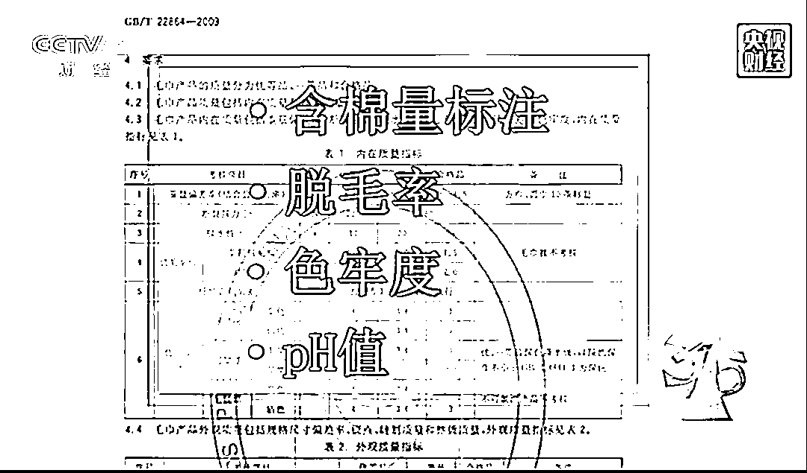
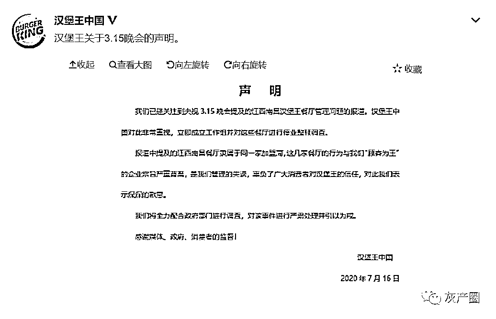

# 2020 央视 315 晚会：今年哪些企业被曝光？

> 原文：[`mp.weixin.qq.com/s?__biz=MzIyMDYwMTk0Mw==&mid=2247501319&idx=1&sn=3704661ad3319148daeae7f3167f5e79&chksm=97cb0d3fa0bc84295e524de3921777f1c73b1fc49d0ea215b59e86653cb9bdb7da9df3fd2e72&scene=27#wechat_redirect`](http://mp.weixin.qq.com/s?__biz=MzIyMDYwMTk0Mw==&mid=2247501319&idx=1&sn=3704661ad3319148daeae7f3167f5e79&chksm=97cb0d3fa0bc84295e524de3921777f1c73b1fc49d0ea215b59e86653cb9bdb7da9df3fd2e72&scene=27#wechat_redirect)

**点击上方蓝色字体免费订阅“灰产圈”**

今年的 3·15 晚会终于来了，

**虽然延期到今晚播出，**

**但“3•15”晚会的名称没有变，**

**初衷没有变。**

**今年“3•15”晚会将仍然**

**秉持担当消费领域瞭望者的使命，**

**守护公共利益，建设美好生活。**

**节目单**

**1.海参“水深”
2.“过期”的汉堡王
3.毛巾的正反面
4.没完没了的变速箱故障
5.精装修还是“惊”装修
6.套路推销，插翅难逃。
7.趣头条广告藏猫腻
8.嗨学网退费为何这么难**

**来看看晚会曝光的黑心事件：**

**1.海参水“深”！** 

**养海参整箱放敌敌畏，南方海参冒充北方海参**

[`mp.weixin.qq.com/mp/readtemplate?t=pages/video_player_tmpl&action=mpvideo&auto=0&vid=wxv_1431249145876267011`](https://mp.weixin.qq.com/mp/readtemplate?t=pages/video_player_tmpl&action=mpvideo&auto=0&vid=wxv_1431249145876267011)

山东即墨是我国主要海参养殖区域之一。

2019 年 10 月，正是海参苗培育期，记者来到栲栳湾养殖基地，发现一个池塘边堆放着近百个玻璃瓶，上面写着：敌敌畏。养殖户坦言，为了清除不利海参生长的其他生物，他刚刚往池塘里加入了不少敌敌畏。

恒生源，是当地规模较大的海参养殖基地之一，基地内的养殖户也承认经常要用到敌敌畏：“敌敌畏，一个池子我使三箱、四箱，鱼虾都死了。”记者在山东即墨调查发现，这种现象非常普遍。那么，记者很是诧异，往池塘里投放这么多的敌敌畏，难道不怕将海参杀死吗？一位兽药店经营者告诉记者：**“海参抗药性是最厉害的，敌敌畏都药不死海参。”**此外，养殖户告诉记者，使用过农药的海水还会被重新排回大海。一些大棚海参养殖户也偷偷告诉记者，他们在养殖过程中也经常用到抗生素等各种兽药原粉。

2019 年 11 月，到了海参苗出苗的时间，记者再次来到了山东即墨，发现来这里收购海参苗的，大都是来自南方的商人。从业者向记者透露了一个鲜为外人所知的行业秘密：海参养成后，还会再次大费周折拉回北方市场加工、销售。一位业内人士透露：“销路都靠北方人，市场里面，80%是我们南方海参。”一些经销商告诉记者，真正的北方海参生长周期长，肉质紧实，价格高，而南方海参生长周期短，价格低，一般消费者很难辨别，因此不少商家都会用南方海参冒充北方海参。

**2.“过期”的汉堡王** 

**汉堡王用过期面包做汉堡，鸡腿排保质期随意改**

全球大型连锁企业汉堡王，宣称“味道为王、食物新鲜”“每一个皇堡都符合汉堡王的皇冠标准”，然而 315 晚会接到内幕人士举报，汉堡王的标准在实际执行中，存在严重问题。

在南昌市汉堡王红谷滩天虹店，记者发现在制作汉堡的过程中，员工煞费心机地操作，就为了少放一片西红柿，或者一片芝士。随着调查的深入，记者的发现更加令人震惊。当班经理发现面包到期后，很自然地吩咐员工更换标签。员工将这批汉堡上旧的标签撕掉，换上了新的标签。第二天记者发现，这批过了保质期的面包被陆续拿出来，做成汉堡卖给了顾客。即便到了食物容易发霉变质的夏天，保质期照改不误。

汉堡王门店资料图

记者随后又对南昌市其它几家汉堡王餐厅进行了调查。在汉堡王南昌王府井店，不仅仅是过期面包被重新修改保质期再销售，过期的南美风味鸡腿排同样被要求修改标签，延长保质期。南昌市多家汉堡王餐厅的员工们已经见怪不怪。

南昌市汉堡王王府井购物中心店员工: “有一次发霉了，是因为面包放太久了。”南昌市汉堡王铜锣湾店店长：“总部也知道。对啊，人家都是从基层做起，当店长当了多少年了。”记者查询南昌市外卖平台发现，有不少食客反映汉堡王的食材不新鲜、汉堡缺斤短两，甚至有顾客吃了食物以后拉肚子。 

**3.毛巾的正反面** 

**毛巾生产线的暗黑面：旧袜子旧内衣竟是毛巾生产原料**

河北省高阳县是中国最大的毛巾生产基地，年产毛巾 50 亿条，约占全国的三分之一。然而记者走访了高阳,却了解到虽然标注着执行国家标准，但有的毛巾实际上却无法保证检测合格。

记者在走访中了解到，当地企业的生产线一般分为两种，一种毛巾可以保证检查合格，而另一种毛巾则会用便宜的纱线加工，达不到国家标准。有从业者曝出了其中的隐秘：**“正规的棉花一吨 16000 多元，14 支纱线的下脚料多便宜，但脱毛率没一个达标的。”**

**那么，这种纱线用的是什么原料、如何生产出来的呢?**

在高阳县辛留佐村，记者找到了一家专门生产毛巾纱的企业，记者看到，工厂生产车间有一个配料池，池子里是用来纺毛巾纱的原料，有的上面还沾染着绿色的污渍，有刺鼻的味道，里面的杂质清晰可见。

负责人冯经理告诉记者，这些原料大部分是再生棉。业内所说的再生棉，指的是一些纺织厂的各种下脚料、碎布片、线头等经过再梳理、再开花，就成了再生棉或者叫回收棉，这种棉花比新的棉花便宜近一倍。高阳及周边多家为毛巾厂生产纱线的企业，每家产量少则一百吨，多则数百吨，那么，这些再生棉，又是如何加工而成的呢?

在河北邯郸南井寨村，这里生产再生棉的原料让人震惊。厂子里的旧衣服堆积如山，有毛衣、外套、秋衣秋裤，甚至穿过的内衣、袜子等。在没有经过任何消毒程序后，经过机器绞碎、几道开花程序，旧衣服重新变成了棉花，同时，产品包装上，依然没有任何警示标志。

这些下脚料、甚至旧衣服加工的再生棉，没有标注任何产品信息及警示语，就卖到纱线厂做成了纱线，纱线上同样也不标注产品信息及警示语，就卖给了毛巾厂，最终做成毛巾。而对于原料中存在的各种问题，各环节的从业者都心知肚明。“这种不合格的毛巾，贴着符合国标的标签，通过中小超市、批发市场、电商等销往全国各地。”一位纺织品公司总经理告诉记者，这种达不到检测标准的毛巾,他们一年的销售额大概能卖到五千万元。

**4.没完没了的变速箱故障** 

**“神车”让人费神：宝骏 560 高速上突然失去动力 故障没完没了投诉无处可去**

宝骏 560.一度被车主们戏称为“神车”。但就是这辆广告中号称车主们最可靠伙伴的“神车”，却一次又一次将一些车主带入窘境。河南驻马店的赵先生在 2017 年 10 月花费 14 万元购买了宝骏 560 汽车，然而，2019 年 2 月的一天，车子在路上突然失去动力。

广东中山杨先生也遇到了同样的情况，在更换了只开了一年的宝骏 560 的变速箱后，不到 4 个月，车子在高速上又突然失去动力。杨先生的车被厂家召回维修，而 5 个月后，车辆新换的变速箱再次出现问题，故障频发。随着宝骏 560 变速箱问题的出现，越来越多的车主反映遇到了类似的问题。

面对问题，4S 店给出的解决方案都是更换变速箱，而一些已经换过一次甚至多次变速箱的车子，问题依旧存在。

修也修不好，一旦超过三包期限还得自掏腰包。天津车主姜先生表示“我是 14.3 万元买的，退车退了不到 6 万元钱，厂家的缺陷为什么让老百姓来买单。”

车主们了解到，2018 年 3 月，上市仅 3 年的宝骏 560 汽车突然宣布停产，如今找厂家投诉无门，看不到一丝彻底解决问题的希望，车主们不知道，这样的问题车辆他们还要开多久。

**5.精装修还是“惊”装修** 

**万科尚城精装房漏成水帘洞，春秋华庭问题房被强制收房，如此精装修“万万不可”!**

2018 年 11 月广州万科尚城业主验房时，发现自己的新房在楼上做蓄水试验时，楼下卫生间“秒变水帘洞”，其中最先收房的 201 户中，竟有 146 户出现漏水情况。

那么，为什么精装修费高达每平米 10000 元至 13000 元的房子，会漏得像“水帘洞”呢?2018 年 12 月 18 日，万科回应称施工标准符合国家规范要求。而广州鸿力公司的工程师在查看现场后表示，卫生间漏水与主管道没封堵好有很大关系。2019 年 3 月，开发商勉强给出了解决方案，但根据入住的业主反映，家里仍然有漏水情况，而且渗漏出来的是排粪水，臭味刺鼻，一栋楼就有十几户人家出现类似问题。

在浙江杭州，春秋华庭小区的业主们收房时也遭遇了类似的遭遇。合同中约定房屋每平米 2 万 8 千元，其中 6000 元为装修款。当业主们按照合同约定的日期前来验房的时候，却发现地板还没铺上、地平也是潮湿的、厨房门随时都会掉落，房间还在施工。

对此，开发商给出的方案是边验房、边收房、边维修的“强制收房”。后来，业主们陆续发现，问题越来越多，一套房子问题少则几十个，多则上百个。地暖开了没两三天，地板居然变黑了。在业主群里，每天都有业主曝出自家地板发黑的问题。这样所谓的精装修，实在令业主们头疼。地板变黑可以更换，但是有的问题，就没那么好解决了。一些业主家做了蓄水测试后，卫生间外墙出现了渗水现象，问题相当普遍。有渗水的，还有直接从墙里不停地往出喷水。

此外，有些业主还发现更大的安全隐患，煤气严重泄漏。开发商表示，煤气泄漏是因为管道没装好，无需担心。每平米 6000 元的装修款，究竟有多少真正用在装修上，业主们不得而知，面对问题不断、如此粗糙的所谓精装修，业主们有苦难言。

**6.套路推销，插翅难逃** 

**美容院推销“步步惊心”：“连环计”设套  学生成“小白鼠”**

免费送护理、免费送面膜，这种以“免费”做噱头，实则推销高价美容项目的行为，似乎已经成为美容行业的套路。315 晚会剧组也接到了大量相关投诉。

在暗访中，记者参与了美容院的集中拓客大型活动，由两位店长为员工们传授经验，将没怎么做过美容的顾客称作“小白鼠”，以“免费体验”的名义把顾客揽进店门后，用一环扣一环的“连环计”来给顾客下套。这个过程中，多个项目老师、门店经理，蹲墙角、爬门缝，想方设法偷听掌握顾客的情况，一旦有需要，随时扮演不同的身份进入房间，同美容师打配合。

要想让顾客对优惠政策信以为真花钱办卡，戏得演逼真，该有的情节必不可少。在拓客活动期间，没有固定收入、涉世未深的学生，是最受欢迎的“小白鼠”。

在“体验”时，美容师会不失时机，以申请优惠的名义把“学生证”从房间里拿出来，在学生面前溜一圈再送回去。让学生们以为自己可以通过“学生证”来获得优惠。而实际上，对于手头没钱的学生，可诺丹婷美容院的梁经理告诉记者，“没钱也能有办法让她们花钱办卡”，她们会推荐各种网贷让学生来借钱美容，有一个月收入只有 3500 元的女孩，就在劝说下从网上借了 20000 元来做美容。

在美容师销售技巧的培训课上，一位姓何的讲师鼓励员工：“只要你想要成交客人，就要学会讲故事，讲案例。铺垫到位了，我们的经理协助、我们的老师协助，解决问题了，钱收进来了，客人滚蛋!”

同时，为了防止顾客事后反悔，美容院会以格式条款或其它各种借口，拒绝消费者的退款请求。这样一来，即便顾客事后意识到自己遭遇套路上当受骗，也很难把钱要回来。一位员工告诉记者，“我们这里就这样子的，为了钱不择手段。”

**7.**趣头条广告藏猫腻****

“用它轻松瘦到 90 斤”“全球唯一，日益风靡”“快速减肥、月瘦 30 斤、永不反弹”。在“趣头条”上，充斥着许多虚假宣传疗效的广告，例如一款属于压片糖果的普通食品，它的宣传却号称：“比伟哥还好使，一粒恢复男人本色”。那么，这些虚假广告是如何登上趣头条的呢？

记者在一家自称是趣头条的广告核心授权代理商——广州天拓网络技术有限公司了解到，负责人林经理向记者保证，就算没有资质，天拓也可以开户，帮助投放广告。

记者虚构了一款减肥产品，没有提供相关资质材料，第二天，天拓公司的优化师就制作好了广告页面，里面还不时弹出某地区某人在几分钟前已购买了这款减肥产品。优化师说，这些其实都是假的。就这样，一个子虚乌有的产品，杜撰的故事，夸张疗效的广告就这么轻而易举地登上了趣头条。

记者还发现，在趣头条上，不仅有虚假宣传疗效的广告，“边玩手机边赚钱”的广告也会频频出现，这些广告无一例外地宣称如何轻松赚钱，同时不停跳出一个微信号。

记者添加这个微信号后，对方发来一个网址，打开网址发现，里面有快 3、幸运飞艇、香港六合彩、大发六合彩等 43 项彩票、6 项棋牌游戏，甚至还有现场购买彩票的直播，原来号称轻松赚钱的方法，实际上竟然是吸引用户参与赌博！

那么，为什么连非法的赌博平台都能在趣头条上做广告呢？记者在一家自称“为趣头条等 30 多家平台提供广告开户投放服务”的聚亿媒网络科技有限公司了解到，只要将赌博广告包装成“网络赚钱”的形式，就能登上趣头条。赌博是非法的，但可以用其它公司的闲置账户来投放广告，业内俗称“套户”，广告里的文案素材也无需广告主提供。

**8.******嗨学网退费为何这么难****

7 月 16 日，央视 3·15 晚会曝光了北京嗨学网教育科技股份有限公司（以下简称“嗨学网”）退费难问题。

为了销量，嗨学网还宣称可以在推销时百分百保障报名成功和百分百兼职挂靠，百分百保障成功率。而支付时具体培训合同“可以不必给用户看”。

退费难频遭投诉 曾因虚假宣传被罚 20 万

司库财经了解到，关于嗨学网获客过程中涉嫌虚假宣传、帮学员代报名、指导学员挂靠赚钱、学员退费难的投诉，早在 2019 年初就曾大量出现，只是时至今日，相关问题似乎仍旧没有得到解决，还因此多次引发与学员的法律纠纷：在 2019 年 7 月，嗨学网因“商品或者服务作虚假或引人误解的宣传”而被北京市工商行政管理局朝阳分局责令改正虚假宣传的违法行为，并处罚款 20 万元。

一位姓韩的先生曾在中国质量万里行投诉，称自己于 2019 年 9 月在百度上看到嗨学广告，宣传一级消防工程师证书挂靠一年十几万，因为自己第一次听说这个证书，就像和平台人员深入了解一下。

之后，嗨学销售人员多次通过电话和微信诱导韩先生报名一级消防工程师培训班，承诺可以代报名，包过考，有考试秘卷，包挂靠，不过退费等，没有钱还可以用免息的支付宝花呗，但是必须先交钱才能激活电子协议。

想到能拿到好的资格证书以后方便找工作，韩先生没有多想，在交完首付款之后通过花呗一共付费 5998 元。

学习一段时间之后，韩先生得知挂靠是不合法的，学在钻法律的空子，并且韩先生求证发现自己没有任何消防相关专业学历和工作经验，根本不符合报考条件，于是提出终止学习，要求嗨学退费，而 2 月份申请退费被拒。一位姓邢的老师表示：“不参加考试没法退费。”

此后这位邢老师不再回复韩先生微信消息，韩先生表示多次通过邮件与嗨学网沟通，并且提供销售聊天截图等，嗨学网均予以驳回！

据韩先生透露，跟他相同遭遇的人不计其数，单“就我们一个微信群，涉案金额就高达上千万，而这样的群还有很多，随便任何一个社交平台搜嗨学，都有很多嗨学受骗学员，黑猫投诉，聚投诉，12315 平台等投诉平台受理的投诉嗨学的案件成千上百起。希望政府重视起来，我们普通老百姓维权太难了，被骗钱对于我这样的贫困家庭来说无异于雪上加霜！”

**好了，接下来被曝光公司开始排队声明：**

**一.宝骏汽车**

**二，汉堡王**

**三.趣头条**

**四.嗨学网**

**截止发稿前：**

1.  养海参整箱放敌敌畏，南方海参冒充北方海参  

    **回应：暂无**

2.  毛巾生产线暗黑面：旧袜子旧内衣是生产原料

    **回应：京东苏宁天猫平台下架永亮毛巾**

3.  精装修还是“惊”装修：万科精装房漏水成水帘洞 春秋华庭问题房被强收

    **回应：暂无**

4.  套路推销，插翅难逃：一美容院“连环计”设套 学生成“小白鼠”

    **回应：暂无**

**我们会对后续事件进行报道，敬请关注**

← 向右滑动与灰产圈互动交流 →

**点击****阅读原文****加入灰产圈高端社群**

