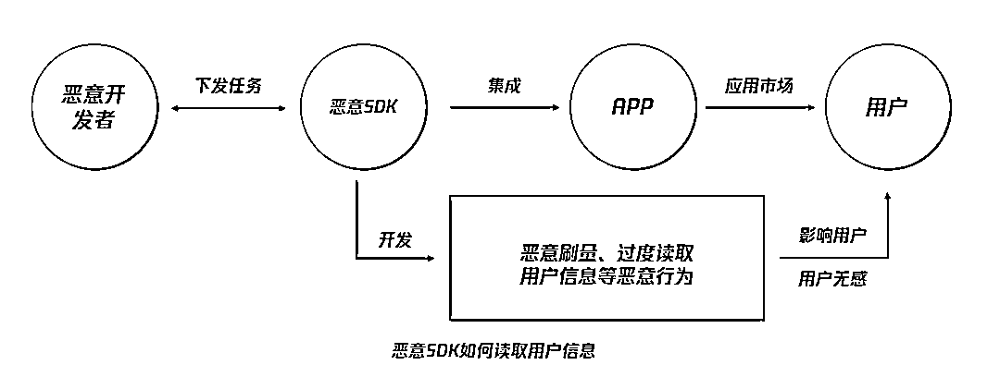

# 这类软件赶紧卸载！央视 315 晚会揭露“手机里的窃贼插件”

> 原文：[`mp.weixin.qq.com/s?__biz=MzIyMDYwMTk0Mw==&mid=2247501402&idx=1&sn=732ff6060df0082c1afea88753623414&chksm=97cb0d62a0bc8474ad5ec7c4d66354ad1dce48b794ed93b57b11a273eae75ff2f7de781cec56&scene=27#wechat_redirect`](http://mp.weixin.qq.com/s?__biz=MzIyMDYwMTk0Mw==&mid=2247501402&idx=1&sn=732ff6060df0082c1afea88753623414&chksm=97cb0d62a0bc8474ad5ec7c4d66354ad1dce48b794ed93b57b11a273eae75ff2f7de781cec56&scene=27#wechat_redirect)

**点击上方蓝色字体免费订阅“灰产圈”**

7 月 16 日，央视 3·15 晚会播出，曝光了包括售卖过期食材、精装房漏水漏气、“黑心”毛巾贴国标、美容院套路推销、平台推送虚假广告等在内的 9 大问题，其中，**还揭露了部分手机软件违规收集个人信息的恶意行为**。

[`v.qq.com/iframe/preview.html?vid=n311692uci8&auto=0&width=500px&height=375px`](https://v.qq.com/iframe/preview.html?vid=n311692uci8&auto=0&width=500px&height=375px)

戳视频了解详情

据央视报道，上海市消费者权益保护委员会委托第三方对市场上的 App 进行检测，发现某些**第三方开发的 SDK**存在违规收集用户个人信息的情况。

**恶意 SDK 是什么？它又是怎样悄悄在我们的手机中读取信息的？它会对我们的生活产生怎样的危害？**

**隐私泄露屡见不鲜****恶意 SDK 背后作恶**

SDK 是 Software Development Kit 的缩写，即“**软件开发工具包**”。简单来说，它是**辅助开发某一类应用软件的相关文档、范例和工具的集合**。

对 App 来说，为了缩短 APP 开发周期、提高开发效率，可以**将某项功能交给第三方来开发**，而第三方服务提供商便会**将服务封装成 SDK**供开发者使用。 

而部分 SDK 包中会加入一些恶意功能，**轻者违规获取用户信息，重者则会威胁手机隐私安全、资金账户安全**。

如“3·15 晚会”曝光的**氪信 SDK**，嵌入到 APP 后会默默收集用户数据，其中包括：联系人、通话记录、短信、应用安装列表、设备信息、位置信息等。

据央视曝光，这款 SDK**共涉及 50 余个手机 APP**，SDK 作为手机软件中提供某种功能或服务的插件植入到手机软件中，安装了这些 APP 的用户，手机中的隐私信息会被不断读取，而在这个过程中，**用户毫不知情**。

（上下滑动查看相关应用）

而此次晚会曝光的另一款**北京招财旺旺信息技术有限公司开发的 SDK**，除了收集用户手机号码、设备信息等隐私外，甚至会收集并上传用户手机中的短信内容，带有验证码的短信同样会被上传，在采集之后还会发送至指定服务器进行储存。

而用户的短信验证码是目前手机 APP 验证用户身份的重要手段之一，一旦泄露，不法分子可能会**利用短信验证码进行软件登录、支付款项、开通业务等行为**，可能会为用户带来极为严重的金钱损失。

**SDK 化身“黑产”保护伞**
**利用个人隐私频频作恶**

除了央视所曝光的 SDK 过度读取用户隐私外，不法分子还利用恶意 SDK 为以下黑产事件“开路”：

**1、非法控制个人手机，进行恶意流量推广**

2018 年曾曝光过的“XX 推”SDK，潜在影响近 2 千万用户。

开发商在 300 多款应用里安装了该款 SDK，通过后门云控开启恶意功能，非法控制个人手机。恶意 SDK 可在云端动态更新下向用户手机发送恶意代码包，Root 用户手机，植入恶意应用到用户设备系统目录，进行恶意广告行为和应用推广，以实现牟取灰色收益。

同时，该 SDK 还会从服务器获取刷量任务，通过恶意控制用户手机的方式，在用户无感知的情况下进行自动化刷量服务。在无形中，你的手机成为了恶意流量黑产的“帮手”。

**2、成为第四方支付平台的助推器**

还有部分不法商家不断突破红线，将 SDK 用于“第四方支付平台”，使用自己注册和控制的支付“空壳公司”，为无收费权限的游戏软件、色情平台、赌博平台提供结算服务，给平台带来一定监管风险。

2019 年 9 月，守护者计划安全团队配合辽宁警方破获一起非法结算案，涉及微信商户流水 60 亿元。涉案公司属游戏行业比较知名的聚合支付公司，在正常聚合业务之外，还为 300 余款无牌游戏 APP 提供收款通道。该案核心手法是挪用了商户支付接口：犯罪团伙将使用空壳公司注册的批量微信商户信息集成到 SDK 中，当团伙与无牌游戏公司勾连时，便将 SDK 作为游戏 APP 的支付功能模块使用，最终将所收的游戏充值款回流给游戏公司，实现结算目的。

**3、层层隐蔽，危害用户安全**

恶意 SDK 拥有很强的隐蔽性和对抗杀毒软件的能力，软件一旦植入恶意 SDK，再通过应用市场分发到用户手中，就会造成较大的影响。

这些恶意 SDK 会持续对用户的个人隐私进行过度读取，甚至帮助网络黑产“铺路”，严重影响移动互联网用户的信息安全和财产安全，危害合法应用市场声誉，造成恶劣的社会影响。

如果这类型的新型黑产手法不加以遏制，未来 SDK 黑产甚至可以控制用户手机做更多的事情。

**对恶意 SDK 重拳出击****需要多方联合齐努力**

恶意 SDK 悄悄藏匿在手机软件中，不仅让用户在使用过程中防不胜防，很多**应用软件的开发者**甚至都未曾了解软件导致的这些安全漏洞。

而恶意 SDK 无度索取个人信息、违规使用手机权限、“协助”黑产完成非法结算等行为，**亟需整改和打击**，才能保护用户的个人信息安全和财产安全。

在此，守哥呼吁各界携手，**一起行动起来，联合打击恶意 SDK**：

作为**源头**的 APP 开发者，需要对 SDK 有着充分了解，从源头上避免 SDK 通过 APP 过度索取用户信息、为黑产“保驾护航”等行为。

**1、APP 应用开发者：**

①**APP 应用开发者应遵循合理、必要和最小化原则选择第三方 SDK**。对必须使用的 SDK 包加大审核力度，对第三方 SDK 进行全面的安全评估，特别警惕具有后台云控功能控制代码的 SDK；

②**开发者应从自身角度履行责任，保障用户的信息安全**。在软件开发过程中，需明确所开发 APP 对个人信息的采集与利用，个人信息存储及保护制度，个人信息的处理制度，未成年信息保护制度等，切实保护用户个人信息及隐私。

作为**软件分发平台**的应用市场，可以直接触达到客户，也需要充分发挥企业责任感。

****2、应用市场：****

①**各级应用市场应加强管理，增强对恶意 SDK 的识别、检测和防范能力**。可参考一些应用分发平台采用的“恶意行为检测”+“隐私泄露检查”+“安全漏洞扫描”+“人工实名复检”四重检测体系，以多样安全审核措施保障上架应用的安全合规；

②应用市场应履行自身责任，在对 APP 进行检测后，对合规、安全、稳定的 APP 进行标识，便于用户在下载软件过程中进行适当的选择。而**对于不合规的 APP，应用市场应及时进行下架处理**。

作为**用户**，我们更应该从自己做起，保护个人隐私安全。

****3、用户：****

①**避免在非官方应用市场下载 APP**，不要通过扫描二维码、点击链接的方式下载软件；

②**下载软件后要对其进行权限设置**，在不影响使用的情况下尽量关闭应用内与“隐私相关”或与“资费相关”的权限；

③**忌在非官方渠道填写自己的**银行账号**及**密码**等信息**，填写任何个人信息都要三思而后行，仔细核查平台的合法性；

④如果遇见泄漏用户隐私或者其他违规行为的 APP，及时通过**中国互联网违法和不良信息举报中心**的网址**www.12377.cn**进行举报。

← 向右滑动与灰产圈互动交流 →

**点击****阅读原文****加入灰产圈高端社群**

