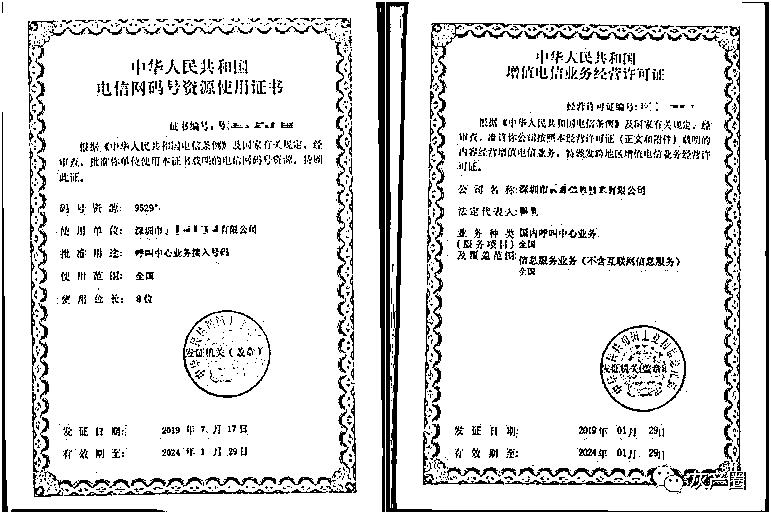

# 揭开“95”号段诈骗电话背后的秘密

> 原文：[`mp.weixin.qq.com/s?__biz=MzIyMDYwMTk0Mw==&mid=2247501402&idx=2&sn=c0763546319d877ec9942f16f4553e4b&chksm=97cb0d62a0bc8474235c480f2a1dad2d9d7caf8a04bba494726d5803f69e2482b2d414a20827&scene=27#wechat_redirect`](http://mp.weixin.qq.com/s?__biz=MzIyMDYwMTk0Mw==&mid=2247501402&idx=2&sn=c0763546319d877ec9942f16f4553e4b&chksm=97cb0d62a0bc8474235c480f2a1dad2d9d7caf8a04bba494726d5803f69e2482b2d414a20827&scene=27#wechat_redirect)

**点击上方蓝色字体免费订阅“灰产圈”**

**“请问您需要贷款吗？”**去年底，江苏南通市民孙先生无意中接到陌生电话。年底手头紧，孙先生表示有贷款意向，对方便通过他的手机号码添加微信。

　　聊天时，对方询问他想要贷款的金额，孙先生报了 30 万。在对方指导下，孙先生下载了一款名为“360 金融 APP”的软件，并用个人信息和银行卡号进行注册。

***　　充值即免息设下“陷阱”***

　　随后对方告诉他，充值 1799 元就可以免 6 个月利息。听说有这样的“福利”，孙先生很心动。为了省下利息，他当即将这笔款项打到对方账户里。

　　正等待放款的孙先生，不料软件提示他的银行账号不正确。为了“更改”帐号，孙先生又缴纳了贷款本金的 20%，也就是 6 万元的手续费。

　　帐号错误、提现需要缴纳保险、需要充值 VIP 获取积分……就这样，被“套路”的孙先生不但没有拿到一分钱贷款，还在对方的指引下，先后多次汇款。直到汇出总计 297123 元之后，孙先生才察觉可能被骗，于是报警。

　　无独有偶，安徽的范先生接到了同样询问是否需要贷款的电话，下载软件后先后转账 11 笔，被骗取 23 万余元。直到接到南通市反诈中心的电话，范先生方才醒悟自己被骗。

　　“像这样的受害人不在少数，无一例外，他们来电显示呼叫号码都是以’95’开头的。”南通市公安局网安支队三大队副大队长许平楠说，由于“95”号段一般用于企业呼叫中心和客服热线，在一定程度上降低了受害人接到电话时的戒备心理。

***　　“952750xx”号段被大量用于拨打诈骗电话***

　　今年 3 月以来，南通市公安局网安支队在工作中发现，“952750xx”号段被大量用于拨打诈骗电话，并关联到全国 266 起诈骗案件。南通市公安局迅速成立专案组，侦查过程中，专案组发现，涉案的“95xxxxxx”号段系南通某通讯技术公司申请使用，法人代表是 39 岁的南通市通州区男子秦某桐。

　　今年 4 月，专案组实施抓捕，包括秦某桐在内的 4 名犯罪嫌疑人落网。以秦某桐为突破口，两个位于深圳的通讯公司进入专案组视线，一个庞大的犯罪网络层层现出原形。

　　据秦某桐交代，他名下的南通某通讯技术公司，曾申请过固定电话号段“0513-85xxxxxx”。他将这一号段转租给他人，每年轻松获利 200 余万元。但这些号码被用于诈骗、广告推销等活动被群众大量举报投诉，不仅号段被禁用，公司也上了本地运营商的“黑名单”。

　　尝到号码资源转租甜头的秦某桐不肯罢手，决定另辟蹊径，打起了通过申请“95xxxxxx”号段来捞金的主意。

　　随后，他通过中介代办申请了“952750xx”码号证书。此时，他又遇到新难题，通过申请只是第一步，要想让号码接入网络正常使用，还需要通过运营商进行语音落地。所谓语音落地是指给号码开通拨打电话的功能。

　　秦某桐联系到了圈内朋友张某仲。张某仲在深圳开办了一家通讯公司。双方一拍即合，商定由秦某桐提供“952750xx”号段码号语音落地服务材料，张某仲则负责对该号段进行落地和线路改造，改造后的线路由双方按一定比例分摊使用。

　　4 月 29 日，专案组将张某仲在内的 5 名犯罪嫌疑人抓获归案。审讯结果出人意料，张某仲只是一个“二道贩子”，实际完成语音落地的是在深圳开了家科技公司的杨某。

　　根据线索，专案组于翌日将杨某为首的 6 名犯罪嫌疑人抓捕归案。该犯罪产业链的 15 名犯罪嫌疑人全部落网，3 家从事犯罪活动通讯技术类公司也都浮出水面。据杨某交代，他是通过外省某市一家运营商完成了语音落地，并通过网络设备设法对号段进行了线路改造，将“952750xx”号段的 100 个号码分配成 5000 条网络电话线路。

　　其中，杨某拿下 4000 条，张某仲分到 600 条，而秦某桐到手的只有 400 条。随后，3 人各自利用自己掌握的资源寻找客户，以高于运营商的价格转租线路牟利。

　　租用线路的客户，大部分都是利用这些号码实施诈骗等违法犯罪活动。

***　　诈骗网络电话批量导入联络人 使用群呼功能“广撒网”***

　　南通市公安局网安支队支队长张建介绍，在号码出租过程中，上游公司的准入筛查机制形同虚设，犯罪团伙只需要提供虚假公司信息，就能租到网络线路，随时随地使用动态的号码拨打网络电话。网络电话不受地域限制，并存在很强的隐蔽性，这也让诈骗团伙隐藏得更深。

　　“牵连出的 266 起案件中，最多的就是信用卡、贷款类诈骗。”负责侦办此案的南通市公安局崇川分局网安大队民警曹阳说，诈骗分子使用网络电话批量导入联络人，使用群呼功能进行“广撒网”。部分犯罪分子甚至利用智能语音功能先行拨号试探，待受害人“上钩”后再转为人工实施下一步诈骗行为，“相比传统的固话拨号实施诈骗，节省了人力成本。”

　　在办案过程中，专案组发现，杨某手上持有的“95xxxxxx”号段并不只有来自秦某桐。

　　从 2018 年以来，杨某为首的团伙通过外省某运营商，先后对 10 余个“95xxxxxx”号段进行语音业务部署，再通过技术改造将线路出租给下游业务公司，共非法获利 800 余万元。

　　今天，江苏省南通市公安局召开新闻发布会，公布在“净网 2020”专项行动中，由公安部、江苏省公安厅统一指挥，破获了全国首例利用“95xxxxxx”号段帮助通讯网络诈骗的案件，抓获犯罪嫌疑人 15 人，捣毁了从事犯罪活动通讯技术类公司 3 家，查封“95xxxxxx”号段 21 个，非法网络电话线路 2 万余条，发现下游业务关系公司 155 家，涉案金额高达 2200 余万元。

　　目前，所有涉案犯罪嫌疑人因涉嫌帮助信息网络犯罪活动罪，均已移送检察机关审查起诉。

　　“这起案件是众多为网络诈骗等犯罪团伙提供帮助的黑灰产业的缩影。”南通市公安局副局长陈兵说，工信部颁布的《电信网码号资源管理办法》中规定，“95”号段号码使用者不得将线路进行转让或出租，不得变相经营固定电话业务、网络电话业务等其他电信业务。

　　随着网络的快速发展，违规将“95”号段号码层层代办、层层转售已经在行业内形成了地下产业链条。这次公安机关以“追源头、抓团伙、斩链条、摧平台、铲黑产”为目标，将号码持有公司、线路转让公司、语音落地公司一网打尽，让重重隐藏的黑灰产业显现出冰山一角。

　　“接下来，公安机关进一步打击新型网络诈骗提供经验的同时，也将督促行业监管部门完善管控措施，防堵骚扰电话漏洞，依法处理违规行为，完善长效管理机制。”陈兵说。

来源：中国青年报

← 向右滑动与灰产圈互动交流 →

**点击****阅读原文****加入灰产圈高端社群**

