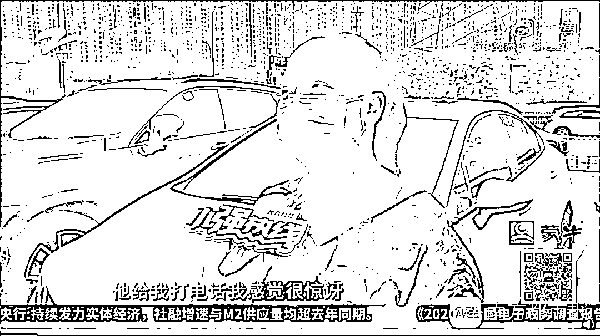

# 揭秘虚假地址注册黑产：自家住房被注册七家公司，地址五十元可买

> 原文：[`mp.weixin.qq.com/s?__biz=MzIyMDYwMTk0Mw==&mid=2247501402&idx=3&sn=fa4976216df8941088200adff52b8d78&chksm=97cb0d62a0bc847407ca3e77be9faef562a8457eeb057515553dd25b7d237d4b8f9642ac5db1&scene=27#wechat_redirect`](http://mp.weixin.qq.com/s?__biz=MzIyMDYwMTk0Mw==&mid=2247501402&idx=3&sn=fa4976216df8941088200adff52b8d78&chksm=97cb0d62a0bc847407ca3e77be9faef562a8457eeb057515553dd25b7d237d4b8f9642ac5db1&scene=27#wechat_redirect)

**点击上方蓝色字体免费订阅“灰产圈”**

房产证明明一直压在箱底没拿出来过，自己的住房却成为数家疑似“皮包公司”的注册地——近日，杭州萧山众安朝阳银座的多名业主都遭遇了类似的事情。他们的共同之处在于：房子买来以后直接出租，或委托给了中介。

业主猜测，房产中介是个人信息泄露的源头，因为他们能直接获得房产证复印件。尽管公司注册信息还需通过市场监督管理部门审批，但随着注册程序的不断简化，一一核实海量公司的注册信息似乎不大可能。

南都记者调查发现，房产中介的确是个人信息泄露的重灾区，而且已经和代办注册的公司形成了黑色产业链。有专家对南都记者表示，杜绝虚假信息注册的现象一方面需要相关部门加强监管，另一方面也需要畅通法律救济途径。

文|蒋琳编辑|石莹

**自家房子莫名被注册七家公司**

要不是几天前接到的一通电话，刘女士（化名）到现在还没发现自己的房子被用来注册了一家从没听说过的公司。

刘女士在接受采访。图自@小强热线-浙江教科微博

据浙江电视台报道，刘女士两年前在杭州萧山众安朝阳银座买了一套公寓房。前几天，她突然接到电话说让她领取公司二维码。“我感觉很惊讶，因为我没有租给办公司的，任何人也没有。”

杭州辰姿科技有限公司的注册信息。图自企查查

后来，刘女士在网上查询到自己家的地址在 2019 年 5 月 23 号被注册为了“杭州辰姿科技有限公司”，法人是一个陌生人。据她回忆，她曾经将房子租给了一家房产中介，交出过房产证照片。这一切就发生在房子被注册之前。

这件事迅速在业主群里发酵。业主听说了刘女士的遭遇，也纷纷查询自家地址，竟然发现有 20 多个业主的房子被注册了公司，最多的被注册了七家。然而，相关的中介和公司要么联系不上，要么表示跟自己无关。

随着涉事业主越来越多，小区物业也开始着手调查。物业透露，有一些中介就是专门代理注册公司的，他们利用业主们的房子来承揽业务，赚取中介费。至于他们是如何拿到房产证信息的，物业表示不清楚。

而除了曾经交出过房产证信息的业主，也存在一例特殊情况。

据报道，其中一户业主从来没有出租过房子，一直都是自己居住，竟然也被人注册了公司。该业主发现，这家公司提供的房产证信息是伪造的。这种“专业手笔”显然已经超出了普通房产中介的能力范围。

****平均一个注册地址售价五十****

**这几天，有很多业主把上述情况反映给了辖区内的市场监管所。工作人员表示，只要提供房产证复印件和租赁合同就可以办理公司注册。她猜测，出现这种情况可能是一部分的房产证被非法中介利用。**

**根据南都个人信息保护研究中心发布的《2019 个人信息安全年度报告》，在上万个受访者中，95%曾遭遇个人信息泄露。其中，中介被认为是信息泄露最严重的行业。**

****

**受访者普遍中介服务的个人信息保护问题比较突出。图自《2019 个人信息安全年度报告》**

**广东省消委会组织开展的 2019 年房地产中介服务专项调查数据则显示，**近五成中介表示能通过公司内部系统看到所有客户的个人信息。****

**深圳市公安局刑侦局七大队副大队长朱海曾在谈论类似案件时指出，**成片泄露的业主姓名、手机号、房产面积及位置等信息多来自物业管理公司。**该大队的另一位副大队长顾育辉则表示，房地产中介之间的资料互换、从网络上购买等也是获取房产信息的常见途径。**

**有房产中介直言，中介一般是从房产商或物业得到详细的业主联系方式。还有物业管理公司负责人透露，物业管理人员流动比较频繁，很难阻止即将离职的员工将小区业主信息悄悄复制后带走。**

**事实上，从能轻易获取海量业主个人信息的房产中介，到代办注册的公司，再到抱着不法目的冒用他人地址的申请人，已经形成了完整的黑色产业链。**

**7 月 14 日，南都记者通过搜索“公司注册”，加入了一个相关 QQ 群。群里不停有人发出注册公司代理的广告，有的直接表示“提供注册地址”。**

****

**南都记者私信其中一个并询问是否有可以用于注册公司的房产证或租赁合同复印件，得到了肯定回答。**

**他表示，只能提供武汉、成都、广州、上海四个地方的注册地址，上海的买五个收费两百块，地址都是写字楼。当南都记者质疑会不会被相应地址的真实使用者发现时，他直言“不影响”，“一个地址可以一直注册的”。**

**一家代理公司的客服经理还曾告诉《北京青年报》，除了提供写字楼地址，他们也可以提供个人业主的产权房作为注册地址，费用上可以便宜一些。“个人业主的小产权房地址，有些是从中介出来的，不能确定房主知不知情，风险比较大。”**

****

****讨债公司找上门，被注册殡葬公司****

**明明提供的是虚假的住所证明，为什么监管部门在审批的时候没有识别出来？** 

**7 月 14 日，杭州市滨江区市场监管局的工作人员对南都记者表示，市场监管所或督察大队会负责审核注册时提交的住所证明，但“只是抽查，不是每一个都会去看。那么多企业怎么可能是每家都去看？”**

**根据《公司登记管理条例》第五十一条，工商局仅对申请材料进行形式审查，仅在其认为需要核实的情形下才予以核实。“在不法分子恶意注册的情况下，会有些缺陷。”北京玺泽律师事务所高级合伙人袁毅告诉南都记者。**

**目前，业主们最担心的问题是：如果这些都是皮包公司，以后法人跑路了，会不会有麻烦事顺着注册地址找上他们？以后买卖房屋会不会有影响？**

**业主们的担心并非杞人忧天。**

**今年 4 月，据《1818 黄金眼》报道，宁波的占女士（化名）发现自己和同幢楼里的 300 多户都被注册了公司，有的甚至被注册了殡葬礼仪公司，她自己也因此被要债公司找上门过几次。**

**南都记者梳理发现，至少从 2016 年开始，居民住房地址被冒用注册公司的事件就屡屡见诸报端。涉事小区所在地包括北京、济南、宁波等多地，更有一个小区内的住房地址被注册了多达 500 多家公司。**

**2016 年 12 月，据《北京青年报》报道，家住北京首开国风美唐综合楼的吴女士（化名）发现自己的家庭住址半年前先后被两家公司注册，开发商的印章和房产证复印件都是伪造的。在她所在的一个有 100 多名业主的群里，起码 20 名以上的业主表示遇到了这种情况。**

**2018 年 10 月，《齐鲁晚报》曾报道，济南的张娜（化名）名下两套房子被陌生人注册了公司；2019 年 4 月，北京房山五和万科长阳天地小区的多位居民向《中国之声》反映，在完全不知情的情况下，他们的商住地址被用于注册了来历不明的公司，仅位于小区内长兴东街 9 号院的业主住址已被注册 500 多家公司。**

****

****加强监管，畅通法律救济途径****

**“冒用（地址）的目的有两个，一是省下租房的费用，二是可以一定程度上逃避监管。”山东博睿律师事务所高级合伙人柳兆清告诉南都记者。据了解，以虚假地址注册的公司被用于诈骗的也不在少数。**

**《公司登记管理条例》第六十四条规定，提供虚假材料取得公司登记的，由公司登记机关责令改正，处以 5 万以上 50 万元以下罚款，情节严重的，撤销公司登记或者吊销营业执照。**

**此外，用虚假地址注册公司的，当事人会被市场监管部门从商事登记簿中移除，载入经营异常名录并向社会公示。企业被载入经营异常名录后，无论是申请变更登记或备案、参与政府工作，还是银行开户，都将不被受理或受到限制和禁入。**

**“因为考虑营商环境的问题，我认为现在市场监管部门对公司成立注册登记政策比较宽松，减少了审查深度，主要为了提高效率”，柳兆清认为，万一真出现问题，集中申请法律救济即可——既提高了整体效率，也对注册申请人的诚信问题做出了考验。**

**袁毅也指出，目前为了便利公司注册，工商局简化了很多手续，难免会有不法分子利用漏洞。杜绝这种现象一方面需要加强监管，另一方面畅通救济途径可能也是一种解决方案。**

**柳兆清提到，遇到类似情况可以用以下几种手段维权：一是到当地市场监管部门举报冒用地址行为，工作人员会上门核查，查证属实的会将其列入经营异常名录；二是起诉市场监管部门撤销该地址登记；三是民事诉讼，起诉侵权人停止侵权，赔偿损失。**

**他认为，市场监管部门还可以同时简化地址被冒用后的行政救济程序，让被侵权人权利尽快得到保障，“例如地址被冒用后的程序可以采取网上立案，全程网上办理。”**

**值得注意的是，已经有地方针对利用虚假地址注册的问题做出了尝试。**

**去年 1 月 1 日，深圳市委政法委牵头印发并施行全国首个《社会管理要素统一地址规范》深圳标准，赋予每一栋建筑物房屋 25 位“身份号码”，构建了全市统一权威准确的房屋地址库。市民在福田、宝安、龙华三个试点区注册公司时，可以使用全市统一的地址基础库智能选填地址，不再允许手工录入地址，从登记源头杜绝虚假地址注册问题。**

**此外，深圳还建立了问题地址救济机制。市民一旦遇到问题地址，可以通过反馈系统进行救济，网格员第一时间上门核实，从问题地址反馈到网格员上门核实、审核入库不超过三个工作日。**

**来源：隐私护卫队**

************

**← 向右滑动与灰产圈互动交流 →**

********点击****阅读原文****加入灰产圈高端社群****

****