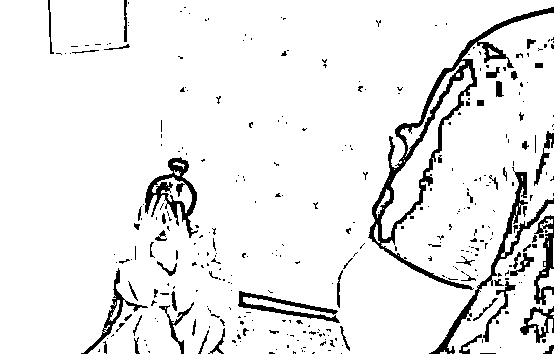

# 当你被“网恋女友”拉黑了

> 原文：[`mp.weixin.qq.com/s?__biz=MzIyMDYwMTk0Mw==&mid=2247501402&idx=4&sn=690e7f54b568d89464b9f0f348f3884d&chksm=97cb0d62a0bc8474bff3f3e7d510e5b8a5e2b6d8f434bbb8189949da0b5a04cd2755652e09e8&scene=27#wechat_redirect`](http://mp.weixin.qq.com/s?__biz=MzIyMDYwMTk0Mw==&mid=2247501402&idx=4&sn=690e7f54b568d89464b9f0f348f3884d&chksm=97cb0d62a0bc8474bff3f3e7d510e5b8a5e2b6d8f434bbb8189949da0b5a04cd2755652e09e8&scene=27#wechat_redirect)

**点击上方蓝色字体免费订阅“灰产圈”**

山东省青岛市公安机关破获了一起特大电信网络诈骗案，16 日上午，121 名涉案嫌疑人被押解回青岛市。

**摄影：刘卓毅**

**点击↓观看现场抓捕视频**

[`mp.weixin.qq.com/mp/readtemplate?t=pages/video_player_tmpl&action=mpvideo&auto=0&vid=wxv_1430859212640436225`](https://mp.weixin.qq.com/mp/readtemplate?t=pages/video_player_tmpl&action=mpvideo&auto=0&vid=wxv_1430859212640436225)

去年 6 月，储先生被一名陌生女孩添加了微信好友，经交流后发现，对方竟是某网络直播平台的美女主播。

储先生按照这名女孩的指引，登录进入了女孩所在的网络平台直播间，并慢慢成了女孩的忠实粉丝。

随后，这位“美女主播”竟在线下通过微信向自己主动示好，两人很快通过微信谈起了恋爱。

接下来，已经成为自己“网恋女友”的美女主播却频频遭遇不幸，业绩不好被领导批评、妹妹学费不够、母亲癌症需要手术……

痴情的储先生大动怜香惜玉之心，每次都有求必应，多次在“女友”直播时慷慨打赏，共计花费 9.7 万余元。

然而，当“女友”又以类似理由向储先生要求援助时，储先生已囊中羞涩。这时的“女友”却没有了与他继续聊天的耐心，直接将其微信拉黑。最终，怀疑被骗的储先生选择向警方报案。

接到报案后，警方立即组织对该直播平台注册信息、受害人充值资金流向等进行深入研判，成功锁定并于今年 1 月赴外地抓获该网络女主播褚某（女，22 岁），同时顺线发现，该案借助网络直播平台的合法外衣实施团伙作案，存在上、下游多个犯罪窝点，涉及受害人众多。

对此，青岛市公安局迅速成立由刑警支队牵头的专案组，在山东省反电信网络诈骗中心的指导和青铁公安处、当地公安机关的配合下，深入侦查研判，精心扩线布网，于近日组织警力辗转千里赶赴该诈骗团伙所在地，为实施全面收网做好了充分准备。

7 月 14 日下午 4 点整，随着现场指挥部一声令下，布控在 8 个诈骗窝点的近 500 名警力同时收网，将总计 151 名窝点成员（其中 30 名已移交当地警方处理）悉数抓获，并依法扣押涉案电脑、手机、银行卡、账目材料等物品一宗。

因该案存在抓捕行程远、涉案人数多、关键电子证据易灭失等困难，青岛市公安局共组织 10 余个分市局以及网警、特警、警务保障等警种部门和市反诈中心警企合作实验室共同参与，先期派出摸排组对各个窝点的实际位置、结构布局、人员组成、作息规律等进行详细调查，精心制定了现场抓捕、勘查取证和看押带离方案，有力确保了收网行动的圆满成功。

警方现已查明，该 8 处窝点涉嫌以文化传媒公司名义借助以上网络直播平台的主播实施电信网络诈骗犯罪行为。

在其中一窝点的查处现场，办案民警发现，该团伙办公地宽敞整洁，还为员工设置了“成果展览室”、乒乓球桌、台球桌、游戏机等文娱设施，俨然一家正规公司。

该诈骗团伙内部组织严密，招商总监、客服主管、主播、业务员、平台维护等岗位分工明确。

据办案民警介绍，该诈骗团伙的每处窝点大约有 20 人，其中 2 至 3 名为女主播。女主播主要负责在线上与平台会员互动。

**每个女主播还会配有 3、4 名业务员，主要负责通过微信以该主播名义与受害人“联络情感”，在时机成熟后便虚构主播父母离异、近亲属患病、承担家庭负担重等生活不幸，骗取受害人信任和同情，并故意营造可以与受害人进一步发展恋爱关系的氛围，引导受害人通过直播平台观看直播并向其打赏。**

每次主播上线前，业务员会将各自与受害人的联络情况通报给主播。主播再结合业务员联络的信息情况，在直播间编造自己过生日、身体不舒服、公司搞活动、需要完成打赏业绩后早点下播等理由，诱使受害人不断充值打赏。

有时，业务员也会假装会员在直播间起哄或辱骂主播，诱使受害人产生嫉妒或同情心理，从而不断在平台充值后为主播“刷礼物”。

“借助网络直播平台实施诈骗行为，已经涉嫌违法犯罪。”据警方介绍，在本案中，虽然直播平台的获利为受害人的自愿打赏消费，但无法掩盖其在骗取受害人信任的基础上诈骗钱款的事实。

青岛警方提示，近年来，电信网络诈骗案件比重较往年有所增多。请市民在借助网络平台娱乐时，要注意甄别和防范，切莫轻易转账或消费，防止因上当受骗产生不必要损失。

编辑：吴明泽 责任编辑：寒冬 来源：青岛公安、北晚新视觉

← 向右滑动与灰产圈互动交流 →

**点击****阅读原文****加入灰产圈高端社群**

