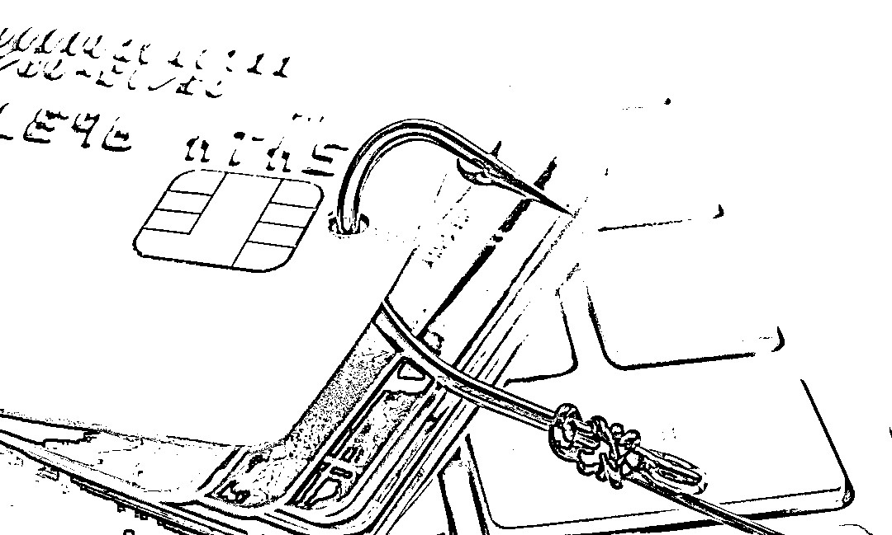
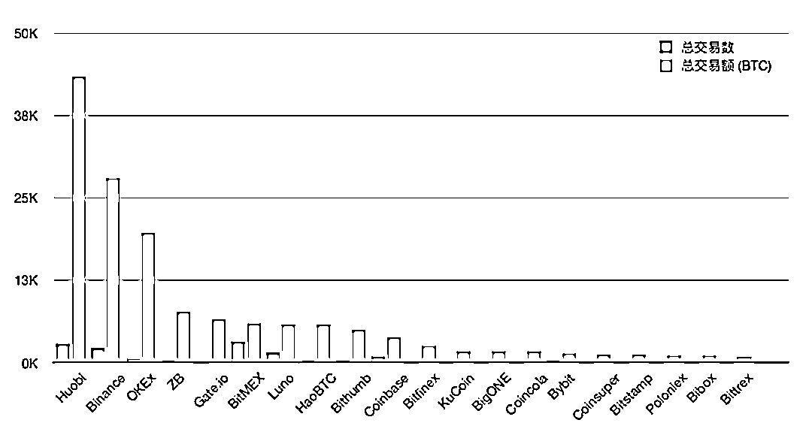
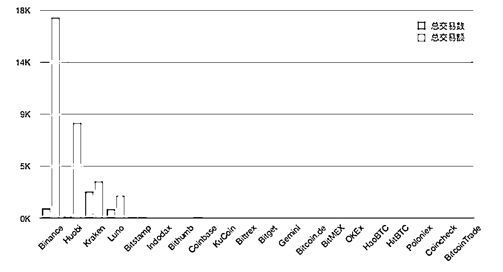
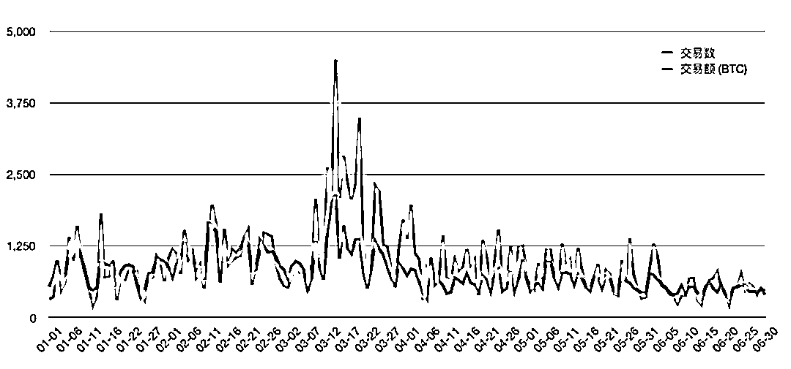
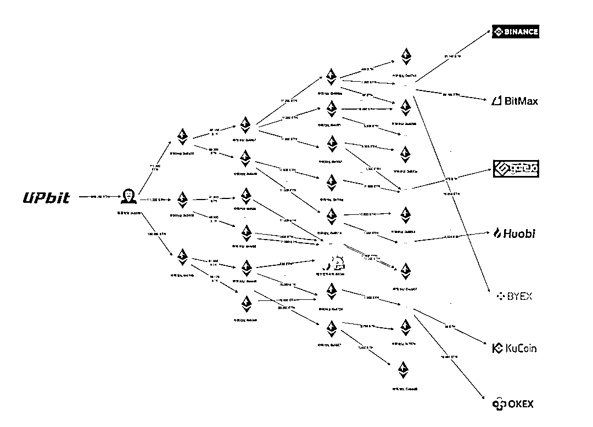
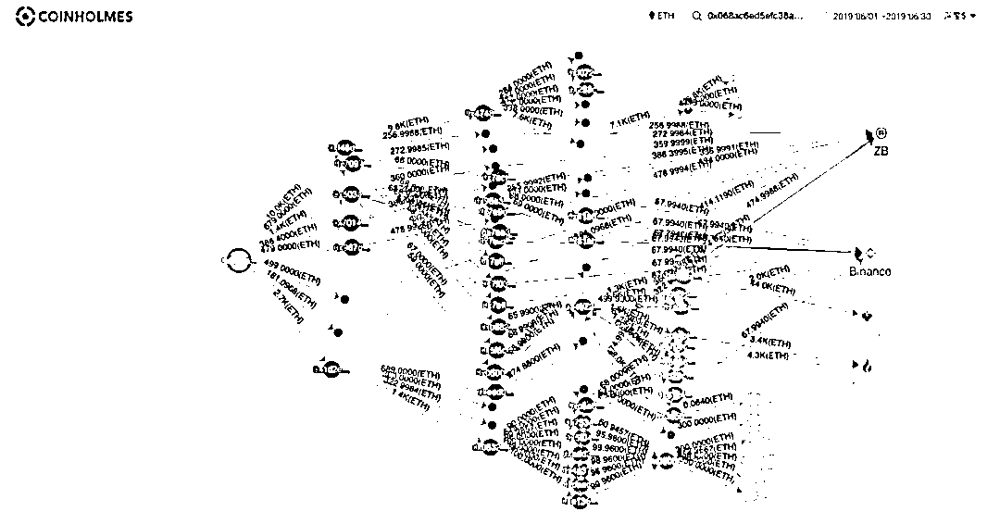
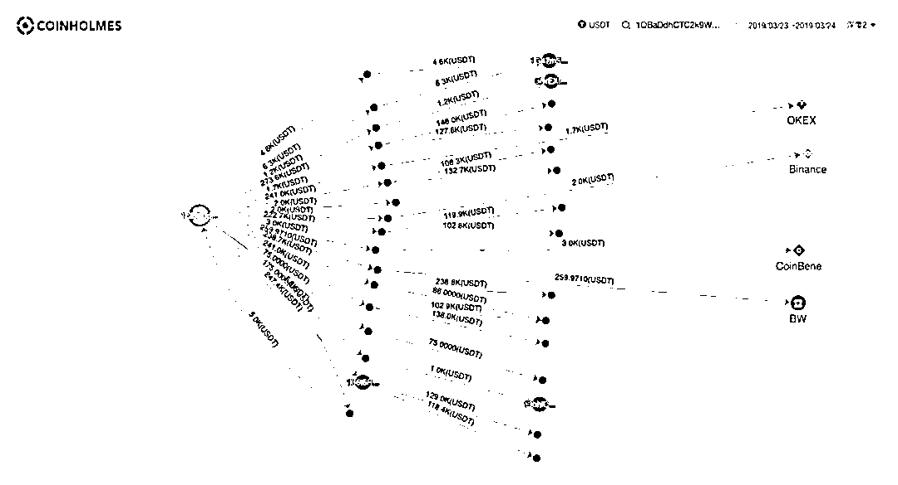

# 交易所成黑钱胜地：“冻卡潮”背后的秘密

> 原文：[`mp.weixin.qq.com/s?__biz=MzIyMDYwMTk0Mw==&mid=2247501460&idx=3&sn=1143b9a592a02bd083c3bfa3bd459f0b&chksm=97cb0daca0bc84bacbbd096862a9fc0e2c31d5fd9db7b2aec1c4c440a24fb9bb10494602cc6f&scene=27#wechat_redirect`](http://mp.weixin.qq.com/s?__biz=MzIyMDYwMTk0Mw==&mid=2247501460&idx=3&sn=1143b9a592a02bd083c3bfa3bd459f0b&chksm=97cb0daca0bc84bacbbd096862a9fc0e2c31d5fd9db7b2aec1c4c440a24fb9bb10494602cc6f&scene=27#wechat_redirect)

**点击上方蓝色字体免费订阅“灰产圈”**

6 月 4 日起，一场涉及 4000 余张银行卡和大量 OTC 商家的“冻卡潮”引发了场外交易者的关注和恐慌。随着“冻卡潮”席卷币圈，场外交易者人人自危，不少 OTC 商家更是直接撤单关机以求自保。 

据了解，“冻卡潮”的直接原因是相关部门严查电信诈骗和资金盘，而数字货币交易所的 OTC 交易区恰好是电信诈骗和资金盘用以洗钱的重灾区。 

**据区块链安全团队 PeckShield 旗下数字货币资产追踪平台 CoinHolmes 数据显示，仅 2020 年上半年，包括黑客攻击、资金盘、暗网、赌博等在内的加密货币地址，共计流入数字资产交易所 13927 笔高风险资产，合计 14.7 万个 BTC（时价折合近 14 亿美元，98 亿元）。CoinHolmes 的数据还追踪到，赃款主要流入到火币、币安、OKEx、中币 和 Gate.io 这五家数字货币交易所。**

在复杂、不确定的政策环境下，加密资产交易所拥抱监管、合规经营是减少法律风险的必要条件，也是交易所长久发展的根基。而在交易所合规的过程中，KYC（了解你的客户）和 AML（反洗钱）又是最通用和基础的要求。

2019 年 6 月，FATF（世界反洗钱金融行动特别组）表示要对数字资产市场进行监管，要求 VASP（虚拟资产服务提供商）在 2020 年 6 月前开始执行 FATF 的监管要求。而根据 FATF 近期召开的全体会议要求，FATF 将在未来一年继续监视虚拟资产市场的洗钱和反恐融资方面的风险，且届时将会审查其标准的事实和影响，对监管实施情况进行验收工作。

赃款的流入让交易所也十分苦恼，绝大部分团队都积极配合警方调查，并接连出台反洗钱措施。但目前依然防不胜防，交易所的合规化进程也受到这些赃款的严重影响。 

**本文，Odaily 星球日报联合 PeckShield，将从数据和技术维度分析赃款如何流入数字货币交易所并洗白，以及交易所如何处理这些赃款，全方位审视数字资产市场面临的 AML 反洗钱问题。**

**半年时间，14 亿美元高风险**

**资金流入加密交易所**

据区块链安全团队 PeckShield 旗下数字资产追踪平台 CoinHolmes 数据显示，**截至 6 月 30 日，CoinHolmes 统计了 101 起⿊客攻击事件，共计赃款 25.91 亿美元，其中⾄少 1,482 万美元已经流⼊交易所；**此外，还有 32 个包括 TokenStore、PlusToken  等在内的理财钱包或资⾦盘诈骗案件，受影响⼈群超百万，共涉及资产 75.18 亿美元，其中至少 2.1 亿美元已流入交易所。

当然，⿊客攻击和资⾦盘只是统计⾼风险地址中的⼀部分，整体⽽⾔，CoinHolmes 对标记为⾼风险的地址进⾏了针对性监控发现，**过去 6 个⽉共计流⼊数字资产交易所 13,927 笔⾼风险资产，合计 14.7 万个 BTC（时价折合超过 14 亿美元，98 亿人民币）。 **

CoinHolmes 将涉及赃款较多的交易所进行了统计，具体如下：

2020 上半年，赃款流⼊交易所情况（图片来源：PeckShield）

2020 上半年，赃款流出交易所情况（图片来源：PeckShield）

**通过对比上述两张图我们发现，交易所流入赃款规模要远高于交易所流出赃款的规模，说明交易所在赃款流动过程中起到了一定的拦截作用。**

在此，我们将本篇文章的统计数据语境设定为：覆盖 BTC、ETH、EOS 三条主链的总计近 1 个亿个地址标签，其中高风险地址包含交易所、服务机构、暗网、混币服务商地址、跨链中心化倒卖机构以及涉及非法攻击的黑客地址等，而凡涉及到高风险地址（例如暗网）的资产，统称为赃款。

**混币服务器和中心化倒卖机构**

**分别是如何帮助洗钱的？**

据 PeckShield 安全团队分析，链上发起的资产可通过资金打散、多账号转移、混币服务机构、去中心化交易所、中心化倒卖机构、DeFi 等不同的通道找到“出口”，这些中间环节犹如“黑盒子”，让资⾦流向变得错综复杂且难以追踪。

以混币服务为例，PeckShield 监控中的高风险地址，仅流入混币服务商的资金至少就有 15.9 亿美元，而混币机构利用了比特币 UTXO 特性（一笔交易可以有多个输入和输出），同时输⼊很多洗钱地址，然后在找零环节混⼊其他正常交易，进⽽将资⾦流向秩序打乱。

这让进入混币器的资金更难被技术追踪到，也使得混币服务商成为常见的洗钱路径。

已统计混币服务商的资⾦吸纳情况（图片来源：PeckShield）

常见的混币器是基于 CoinJoin 协议开发的，以 CoinJoin 协议为例，其构建了“多个交易发送者地址转给多个交易接收者地址”的交易行为，以此让追踪者无法建立输出地址与追踪事件的强关联，从而达到擦除痕迹的目的。

不过，混币并不意味着这批数字资产将不再被追查到，只是让真实流向变得更加复杂。以 PlusToken 为例，涉案资金不断被“混币”，大额资金被拆分为数量众多的小额资金，使得追踪目标分散化，增加了追踪所需的资源和人力成本。 

除了流入混币服务工具，还有⼀部分被盗资产会流向 ChangeNow、 CoinSwitch 等中心化倒卖机构。由于这些机构不需要用户 KYC，可人工协助倒卖各类数字资产，所以也成为⼀种⽐较主流的洗钱通道。 

以韩国交易所 Upbit 被盗为例，2019 年年底， Upbit 交易所遭受⿊客攻击损失了 3.4 万个 ETH。在过去的半年，⿊客⼀直持续进⾏资产转移、切割、分散转移、混币、洗钱等操作，终于在近⽇清洗了全部资⾦。

**如下图所示，⿊客在攻击 Upbit 交易所得⼿后分了四层转移，最终资⾦分别流⼊了币安、BitMax、Gate.io、Huobi、BYEX、KuCoin、OKEx 等交易所。**

Upbit 项⽬赃款流⼊交易所情况分析（图片来源：PeckShield）

2019 年 6 月 10 日，理财钱包 TokenStore 被曝疑似跑路，在已统计范围内，至少数千名用户的上亿元资产被卷走，包括 BTC、ETH、ETC、XRP、EOS、LTC、USDT 等多个主流加密货币。

TokenStore 资产转移路径（ETH 部分资产流向）

2019 年 3 月 24 日，DragonEX 交易所遭到黑客入侵，导致大量用户和平台的数字资产被盗，被盗的数字货币资产包括：BTC、ETH、EOS、XRP、ETC、USDT 等。

DragonEX 龙网被盗资产转移路径（USDT 部分资产）

**交易所如何处理流入赃款？**

看完上面的数据分析和原理解释，相信你已经对洗钱⽣态的复杂性有了一定的认识。

在此，我们需要明确一件事，赃款最终流入交易所并非交易所的问题，交易所很难完全有效识别资金的合法性，也是赃款流入的受害者之一。为此，对于头部的交易所，如何建立一套成熟的风控制度来防止赃款自由流动，尤为关键。

Odaily 星球日报联系了上文出现过的交易所中的五家代表，火币、币安、OKEx、中币和 Gate.io，询问他们如何处理流入交易所的赃款。截至发稿，火币、OKEx、中币和 Gate.io 向我们介绍了其风控系统，币安尚未回复。

**下面我们具体来看一下这四家头部交易所在应对赃款流入上有哪些相同与不同？**

OKEx 相关负责人向 Odaily 星球日报介绍，OKEx 目前已经创建起基于区块链的大数据风控系统，专用于风险的监测，分析和处置。在策略方面，OKEx 目前已经提炼近千条风控规则，部署在全场景业务线，覆盖账户完整生命周期。在模型方面，OKEx 目前已建立多个机器学习模型，可有效识别撞库、木马、钓鱼、破解、社会工程学诈骗等欺诈手段，实现小时级的风控模型调整。

对于处理流入的赃款赃款，OKEx 一般的流程是识别赃款，随后配合监管部门冻结相关账户，最后进行严格的 KYC 以及出示关于资金合法来源的证明，OKEx 才会解冻相关账户。根据 OKEx 的后台数据显示，仅在今年 6 月，OKEx 就已冻结了数百个可疑账户。

火币相关部门负责人对 Odaily 星球日报表示： 关于“黑币”流入火币的问题，事实上，“黑币”流入是一个普遍现象，火币是全球最大的数字资产交易所之一，因市场份额大，充提量高，“黑币”流入的情况也难以避免。 

根据实际运营情况来看，大部分追踪机构看到的“黑币”流入，实际上均来源于用户私下在场外 OTC 交易来的资产，私下场外交易的形式使得链上看起来单纯的转账情况变得不单纯。另外，链上的转账关系并不像数据呈现般简单转移，一些资金盘私下诱导用户在火币买币以后提币到资金盘交易，参与资金盘用户套现的时候可能会提币回火币，也会造成所谓“黑币”的流入。当然，也存在一些攻击者、盗号者直接进来洗钱的情况。

而针对此类事件，火币称其有完备的风控系统和严格的流程对这类事件进行处置。

火币拥有 KYC、KYT（Know Your Transaction）和 AML 以及链上监控系统。依赖火币自身的安全情报体系，从事件、地址、资产跟踪等层面，实时监控全量流入火币的资产，并会视情况根据触发的不同风控策略，对可疑交易启动风控措施。当发现有可疑资产时，会自动限制流入目标账户的提币，对可能导致用户资产造成损失的操作也会有安全提醒。

此外，火币表示也一直积极通过科技助警通道和司法协查手段，积极配合公权力机关打击犯罪，并根据公权力机关的要求采取必要的行动。

Gate.io 对 Odaily 星球日报表示，Gate.io 目前已经针对这些赃款建立了专门的系统，以此监控黑名单地址，包括 PlusToken 的 EOS 地址、Upbit 被黑后转移的地址等，发现流入资金会立即冻结。Gate.io 现已配合司法机关拦截多笔 TokenPlus 和 Upbit 的资金流入。

另外 Gate.io 也有自己的 KYT 平台 block.info，可以关联任意地址的相关地址以及控制方，将可疑活动与现实世界的实体联系起来，对可疑钱包实时监控。

中币相关负责人告诉 Odaily 星球日报，中币平台内部自建一套黑币地址名单，并不定期有专人更新，系统监测到黑币地址一经转入到中币平台，马上冻结该账户；法币交易区的广告主，可灵活设置交易对手的多维度条件，比如交易 T+1 天才能提币等，防范黑钱及黑币转移。另外，中币在其网站和 app 设置了“全民一键举报”按钮，用户可快速便捷地举报其认为可疑的其他客户。

**交易所反洗钱面临的最大挑战**

从上文各家交易所回复的应对流入赃款的处理方式来看，Odaily 星球日报发现，头部交易所都已着手建立应对赃款的防控机制，并正在逐渐完善。

事实上，近两年数字货币交易所们预警和防范赃款流入的意识相较 2018 年之前，已经有了显著提高，但是在用户教育上依旧有很长的路要走。

拿 6 月份发生的冻卡潮来说，某头部交易所内部人士向 Odaily 星球日报表示：“你敢相信吗？一个在币圈待了四年以上的微博大 V，在发现自己被冻卡之后，疯狂给我们打电话，破口大骂地让我们给他解冻。他连冻卡和冻币都没分清楚，还以为是我们冻了他的银行卡。”

交易所没有权利冻结任何用户的银行卡，这个权限属于银行，在发现一笔交易异常时，交易所只有冻币的资格，然后等待警方介入调查。

目前绝大部分国家、地区针对数字货币交易的立法、监管都不明确，地⽅司法或公安系统虽然接到了⼤量关于区块链诈骗相关的案宗，但⽬前没有明确的法律政策供参考执⾏，因此这类案件⽴案程序⽐较复杂，会存在⼀定时间窗⼝；另外⼤部分交易所都不会在警⽅没有⽴案的情况下私⾃对⽤户的资产进⾏处理，也给犯罪分子洗钱留下了时间。 

**据 PeckShield 介绍，他们经手的案件追踪要经过以下流程：链上黑名单地址搜集监控→黑名单地址资产异动预警→等待受害者线下报警立案→警方介入向交易所取证查证→交易所对目标资产进行冻结→冻结资产的后续分配或拍卖后续。**

目前这一套流程走下来，至少需要 1-2 个自然月，而一笔非法资产从转移到洗钱卖出可能仅需要数分钟。所以 PeckShield 安全团队认为，追查赃款存在的时间窗口问题，才是交易所反洗钱所面临的最大挑战。 

除此之外，上文我们提到的赃款大量流入混币服务器和中心化倒卖机构，也是交易所在反洗钱方面面临的主要风险之一，他们极大地增加了赃款追踪的难度系数和成本。

综上，数字货币交易所目前所面临的反洗钱等合规问题依旧严峻，在处理赃款流入问题上依旧有很大的提升空间，希望在 2021 年 FATF 监管大锤落下之前，交易所们可以探索出更加高效透明的反洗钱处理方案，为投资者提供一个更加安全可靠的交易环境。

**特别感谢区块链安全团队 PeckShield 及其旗下数字货币资产追踪平台 CoinHolmes 对本文提供的数据及分析。**

文 | 王也  运营 | 盖遥  编辑 | 郝方舟 出品 | Odaily 星球日报（ID：o-daily）

← 向右滑动与灰产圈互动交流 →

**点击****阅读原文****加入灰产圈高端社群**

