# 当“黑人抬棺”碰上“坟头蹦迪”，大俗还是大雅？

> 原文：[`mp.weixin.qq.com/s?__biz=MzIyMDYwMTk0Mw==&mid=2247501561&idx=1&sn=13e886c90c13a095387e4958ce107c5c&chksm=97cb0dc1a0bc84d7283e6e2db9a90523773453ffa8d204fc71d083ad09f239fcddaa96a307a8&scene=27#wechat_redirect`](http://mp.weixin.qq.com/s?__biz=MzIyMDYwMTk0Mw==&mid=2247501561&idx=1&sn=13e886c90c13a095387e4958ce107c5c&chksm=97cb0dc1a0bc84d7283e6e2db9a90523773453ffa8d204fc71d083ad09f239fcddaa96a307a8&scene=27#wechat_redirect)

**点击上方蓝色字体免费订阅“灰产圈”**

先来看一下前一阵火爆全球的《黑人抬棺》 

[`v.qq.com/iframe/preview.html?width=500&height=375&auto=0&vid=d0954264wf0`](https://v.qq.com/iframe/preview.html?width=500&height=375&auto=0&vid=d0954264wf0)

黑人抬棺，专业团队，抬棺他们是认真的，跳舞他们也是认真的，俗话说黑人一笑，世事难料，黑人抬棺，不再孤单。

那么放眼国内，不得不说国内某些地区的“坟头蹦迪”文化。

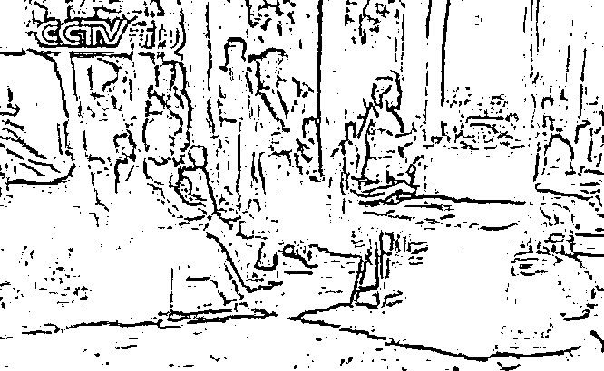

独具特色的坟头蹦迪活动近日再次引爆多家外媒的集中报道。 

英国每日邮报、周刊报道、每日电讯报等媒体以“葬礼脱衣舞”等字眼作为标题吸引了对这项异国风俗略有耳闻的外国网友的高度关注。

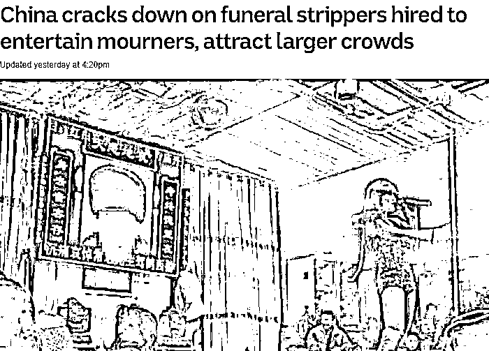

中国打击葬礼上用来吸引更多吊唁者的脱衣舞活动

中国禁止家庭成员聘请色情舞者吸引哀悼者，“葬礼脱衣舞”活动遭到打击

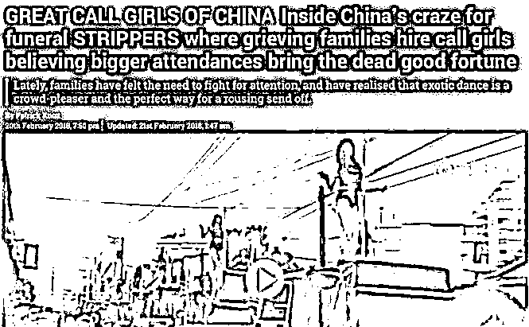

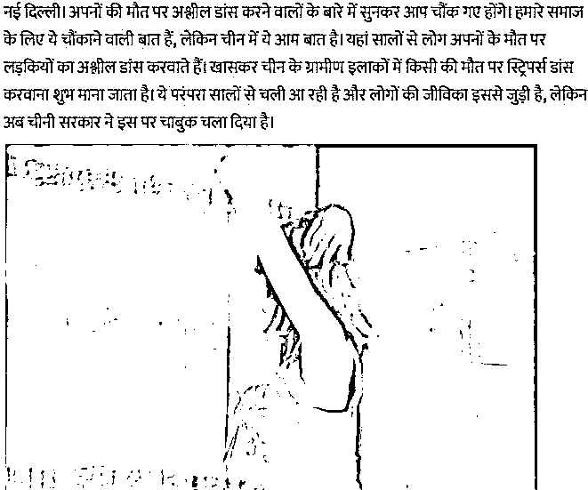

惊闻此事的网友在评论区展露出了他们复杂的心情。

第一次听说这项民俗的网友表示惊讶与困惑，早有见识的网友则为它的谢幕感到些许不舍。

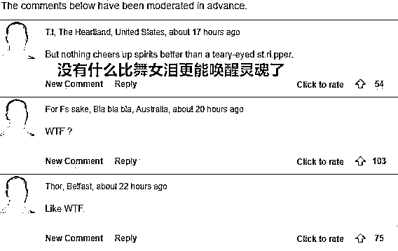

事实上这已经不是外媒第一次报道中国乡村的殡葬艳舞了，官方的打压行动也并非初次。

自 2015 年宣布全面禁止以来，原本不为人熟知的低俗场面却被频频曝光，相反吸引到了更多网友的关注。

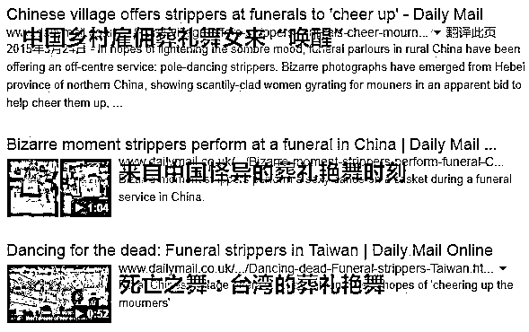

只要被通报查获的葬礼表演事件就会及时出现在各大媒体版面，每一次的华丽现身总能赚足老外的眼球。

毕竟狠料就意味着流量，媒体就怕网友看不够。

> “这太疯狂了。激动的身体告诉我不要忘记悲伤，毕竟这还是葬礼！”
> 
> “真想参加。相信它能让在座的各位感受到生命的美好并且更加热爱它。”

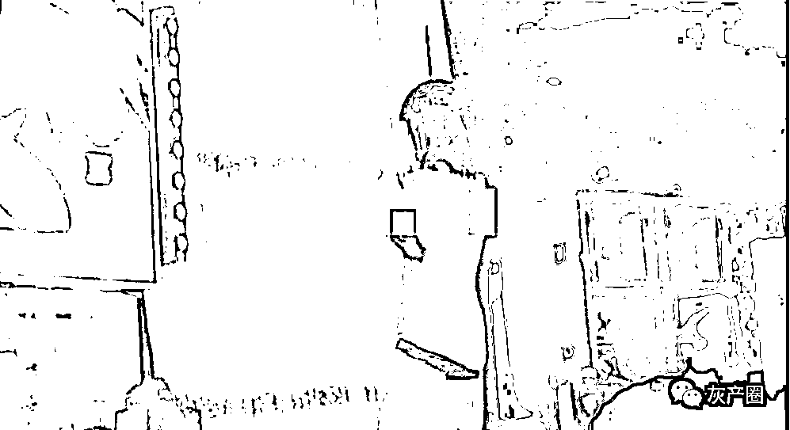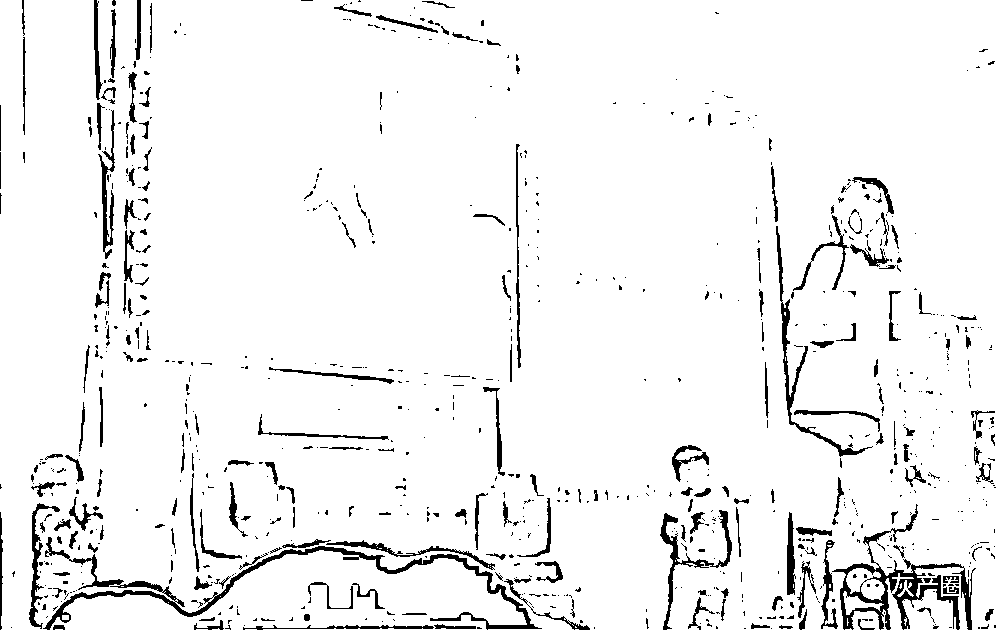

2015 年，河北邯郸某葬礼上的脱衣舞表演

“哦不，还有孩子！感谢这位女士穿着尽可能保守，张弛有度的葬礼艳舞让我肃然起敬。”

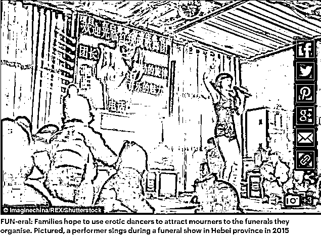

2015 年，一位热辣的表演者在河北某地的一场葬礼上演唱

直接趴在死者棺材上

在这其中，曾有这样一则新闻轰动一时：

“中国台湾省某地惊现 50 位钢管舞女登顶 50 辆吉普豪车摇臀出殡”,场面十分热辣，让人不敢相信这与死人有关。

只见辣妹们穿着性感的衣服，站在一台台吉普车上，大跳钢管舞。

场面十分火热，让人很难相信这事竟然是与死者有关的。

脸书上的网友对此展开热烈讨论。

相比于国内网友对此事的难堪，外国网友则意外地感到欣赏。

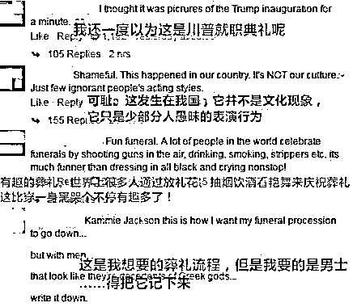

Reddit 上一位叫 plastigoop 的网友在看过这张图片后发表了自己的见解，言辞之中透露敬畏之情。

> “悲喜交加的奇特氛围刷新了人们对葬礼的认知，极端的情绪碰撞彰显生命力的永恒。这是继往开来的隆重仪式，逝者的灵魂永远在观者的心中激荡。”

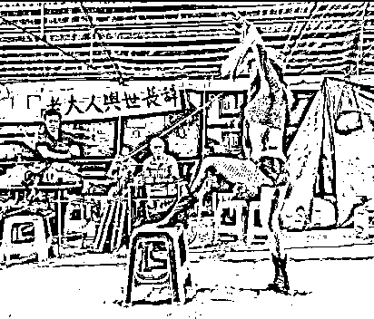

youtube 上拥有百万订阅者的 sourcefed 频道也对此行为进行了演绎。为还原香艳葬礼的配置，几位主播用简单的方式做出诠释。 

> “一半是伤感，一半是性感，这就是死亡之舞的真谛。”

然而此次的打击行动势必将卷土重来的葬礼艳舞习俗进一步瓦解。

在本为污秽陋习的整治对象里，它却像是一位有故事的女同学让大家深感魅惑想要了解地更多。

每日邮报引用了国内的环球时报的相关报道进行讲解：

> “这一民俗活动兴起于上世纪 90 年代的中国，至今广泛流传于各大乡村地区，有一定的文化基础。”

福建师范大学社会学与历史系教授黄建兴向环球时报表示：

> “一些地方通过艳舞表演吸引更多吊唁者参与葬礼，用来表达死者对生者的祝福，有着生生不息的寓意在里面。”

另一位专家则道出真谛，“农村文娱资源匮乏，人们只能通过低级娱乐满足需求。通过‘性’来诠释‘生’并与死亡相联结，归根结底是一种生殖崇拜的体现。”

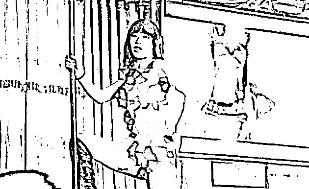

然而不少物质生活过于丰富的西方网友却对此表示不解。

他们声称殡葬艳舞的风俗值得大力效仿，毕竟生活已经够无聊，死后总得有趣一下。

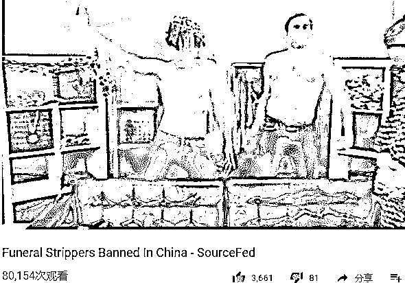

为什么我们西方不能有这个？

加拿大和英国的葬礼都太无聊，有酒有舞娘有烟花的葬礼才有趣。

直到一位网友在论坛上表示愤怒：自己祖父的葬礼照片被表弟 p 了一位钢管女郎。

随即这一想法从他的脑中消失了。

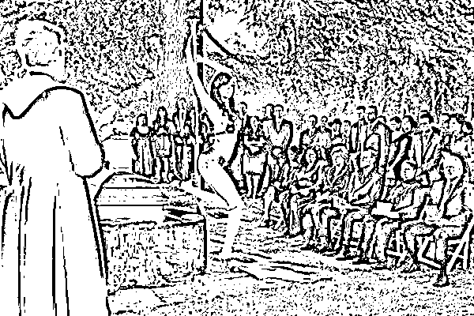

**这就是所谓站着说话不腰疼，轮到自己就慌了神。**

← 向右滑动与灰产圈互动交流 →

**点击****阅读原文****加入灰产圈高端社群**

