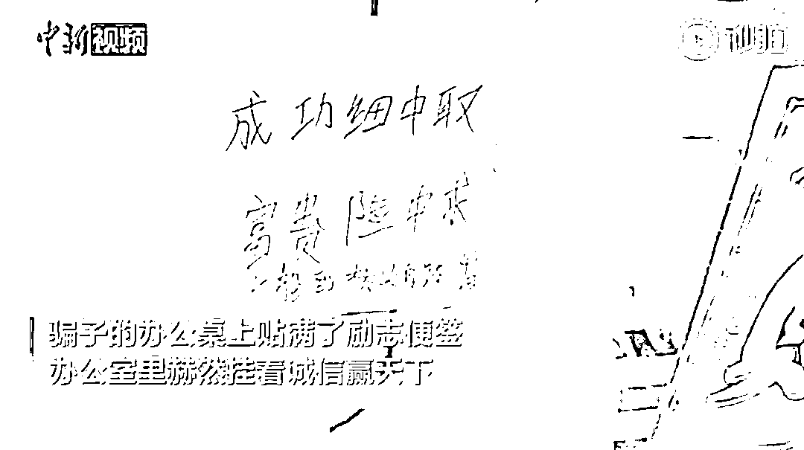
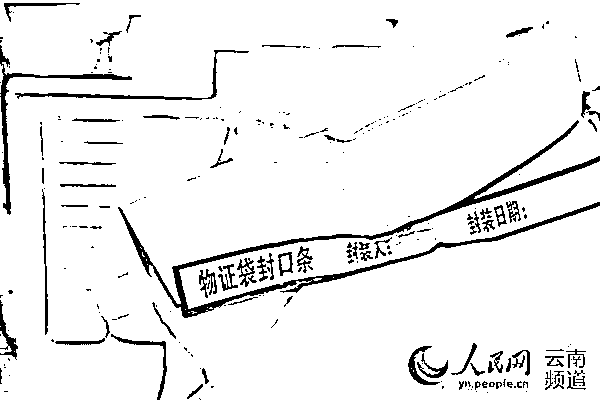
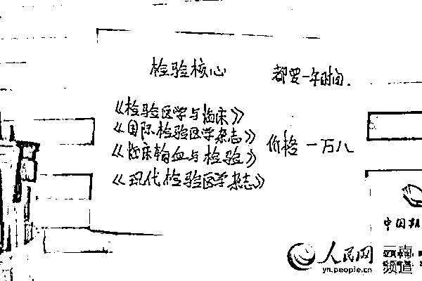
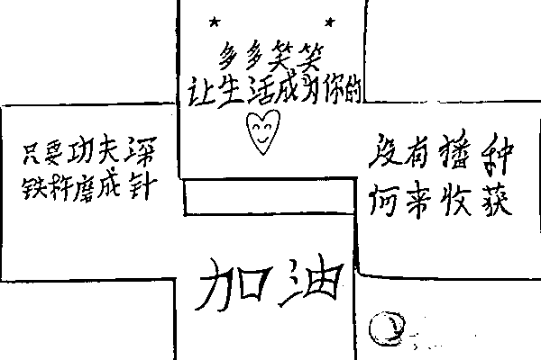
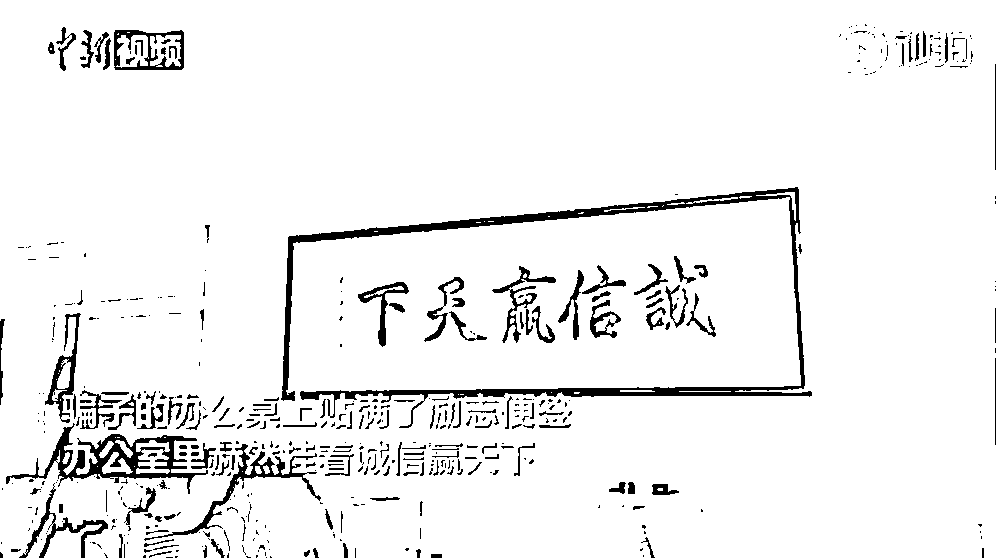
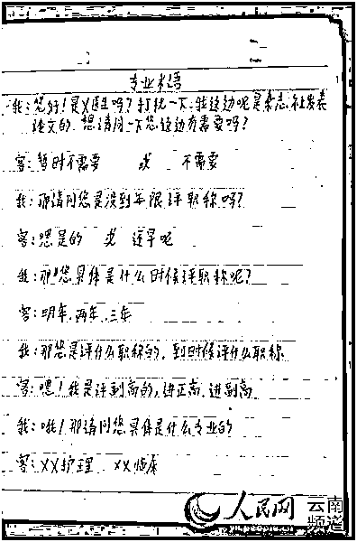
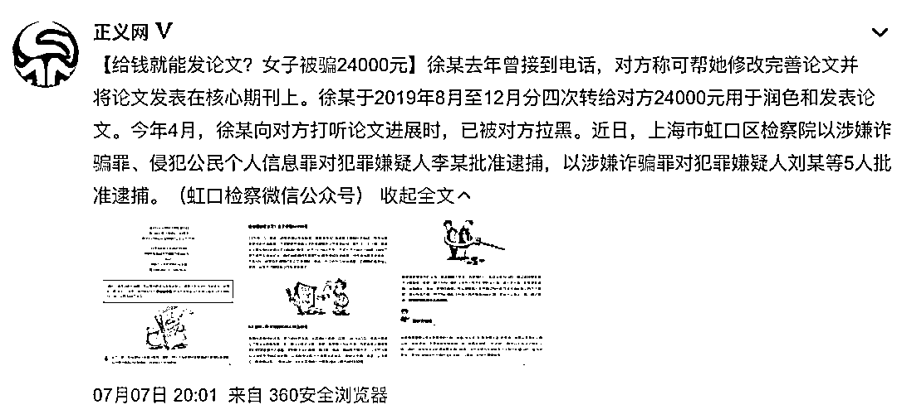
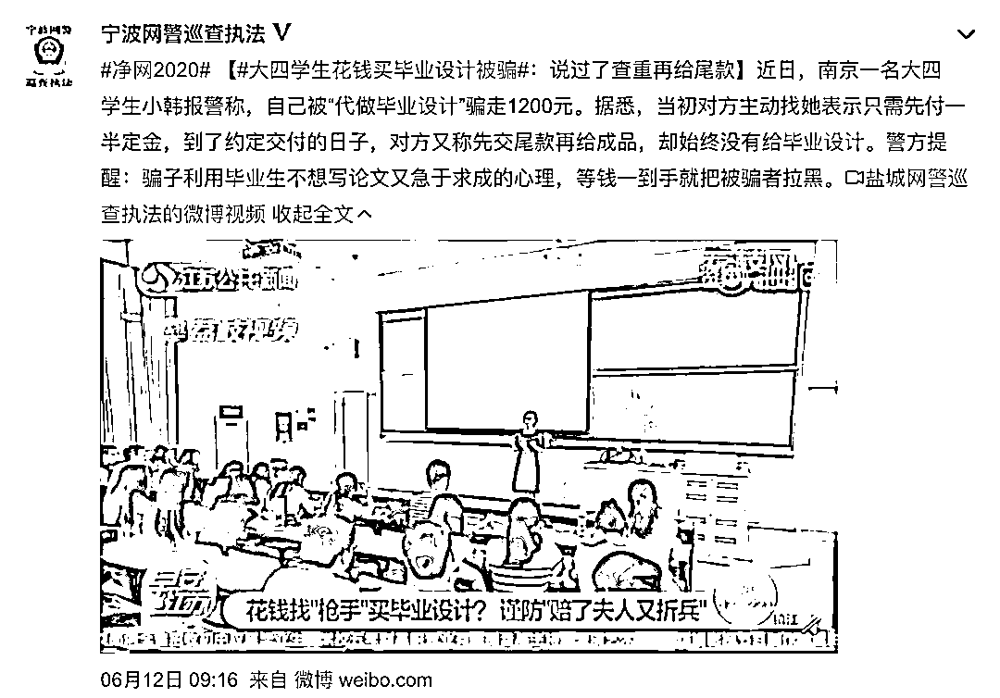

# “我”在骗子公司看到了“诚信赢天下”！

> 原文：[`mp.weixin.qq.com/s?__biz=MzIyMDYwMTk0Mw==&mid=2247501561&idx=2&sn=80dedc745ce0cf674cbb709a266e05b3&chksm=97cb0dc1a0bc84d79d7c1f09edd05ba574f4444534d359c94bc65caef8e76d95e186b61dc968&scene=27#wechat_redirect`](http://mp.weixin.qq.com/s?__biz=MzIyMDYwMTk0Mw==&mid=2247501561&idx=2&sn=80dedc745ce0cf674cbb709a266e05b3&chksm=97cb0dc1a0bc84d79d7c1f09edd05ba574f4444534d359c94bc65caef8e76d95e186b61dc968&scene=27#wechat_redirect)

**点击上方蓝色字体免费订阅“灰产圈”**

**“诚信赢天下。”**

**“成功细中取，富贵险中求。”**

如此励志的标语，竟然出现在了诈骗团伙的办公室。

近日，云南昆明刑侦支队协助江苏泰州姜堰警方捣毁了一个以“买卖、代发论文”为由实施诈骗的犯罪团伙。

**这伙只有初高中文凭的犯罪嫌疑人，诈骗的对象大多****竟****是博士、副教授等高知群体。**

***以为给钱就能发论文***

***结果被骗 8500 元***

一次偶然的机会，41 岁的王女士听说网上有人做“代发论文”的生意，声称只要给钱，国家级刊物都能上。

2019 年 5 月，王女士通过网页上的微信号联系了对方。商定好价格后，王女士便给了对方 3000 元定金，约定文章写好经王女士确认后再行刊发。

之后，**骗子团伙借包发表为由，保证只要给“发稿费”就能上国家级期刊，又收取了王女士 5500 元余款。可这次转账后，王女士就再也没联系上对方，这才意识到被骗了。**

王女士报警后，民警很快锁定以黄某为首的犯罪团伙。**2020 年 5 月，警方一举抓获了包括黄某在内的 11 名犯罪嫌疑人，现场扣押手机、电脑等物品百余件。**

[`mp.weixin.qq.com/mp/readtemplate?t=pages/video_player_tmpl&action=mpvideo&auto=0&vid=wxv_1421293469448159232`](https://mp.weixin.qq.com/mp/readtemplate?t=pages/video_player_tmpl&action=mpvideo&auto=0&vid=wxv_1421293469448159232)

***2 年作案 1000 余起 ***

***嫌疑人大多初高中文化***

经查，**这伙嫌疑人大多只有初、高中文化，根本不具备代写专业文章并发表的水平。**一般情况下，他们是根据对方的发稿期刊级别和发稿字数收取 5000 至 9000 元不等的代写和发稿费，收到转账后承诺 3 个月之内在指定刊物上发表。

**而事实上他们不会向指定刊物投稿，如果对方反复催，他们就会随便将文章发到一些没有期刊号的业余杂志上应付了事，或者直接不予回复。**

**由于代写、代发表文章本身是不光彩的事，尽管受害人收到的代写文章质量很差、不能发表，但很多人发现被骗后还是选择不报警。**

该团伙正是掌握了受害人的这一心理，2 年内疯狂作案 1000 余起，诈骗金额超过 600 万元。

***“诚信赢天下” ***

***为了骗人，他们也拼了***

抓捕现场，骗子的办公桌上贴满了励志便签：

**“只要功夫深，铁杵磨成针”“成功细中取，富贵险中求。”**

**更让人啼笑皆非的是，办公室里赫然挂着“诚信赢天下”的标语。**

桌上还有厚厚的一摞专业书、笔记详实的诈骗话术本......

近日，随着最后一名犯罪嫌疑人到公安机关投案，该犯罪团伙 12 名嫌疑人全部落网。

目前，相关犯罪嫌疑人已被依法采取刑事强制措施，案件仍在进一步办理之中。

***类似案件频发***

***民警提醒：勿随意听信网络广告***

记者搜索发现，**利用代写代发论文行骗的案件不在少数，骗子的作案手法也几乎相同。**

对此民警提示

不要随意听信网络广告

试图走捷径、“抄近道”

就会让不法分子有机可乘

**遇到要求通过微信、支付宝等方式**

**转账至个人账户的情况**

**一定要谨慎对待**

**再三核实**

**一旦发现被骗**

**请立即报警**

**切勿让犯罪分子逍遥法外**

**欺骗更多受害人**

来源：中国青年报综合人民日报、中国新闻网、东方网等监制：于卫亚 编辑：陈子夏、李昂 实习：廖婧、苏汇智

← 向右滑动与灰产圈互动交流 →

**点击****阅读原文****加入灰产圈高端社群**

