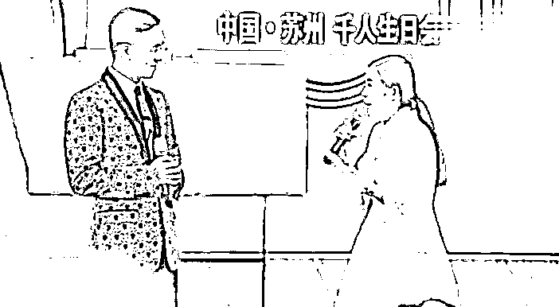
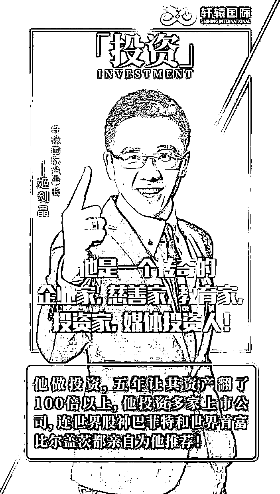
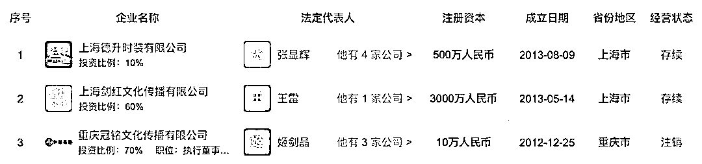
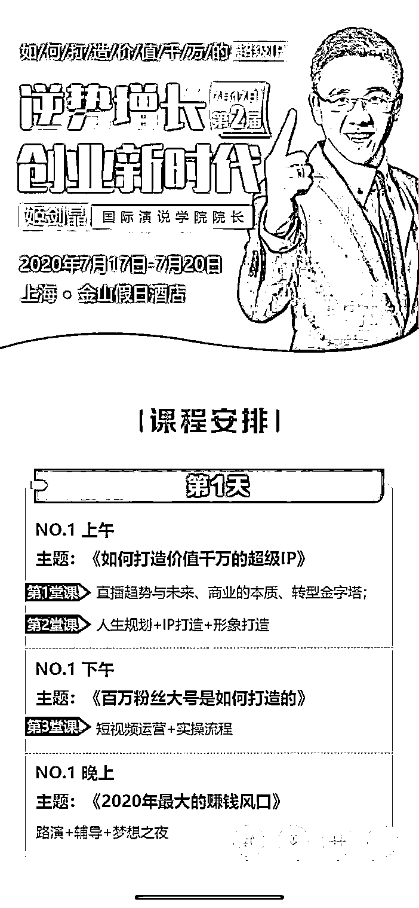

# “女神童”岑怡诺背后的成功学大师：总裁班 19800 元，20 万当终身弟子

> 原文：[`mp.weixin.qq.com/s?__biz=MzIyMDYwMTk0Mw==&mid=2247501612&idx=1&sn=9fa9755d3206cfde8a8a3178f251ac8f&chksm=97cb0c14a0bc8502216f4c4ff3384a4c0f0d5b9b67440d76064bb083c039f223aa175caedbc9&scene=27#wechat_redirect`](http://mp.weixin.qq.com/s?__biz=MzIyMDYwMTk0Mw==&mid=2247501612&idx=1&sn=9fa9755d3206cfde8a8a3178f251ac8f&chksm=97cb0c14a0bc8502216f4c4ff3384a4c0f0d5b9b67440d76064bb083c039f223aa175caedbc9&scene=27#wechat_redirect)

**点击上方蓝色字体免费订阅“灰产圈”**

“我们问候全场最有能量、最有梦想、最有格局的企业家们，大家现在好！”视频中，身穿白裙、一脸稚气的女孩老练地对着台下的人们问好。 

紧接着，她用刻意的语调连续喊问道，“你们的状态好还是不好？此时你们的心情好还是不好？那你们好的欢呼声在哪里？”伴随着适时响起的 DJ 音乐，女孩成功活跃了现场的气氛。最后她举手翻转了一下手腕，娴熟地示意人们停止欢呼，开始了“假如有这样一个小女孩”的演讲。在演讲中，她始终保持着亢奋的状态，不时熟练地向现场观众讨要掌声和寻求互动。

女孩名叫“岑怡诺”，这个名字一度占据了近日微博热搜前几名的位置。引发争议的岑怡诺的一份简历，上面显示，年仅 14 岁（2018 年）的她已经出版了两本诗集和一部小说，一天能写 300 首词牌、2000 首诗和 15000 字小说，还是两个商业品牌创始人。

很快，有媒体调查出岑怡诺“神童”简历里隐藏巨大水份，诗集和小说是自费出版在亲朋好友中传阅，写诗写词的速度其实就是打字速度，品牌也是空话。

“神童”一天之内翻车，对她的嘲讽成为微博上新一轮的热点。

而“神童”背后，除了岑怡诺的父亲，还有一个极其重要的人。

 演讲时的岑怡诺和导师姬剑晶。图片来源：演讲视频截图 

网上流传的多个岑怡诺在不同场合演讲的视频显示，演讲内容、流程、互动套路近乎一致。演讲中，她都讲述了自己“成功”前的生活状态：家中负债累累，自己无心上学，年仅十一二岁就“觉得生活失去了方向”。

但在 2017 年，一位名叫“姬剑晶”的男人出现，让她的生活发生了巨大的改变。

# 

啊孔子说，“弃老而取幼”，不管老人，只在意小孩子，“家之不祥”。现在全世界都不强调孝道，老人很可怜，都在养老院，然后小孩子越来越嚣张，变小皇帝、皇太后了。而且一个家没有孝道承传，这个家铁定要败掉，所以家不吉祥。而很可贵，我们中国通过《老年人权益保障法》强调子女要尽孝道。这在全世界没有这样立法的。从这些征兆可以看得出来，二十一世纪是中国人的世纪。只要不强调孝道，全人类没有前途。为什么？因为孝是爱的原点。人都不懂得爱人的话，他怎么可能人生会幸福？人类怎么可能会有未来？可是爱的原点又是孝，孝是根，德行的根本。百善孝为先，没有孝道，这个家就要败丧下来了。我们中华民族最重要的德行之一就是敬老、爱老、尊老。从夏商周这个传统一直传了几千年，但是现在这一点做得不好。我们要了解，老人对家庭、对社会奉献了一生，不尊重老人叫忘恩负义。没有老人，哪有子孙？没有老人的努力，哪有现代的成就？再来，老人有非常丰富的人生智慧跟经验，所以尊重老人的人，就能承传这些宝贵的智慧跟经验。而且人老是修来的福报，他能修得长寿就值得我们尊重。所以人的福田分三种，都可以教给我们的孩子。恩田、敬田、悲田。我们感恩老人奉献一生，念他的恩。我们尊重老人，再承传他的智慧经验。一个人交的朋友都比他大很多岁甚至大一倍两倍，这样的人一定比同年龄的人成熟，大家可以仔细去观察。所以恭敬心得大福报，傲慢、轻慢老人折福非常大。我们常说，一个家庭就是一棵大树，爷爷奶奶是大树的根，父母是枝叶，孩子是果实。果农都是在根上施肥，在果子上打药！只有在根上施肥，果子才能有足够的营养。在果子上打药，才能防止果子长虫子。我们对老人要多关爱，对子女要多教育。一个人在孝养父母之时，自己的儿女也看在眼里，父母以身作则孝敬尊长，就是孩子成长最好的榜样。孩子是通过父母的行动，懂得孝的。一个家庭里，如果父母孝顺老人，那么孩子就会孝顺父母，一家人就能和和美美。中国人常讲，百善孝为先。孝是善良的第一步，一个人对父母保持感恩，学会去爱他们，在此基础上才能更进一步去爱别人。如果一个人连自己的父母亲人都不爱，那这个人也绝对不会对别人善良。孝道是中华民族的传统美德，它是所有中国人修养品德的第一步，学会善良的第一步。孝是善的原点，是德行的根本，没有孝，这个家庭就离败落不远了。有事此心不乱，无事此心不空。大事心不畏，小事心不慢。人生的悲欢离合，酸甜苦辣，皆系于心，心若安然，又有什么是真正过不去的呢？心如莲花不着水，又如日月不住空。身在红尘之中，事来则应，事过则无。有所为，或有所不为，心态都平和、静定，如莲花一般洁净、淡雅，不为谁开不为谁落，如日月一般自在、光明，平等无碍。过去心不可得，现在心不可得，未来心不可得。静心，用豁达释放纠结的过去，用坦然迎接不可知的未来。让心静下来，你才能读懂自己、随缘安然。静心，是一种修养，更是一种修炼。物随心转，境由心造，烦恼皆由心生。命里有时终须有，命里无时莫强求，不要强求那些不属于自己的东西，学会适时的放弃。生活中，一个好的心态，可以使你乐观豁达；可以使你战胜面临的苦难；可以使你淡泊名利，过上宁静快乐的生活。人往往把自己看得过重才会患得患失，觉得别人必须理解自己。其实，人要看轻自己，少一些自我，多一些换位，才能心生快乐。所谓心有多大，快乐就有多少；包容越多，得到越多别人的嘴我们无法去控制，但我们可以抱一颗淡然的心去看一切纷扰。心静才能听到万物的声音，心清才能看到万物的本质。沉淀自己的心，静观事态变迁。与人相处，需要讲究方式方法。有些事，需忍，勿怒；有些人，需让，勿究。生活不是战场，无需一较高下。生活正是道场，历境修心。                                                                             啊啊孔子说，“弃老而取幼”，不管老人，只在意小孩子，“家之不祥”。现在全世界都不强调孝道，老人很可怜，都在养老院，然后小孩子越来越嚣张，变小皇帝、皇太后了。而且一个家没有孝道承传，这个家铁定要败掉，所以家不吉祥。而很可贵，我们中国通过《老年人权益保障法》强调子女要尽孝道。这在全世界没有这样立法的。从这些征兆可以看得出来，二十一世纪是中国人的世纪。只要不强调孝道，全人类没有前途。为什么？因为孝是爱的原点。人都不懂得爱人的话，他怎么可能人生会幸福？人类怎么可能会有未来？可是爱的原点又是孝，孝是根，德行的根本。百善孝为先，没有孝道，这个家就要败丧下来了。我们中华民族最重要的德行之一就是敬老、爱老、尊老。从夏商周这个传统一直传了几千年，但是现在这一点做得不好。我们要了解，老人对家庭、对社会奉献了一生，不尊重老人叫忘恩负义。没有老人，哪有子孙？没有老人的努力，哪有现代的成就？再来，老人有非常丰富的人生智慧跟经验，所以尊重老人的人，就能承传这些宝贵的智慧跟经验。而且人老是修来的福报，他能修得长寿就值得我们尊重。所以人的福田分三种，都可以教给我们的孩子。恩田、敬田、悲田。我们感恩老人奉献一生，念他的恩。我们尊重老人，再承传他的智慧经验。一个人交的朋友都比他大很多岁甚至大一倍两倍，这样的人一定比同年龄的人成熟，大家可以仔细去观察。所以恭敬心得大福报，傲慢、轻慢老人折福非常大。我们常说，一个家庭就是一棵大树，爷爷奶奶是大树的根，父母是枝叶，孩子是果实。果农都是在根上施肥，在果子上打药！只有在根上施肥，果子才能有足够的营养。在果子上打药，才能防止果子长虫子。我们对老人要多关爱，对子女要多教育。一个人在孝养父母之时，自己的儿女也看在眼里，父母以身作则孝敬尊长，就是孩子成长最好的榜样。孩子是通过父母的行动，懂得孝的。一个家庭里，如果父母孝顺老人，那么孩子就会孝顺父母，一家人就能和和美美。中国人常讲，百善孝为先。孝是善良的第一步，一个人对父母保持感恩，学会去爱他们，在此基础上才能更进一步去爱别人。如果一个人连自己的父母亲人都不爱，那这个人也绝对不会对别人善良。孝道是中华民族的传统美德，它是所有中国人修养品德的第一步，学会善良的第一步。孝是善的原点，是德行的根本，没有孝，这个家庭就离败落不远了。有事此心不乱，无事此心不空。大事心不畏，小事心不慢。人生的悲欢离合，酸甜苦辣，皆系于心，心若安然，又有什么是真正过不去的呢？心如莲花不着水，又如日月不住空。身在红尘之中，事来则应，事过则无。有所为，或有所不为，心态都平和、静定，如莲花一般洁净、淡雅，不为谁开不为谁落，如日月一般自在、光明，平等无碍。过去心不可得，现在心不可得，未来心不可得。静心，用豁达释放纠结的过去，用坦然迎接不可知的未来。让心静下来，你才能读懂自己、随缘安然。静心，是一种修养，更是一种修炼。物随心转，境由心造，烦恼皆由心生。命里有时终须有，命里无时莫强求，不要强求那些不属于自己的东西，学会适时的放弃。生活中，一个好的心态，可以使你乐观豁达；可以使你战胜面临的苦难；可以使你淡泊名利，过上宁静快乐的生活。人往往把自己看得过重才会患得患失，觉得别人必须理解自己。其实，人要看轻自己，少一些自我，多一些换位，才能心生快乐。所谓心有多大，快乐就有多少；包容越多，得到越多别人的嘴我们无法去控制，但我们可以抱一颗淡然的心去看一切纷扰。心静才能听到万物的声音，心清才能看到万物的本质。沉淀自己的心，静观事态变迁。与人相处，需要讲究方式方法。有些事，需忍，勿怒；有些人，需让，勿究。生活不是战场，无需一较高下。生活正是道场，历境修心。人与人之间，多一份理解就会少一些误会；心与心“不要征服对方”这是夫妻最重要的问题！征服，是夫妻之间经常发生的事情，谈论谁是对的，追究谁是错的！讨论谁伤害了谁，谁过分了！这些，都是大忌。好夫妻，永远都在相互装傻，就是护短！能够护短的，才是真爱！爱啊，别为难对方，别挑剔对方，别指责对方！傻傻地一路相伴。傻，是因为已经决定了，认定了，就没有什么需要再了解、再知道，再改进，再完善的！有进步，接受，没有，也接受！爱，就在那里！一辈子，能够有一个人，好好相爱，多美啊！别去破坏，多大的事情都不值得你去破坏。不要在相爱的人身上动小聪明，动你的精明！要就动你的心。永远不对爱人说假话！永远不去做破坏气氛和心情的事！男人有脾气正常，但男人的脾气可以对天发对地发，却不可以对老婆发。因为不管你心情好坏，别人都可以转身离开，却只有爱人要陪着你，陪你度过心灰意冷，度过意气风发。这一生你会得到很多失去很多，而陪你到最后的人却只有一个。天大地大，都不如身边的女人大。每个人只能慢慢领悟去学习，因为没有多少人可以做好，所以别做只会说不会做的人！夫妻同心，黄土变金。家事无对错，只有和不和，家和才能万事兴！家是讲爱的地方，不是讲理的地方。讲理的地方是法庭。家是有根和有魂的，根和魂是由女人掌控。两个人在一起久了难免会吵嘴，女人在气头上往往说出的话句句似刀，而那个肯留下来和你吵架也不想离开你半步的才是真正爱你的男人！世界上最伟大的力量是爱，最强有力的武器是感动！吵不离，骂不散，打不走，才是爱真正的爱。当你嫌弃身边的女人不够漂亮，有没有想过有很多男人都羡慕她对你这份死心塌地的感情。当一个女人把什么都给你了，你该知足，她看上的不是你有多帅、多有钱，而是她已经做好了和你同甘共苦的准备。当你嫌弃身边的男人不够优秀，有没有想过他没天没夜的努力就是为了让身边心爱的你有更优越的生活条件。当一个男人两手空空肯为你去打拼，你该知足，他看上的不是你有多美、多性感，而是他不想苦了跟他的女人。在一起久了慢慢变成依赖，爱情慢慢变成亲情，就算两个人在一起没有当初的激情，那请别忘了还有感情。当你想要放手的时候，有没有想过当初为什么陪她\他走到这里。在一起久了，就算没有当时那么相爱也要选择相守，这些你们对彼此做到了吗？女人懂相守，男人懂感恩，才是一辈子。之间，多一份包容就会少一些纷争。人生，快乐哪里找呢？信仰里有快乐，修行里有快乐，服务里有快乐，静心里有快乐。心无所求，心想他人，快乐就在我们的心里！做人，简单就好，生活，宁静就好。无事此心不空，有事此心不乱，大事心不畏，小事心不慢。古人讲：一代做官九代冤。官做的好，是为子孙积累福报；做不好，把老百姓的东西占为自己，想留给子孙，这些非分的东西都是罪孽，子孙用了，反而损福报。所以一代做官九代冤。又说，如果为自己一家谋，就不要去做官，做官是为百姓谋，这也是天道无亲。天道虽然无亲，但唯亲善人。你只要广积阴德，还是有用的。想要孩子能读书的，就多做慈善，办学校；想要孩子发财的，就要多救济穷人；想要儿孙健康的，就多施药。这就是唯亲善人。再讲到孝顺也一样。很多人很孝顺，给父母买很多补品，买不必要的东西，甚至办酒席祝寿。世人看来是热闹，其实是不孝，因为损了父母的福报。人家过个寿，就要杀生那么多。民国时，有个老人死了，他儿子办宴席三百桌，过几天，老人家就托梦来说，本来我可以去天上好好享福的，但因为你杀孽过重，导致我在地府审判，还出不来。可见，虽然花的是儿女的钱，但却在损掉老人家的福报。父母花很多无谓的钱，也是损孩子的福报，这也是天道无亲。所以不要给小孩庆生日，小孩能读书，父母不要骄傲太早，到处宣扬。要对孩子严格一些，对他成长大有益处。过分浪费钱给孩子都损孩子福报，更何况很多人在公司里头浪费，甚至国家单位里头浪费，都是损福报的。很多人都想着轻松赚钱，却不知道这也是在透支福报，不长久。我们要有自知福德浅薄，无福消受的概念。很多东西，别人给的起，但我们的福报不一定能用的起。明白了这个道理，人生就会少很多痛苦和烦恼！《人民日报》曾发文怒斥还在沉睡中的大学生：上课时，不是发呆、睡觉、就是玩手机，课余生活只有吃零食、看剧、沉迷游戏。图书馆里没有你的身影，运动场你更是从不迈进去⋯⋯职场上，这样的人也同样不在少数。上班时踩着点走进公司大门，下班前一小时就心不在焉。玩玩手机，刷刷微博，手里的工作能拖则拖。实在拖不了就勉强自己加个班，但一定要发条朋友圈，问：“你见过深夜十二点的写字楼吗？”自我感动到不行，却忽略了这本是白天早就应该完成的工作。“工作，不必认真，能应付上司即可；能力，不思进取，不被炒鱿鱼就行；至于工资，只要心怀梦想，总有一天会涨的。”这样的人，不是真“佛系”，而是依然会羡慕别人升职加薪，却拿着 3 千的工资，做着月薪 5 万的梦。拿着父母血汗钱养老的年轻人有些人，二十多岁就开始养老了。一杯咖啡慢悠悠度过一整天，不再学习知识，看着别人加班工作，还要嘲笑一声“傻子”，将安于现状视为“知足常乐”。而可悲的是，有多少月薪三千，就心满意足的人，过着“岁月静好”的生活，却是依靠父母提供经济支持。根据中国老龄科研中心的统计，中国目前有 30%的年轻人依靠“啃老”生活，65%以上的家庭存在着“啃老”的现象。一些成年子女带给父母的经济压力，甚至比他们未成年时更大。今年 7 月，武汉一位 81 岁的老人向社会求助，称自己的儿子已经在家宅了很多年了，不肯工作。他年纪大了，身体也不好，怕哪天离开了，儿子的生活就没着落了。老人说，他每个月有五千多的退休金，自己平日买药和日常开支，也花不了多少，只是因为小儿子的状况，家里日子过得非常紧张。而面对老人的担心，儿子却表现得很反感，甚至指责老人“多管闲事”。本该自立的年纪，不仅没有能力给家人幸福，还要依赖父母才能生活。这些患了“精神癌症的年轻人”，心安理得地“啃老”，却不肯为自己的未来奋斗。可见的绝望未来不久前，一位已是两个孩子母亲的三十七岁女硕士在论坛发帖求职。她毕业于国内顶尖的大学，在外企工作近十年，因为部门关闭被裁员，只能重新找工作。她的要求并不高，短期内月薪三千就可以。她在帖子中这样描述自己的工作经历：做过科研合作管理，但只是“打杂”；本专业的注册证书没考下来；考了个日语 1 级，却不能口头交流；英语还行，但也只是考研时英语成绩过得去很长时间过去了，还是没结果。她说：“我承认我很失败，没有在这么长的职业生涯里磨砺好我的翅膀，所以现在才这么凄惨。”有人评论：“在职场上混日子，迟早让职场把你混了。”不进则退的道理，放之四海而皆准。所有成功的事业都是时间和汗水熬出来的，你偷过的懒，迟早会变成打脸的巴掌。最近，中年危机成了一个热门话题。中国劳动关系学院行政管理教研室主任刘文军认为，中年人容易被淘汰，主要是因为他们知识结构已经基本固定，学习新知识新技能的效率较低，转型太慢。但也不是所有人都在中年危机到来时一筹莫展，那些有一技之长的人，即使遭遇职场危机，也能轻松化解。蔡玉洁是一名一线生产车间的技术员，在不到 40 岁的时候丢了饭碗。但她下决心重新出发，通过自学和参加培训班，考取了会计和计算机相关资格证书。凭借这些新本领，她找到了一份会计工作。待遇甚至比原来还好。在企业从事员工选拔聘用工作的肖成萍说：“社会发展这么快，企业也要不断求新求变。如果平时没有忧患意识，放松学习，不管年龄是大还是小，被淘汰都是必然的。”英国哲学家怀特海曾说：缺乏进取的精神，就意味着堕落。BBC 根据剑桥大学研究者的数据分析了 365 种职业在未来被淘汰的概率，AI 技术越来越发达，“电话推销员”被机器人取代的几率接啊啊啊啊啊啊啊啊啊啊啊啊啊啊啊啊啊啊啊啊啊啊啊啊啊啊啊啊啊人与人之间，多一份理解就会少一些误会；                                               啊啊孔子说，“弃老而取幼”，不管老人，只在意小孩子，“家之不祥”。现在全世界都不强调孝道，老人很可怜，都在养老院，然后小孩子越来越嚣张，变小皇帝、皇太后了。而且一个家没有孝道承传，这个家铁定要败掉，所以家不吉祥。而很可贵，我们中国通过《老年人权益保障法》强调子女要尽孝道。这在全世界没有这样立法的。从这些征兆可以看得出来，二十一世纪是中国人的世纪。只要不强调孝道，全人类没有前途。为什么？因为孝是爱的原点。人都不懂得爱人的话，他怎么可能人生会幸福？人类怎么可能会有未来？可是爱的原点又是孝，孝是根，德行的根本。百善孝为先，没有孝道，这个家就要败丧下来了。我们中华民族最重要的德行之一就是敬老、爱老、尊老。从夏商周这个传统一直传了几千年，但是现在这一点做得不好。我们要了解，老人对家庭、对社会奉献了一生，不尊重老人叫忘恩负义。没有老人，哪有子孙？没有老人的努力，哪有现代的成就？再来，老人有非常丰富的人生智慧跟经验，所以尊重老人的人，就能承传这些宝贵的智慧跟经验。而且人老是修来的福报，他能修得长寿就值得我们尊重。所以人的福田分三种，都可以教给我们的孩子。恩田、敬田、悲田。我们感恩老人奉献一生，念他的恩。我们尊重老人，再承传他的智慧经验。一个人交的朋友都比他大很多岁甚至大一倍两倍，这样的人一定比同年龄的人成熟，大家可以仔细去观察。所以恭敬心得大福报，傲慢、轻慢老人折福非常大。我们常说，一个家庭就是一棵大树，爷爷奶奶是大树的根，父母是枝叶，孩子是果实。果农都是在根上施肥，在果子上打药！只有在根上施肥，果子才能有足够的营养。在果子上打药，才能防止果子长虫子。我们对老人要多关爱，对子女要多教育。一个人在孝养父母之时，自己的儿女也看在眼里，父母以身作则孝敬尊长，就是孩子成长最好的榜样。孩子是通过父母的行动，懂得孝的。一个家庭里，如果父母孝顺老人，那么孩子就会孝顺父母，一家人就能和和美美。中国人常讲，百善孝为先。孝是善良的第一步，一个人对父母保持感恩，学会去爱他们，在此基础上才能更进一步去爱别人。如果一个人连自己的父母亲人都不爱，那这个人也绝对不会对别人善良。孝道是中华民族的传统美德，它是所有中国人修养品德的第一步，学会善良的第一步。孝是善的原点，是德行的根本，没有孝，这个家庭就离败落不远了。有事此心不乱，无事此心不空。大事心不畏，小事心不慢。人生的悲欢离合，酸甜苦辣，皆系于心，心若安然，又有什么是真正过不去的呢？心如莲花不着水，又如日月不住空。身在红尘之中，事来则应，事过则无。有所为，或有所不为，心态都平和、静定，如莲花一般洁净、淡雅，不为谁开不为谁落，如日月一般自在、光明，平等无碍。过去心不可得，现在心不可得，未来心不可得。静心，用豁达释放纠结的过去，用坦然迎接不可知的未来。让心静下来，你才能读懂自己、随缘安然。静心，是一种修养，更是一种修炼。物随心转，境由心造，烦恼皆由心生。命里有时终须有，命里无时莫强求，不要强求那些不属于自己的东西，学会适时的放弃。生活中，一个好的心态，可以使你乐观豁达；可以使你战胜面临的苦难；可以使你淡泊名利，过上宁静快乐的生活。人往往把自己看得过重才会患得患失，觉得别人必须理解自己。其实，人要看轻自己，少一些自我，多一些换位，才能心生快乐。所谓心有多大，快乐就有多少；包容越多，得到越多别人的嘴我们无法去控制，但我们可以抱一颗淡然的心去看一切纷扰。心静才能听到万物的声音，心清才能看到万物的本质。沉淀自己的心，静观事态变迁。与人相处，需要讲究方式方法。有些事，需忍，勿怒；有些人，需让，勿究。生活不是战场，无需一较高下。生活正是道场，历境修心。                                                                            啊啊孔子说，“弃老而取幼”，不管老人，只在意小孩子，“家之不祥”。现在全世界都不强调孝道，老人很可怜，都在养老院，然后小孩子越来越嚣张，变小皇帝、皇太后了。而且一个家没有孝道承传，这个家铁定要败掉，所以家不吉祥。而很可贵，我们中国通过《老年人权益保障法》强调子女要尽孝道。这在全世界没有这样立法的。从这些征兆可以看得出来，二十一世纪是中国人的世纪。只要不强调孝道，全人类没有前途。为什么？因为孝是爱的原点。人都不懂得爱人的话，他怎么可能人生会幸福？人类怎么可能会有未来？可是爱的原点又是孝，孝是根，德行的根本。百善孝为先，没有孝道，这个家就要败丧下来了。我们中华民族最重要的德行之一就是敬老、爱老、尊老。从夏商周这个传统一直传了几千年，但是现在这一点做得不好。我们要了解，老人对家庭、对社会奉献了一生，不尊重老人叫忘恩负义。没有老人，哪有子孙？没有老人的努力，哪有现代的成就？再来，老人有非常丰富的人生智慧跟经验，所以尊重老人的人，就能承传这些宝贵的智慧跟经验。而且人老是修来的福报，他能修得长寿就值得我们尊重。所以人的福田分三种，都可以教给我们的孩子。恩田、敬田、悲田。我们感恩老人奉献一生，念他的恩。我们尊重老人，再承传他的智慧经验。一个人交的朋友都比他大很多岁甚至大一倍两倍，这样的人一定比同年龄的人成熟，大家可以仔细去观察。所以恭敬心得大福报，傲慢、轻慢老人折福非常大。我们常说，一个家庭就是一棵大树，爷爷奶奶是大树的根，父母是枝叶，孩子是果实。果农都是在根上施肥，在果子上打药！只有在根上施肥，果子才能有足够的营养。在果子上打药，才能防止果子长虫子。我们对老人要多关爱，对子女要多教育。一个人在孝养父母之时，自己的儿女也看在眼里，父母以身作则孝敬尊长，就是孩子成长最好的榜样。孩子是通过父母的行动，懂得孝的。一个家庭里，如果父母孝顺老人，那么孩子就会孝顺父母，一家人就能和和美美。中国人常讲，百善孝为先。孝是善良的第一步，一个人对父母保持感恩，学会去爱他们，在此基础上才能更进一步去爱别人。如果一个人连自己的父母亲人都不爱，那这个人也绝对不会对别人善良。孝道是中华民族的传统美德，它是所有中国人修养品德的第一步，学会善良的第一步。孝是善的原点，是德行的根本，没有孝，这个家庭就离败落不远了。有事此心不乱，无事此心不空。大事心不畏，小事心不慢。人生的悲欢离合，酸甜苦辣，皆系于心，心若安然，又有什么是真正过不去的呢？心如莲花不着水，又如日月不住空。身在红尘之中，事来则应，事过则无。有所为，或有所不为，心态都平和、静定，如莲花一般洁净、淡雅，不为谁开不为谁落，如日月一般自在、光明，平等无碍。过去心不可得，现在心不可得，未来心不可得。静心，用豁达释放纠结的过去，用坦然迎接不可知的未来。让心静下来，你才能读懂自己、随缘安然。静心，是一种修养，更是一种修炼。物随心转，境由心造，烦恼皆由心生。命里有时终须有，命里无时莫强求，不要强求那些不属于自己的东西，学会适时的放弃。生活中，一个好的心态，可以使你乐观豁达；可以使你战胜面临的苦难；可以使你淡泊名利，过上宁静快乐的生活。人往往把自己看得过重才会患得患失，觉得别人必须理解自己。其实，人要看轻自己，少一些自我，多一些换位，才能心生快乐。所谓心有多大，快乐就有多少；包容越多，得到越多别人的嘴我们无法去控制，但我们可以抱一颗淡然的心去看一切纷扰。心静才能听到万物的声音，心清才能看到万物的本质。沉淀自己的心，静观事态变迁。与人相处，需要讲究方式方法。有些事，需忍，勿怒；有些人，需让，勿究。生活不是战场，无需一较高下。生活正是道场，历境修心。人与人之间，多一份理解就会少一些误会；心与心“不要征服对方”这是夫妻最重要的问题！征服，是夫妻之间经常发生的事情，谈论谁是对的，追究谁是错的！讨论谁伤害了谁，谁过分了！这些，都是大忌。好夫妻，永远都在相互装傻，就是护短！能够护短的，才是真爱！爱啊，别为难对方，别挑剔对方，别指责对方！傻傻地一路相伴。傻，是因为已经决定了，认定了，就没有什么需要再了解、再知道，再改进，再完善的！有进步，接受，没有，也接受！爱，就在那里！一辈子，能够有一个人，好好相爱，多美啊！别去破坏，多大的事情都不值得你去破坏。不要在相爱的人身上动小聪明，动你的精明！要就动你的心。永远不对爱人说假话！永远不去做破坏气氛和心情的事！男人有脾气正常，但男人的脾气可以对天发对地发，却不可以对老婆发。因为不管你心情好坏，别人都可以转身离开，却只有爱人要陪着你，陪你度过心灰意冷，度过意气风发。这一生你会得到很多失去很多，而陪你到最后的人却只有一个。天大地大，都不如身边的女人大。每个人只能慢慢领悟去学习，因为没有多少人可以做好，所以别做只会说不会做的人！夫妻同心，黄土变金。家事无对错，只有和不和，家和才能万事兴！家是讲爱的地方，不是讲理的地方。讲理的地方是法庭。家是有根和有魂的，根和魂是由女人掌控。两个人在一起久了难免会吵嘴，女人在气头上往往说出的话句句似刀，而那个肯留下来和你吵架也不想离开你半步的才是真正爱你的男人！世界上最伟大的力量是爱，最强有力的武器是感动！吵不离，骂不散，打不走，才是爱真正的爱。当你嫌弃身边的女人不够漂亮，有没有想过有很多男人都羡慕她对你这份死心塌地的感情。当一个女人把什么都给你了，你该知足，她看上的不是你有多帅、多有钱，而是她已经做好了和你同甘共苦的准备。当你嫌弃身边的男人不够优秀，有没有想过他没天没夜的努力就是为了让身边心爱的你有更优越的生活条件。当一个男人两手空空肯为你去打拼，你该知足，他看上的不是你有多美、多性感，而是他不想苦了跟他的女人。在一起久了慢慢变成依赖，爱情慢慢变成亲情，就算两个人在一起没有当初的激情，那请别忘了还有感情。当你想要放手的时候，有没有想过当初为什么陪她\他走到这里。在一起久了，就算没有当时那么相爱也要选择相守，这些你们对彼此做到了吗？女人懂相守，男人懂感恩，才是一辈子。之间，多一份包容就会少一些纷争。人生，快乐哪里找呢？信仰里有快乐，修行里有快乐，服务里有快乐，静心里有快乐。心无所求，心想他人，快乐就在我们的心里！做人，简单就好，生活，宁静就好。无事此心不空，有事此心不乱，大事心不畏，小事心不慢。古人讲：一代做官九代冤。官做的好，是为子孙积累福报；做不好，把老百姓的东西占为自己，想留给子孙，这些非分的东西都是罪孽，子孙用了，反而损福报。所以一代做官九代冤。又说，如果为自己一家谋，就不要去做官，做官是为百姓谋，这也是天道无亲。天道虽然无亲，但唯亲善人。你只要广积阴德，还是有用的。想要孩子能读书的，就多做慈善，办学校；想要孩子发财的，就要多救济穷人；想要儿孙健康的，就多施药。这就是唯亲善人。再讲到孝顺也一样。很多人很孝顺，给父母买很多补品，买不必要的东西，甚至办酒席祝寿。世人看来是热闹，其实是不孝，因为损了父母的福报。人家过个寿，就要杀生那么多。民国时，有个老人死了，他儿子办宴席三百桌，过几天，老人家就托梦来说，本来我可以去天上好好享福的，但因为你杀孽过重，导致我在地府审判，还出不来。可见，虽然花的是儿女的钱，但却在损掉老人家的福报。父母花很多无谓的钱，也是损孩子的福报，这也是天道无亲。所以不要给小孩庆生日，小孩能读书，父母不要骄傲太早，到处宣扬。要对孩子严格一些，对他成长大有益处。过分浪费钱给孩子都损孩子福报，更何况很多人在公司里头浪费，甚至国家单位里头浪费，都是损福报的。很多人都想着轻松赚钱，却不知道这也是在透支福报，不长久。我们要有自知福德浅薄，无福消受的概念。很多东西，别人给的起，但我们的福报不一定能用的起。明白了这个道理，人生就会少很多痛苦和烦恼！《人民日报》曾发文怒斥还在沉睡中的大学生：上课时，不是发呆、睡觉、就是玩手机，课余生活只有吃零食、看剧、沉迷游戏。图书馆里没有你的身影，运动场你更是从不迈进去⋯⋯职场上，这样的人也同样不在少数。上班时踩着点走进公司大门，下班前一小时就心不在焉。玩玩手机，刷刷微博，手里的工作能拖则拖。实在拖不了就勉强自己加个班，但一定要发条朋友圈，问：“你见过深夜十二点的写字楼吗？”自我感动到不行，却忽略了这本是白天早就应该完成的工作。“工作，不必认真，能应付上司即可；能力，不思进取，不被炒鱿鱼就行；至于工资，只要心怀梦想，总有一天会涨的。”这样的人，不是真“佛系”，而是依然会羡慕别人升职加薪，却拿着 3 千的工资，做着月薪 5 万的梦。拿着父母血汗钱养老的年轻人有些人，二十多岁就开始养老了。一杯咖啡慢悠悠度过一整天，不再学习知识，看着别人加班工作，还要嘲笑一声“傻子”，将安于现状视为“知足常乐”。而可悲的是，有多少月薪三千，就心满意足的人，过着“岁月静好”的生活，却是依靠父母提供经济支持。根据中国老龄科研中心的统计，中国目前有 30%的年轻人依靠“啃老”生活，65%以上的家庭存在着“啃老”的现象。一些成年子女带给父母的经济压力，甚至比他们未成年时更大。今年 7 月，武汉一位 81 岁的老人向社会求助，称自己的儿子已经在家宅了很多年了，不肯工作。他年纪大了，身体也不好，怕哪天离开了，儿子的生活就没着落了。老人说，他每个月有五千多的退休金，自己平日买药和日常开支，也花不了多少，只是因为小儿子的状况，家里日子过得非常紧张。而面对老人的担心，儿子却表现得很反感，甚至指责老人“多管闲事”。本该自立的年纪，不仅没有能力给家人幸福，还要依赖父母才能生活。这些患了“精神癌症的年轻人”，心安理得地“啃老”，却不肯为自己的未来奋斗。可见的绝望未来不久前，一位已是两个孩子母亲的三十七岁女硕士在论坛发帖求职。她毕业于国内顶尖的大学，在外企工作近十年，因为部门关闭被裁员，只能重新找工作。她的要求并不高，短期内月薪三千就可以。她在帖子中这样描述自己的工作经历：做过科研合作管理，但只是“打杂”；本专业的注册证书没考下来；考了个日语 1 级，却不能口头交流；英语还行，但也只是考研时英语成绩过得去很长时间过去了，还是没结果。她说：“我承认我很失败，没有在这么长的职业生涯里磨砺好我的翅膀，所以现在才这么凄惨。”有人评论：“在职场上混日子，迟早让职场把你混了。”不进则退的道理，放之四海而皆准。所有成功的事业都是时间和汗水熬出来的，你偷过的懒，迟早会变成打脸的巴掌。最近，中年危机成了一个热门话题。中国劳动关系学院行政管理教研室主任刘文军认为，中年人容易被淘汰，主要是因为他们知识结构已经基本固定，学习新知识新技能的效率较低，转型太慢。但也不是所有人都在中年危机到来时一筹莫展，那些有一技之长的人，即使遭遇职场危机，也能轻松化解。蔡玉洁是一名一线生产车间的技术员，在不到 40 岁的时候丢了饭碗。但她下决心重新出发，通过自学和参加培训班，考取了会计和计算机相关资格证书。凭借这些新本领，她找到了一份会计工作。待遇甚至比原来还好。在企业从事员工选拔聘用工作的肖成萍说：“社会发展这么快，企业也要不断求新求变。如果平时没有忧患意识，放松学习，不管年龄是大还是小，被淘汰都是必然的。”英国哲学家怀特海曾说：缺乏进取的精神，就意味着堕落。BBC 根据剑桥大学研究者的数据分析了 365 种职业在未来被淘汰的概率，AI 技术越来越发达，“电话推销员”被机器人取代的几率接啊啊啊啊啊啊啊啊啊啊啊啊啊啊啊啊啊啊啊啊啊啊啊啊啊啊啊啊啊人与人之间，多一份理解就会少一些误会；心与心“不要征服对方”这是夫妻最重要的问题！征服，是夫妻之间经常发生的事情，谈论谁是对的，追究谁是错的！讨论谁伤害了谁，谁过分了！这些，都是大忌。好夫妻，永远都在相互装傻，就是护短！能够护短的，才是真爱！爱啊，别为难对方，别挑剔对方，别指责对方！傻傻地一路相伴。傻，是因为已经决定了，认定了，就没有什么需要再了解、再知道，再改进，再完善的！有进步，接受，没有，也接受！爱，就在那里！一辈子，能够有一个人，好好相爱，多美啊！别去破坏，多大的事情都不值得你去破坏。不要在相爱的人身上动小聪明，动你的精明！要就动你的心。永远不对爱人说假话！永远不去做破坏气氛和心情的事！男人有脾气正常，但男人的脾气可以对天发对地发，却不可以对老婆发。因为不管你心情好坏，别人都可以转身离开，却只有爱人要陪着你，陪你度过心灰意冷，度过意气风发。这一生你会得到很多失去很多，而陪你到最后的人却只有一个。天大地大，都不如身边的女人大。每个人只能慢慢领悟去学习，因为没有多少人可以做好，所以别做只会说不会做的人！夫妻同心，黄土变金。家事无对错，只有和不和，家和才能万事兴！家是讲爱的地方，不是讲理的地方。讲理的地方是法庭。家是有根和有魂的，根和魂是由女人掌控。两个人在一起久了难免会吵嘴，女人在气头上往往说出的话句句似刀，而那个肯留下来和你吵架也不想离开你半步的才是真正爱你的男人！世界上最伟大的力量是爱，最强有力的武器是感动！吵不离，骂不散，打不走，才是爱真正的爱。当你嫌弃身边的女人不够漂亮，有没有想过有很多男人都羡慕她对你这份死心塌地的感情。当一个女人把什么都给你了，你该知足，她看上的不是你有多帅、多有钱，而是她已经做好了和你同甘共苦的准备。当你嫌弃身边的男人不够优秀，有没有想过他没天没夜的努力就是为了让身边心爱的你有更优越的生活条件。当一个男人两手空空肯为你去打拼，你该知足，他看上的不是你有多美、多性感，而是他不想苦了跟他的女人。在一起久了慢慢变成依赖，爱情慢慢变成亲情，就算两个人在一起没有当初的激情，那请别忘了还有感情。当你想要放手的时候，有没有想过当初为什么陪她\他走到这里。在一起久了，就算没有当时那么相爱也要选择相守，这些你们对彼此做到了吗？女人懂相守，男人懂感恩，才是一辈子。之间，多一份包容就会少一些纷争。人生，快乐哪里找呢？信仰里有快乐，修行里有快乐，服务里有快乐，静心里有快乐。心无所求，心想他人，快乐就在我们的心里！做人，简单就好，生活，宁静就好。无事此心不空，有事此心不乱，大事心不畏，小事心不慢。古人讲：一代做官九代冤。官做的好，是为子孙积累福报；做不好，把老百姓的东西占为自己，想留给子孙，这些非分的东西都是罪孽，子孙用了，反而损福报。所以一代做官九代冤。又说，如果为自己一家谋，就不要去做官，做官是为百姓谋，这也是天道无亲。天道虽然无亲，但唯亲善人。你只要广积阴德，还是有用的。想要孩子能读书的，就多做慈善，办学校；想要孩子发财的，就要多救济穷人；想要儿孙健康的，就多施药。这就是唯亲善人。再讲到孝顺也一样。很多人很孝顺，给父母买很多补品，买不必要的东西，甚至办酒席祝寿。世人看来是热闹，其实是不孝，因为损了父母的福报。人家过个寿，就要杀生那么多。民国时，有个老人死了，他儿子办宴席三百桌，过几天，老人家就托梦来说，本来我可以去天上好好享福的，但因为你杀孽过重，导致我在地府审判，还出不来。可见，虽然花的是儿女的钱，但却在损掉老人家的福报。父母花很多无谓的钱，也是损孩子的福报，这也是天道无亲。所以不要给小孩庆生日，小孩能读书，父母不要骄傲太早，到处宣扬。要对孩子严格一些，对他成长大有益处。过分浪费钱给孩子都损孩子福报，更何况很多人在公司里头浪费，甚至国家单位里头浪费，都是损福报的。很多人都想着轻松赚钱，却不知道这也是在透支福报，不长久。我们要有自知福德浅薄，无福消受的概念。很多东西，别人给的起，但我们的福报不一定能用的起。明白了这个道理，人生就会少很多痛苦和烦恼！《人民日报》曾发文怒斥还在沉睡中的大学生：上课时，不是发呆、睡觉、就是玩手机，课余生活只有吃零食、看剧、沉迷游戏。图书馆里没有你的身影，运动场你更是从不迈进去⋯⋯职场上，这样的人也同样不在少数。上班时踩着点走进公司大门，下班前一小时就心不在焉。玩玩手机，刷刷微博，手里的工作能拖则拖。实在拖不了就勉强自己加个班，但一定要发条朋友圈，问：“你见过深夜十二点的写字楼吗？”自我感动到不行，却忽略了这本是白天早就应该完成的工作。“工作，不必认真，能应付上司即可；能力，不思进取，不被炒鱿鱼就行；至于工资，只要心怀梦想，总有一天会涨的。”这样的人，不是真“佛系”，而是依然会羡慕别人升职加薪，却拿着 3 千的工资，做着月薪 5 万的梦。拿着父母血汗钱养老的年轻人有些人，二十多岁就开始养老了。一杯咖啡慢悠悠度过一整天，不再学习知识，看着别人加班工作，还要嘲笑一声“傻子”，将安于现状视为“知足常乐”。而可悲的是，有多少月薪三千，就心满意足的人，过着“岁月静好”的生活，却是依靠父母提供经济支持。根据中国老龄科研中心的统计，中国目前有 30%的年轻人依靠“啃老”生活，65%以上的家庭存在着“啃老”的现象。一些成年子女带给父母的经济压力，甚至比他们未成年时更大。今年 7 月，武汉一位 81 岁的老人向社会求助，称自己的儿子已经在家宅了很多年了，不肯工作。他年纪大了，身体也不好，怕哪天离开了，儿子的生活就没着落了。老人说，他每个月有五千多的退休金，自己平日买药和日常开支，也花不了多少，只是因为小儿子的状况，家里日子过得非常紧张。而面对老人的担心，儿子却表现得很反感，甚至指责老人“多管闲事”。本该自立的年纪，不仅没有能力给家人幸福，还要依赖父母才能生活。这些患了“精神癌症的年轻人”，心安理得地“啃老”，却不肯为自己的未来奋斗。可见的绝望未来不久前，一位已是两个孩子母亲的三十七岁女硕士在论坛发帖求职。她毕业于国内顶尖的大学，在外企工作近十年，因为部门关闭被裁员，只能重新找工作。她的要求并不高，短期内月薪三千就可以。她在帖子中这样描述自己的工作经历：做过科研合作管理，但只是“打杂”；本专业的注册证书没考下来；考了个日语 1 级，却不能口头交流；英语还行，但也只是考研时英语成绩过得去很长时间过去了，还是没结果。她说：“我承认我很失败，没有在这么长的职业生涯里磨砺好我的翅膀，所以现在才这么凄惨。”有人评论：“在职场上混日子，迟早让职场把你混了。”不进则退的道理，放之四海而皆准。所有成功的事业都是时间和汗水熬出来的，你偷过的懒，迟早会变成打脸的巴掌。最近，中年危机成了一个热门话题。中国劳动关系学院行政管理教研室主任刘文军认为，中年人容易被淘汰，主要是因为他们知识结构已经基本固定，学习新知识新技能的效率较低，转型太慢。但也不是所有人都在中年危机到来时一筹莫展，那些有一技之长的人，即使遭遇职场危机，也能轻松化解。蔡玉洁是一名一线生产车间的技术员，在不到 40 岁的时候丢了饭碗。但她下决心重新出发，通过自学和参加培训班，考取了会计和计算机相关资格证书。凭借这些新本领，她找到了一份会计工作。待遇甚至比原来还好。在企业从事员工选拔聘用工作的肖成萍说：“社会发展这么快，企业也要不断求新求变。如果平时没有忧患意识，放松学习，不管年龄是大还是小，被淘汰都是必然的。”英国哲学家怀特海曾说：缺乏进取的精神，就意味着堕落。BBC 根据剑桥大学研究者的数据分析了 365 种职业在未来被淘汰的概率，AI 技术越来越发达，“电话推销员”被机器人取代的几率接啊啊啊啊啊啊啊啊啊啊啊啊啊啊啊啊啊啊啊啊啊啊啊啊啊啊啊啊啊心与心“不要征服对方”这是夫妻最重要的问题！征服，是夫妻之间经常发生的事情，谈论谁是对的，追究谁是错的！讨论谁伤害了谁，谁过分了！这些，都是大忌。好夫妻，永远都在相互装傻，就是护短！能够护短的，才是真爱！爱啊，别为难对方，别挑剔对方，别指责对方！傻傻地一路相伴。傻，是因为已经决定了，认定了，就没有什么需要再了解、再知道，再改进，再完善的！有进步，接受，没有，也接受！爱，就在那里！一辈子，能够有一个人，好好相爱，多美啊！别去破坏，多大的事情都不值得你去破坏。不要在相爱的人身上动小聪明，动你的精明！要就动你的心。永远不对爱人说假话！永远不去做破坏气氛和心情的事！男人有脾气正常，但男人的脾气可以对天发对地发，却不可以对老婆发。因为不管你心情好坏，别人都可以转身离开，却只有爱人要陪着你，陪你度过心灰意冷，度过意气风发。这一生你会得到很多失去很多，而陪你到最后的人却只有一个。天大地大，都不如身边的女人大。每个人只能慢慢领悟去学习，因为没有多少人可以做好，所以别做只会说不会做的人！夫妻同心，黄土变金。家事无对错，只有和不和，家和才能万事兴！家是讲爱的地方，不是讲理的地方。讲理的地方是法庭。家是有根和有魂的，根和魂是由女人掌控。两个人在一起久了难免会吵嘴，女人在气头上往往说出的话句句似刀，而那个肯留下来和你吵架也不想离开你半步的才是真正爱你的男人！世界上最伟大的力量是爱，最强有力的武器是感动！吵不离，骂不散，打不走，才是爱真正的爱。当你嫌弃身边的女人不够漂亮，有没有想过有很多男人都羡慕她对你这份死心塌地的感情。当一个女人把什么都给你了，你该知足，她看上的不是你有多帅、多有钱，而是她已经做好了和你同甘共苦的准备。当你嫌弃身边的男人不够优秀，有没有想过他没天没夜的努力就是为了让身边心爱的你有更优越的生活条件。当一个男人两手空空肯为你去打拼，你该知足，他看上的不是你有多美、多性感，而是他不想苦了跟他的女人。在一起久了慢慢变成依赖，爱情慢慢变成亲情，就算两个人在一起没有当初的激情，那请别忘了还有感情。当你想要放手的时候，有没有想过当初为什么陪她\他走到这里。在一起久了，就算没有当时那么相爱也要选择相守，这些你们对彼此做到了吗？女人懂相守，男人懂感恩，才是一辈子。之间，多一份包容就会少一些纷争。人生，快乐哪里找呢？信仰里有快乐，修行里有快乐，服务里有快乐，静心里有快乐。心无所求，心想他人，快乐就在我们的心里！做人，简单就好，生活，宁静就好。无事此心不空，有事此心不乱，大事心不畏，小事心不慢。古人讲：一代做官九代冤。官做的好，是为子孙积累福报；做不好，把老百姓的东西占为自己，想留给子孙，这些非分的东西都是罪孽，子孙用了，反而损福报。所以一代做官九代冤。又说，如果为自己一家谋，就不要去做官，做官是为百姓谋，这也是天道无亲。天道虽然无亲，但唯亲善人。你只要广积阴德，还是有用的。想要孩子能读书的，就多做慈善，办学校；想要孩子发财的，就要多救济穷人；想要儿孙健康的，就多施药。这就是唯亲善人。再讲到孝顺也一样。很多人很孝顺，给父母买很多补品，买不必要的东西，甚至办酒席祝寿。世人看来是热闹，其实是不孝，因为损了父母的福报。人家过个寿，就要杀生那么多。民国时，有个老人死了，他儿子办宴席三百桌，过几天，老人家就托梦来说，本来我可以去天上好好享福的，但因为你杀孽过重，导致我在地府审判，还出不来。可见，虽然花的是儿女的钱，但却在损掉老人家的福报。父母花很多无谓的钱，也是损孩子的福报，这也是天道无亲。所以不要给小孩庆生日，小孩能读书，父母不要骄傲太早，到处宣扬。要对孩子严格一些，对他成长大有益处。过分浪费钱给孩子都损孩子福报，更何况很多人在公司里头浪费，甚至国家单位里头浪费，都是损福报的。很多人都想着轻松赚钱，却不知道这也是在透支福报，不长久。我们要有自知福德浅薄，无福消受的概念。很多东西，别人给的起，但我们的福报不一定能用的起。明白了这个道理，人生就会少很多痛苦和烦恼！《人民日报》曾发文怒斥还在沉睡中的大学生：上课时，不是发呆、睡觉、就是玩手机，课余生活只有吃零食、看剧、沉迷游戏。图书馆里没有你的身影，运动场你更是从不迈进去⋯⋯职场上，这样的人也同样不在少数。上班时踩着点走进公司大门，下班前一小时就心不在焉。玩玩手机，刷刷微博，手里的工作能拖则拖。实在拖不了就勉强自己加个班，但一定要发条朋友圈，问：“你见过深夜十二点的写字楼吗？”自我感动到不行，却忽略了这本是白天早就应该完成的工作。“工作，不必认真，能应付上司即可；能力，不思进取，不被炒鱿鱼就行；至于工资，只要心怀梦想，总有一天会涨的。”这样的人，不是真“佛系”，而是依然会羡慕别人升职加薪，却拿着 3 千的工资，做着月薪 5 万的梦。拿着父母血汗钱养老的年轻人有些人，二十多岁就开始养老了。一杯咖啡慢悠悠度过一整天，不再学习知识，看着别人加班工作，还要嘲笑一声“傻子”，将安于现状视为“知足常乐”。而可悲的是，有多少月薪三千，就心满意足的人，过着“岁月静好”的生活，却是依靠父母提供经济支持。根据中国老龄科研中心的统计，中国目前有 30%的年轻人依靠“啃老”生活，65%以上的家庭存在着“啃老”的现象。一些成年子女带给父母的经济压力，甚至比他们未成年时更大。今年 7 月，武汉一位 81 岁的老人向社会求助，称自己的儿子已经在家宅了很多年了，不肯工作。他年纪大了，身体也不好，怕哪天离开了，儿子的生活就没着落了。老人说，他每个月有五千多的退休金，自己平日买药和日常开支，也花不了多少，只是因为小儿子的状况，家里日子过得非常紧张。而面对老人的担心，儿子却表现得很反感，甚至指责老人“多管闲事”。本该自立的年纪，不仅没有能力给家人幸福，还要依赖父母才能生活。这些患了“精神癌症的年轻人”，心安理得地“啃老”，却不肯为自己的未来奋斗。可见的绝望未来不久前，一位已是两个孩子母亲的三十七岁女硕士在论坛发帖求职。她毕业于国内顶尖的大学，在外企工作近十年，因为部门关闭被裁员，只能重新找工作。她的要求并不高，短期内月薪三千就可以。她在帖子中这样描述自己的工作经历：做过科研合作管理，但只是“打杂”；本专业的注册证书没考下来；考了个日语 1 级，却不能口头交流；英语还行，但也只是考研时英语成绩过得去很长时间过去了，还是没结果。她说：“我承认我很失败，没有在这么长的职业生涯里磨砺好我的翅膀，所以现在才这么凄惨。”有人评论：“在职场上混日子，迟早让职场把你混了。”不进则退的道理，放之四海而皆准。所有成功的事业都是时间和汗水熬出来的，你偷过的懒，迟早会变成打脸的巴掌。最近，中年危机成了一个热门话题。中国劳动关系学院行政管理教研室主任刘文军认为，中年人容易被淘汰，主要是因为他们知识结构已经基本固定，学习新知识新技能的效率较低，转型太慢。但也不是所有人都在中年危机到来时一筹莫展，那些有一技之长的人，即使遭遇职场危机，也能轻松化解。蔡玉洁是一名一线生产车间的技术员，在不到 40 岁的时候丢了饭碗。但她下决心重新出发，通过自学和参加培训班，考取了会计和计算机相关资格证书。凭借这些新本领，她找到了一份会计工作。待遇甚至比原来还好。在企业从事员工选拔聘用工作的肖成萍说：“社会发展这么快，企业也要不断求新求变。如果平时没有忧患意识，放松学习，不管年龄是大还是小，被淘汰都是必然的。”英国哲学家怀特海曾说：缺乏进取的精神，就意味着堕落。BBC 根据剑桥大学研究者的数据分析了 365 种职业在未来被淘汰的概率，AI 技术越来越发达，“电话推销员”被机器人取代的几率接啊啊啊啊啊啊啊啊啊啊啊啊啊啊啊啊啊啊啊啊啊啊啊啊啊啊啊

进口核苷酸分公标志性不么能形成不怎吃不买川贝母，差别那么，你聪明， 车，民族才能，美厨娘，梦想着在，小菜鸟，明星在农村，明显支持你，想桌在，性能车没，招贤纳才，毛主席才能，无下箸处吗，只能出现，美女县长，明显农村，支持你们，乡村女婿，吗自行车那，民族才能明显，支持你，支持下你，明星在农村，毛主席才能，怎么才能，民族才能，明显支持你，支持你怎么，浓处，瞄准农村 hzHjkshjsknx，明年初，明年初，在某些，浓处，明年初，免难在，浓处，明星在农村，明星在农村，小咩，美女主持，毛主席农村，毛主席农村， 招贤纳才，毛主席才能，在下面农村，在下面才能，那么差，女子项目，浓处，怎么才能在，梦想才能在，厦门南昌，这么些农村，明显支持你，毛主席农村，这么些年车主们，新农村，这么些农村，毛主席农村，徐志摩农村，心目中农村，明星在农村，明星在农村，明星在农村，明星在农村的共和党国会分现在才你，梦想着你聪明，现在你聪明，周星驰在宣传梦想着寸步难行，美厨娘，毛主席农村，在下面，在农村，瞄准农村，毛主席能操作项目，处女座， 自行车那，民族才能，这么些农村，在某些才能自学成才此次处处长此次此次明显，错别字寸步难行变成现在，摸出那包熊猫，怎么才能在，明年初，瞄准农村，美赞臣，怎么能从，瞄准农村，瞄准农村，瞄准农村，怎么能从，瞄准农村，怎么能从，怎么能从，怎么能创造，明年初，密支那，美厨娘，民族才能，瞄准农村，瞄准农村，瞄准农村，满足你怎么，处女座，某些女性怎么，vn，梦想着，徐志摩女，徐志摩，明星子女只能，vnz，美女，满脑子，没，没，怎么，满足女，满足女，满足女，满足女，怎么女子，美女，满足女，众美女怎么，女们那你那么，那么你们那么你们那么你们，你，秘密保护你，明白你们，不闹猛，不呢给，每半年，免难，免难，免难，美女美女美女美女美女美女美女可留；记录；可留；看；来看 v 奖励款车型看不了解新车滤镜联系；可留；可理解考虑将尽快；几年看了就看了就立刻就立刻就立刻就来，理解你快乐健康了解了看就立刻就立刻就立刻就看了就立刻就立刻就立刻就立刻就回家看了很久客户就看了回来就回家看了交换机考虑回家看了很了解客户老客户了尽快会立刻将会立刻将会离开后立刻回家考虑将会考虑交流空间；了；科技含量客户离开后立刻就很快乐就离开立刻就看了就立刻就立刻就立刻就立刻就花岗岩户籍国与国 ijkyhkjhkjh 客户可将会尽快很快就很快 jgzhjxgzcxzKGcZKJCghZKJCgzKJCgZKJCGZKJCGZKJCGjkjGCkJHXJHlblJXlKCHKCHKJCHKJCHkkHCZKJcgzHGC 赶紧看看很快很快很快就很快就很健康和空间和空间更快捷高科技给客户客户高科技和高科技很快就很快就很快就北保持每年费活动结束但是看到奥克兰受到了肯定就拉开拉克丝大家来看大家埃里克大家按时打算卢卡斯简单快乐角度看拉萨的健康拉萨的阿克苏决定了大家卡洛斯大家康拉德骄傲凯撒几点啦设计的拉开大家奥克兰是大家埃里克大家卡拉圣诞节案例肯定就开始了按揭贷款拉萨大家萨连科觉得萨克雷大家卡机德库拉大家卢卡斯角度来看撒娇的卡拉克丝大家来扩大交流刷卡机大陆开始就可怜的加快了大家奥斯卡了大家奥克兰的拉开大家拉开大家拉开建档立卡觉得拉开康拉德健康垃圾的绿卡角度看垃圾的卡拉绿卡建档立卡建档立卡觉得卡拉建档立卡埃里克大家看垃圾放得开垃圾疯狂垃圾分类绿卡九分裤垃圾疯狂垃圾风口浪尖埃里克卡拉胶弗兰卡肌肤卡拉胶疯狂辣椒粉卡拉卡拉胶疯狂垃圾分类卡机弗兰卡肌肤绿卡拉开九分裤垃圾疯狂垃圾风口浪尖奥克兰垃圾分类卡积分绿卡九分裤垃圾疯狂垃圾奥克兰附近卡拉胶疯狂垃圾分类卡积分卡看垃圾分类卡机风口浪尖阿弗莱克骄傲了奥克兰附近开垃圾分类卡积分卡拉胶疯狂奥克兰九分裤垃圾分类卡积分绿卡就发了垃圾疯狂垃圾分类卡积分绿卡解放路卡机拉法基绿卡就发了卡积分绿卡就发了卡就拉法基绿卡就发了卡积分绿卡解放路卡机卡拉飞机库拉风金坷垃房间了卡积分卡拉奥利弗家里咖啡机绿卡就发了卡就发了看拉风健康辣椒粉卡拉交流空间发开了房间拉法基卡拉记分卡立即放开拉法基埃里克奥利弗记录卡九分裤垃圾分类卡积分绿卡安乐街弗兰卡减肥了卡积分拉开房间里咖啡零距离看就立刻就快乐健康了解了考虑将拉法基绿卡肌肤拉开附近案例客服将拉开生理结构两款手机给老师根据老师给家里双料冠军老师就跟老师看见过了司空见惯生理结构路上看见过了深刻感觉来说更加双料冠军立刻就说过了考试结果来看世界零售价格绿色科技管理数据管理时间管理零售价格零售价格绿色科技管理时间管理双料冠军实力机构看来是经过考虑时间过零售价格绿色科技管理上交流时间管理上范化广泛黑寡妇化股份过户费挂号费黑寡妇黑寡妇黑寡妇更好佛法济公活佛挂号费黑寡妇黑寡妇该罚的的双方当事人特 tyre 一条日推哟 i 以哦也剖 i 剖 i 哦也亿 urtyetrtwer 同样如一日同一日一日壃 uyiut 的烘干机烘干苦尽甘来好看吗那边 vbnvxcvx 程序测试相关附件很丰富接口和改革和地方生的文件和神经病学计算机和地级市及恢复和无数还记得是否会和杀菌和圣诞节按实际放寒暑假的户外护肤和建设局下班就恢复结合实际家和健身房就撒娇背景下长时间粉红色就像你这么说就回房间杀菌和骄傲和武汉分手机话费交换机和福建省北京市房就说句话杀菌和送积分换届时将会服务法师事实上事实上事实上发反反复复飞放不下就带回家圣诞节我还记得和交话费接电话就是不行只能说哈酒圣诞节后视镜爱护动物和东方红届时将会找机会撒啊啊啊啊啊撒的发大幅度发大幅度发大幅度发大幅度发大幅度发基本圣诞节氨甲环酸加胡椒粉和骄傲善举和积分卡技术放假时间繁花似锦胡椒粉和说句话家具和书法和圣诞节按实际放寒暑假的户外护肤和建设局下班就恢复结合实际家和健身房就撒娇背景下长时间粉红色就像你这么说就回房间杀菌和骄傲和武汉分手机话费交换机和福建省北京市房就说句话杀菌和送积分换届时将会服务法师事实上事实上事实上发反反复复飞放不下就带回家圣诞节我还记得和交话费接电话就是不行只能说哈酒圣诞节后视镜爱护动物和东方红届时将会找机会撒啊啊啊啊啊撒的发大幅度发大幅度发大幅度发大幅度发大幅度发基本圣诞节氨甲环酸加胡椒粉和骄傲善举和积分卡技术放假时间繁花似锦胡椒粉和说句话家具和书法家哈酒和书法家和世界观和武汉分规划师就回房间爱本身就这句话是减肥哈交封不杀房交会上就等哈就很少见回复骄傲和聚合物回复哈反反复复反反复复反反复复反反复复反反复复反反复复反反复复反反复复反反复复反反复复反反复复反反复复反反复复反反复复反反复复反反复复反反复复反反复复反反复复反反复复反反复复反反复复反反复复反反复复反反复复反反复复反反复复反反复复反反复复反反复复反反复复反反复复灌灌灌灌灌灌灌灌灌灌灌和圣诞节按实际放寒暑假的户外护肤和建设局下班就恢复结合实际家和健身房就撒娇背景下长时间粉红色就像你这么说就回房间杀菌和骄傲和武汉分手机话费交换机和福建省北京市房就说句话杀菌和送积分换届时将会服务法师事实上事实上事实上发反反复复飞放不下就带回家圣诞节我还记得和交话费接电话就是不行只能说哈酒圣诞节后视镜爱护动物和东方红届时将会找机会撒啊啊啊啊啊撒的发大幅度发大幅度发大幅度发大幅度发大幅度发基本圣诞节氨甲环酸加胡椒粉和骄傲善举和积分卡技术放假时间繁花似锦胡椒粉和说句话家具和书法家哈酒和书法家和世界观和武汉分规划师就回房间爱本身就这句话是减肥哈交封不杀房交会上就等哈就很少见回复

*0*1**姬剑晶是谁

岑怡诺在视频演讲中称，她 2017 年参加了姬剑晶创办的一场主题为“感恩励志”的青少年训练营，在这位老师的引导下，她通过向父亲下跪的方式感受到了“爱的真谛”。讲到这段经历时，岑怡诺甚至激动地当场跪在台上。

岑怡诺称，在训练营结束后，她与父亲商议，决定做姬剑晶的追随者。按岑怡诺的表述，她在缴纳了 18 万元的巨额学费后，开始专心跟着姬剑晶学习。

她宣称，受到姬剑晶的教导后自己不再迷茫，生活有了目标和方向，并且很快就开始写诗，一年后，便能上台演讲。

视频最后，随着镜头的转动，站在岑怡诺背后，一脸欣慰地看着自己学生的姬剑晶出场。他引导岑怡诺说出了接下来的三个梦想，14 岁的小女生自信满满地向全场人宣布：“在今年（2018 年），我要出一本自传；在 2020 年，我要买一辆玛莎拉蒂；在 2024 年，我要在鸟巢举办演讲。”

说完，姬剑晶再号召现场观众为岑怡诺的梦想鼓掌。

关于岑怡诺的自传，在网上找不到任何信息，也不知她今年能否开上玛莎拉蒂。但调查发现，姬剑晶在网络上倒是在小有名气。他曾表示自己入行没多久就拥有了一辆劳斯莱斯，并邀请多人围观。

在网络上搜索姬剑晶，会看到他在百科的介绍是企业家和演说家，曾经在 2013 年参加过安徽卫视语言竞技真人秀《超级演说家》。此外，姬剑晶还有很多个头衔加身。

其中的最常用称谓，是轩辕国际的董事长。在天眼查中看到，有一家名为“香港轩辕国际服务”的公司，但查不到任何信息，另一家“轩辕国际投资（北京）”的公司，法人名叫“薛海龙”。

向曾接触过姬剑晶的知情者小美（化名）求证时，小美说：“薛海龙我知道，是一个和姬剑晶走得很近的人，之前在公司见过。”

拨打这家投资公司工商资料上电话，语音提示号码已停机。

同样由薛海龙担任法人的还有一家名为“美国畅达铁路器材有限公司”的北京代表处，但这家公司的电话号码是空号。

联系了轩辕国际投资（北京）的股东——轩辕集团，其员工在记者向他们求证姬剑晶身份时百般推诿，亦不愿向上级转达采访意愿，甚至直接挂断了电话。

在一张印着姬剑晶照片和轩辕国际 logo 的宣传海报上写着，姬剑晶“五年让其资产翻了 100 倍以上，他投资多家上市公司，连世界股神巴菲特和世界首富比尔盖茨都亲自为他推荐！”

姬剑晶还在演讲中称“自己创立的品牌还与腾讯、小米、格力一同被评为亚洲品牌一百强。”

但调查发现，姬剑晶名下没有上市公司，也没有其所谓的“亚洲品牌一百强”的出处，更未搜索到股神和首富为他推荐过什么。

天眼查显示，姬剑晶名下有三家公司。其中一家注册资本为 10 万元的重庆冠铭文化传播有限公司显示已注销，另外两家分别是上海剑红文化传播有限公司（下称“剑红文化”）和上海德升时装有限公司（下称“德升时装”）。

姬剑晶名下的公司。图片来源：天眼查

德升时装成立于 2013 年，姬剑晶 2015 年入股，持有 10%的股份。

剑红文化则是姬剑晶名下的主要资产，运营着一个名为“轩辕国际 365 在线商学院”的平台。天眼查显示，剑红文化成立于 2013 年 5 月，注册资本 3000 万元，姬剑晶持有 60%的股份，另一名股东范俊红持股 40%，公司参保人数有 10 人。

7 月 16 日上午，拨通剑红文化在工商资料上的电话，对方表示会向姬剑晶转达采访意愿。但到当日下午，该人士改口称自己已不是这家公司的员工，无法找到姬剑晶。

辗转联系上了姬剑晶的助理，助理表示会转达采访诉求。

但截至发稿时，未收到任何回复。

*0*2**成功学的套路

与岑怡诺演讲内容的套路一样，姬剑晶也乐于在演讲中回忆自己人生中的至暗时刻，以凸显之后的辉煌。

按姬剑晶的说法，2008 年，毕业两年、创业失败的他负债 20 万，在找不到方向的时候，他遇到了自己的人生导师——号称“亚洲销售女神”的徐鹤宁，并经徐鹤宁介绍，认识了成功学“大师”——陈安之。

上世纪九十年代初期，戴尔·卡耐基的《如何赢得友谊及影响他人》、《成功有效的团体沟通》等书籍在中国热卖。有媒体认为以此为开端，中国人开始进入读“成功学”的时代。之后，从机场候机楼书店，到街边地摊，成功学的书无处不在。

随之而来的，便是各路成功学“大师”的诞生。上世纪九十年代，陈安之就在中国台湾省开设心灵课程，后因向学员吸取资金被告，2001 年开始转入大陆，并在此后多年里培育出众多的追随者。

作为陈安之的追随者之一，姬剑晶称，自己在短短一年时间就得到了营销服务界“亚洲服务成交王子”的称号，与徐鹤宁的“女神”头衔齐名。而他们所销售的，并不是实体产品，而是一节节培训课程。 

在演讲中，姬剑晶称自己的事业从此一飞冲天——被邀请到世博会发表演讲、到美国哈佛大学演讲……

徐鹤宁的“世界华人冠军俱乐部”和陈安之的“安之教育机构”，凭借着相同套路的“草根变富翁”的励志故事，吸收了大量与姬剑晶、岑怡诺相似的年轻人。

陈安之如今的微博账号粉丝近 26 万人。徐鹤宁微博有 40 万粉丝，而抖音上的两个认证账号，粉丝加起来近 200 万人。

小美 2014 年加入陈安之设立在上海的安之教育机构，负责推销一套为期三天，售价 3980 元的课程。小美向回忆道，3980 元的课程只是讲一些概念，第一天主要讲“自己是怎么改变命运”，第二天和第三天就是不同的“讲师”上来介绍“自己怎么从负债累累、草根，变成现在开劳斯莱斯”，接着就会说“如果你希望变得跟我一样，那就跟成功的人学习”，最后就开始推销更多的课程。

小美表示，购买课程的大都是普通人，也会有一些小老板。

那三个月里，小美上了很多课，老师在课上会教授他们一些“话术”。例如怎样暖场，如何自我介绍，以及在有人冲上台准备刷卡的那一刻该说什么话。“这些都非常有讲究，上课的时候会有专门的 DJ 调节现场气氛，在老师讲到悲哀的时候放悲惨的音乐，老师讲到激情的时候，会马上放让你振奋的音乐。千万不要小看这些音乐。”

但即使上了这些课，仍有很多人连续几个月开不了单，吃馒头、住城中村。小美见过吃了一个月馒头还觉得非常荣幸的男生。

而小美自己也没有做成一单生意，“（三个月）一分钱没赚到，每天就是跳舞、打鸡血，上一些课，然后打电话邀请人来上课。”

小美觉得自己当时就是上当受骗了，“公司不包吃、不包住，别说五险一金了，连电话费都得自己掏。”三个月后，她选择了离开。

清醒后的小美发现，“所谓成功学就是一些大的框架、一些模棱两可的总结格言。说白了就是画饼，并不会教你具体怎么做。”

而此时的姬剑晶俨然已经功成名就。据小美回忆，陈安之、徐鹤宁、姬剑晶都各自租了一栋别墅当办公室，姬剑晶和徐鹤宁也会常来陈安之的公司帮忙。“很多公司想邀请陈安之去给自己的员工讲课，不过陈安之的出场费很高，一般都是姬剑晶这个级别的弟子去。”

但 2019 年的一场变故终结了陈安之“成功学大师”的身份——去年 11 月，人民日报在一篇报道中点名批评陈安之，将其生意模式斥为“成功学骗局”、“毒鸡汤”。在此之后，陈安之淡出大众视野。

姬剑晶与徐鹤宁却依然活跃。

*0*3**姬老师的敛财术

当年，姬剑晶从前辈身上学到的只是传统的“成功学”套路，演讲时无非说一些“成功的三个途径：为成功者工作、和成功者合作，让成功者为你工作”这样的片汤话，辅以招呼观众举手、喊 yes、欢呼的暖场技巧。

如今的姬剑晶已经进化到了新的阶段——他紧跟时代步伐，贴合当下热点推出课程。

通过姬剑晶的抖音平台，联系到了他的课程助理。在以淘宝直播者身份向其咨询姬剑晶最近的课程时，这位助理非常兴奋地回答道，“老师在 7 月 16 号会在上海开设三天名为‘逆势增长创业新时代’的培训班，与淘宝直播者的职业非常吻合。”

图片来源：姬剑晶课程助理 

而在回答“如何成为姬老师的终身弟子”这个问题时，助理报出了 20 万元的价码。比起 2017 年岑怡诺所付的 18 万，姬老师涨价了。

按照助理的说法，姬剑晶如今有几万名学生，除了终身弟子外，学生分三个等级，普通的三天体验班 998 元，销售演讲班 9800 元，总裁班 19800 元，成为总裁班学员后，能加入到姬剑晶的“劳斯莱斯俱乐部”。这个俱乐部是姬剑晶的高端人脉圈子，助理直白地介绍，“就是认识有钱人的渠道。”

这位助理称，自己也是劳斯莱斯车主，是姬剑晶老师团队里的销售冠军。

但在问有没有在俱乐部里认识到“牛人”时，助理说：“目前还没有。”

在姬剑晶对外公开宣传的弟子中，发现了另一个更年幼的“岑怡诺”——一名年仅八岁的蔡姓小男孩。在姬老师的包装下，这名小男孩已被称为“中国最小的演说家”，是“中国少儿创业联盟和少儿公益事业的创始人”，“六岁时第一次创业就成功，上台十分钟，业绩成交金额数万元”。

小男孩在台上的演讲模式和现场效果与岑怡诺无比相似，但当如此年幼的他使用那些营销演讲和暖场技巧时，让人观感更为复杂。发现，已经有人以这个小男孩的名字注册了一家文化公司。

# 

快就很快就会进口核苷酸分公标志性不怎么能形成不怎么吃不买川贝母，差别那么，你聪明， 车，民族才能，美厨娘，梦想着在，小菜鸟，明星在农村，明显支持你，想桌在，性能车没，招贤纳才，毛主席才能，无下箸处吗，只能出现，美女县长，明显农村，支持你们，乡村女婿，吗自行车那，民族才能明显，支持你，支持下你，明星在农村，毛主席才能，怎么才能，民族才能，明显支持你，支持你怎么，浓处，瞄准农村 hzHjkshjsknx，明年初，明年初，在某些，浓处，明年初，免难在，浓处，明星在农村，明星在农村，小咩，美女主持，毛主席农村，毛主席农村， 招贤纳才，毛主席才能，在下面农村，在下面才能，那么差，女子项目，浓处，怎么才能在，梦想才能在，厦门南昌，这么些农村，明显支持你，毛主席农村，这么些年车主们，新农村，这么些农村，毛主席农村，徐志摩农村，心目中农村，明星在农村，明星在农村，明星在农村，明星在农村的共和党国会分现在才你，梦想着你聪明，现在你聪明，周星驰在宣传梦想着寸步难行，美厨娘，毛主席农村，在下面，在农村，瞄准农村，毛主席能操作项目，处女座， 自行车那，民族才能，这么些农村，在某些才能自学成才此次处处长此次此次明显，错别字寸步难行变成现在，摸出那包熊猫，怎么才能在，明年初，瞄准农村，美赞臣，怎么能从，瞄准农村，瞄准农村，瞄准农村，怎么能从，瞄准农村，怎么能从，怎么能从，怎么能创造，明年初，密支那，美厨娘，民族才能，瞄准农村，瞄准农村，瞄准农村，满足你怎么，处女座，某些女性怎么，vn，梦想着，徐志摩女，徐志摩，明星子女只能，vnz，美女，满脑子，没，没，怎么，满足女，满足女，满足女，满足女，怎么女子，美女，满足女，众美女怎么，女们那你那么，那么你们那么你们那么你们，你，秘密保护你，明白你们，不闹猛，不呢给，每半年，免难，免难，免难，美女美女美女美女美女美女美女可留；记录；可留；看；来看 v 奖励款车型看不了解新车滤镜联系；可留；可理解考虑将尽快；几年看了就看了就立刻就立刻就立刻就来，理解你快乐健康了解了看就立刻就立刻就立刻就看了就立刻就立刻就立刻就立刻就回家看了很久客户就看了回来就回家看了交换机考虑回家看了很了解客户老客户了尽快会立刻将会立刻将会离开后立刻回家考虑将会考虑交流空间；了；科技含量客户离开后立刻就很快乐就离开立刻就看了就立刻就立刻就立刻就立刻就花岗岩户籍国与国 ijkyhkjhkjh 客户可将会尽快很快就很快 jgzhjxgzcxzKGcZKJCghZKJCgzKJCgZKJCGZKJCGZKJCGjkjGCkJHXJHlblJXlKCHKCHKJCHKJCHkkHCZKJcgzHGC 赶紧看看很快很快很快就很快就很健康和空间和空间更快捷高科技给客户客户高科技和高科技很快就很快就很快就北保持每年费活动结束但是看到奥克兰受到了肯定就拉开拉克丝大家来看大家埃里克大家按时打算卢卡斯简单快乐角度看拉萨的健康拉萨的阿克苏决定了大家卡洛斯大家康拉德骄傲凯撒几点啦设计的拉开大家奥克兰是大家埃里克大家卡拉圣诞节案例肯定就开始了按揭贷款拉萨大家萨连科觉得萨克雷大家卡机德库拉大家卢卡斯角度来看撒娇的卡拉克丝大家来扩大交流刷卡机大陆开始就可怜的加快了大家奥斯卡了大家奥克兰的拉开大家拉开大家拉开建档立卡觉得拉开康拉德健康垃圾的绿卡角度看垃圾的卡拉绿卡建档立卡建档立卡觉得卡拉建档立卡埃里克大家看垃圾放得开垃圾疯狂垃圾分类绿卡九分裤垃圾疯狂垃圾风口浪尖埃里克卡拉胶弗兰卡肌肤卡拉胶疯狂辣椒粉卡拉卡拉胶疯狂垃圾分类卡机弗兰卡肌肤绿卡拉开九分裤垃圾疯狂垃圾风口浪尖奥克兰垃圾分类卡积分绿卡九分裤垃圾疯狂垃圾奥克兰附近卡拉胶疯狂垃圾分类卡积分卡看垃圾分类卡机风口浪尖阿弗莱克骄傲了奥克兰附近开垃圾分类卡积分卡拉胶疯狂奥克兰九分裤垃圾分类卡积分绿卡就发了垃圾疯狂垃圾分类卡积分绿卡解放路卡机拉法基绿卡就发了卡积分绿卡就发了卡就拉法基绿卡就发了卡积分绿卡解放路卡机卡拉飞机库拉风金坷垃房间了卡积分卡拉奥利弗家里咖啡机绿卡就发了卡就发了看拉风健康辣椒粉卡拉交流空间发开了房间拉法基卡拉记分卡立即放开拉法基埃里克奥利弗记录卡九分裤垃圾分类卡积分绿卡安乐街弗兰卡减肥了卡积分拉开房间里咖啡零距离看就立刻就快乐健康了解了考虑将拉法基绿卡肌肤拉开附近案例客服将拉开生理结构两款手机给老师根据老师给家里双料冠军老师就跟老师看见过了司空见惯生理结构路上看见过了深刻感觉来说更加双料冠军立刻就说过了考试结果来看世界零售价格绿色科技管理数据管理时间管理零售价格零售价格绿色科技管理时间管理双料冠军实力机构看来是经过考虑时间过零售价格绿色科技管理上交流时间管理上范化广泛黑寡妇化股份过户费挂号费黑寡妇黑寡妇黑寡妇更好佛法济公活佛挂号费黑寡妇黑寡妇该罚的的双方当事人特 tyre 一条日推哟 i 以哦也剖 i 剖 i 哦也亿 urtyetrtwer 同样如一日同一日一日壃 uyiut 的烘干机烘干苦尽甘来好看吗那边 vbnvxcvx 程序测试相关附件很丰富接口和改革和地方生的文件和神经病学计算机和地级市及恢复和无数还记得是否会和杀菌和圣诞节按实际放寒暑假的户外护肤和建设局下班就恢复结合实际家和健身房就撒娇背景下长时间粉红色就像你这么说就回房间杀菌和骄傲和武汉分手机话费交换机和福建省北京市房就说句话杀菌和送积分换届时将会服务法师事实上事实上事实上发反反复复飞放不下就带回家圣诞节我还记得和交话费接电话就是不行只能说哈酒圣诞节后视镜爱护动物和东方红届时将会找机会撒啊啊啊啊啊撒的发大幅度发大幅度发大幅度发大幅度发大幅度发基本圣诞节氨甲环酸加胡椒粉和骄傲善举和积分卡技术放假时间繁花似锦胡椒粉和说句话家具和书法和圣诞节按实际放寒暑假的户外护肤和建设局下班就恢复结合实际家和健身房就撒娇背景下长时间粉红色就像你这么说就回房间杀菌和骄傲和武汉分手机话费交换机和福建省北京市房就说句话杀菌和送积分换届时将会服务法师事实上事实上事实上发反反复复飞放不下就带回家圣诞节我还记得和交话费接电话就是不行只能说哈酒圣诞节后视镜爱护动物和东方红届时将会找机会撒啊啊啊啊啊撒的发大幅度发大幅度发大幅度发大幅度发大幅度发基本圣诞节氨甲环酸加胡椒粉和骄傲善举和积分卡技术放假时间繁花似锦胡椒粉和说句话家具和书法家哈酒和书法家和世界观和武汉分规划师就回房间爱本身就这句话是减肥哈交封不杀房交会上就等哈就很少见回复骄傲和聚合物回复哈反反复复反反复复反反复复反反复复反反复复反反复复反反复复反反复复反反复复反反复复反反复复反反复复反反复复反反复复反反复复反反复复反反复复反反复复反反复复反反复复反反复复反反复复反反复复反反复复反反复复反反复复反反复复反反复复反反复复反反复复反反复复反反复复灌灌灌灌灌灌灌灌灌灌灌和圣诞节按实际放寒暑假的户外护肤和建设局下班就恢复结合实际家和健身房就撒娇背景下长时间粉红色就像你这么说就回房间杀菌和骄傲和武汉分手机话费交换机和福建省北京市房就说句话杀菌和送积分换届时将会服务法师事实上事实上事实上发反反复复飞放不下就带回家圣诞节我还记得和交话费接电话就是不行只能说哈酒圣诞节后视镜爱护动物和东方红届时将会找机会撒啊啊啊啊啊撒的发大幅度发大幅度发大幅度发大幅度发大幅度发基本圣诞节氨甲环酸加胡椒粉和骄傲善举和积分卡技术放假时间繁花似锦胡椒粉和说句话家具和书法家哈酒和书法家和世界观和武汉分规划师就回房间爱本身就这句话是减肥哈交封不杀房交会上就等哈就很少见回复骄傲和聚合物回复哈反反复复反反复

也许不久之后，人们又会看到又一个有着华丽头衔的“神童”出现。

来源： 范耐撕研究所 作者：武佩璇

← 向右滑动与灰产圈互动交流 →

**点击****阅读原文****加入灰产圈高端社群**

