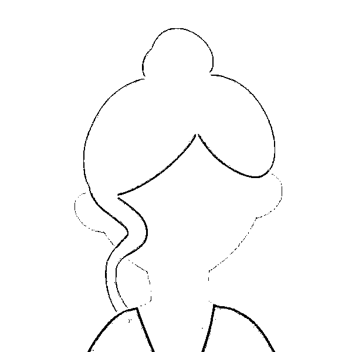
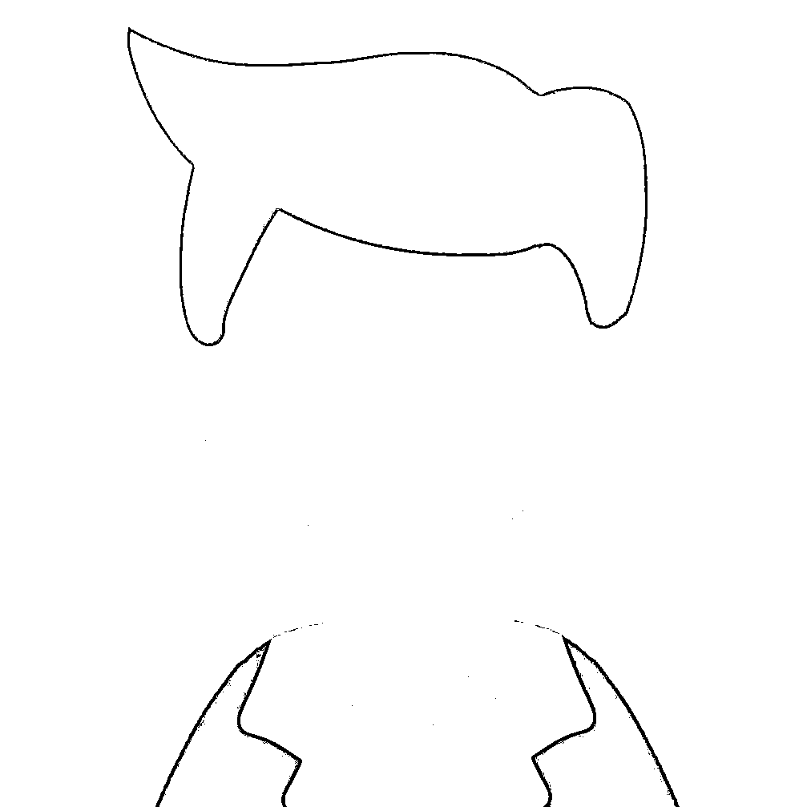
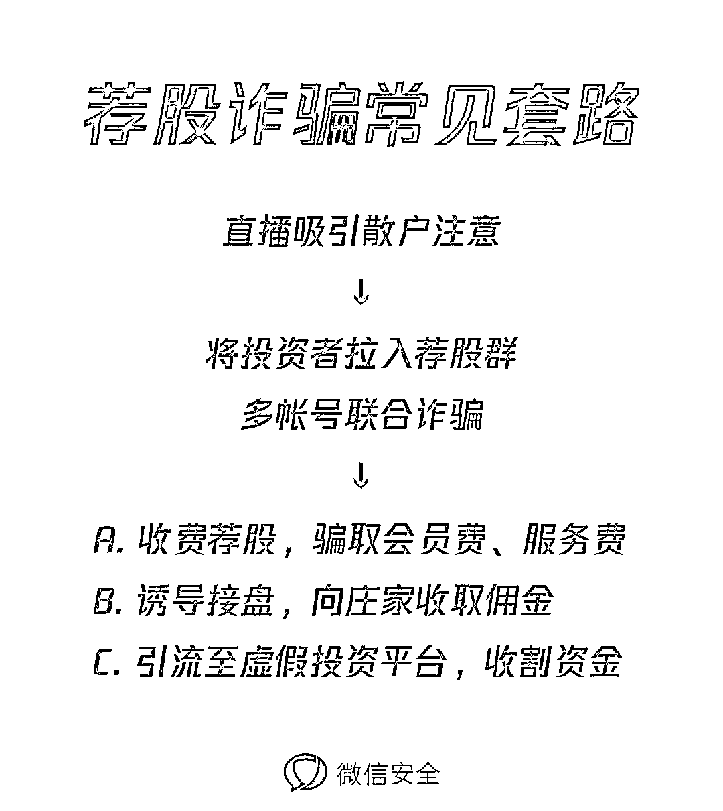

# 荐股群里只有我一个人在赔钱？是的

> 原文：[`mp.weixin.qq.com/s?__biz=MzIyMDYwMTk0Mw==&mid=2247501650&idx=1&sn=3b0194015deffbe0f12ee0a28f0e0146&chksm=97cb0c6aa0bc857c0d69b75376a2107190b6b84915fedeb02b8548b150d746029f56cbd396d9&scene=27#wechat_redirect`](http://mp.weixin.qq.com/s?__biz=MzIyMDYwMTk0Mw==&mid=2247501650&idx=1&sn=3b0194015deffbe0f12ee0a28f0e0146&chksm=97cb0c6aa0bc857c0d69b75376a2107190b6b84915fedeb02b8548b150d746029f56cbd396d9&scene=27#wechat_redirect)

**点击上方蓝色字体免费订阅“灰产圈”**

伴随 A 股市场回暖，牛市气息越来越浓，近期，非法网络荐股现象又有抬头。在“直播分析行情、定期发放福利、入会辅导投资”的一条龙服务下，不少投资者在大大小小的荐股群里栽了跟头。

40 人的荐股群里 39 个都是骗子？屡屡得手的荐股群是怎么让人一步步落入陷阱的？跟着“大师”投资又有什么风险呢？

**“戏精”荐股群**

**团伙作案 多帐号联合诈骗**

懂行情、知内幕的“大师”是荐股诈骗团伙的吸睛招牌，也是将投资者引入骗局的“领路人”。而所谓的荐股群，就是“大师”用来**推荐买入股票**的粉丝群、福利群，有的还要求付费入群。

当有投资者被“大师”的网络直播吸引，“助理 ”便会将他拉进荐股群。群里的“大师”、“助理”以及各位“粉丝学员”**全部都是诈骗团伙操控的帐号**，等投资者一进群，就开始他们的表演。

**创投首席顾问-钱老师

@所有人 翻倍牛股两点半在课堂加密分享，再不进就进不来了哦

小拖

终于来啦！

琪琪子

一直在等！老师辛苦了

首先，“大师”会在群里给出他看好的股票名称和代码，声称这些股票有翻倍、暴涨的潜力，然后号召群员跟随买入。而此时，群里的“粉丝”也会第一时间出来响应，踊跃跟投，甚至毫不犹豫一掷千金。

阿希

助理老师，我准备多少资金跟钱老师操作合适？

助理小财

这个根据你个人能力吧，赚多赚少而已

阿希

那先拿五十万试试吧！赚钱几率大的话再考虑增持

这样的戏码每天在群里循环上映，一方面借“粉丝”的追捧神化“大师”的业务能力，一方面用“一呼百应”的互动效果刺激投资者**从众跟投**。

不仅如此，为了巩固投资者信心，诈骗团伙还会安排“粉丝”在群里分享各自的收益情况、向老师请教后续操作。看似不经意的交流，其实是诈骗团伙准备的慢性“麻醉剂”。

我今天涨停了好开心

我也，收割完准备撤了

老师我到现在已经快二十个点位了，需要加仓吗

这么厉害？！

诈骗团伙通过制造**多赚少赔**的假象，误导投资者建立**错误的盈亏认识**。

20 个点位的盈利、10 万成本一天赚 1 万……当一个个“活生生”的成功案例摆在面前，投资者的警惕被逐渐麻痹。甚至在已经发生亏损的情况下，仍然心存侥幸，在夸大收益的洗脑式宣传下萌生**“再搏一次”**的冲动，却不知等待他的可能是更严重的投资亏损。

没有抓到大肉股，但上周也小赚了一笔

下午 3:00

你们的海外资产平台还打得开吗

下午 3:30

有人吗

@钱老师 @助理小财

**“野鸡荐股”风险高**

**严厉打击 提高警惕**

事实上，我国法律法规对证券、期货投资咨询从业者有非常严格的要求，**未经中国证监会许可，任何机构和个人均不得从事各种形式证券、期货投资咨询业务**。

相关法律

**·《证券、期货投资咨询管理暂行办法》第三条**

从事证券、期货投资咨询业务，必须依照本办法的规定，取得中国证监会的业务许可。未经中国证监会许可，任何机构和个人均不得从事本办法第二条所列各种形式证券、期货投资咨询业务。证券经营机构、期货经纪机构及其工作人员从事超出本机构范围的证券、期货投资咨询业务，应当遵守本办法的规定。

**·《中华人民共和国证券法》第 122 条**

未经国务院证券监督管理机构批准，任何单位和个人不得经营证券业务。投资咨询机构及其从业人员从事证券服务业务不得有下列行为：

代理委托人从事证券投资；与委托人约定分享证券投资收益或者分担证券投资损失；买卖本咨询机构提供服务的上市公司股票；利用传播媒介或者通过其他方式提供、传播虚假或者误导投资者的信息；法律、行政法规禁止的其他行为。

而荐股群里的“大师”虽自称“首席分析师”，很多却没有相关从业资格，有的只是涉猎股市的门外汉。他们收取高额的**会员费、服务费**，给出的建议却不具备参考价值，更有甚者，**通过****诱骗大批散户接盘的方式向庄家换取佣金**，不仅导致投资者产生巨大损失，还在一定程度上破坏市场秩序。

此外，一些诈骗团伙还会冒充正规投资公司，提供**虚假投资平台**诱骗投资者注资。后续通过在后台实时操纵行情、伪造交易记录等手法欺诈用户大量资金。

而无论何种形式，**通过荐股群获得的投资渠道最终都会导致投资者的资金亏损，**投入的成本不是被套牢就是和荐股团队一起“人间蒸发”。

对此，微信安全团队依据**《腾讯微信软件许可及服务协议》**、**《微信个人帐号使用规范》**，针对违反了《证券法》《证券、期货投资咨询管理暂行办法》《证券投资顾问业务暂行规定》等法律法规的非法荐股行为进行严厉打击，同时配合警方工作，保障微信用户的信息安全及合法权益。

与此同时，微信安全中心提醒，在多数案例中，骗徒都是利用大部分散户的**专业知识匮乏和赌徒心理**设计布局。希望广大投资者谨记股票、期货等投资具有风险性，选择正规、可靠的渠道投资理财，不要让欺诈者有可乘之机。

来源：微信安全中心

← 向右滑动与灰产圈互动交流 →

**点击****阅读原文****加入灰产圈高端社群**

