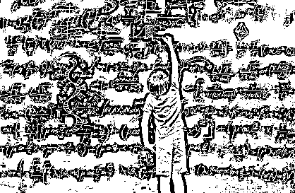

# “神童”接连翻车，造假终究破功！

> 原文：[`mp.weixin.qq.com/s?__biz=MzIyMDYwMTk0Mw==&mid=2247501650&idx=2&sn=5c41bd3a1ec0cfc069dd4219bc7ae30d&chksm=97cb0c6aa0bc857ce2331ef3f434cab1a72636da97796979c6a38153c2088c74708f961703a5&scene=27#wechat_redirect`](http://mp.weixin.qq.com/s?__biz=MzIyMDYwMTk0Mw==&mid=2247501650&idx=2&sn=5c41bd3a1ec0cfc069dd4219bc7ae30d&chksm=97cb0c6aa0bc857ce2331ef3f434cab1a72636da97796979c6a38153c2088c74708f961703a5&scene=27#wechat_redirect)

**点击上方蓝色字体免费订阅“灰产圈”**

近来，有关“神童”的新闻层出不穷，令人眼花缭乱。

前有成功做出“硕博级”基因研究的小学生获得全国大奖，后有一天能写 300 首词牌、2000 首诗的“天才少女”震惊舆论。这些明显有悖常规的“神童”想不让人关注都难。

很快，**在群众的围观之下，在舆论的拷问之中，“神童”神奇不再，泡沫一戳就破。**获奖小学生研究成果为其研究员父母所“赠”，因而所获大奖也被迅速撤销。离开了“造神式”演讲的氛围，“天才少女”的“辉煌成绩”脆弱得不堪一击。其背后的培训机构也已大门紧闭，创始人们纷纷退出公司股份，让众人对成才的“奥秘”无法知晓。

就在两位“神童”相继走下神坛之际，一位 12 岁就要“硕博连读”的“神童”何宜德同学又火了，成为了众人眼中的“别人家的孩子”。其履历中，辉煌的成就比比皆是：1 岁徒步暴走、2 岁攀登南京紫金山、3 岁在雪地里裸跑、4 岁参加国际帆船比赛、5 岁开飞机围绕北京野生动物园飞一周、6 岁写自传、7 岁三次穿越新疆罗布泊，8 岁考入南京大学……

[`v.qq.com/iframe/preview.html?vid=v31186z6ia8&auto=0`](https://v.qq.com/iframe/preview.html?vid=v31186z6ia8&auto=0)

何同学“考入南京大学”听上去很厉害，但经过挖掘真相却是：自考大专学历，历时两年半，三门是压线通过，且考试科目里没有英语、数学，都是一些“简易知识”……虽然目前为止何同学其他成就还未翻车，但其成长和接受的教育方式也备受质疑和争议，如此大专也让“神童”显得成色不足。

**当然，我们不能否认“神童”的存在，但其存在绝对是凤毛麟角且经得起实践检验的。**而上述这些所谓“神童”神乎其神，取得了成人也难以企及的成就，明显有违规律。以“天才少女”为例，按照常理，即便一分钟创作一首诗，24 小时下来充其量也只能完成 1440 首。无论打字还是录音，一天要创作 2000 首诗几乎是不可能完成的任务。

然而，为什么这样的谎言和骗局却能屡试不爽，一些学生和家长却屡屡中招？**关键在于一些人总抱有“神童情结”。“神童情结”古已有之，广为熟知的就是方仲永。**而上世纪八九十年代，我国曾出现过一股“神童热”。彼时，“神童”苦攻数理化，以考上中科大少年班为标尺。结果，这次热潮，随着几位主角“泯然众人”而告终。

近年来，“神童热”似乎又有抬头之势：6 岁编程、8 岁建网站、13 岁创办公司、14 岁被麻省理工录取成为“预科生”，等等。加上近期几个典型例子，如今的“神童”涉猎的领域更加广泛，也并非只通过少年高考作为证明途径。

只不过，上世纪那波“神童热”里的神童，**还是通过试题难度和考试分数作为衡量标准，以实打实的真本领考上大学，是有真才实学的。而这波“神童热”，诸如创作、演讲等领域既无明确衡量标准，又无法验证成绩取得是否为“神童”本人所为，这就产生了很多“浑水摸鱼”者。**

这类现象背后，既有家长为了孩子好名义下的“过度操作”，也有诸如“速读达人”“蒙眼识字”“量子波动速读”“一分钟阅读上万字”等商业机构的极力炒作。可不管“幕后势力”是谁，**目的都是利益，利用的都是信任，伤害的都是孩子。**

而从近期不断翻车的事件来看，**群众眼里不揉沙子，公众智商不容挑战。**这些造假、炒作可以骗一时、一人，却难以瞒永久、骗公众。

此外，监管部门也应该及时跟进，而且要做好预防工作，坚决杜绝利用“神童”幌子行骗的商业行为，而绝不能等到舆论发现问题、指出问题后再作出回应，那样的话，就太被动了。

编辑：单镜宇  责任编辑：孟夏 来源：央视网评

← 向右滑动与灰产圈互动交流 →

**点击****阅读原文****加入灰产圈高端社群**

