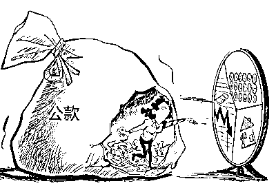
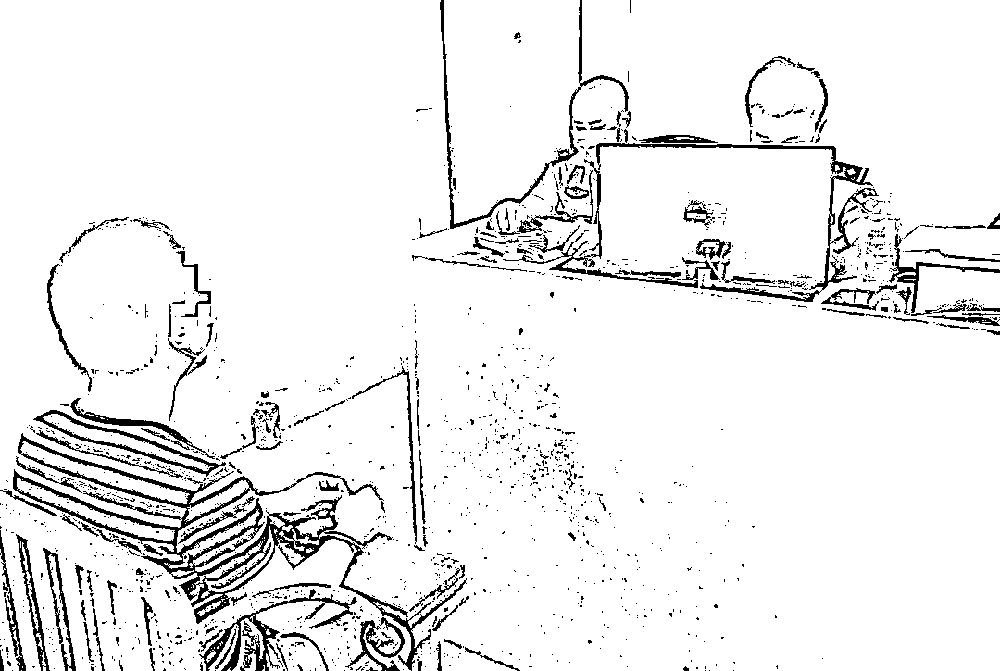
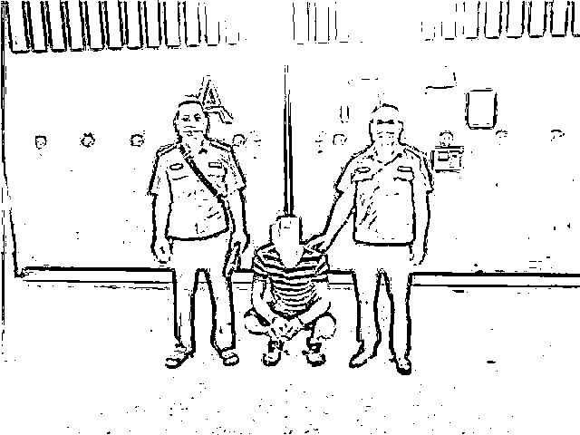
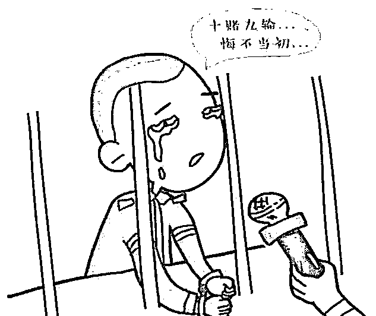
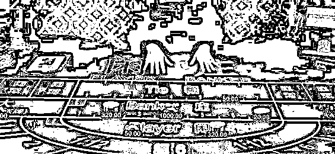
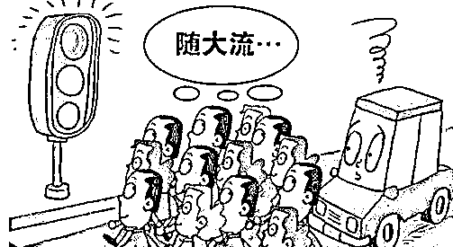
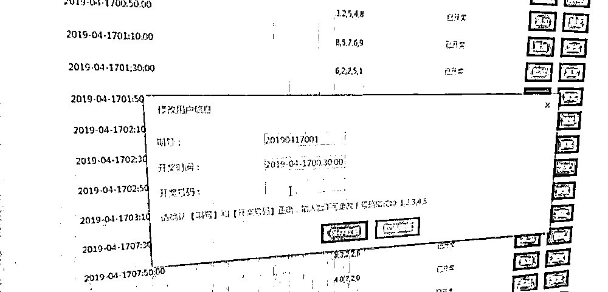
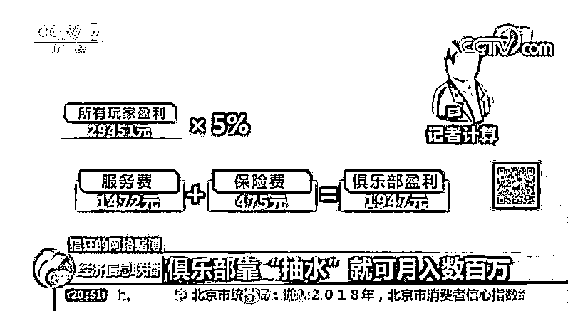

# 拘！贺州一男子沉迷网赌侵占公款 43 万元终被抓！

> 原文：[`mp.weixin.qq.com/s?__biz=MzIyMDYwMTk0Mw==&mid=2247501650&idx=3&sn=a43275544b163eb4f72f3ae949cb9e4e&chksm=97cb0c6aa0bc857cb2e118133f69ca922d283b8232a2a910a05e2a07aeea405daa29eaa1942d&scene=27#wechat_redirect`](http://mp.weixin.qq.com/s?__biz=MzIyMDYwMTk0Mw==&mid=2247501650&idx=3&sn=a43275544b163eb4f72f3ae949cb9e4e&chksm=97cb0c6aa0bc857cb2e118133f69ca922d283b8232a2a910a05e2a07aeea405daa29eaa1942d&scene=27#wechat_redirect)

**点击上方蓝色字体免费订阅“灰产圈”**

**网络赌博危害大**

**十赌十输，没有例外**

“

当时我已经完全沉迷于赌博，不但花光了积蓄，欠下了一身债，还挪用了公款，我将为自己的贪欲付出惨痛代价……

”廖某是贺州市某公司的业务员迷恋网络赌博为了弥补赌博亏空竟然挪用公司公款 43 万元……

**染上赌瘾**

廖某是广西某家禽养殖公司的业务员，因业绩突出，于 2016 年成为贺州分公司的业务总代表，月薪上万元。2018 年初，廖某在网络上接触到了赌博网站，短短 8 个多月，廖某的人生轨迹发生了改变。他接触网络博彩后，庄家为钓到大鱼，让廖某多次赢钱。廖某不以为这是个“十赌九输”的陷阱，反而深信不疑是自己“好运”加身，认为博彩比起自己这份陪笑脸拉业务的工作不知好了多少倍。从此，廖某赌注越玩越大，动辄成千上万的砸钱豪赌，很快，他输光积蓄 50 万元。输钱并没有使其醒悟，仍自信是“好运”的人，说不定哪天就连本带利的赢了回来。

**挪用公款**

2019 年 9 月 1 日至 6 日，廖某为了翻本，将主意打到老客户的应收款上，慌称公司账户出现异常，暂由他代收。他坚信的“好运”并没出现，43 万元公款也输个精光。2019 年 9 月 6 日，该公司负责人到贺州市公安局旺高开发区派出所报案称，该公司从 9 月 1 日至 6 日的 6 天时间里，按照贺州分公司业务总代表廖某下的订单，供应了客户价值 43 万元的肉鸡。以往，客户收到货源后都会把订单款汇入总公司账户，可 6 天里，财务反映公司账户未入一分钱，便打电话询问廖某，廖某不仅关机，人也失踪了，怀疑是他卷走了公款。

**畏罪潜逃**

廖某畏罪潜逃期间，他从没睡过一个好觉，吃过一顿好饭。困了累了，就到路边长椅小睡一会儿，吃的是凉水就馒头。新冠肺炎疫情防控期间，他再也无路可去，悄悄地回到桂林，深居简出在远房亲戚家，并隐瞒自己卷公款逃亡的犯罪行为。

**落入法网**

接到报案后，警方立案侦查并启动协查机制。2020 年 7 月 15 日，在桂林警方协助下，贺州市公安局平桂分局将正打算出门给其妻子送午饭的廖某抓获。“我认罪认罚，能不能先让我把午饭送给我妻子？”原来，廖某在出逃前给妻子打了个电话，谎称公司安排他外地考察学习几年。7 月 15 日，他终于按捺不住思念妻子，回到家打算给他妻子做个午饭并送去，结果被警察候个正着。廖某归案后，对自己利用职务之便侵占公司钱财的犯罪事实供认不讳。目前，已被警方依法刑事拘留。人们都说“十赌九输”沉迷于赌博轻则倾家荡产，重则家破人亡本案中的廖某因沾染赌博付出惨痛代价，

最终还将面对严厉的刑事处罚。

**网络赌博的坑到底有多深？**

**远远超乎你的想象**

请看以下几个关键点 

让你对网络赌博套路有更深的了解

**施以小利**

虽然大家都知道“十赌九输”，可很多人偏偏就觉得自己是“天选之子”。犯罪团伙就是利用这种心态，让人一步一步地堕入陷阱。

很多团伙控局的赌博平台，开始都会让新手赢一部分。当你认为你是无敌幸运星时，就是你输光家产的开始。

**有去无回**

参赌者一开始要通过网银将赌资转入指定的账号，有时候用手机刷二维码，将钱转到赌博网站里。实际上，无论你是输是赢，由于犯罪团伙设了局，赌徒充值的钱只要进了他们的账户，最终就是肉包子打狗——有去无回。

**无法提现**

有的人在某某网站侥幸赢了钱以后，申请提现时就会遇到“网站正在维护”的提示，让你明天再试。这些人暂时提不出钱来，就会忍不住继续去赌，然后把前面赢的和自己的本金全部输干净。

即使没有输光，第二天再去提现时，还是说系统维护。如果去找客服，他们就会以各种理由和你拖时间，甚至是直接把你的账号禁封。

**虚假人气**

通常新手登录平台后会发现，有很多人在里面玩，这种氛围使他们在心理上陷入集体无意识，觉得法不责众而产生虚假安全感，无法冷静思考。其实那些在玩的“人”，多数都是“机器人”。

**后台控制**

网络赌博大坑中最可怕的，当然还是后台控制了。一般情况下，后台可以设置庄闲盈利点，可以在小的可控范围内让你赢钱，然后大多数情况下让你输。也有很多人在玩的关键时刻会遇到“网络不佳”。其实那并不是真的网络不佳，而是正在进行后台控制，让原本的赢局变成输局。

**抽水返点**

大部分赌局的抽水返点是百分之几，玩家和庄家不停地赌，他们之间的胜率也会趋向平等。但庄家每一局都在“抽水”，即使玩家最终和庄家打成平手，因为抽水的机制，玩家的本金也会被庄家拿走大半。所以这就是为什么十赌九输，赢的只能是庄家。

在网络上进行赌博没有资金控制的概念，因为你的赌注就是一串数字，你根本感觉不出其中的分量。

这种迷幻感觉和提款的便捷结合在一起以后，你原本对于金钱的正确价值观就会慢慢被摧毁，这就是网络赌博的最可怕之处！

警察蜀黍见多了好好的人赌博后失去理智、倾家荡产、借钱诈骗、各种谎言、网络借贷、债台高筑，乃至最终妻离子散，甚至家破人亡。

**说了这么多****归根结底一句话****网络赌博套路多****请君远离！**

****

来源：平桂警方，贺州城事，戒赌吧

← 向右滑动与灰产圈互动交流 →

**点击****阅读原文****加入灰产圈高端社群**

