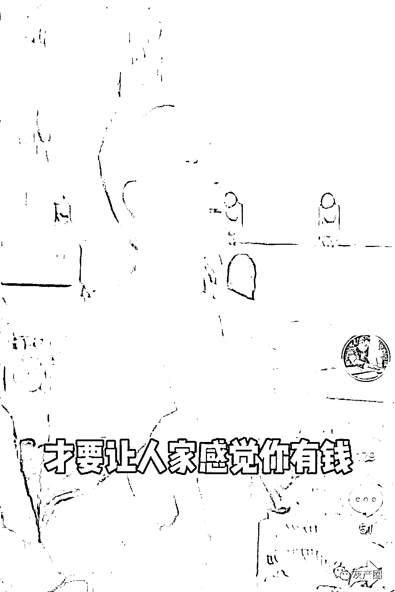

# 短视频上的成功学大师们：周文强，聂枭，吴帝聪，还有……

> 原文：[`mp.weixin.qq.com/s?__biz=MzIyMDYwMTk0Mw==&mid=2247501712&idx=1&sn=c0ce322be168977b788c8e894f02a244&chksm=97cb0ca8a0bc85be9c1225cd0564dbb02fd4d6985e7d6d6afccd3009063861441dced3df94ff&scene=27#wechat_redirect`](http://mp.weixin.qq.com/s?__biz=MzIyMDYwMTk0Mw==&mid=2247501712&idx=1&sn=c0ce322be168977b788c8e894f02a244&chksm=97cb0ca8a0bc85be9c1225cd0564dbb02fd4d6985e7d6d6afccd3009063861441dced3df94ff&scene=27#wechat_redirect)

**点击上方蓝色字体免费订阅“灰产圈”**

**最近有两件事，让我们不得不关注下短视频平台上的成功学。**一是一天写 2000 首诗的 16 岁女孩岑某诺，她的演讲视频有煽动有手势，俨然一副成功学老油条派头，她师从姬剑晶，而姬则是陈安之弟子。二是罗永浩昨天转发一条樊登的演讲视频，讽刺他是“又一个吴晓波”。因为樊登分析了罗永浩为什么会失败，又给他指了条成功之路。老罗之所以反感樊登、吴晓波，或反感动不动就告诉大家“怎么做就一定能成功”、“不这么做就肯定失败”的“鸡汤贩子”。这类人也就是大众熟知的“成功学大师”。早些年间他们出现在候机楼的电视屏幕中、机场书店里。如今，曾以线下课堂为主战场的“大师”们又将目光汇聚在短视频风口中。**三言财经注意到，在多个短视频平台中，经常能刷到各种所谓成功大师们的激情演讲视频。今天，我们深入了解下他们如何在短视频时代运作自己。****樊登**首先，就以被罗永浩“Diss”的樊登开场。樊登是前中央电视台节目主持人，曾经主持过央视《实话实说》、《12 演播室》、《商界传奇》等节目。2013 年 10 月，樊登创办樊登读书。有报道称，2018 年初樊登读书会已有 400 万会员，年销售额接近 4 亿，2019 年开了 270 多家书店。短视频时代，樊登也抓住了当下风口。在多个短视频平台开通了不同类型的账号，樊登本人则亲力亲为，在镜头前为用户“读书”。短视频也使得樊登很像那些兜售“鸡汤”的成功学大师，但是显得比较有文化。**演讲内容和表现形式****三言财经注意到，和樊登以及樊登读书有关的并且经过平台认证的短视频账号超过 20 余个。内容涉及、读书、职场、育儿等多个方面，种类繁多。**此外，这些账号粉丝量也十分巨大，有账号粉丝量高达 826.5 万，粉丝量最低的也有近十万。我们注意到，**去年樊登的短视频有不少关于创业，今年似乎是看中了母婴育儿这个大市场，**近期的视频大比例是育儿类，普及育儿、教育知识。**不过，其短视频内容很多都没有明确表示其观点来自具体哪本书。**所有视频仅是提出问题然后给出解决方案甚至还有“鸡汤”性质的短视频。比如樊登读书去年曾发布一些“小伙炸油条，逆袭成总裁”、“老公和女同学一起创业走的很近，我该怎么办”之类的视频。有的内容没有明确表示来自某本书，反倒像樊登的个人观点。在名为“@樊登读书职场”的账号中，很多内容则更像是鸡汤。例如上面这几则视频，樊登要么在讲大道理，要么就是说鸡汤。虽然有的视频会提到来自某本书籍，**但整体上依然是“鸡汤”那种“事后诸葛亮”行为。**
因此，从这个角度，樊登也算是一众“成功学大师”的其中一员。**商业模式**樊登读书通过收费会员模式来变现。樊登读书 App 提供购买樊登读书会员入口，用户需要支付每年 388 元获得会员资格。可以享受多种听书服务，以及会员积分服务。此外，樊登读书 App 中也有实体书销售平台，甚至还包括小型电商服务。**而在短视频方面，樊登则主要以售卖实体书为主。并为开通会员引流。**因此，整体来看，樊登在短视频普及各种知识碎片，收集粉丝，为读书会引流+卖书。看起来文雅一点。**周文强**文有周文强，武有马保国——网友。

[`v.qq.com/iframe/preview.html?width=500&height=375&auto=0&vid=y3029t5xhao`](https://v.qq.com/iframe/preview.html?width=500&height=375&auto=0&vid=y3029t5xhao)

经常玩短视频的网友说不定刷到过周文强的演讲视频，他经常吐着唾沫星子讲秦始皇多么伟大。如果不了解周文强，说不定会以为他是某位历史老师，孜孜不倦的为网友描述中国历史。**他似乎独爱秦朝历史，很多短视频内容都和讲述秦朝历史有关。****实际上，周文强是一个不折不扣的成功学大师。而且，他还是“忽悠人”的那种。**因为除了讲历史，周文强还主要讲所谓“财商”。这部分内容就完全是“成功学大师”的套路了，全部是一些调动观众情绪的成功学鸡汤，看似有用实则无意义。周文强实际上是打着讲历史的幌子，做成功励志导师的本质。**演讲内容和表现模式**周文强在演讲中，肢体语言丰富，眼神坚定。习惯边讲话边挥舞手臂，而且声调高昂，看上去非常有自信。**尤其是在讲述有关秦朝历史内容时，周文强更是表现的“霸气十足”，仿佛秦始皇附身一般。**甚至周文强还做了“特效”，在昏暗的画面描述秦朝波澜壮阔的历史，再加上他抑扬顿挫的语气，观众情绪很容易被带动。但是，周文强讲的秦朝历史**可能是信口雌黄，很多内容完全是错误的。**举例来说，周文强在一次演讲中他讲到秦朝之所以被灭，是为了华夏民族之大义。但稍微懂一点我国秦末历史的人都知道，秦军主力完全就是被项羽所灭。压根不存在周文强所谓秦始皇命令秦军死守边境导致秦国无力抗敌被灭亡一说。不仅讲历史周文强瞎讲，就连大众皆知的事情他都能随口就来。**“科比姓科”这个网络梗就是出自周文强之口。**除了秦始皇，马云、任正非、柳传志是其口中的固定成功嘉宾，通过讲他们的案例调动观众情绪。但也是错误百出，比如他说柳传志的副手顶替柳传志走私罪名坐牢。 **商业模式**周文强的商业模式可能是通过忽悠性质的励志演讲短视频，以赠送“学习资料”为由，吸引流量，最后再集中“忽悠”粉丝购买高价课程或者其他模式变现。为了探究周文强的变现模式，三言财经联系了其提供的一个赠送“学习资料”微信账号。对方表示自己是汇成集团周文强公司的财商教育总监，并且将所谓学习资料发送了过来。三言财经发现，所谓学习资料，实际上就是一本《富爸爸》的电子书。而且虽然宣传免费，对方却提出这份资料需要支付 1 元钱。追问之下对方表示这 1 元钱是另外赠送三份资料和一堂价值 1980 元的微信课费用。为了进一步了解情况，三言财经在支付费用后，对方又发来了三份资料，并且承诺会于明天晚上开启微信课。**这三份资料除了一本别人写的电子书外，剩余两份完全是毫无价值的甚至连“鸡汤”都算不上的“成功案例”。**由于目前所谓微信课还未开课，有关周文强变现手段还需进一步了解。整体来看，周文强的套路则是通过各种成功学、历史故事短视频吸引粉丝。如果有网友对其感兴趣，想进一步了解。周文强团队则以蝇头小利继续吸引粉丝，组建社群，或通过“网课”形式变现。此外，周文强还在短视频平台上销售书，其中还包括他自己的一些“成功学”励志书籍。这也是他变现手段的其中之一。**吴帝聪**吴帝聪也是比较典型的成功学大师，现在也短视频平台中拥有超百万粉丝。三言财经发现，账号名称中有吴帝聪并且粉丝量大于 10 万的有四个。并且这些账号无一例外发布的都是吴帝聪演讲视频。其中粉丝量最大的账号“吴帝聪顶级销讲”中，近期视频内容主要以夫妻关系、企业运营为主。而且几个账号则以销售方式类以及吴帝聪个人生活类短视频为主。**演讲内容和表现形式**吴帝聪短视频在表现形式上多以在舞台上手拿麦克风，以类似主持人的方式演讲为主。**在讲话时还会来回走动，并且语速平和，声音铿锵有力**。有些类似曾经老师对学生训话一样，面无表情，说到某些内容时还会手指向观众，仿佛某个人犯错一般。**吴帝聪最具特色的表现则是等待鼓掌：**每当演讲重点说出后，他会立刻停顿，偶尔还会将头甩向一边。之后就是全场鼓掌，有的视频中台上还有助手鼓掌带动全场气氛。**视频内容则多以夫妻关系、企业运营和销售模式为主。****商业模式**目前，在短视频这类变现手段上，吴帝聪采取电商加引流线下课程方式。其短视频平台商品橱窗中，上架很多鸡汤、成功学类的书籍。此外，在账号简介中，注明将于 8 月举办线下课程，并且提供报名渠道。相比周文强，吴帝聪并没有以“赠送学习资料”为由获取流量，似乎仍主要以线下演讲为主要变现渠道。**聂枭**“掌声哥”聂枭也是大众熟知的成功学大师。还是中国演说家、一名董事局主席。

相比上面几位大师来说，聂枭算是最喜欢在个人打扮上花功夫最多的人了。他经常以不同形象出现在各个视频片段中：

[`v.qq.com/iframe/preview.html?width=500&height=375&auto=0&vid=y0724ygjio1`](https://v.qq.com/iframe/preview.html?width=500&height=375&auto=0&vid=y0724ygjio1)

**表现形式和演讲内容**不同于其他大师，聂枭的演讲并不局限于舞台。在有的短视频中，聂枭身处群众中间，为广大群众宣讲他的理念。**在演讲中，聂枭很喜欢用“听懂鼓掌”这样的语言引导观众鼓掌。**此外，聂枭操着一口不是很标准的普通话，让他的演讲也颇具一些个人特色。聂枭宣传“悟道”，而其强调“悟道不是靠读书获得，是需要有天赋和名师指点”。他还宣传“努力不能改变命运”，声称“羊再努力吃草也不能变成狼”。甚至还发表过“懂得越多人生越残废”这样的观点。**商业模式**短视频方面，在某段视频平台中有一个疑似聂枭个人账号，拥有粉丝 1.8 万。该账号未开通购物车功能，仅在账号简介中留下一微信号。联系上后，对方提供了一个“学习平台”，该平台里售卖聂枭的各种“课程”。这些课程售价从 399 元到 99 元不等。不过，除了这个“学习平台”外，对方并未提供有关聂枭的更多内容。**不要轻信成功学**在今天三言财经盘点的几位成功学大师中，**除了樊登依托樊登读书平台，所宣讲内容有书籍理论依据，可以当作方法论看待外，其他几位大师则都可以用“大忽悠”描述。**之所以所谓成功学能够有市场，主要在于部分人相信成功可以通过某种捷径实现。曾经，那些大师通过包装自己，在各地开办宣讲会，通过宣传“成功能够轻而易举实现”理论“割韭菜”。现在，科技的发达也给这批人带来更好的“变现模式”。短视频模式简单精准，可以让这些“大师”的理论浓缩到十几秒。成功的定义是多元的，没有统一的标准。现在这些成功学大师通过短视频形式，“洗脑观众”，将成功局限于金钱、物质，宣扬扭曲的价值观。实则是为了通过诈骗的手段，牟取不当之财。的确努力不一定成功，但是成功离不开努力。每个人应当树立正确的价值观，莫要相信所谓易如反掌就能成功的办法。

出品｜三言财经  作者｜DorAemon

← 向右滑动与灰产圈互动交流 →

**点击****阅读原文****加入灰产圈高端社群**

